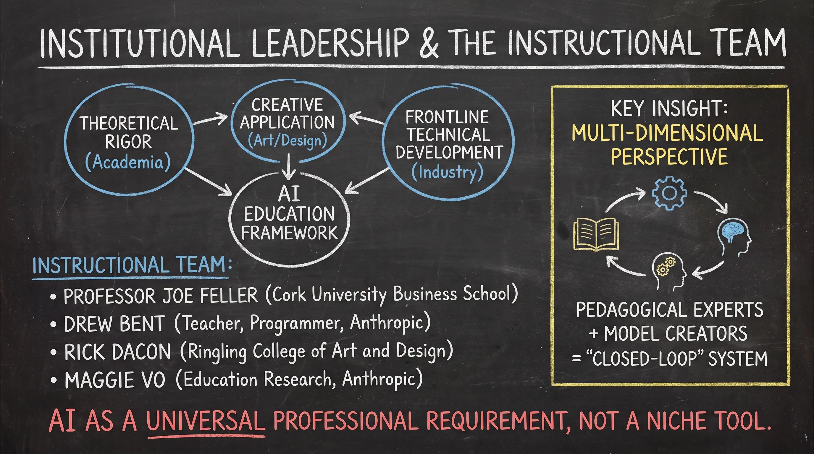
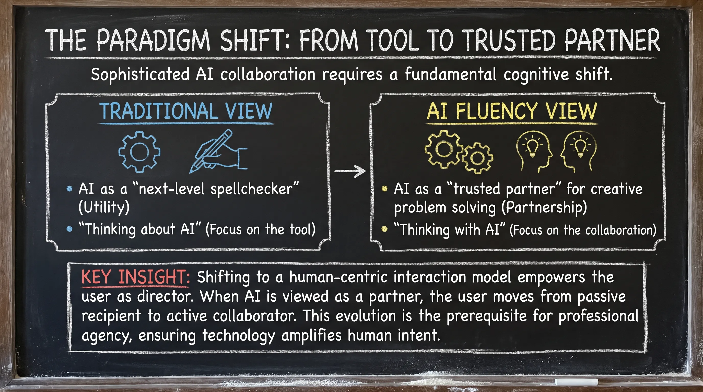
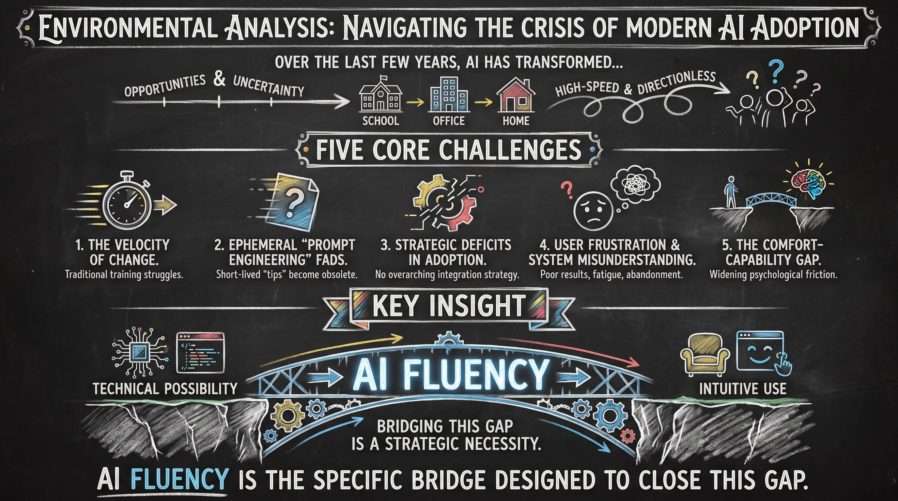
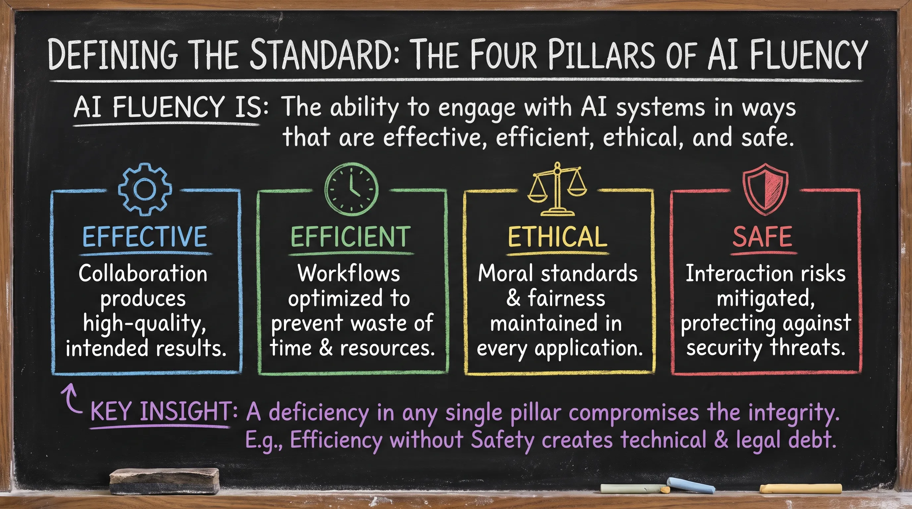
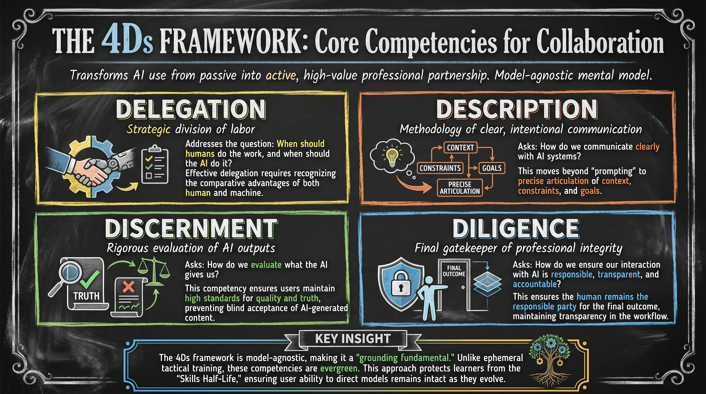
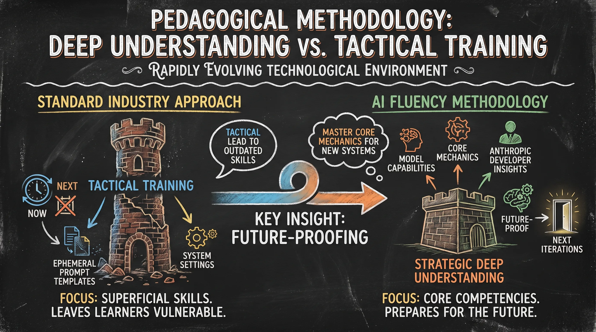
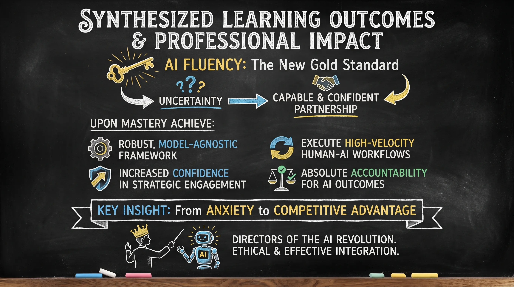

# Lesson 1.1: Introduction & Foundations of AI Fluency

---

## 1. Institutional Leadership and the Instructional Team

Establishing a credible AI education framework requires theoretical rigor, creative application, and frontline technical development. A cross-disciplinary team with high-level academia and industry-leading technical staff is essential in the volatile market. This expertise ensures the curriculum is grounded in pedagogical principles while connected to the actual mechanics of the models being built, creating a "closed-loop" feedback system.

**Instructional Team:**
* **Professor Joe Feller**: Cork University Business School
* **Drew Bent**: Teacher, Programmer, and Technical Staff at Anthropic
* **Rick Dacon**: Ringling College of Art and Design
* **Maggie Vo**: Education Research Team at Anthropic

**Key Insight:** The collaboration between a premier business school, leading art/design college, and Claude model developers at Anthropic creates a multi-dimensional perspective on AI fluency. Having model creators alongside pedagogical experts provides rare depth, ensuring the framework addresses both the "how" and the "why" of system behavior. This treats AI not as a niche technical tool but as a universal professional requirement.

---

  
  
<b><u>Institutional Leadership and the Instructional Team</u></b>

---

## 2. The Paradigm Shift: From Tool to Trusted Partner

Sophisticated AI collaboration requires a fundamental cognitive shift. Most users engage with AI transactionally, limiting high-value output potential. True fluency requires transitioning from viewing AI as an external utility to a cognitive partner integrated into professional workflow—the essential foundation for implementing advanced frameworks like the 4Ds.

| Traditional View | AI Fluency View |
| :--- | :--- |
| AI as a "next-level spellchecker" (Utility) | AI as a "trusted partner" for creative problem solving (Partnership) |
| "Thinking about AI" (Focus on the tool) | "Thinking with AI" (Focus on the collaboration) |

**Key Insight:** Shifting to a human-centric interaction model empowers the user as director. When AI is viewed as a partner rather than a spellchecker, the user moves from passive recipient to active collaborator. This evolution is the prerequisite for professional agency, ensuring technology amplifies human intent rather than merely automating routine tasks.

---

  
  
<b><u>The Paradigm Shift: From Tool to Trusted Partner</u></b>

---

## 3. Environmental Analysis: Navigating the Crisis of Modern AI Adoption

Over the last few years, AI has transformed from specialized technologies to interactive systems that millions use daily at school, at work, and at home. This transformation creates both opportunities and uncertainty. The current AI industry landscape is high-speed and often directionless, creating substantial friction for organizations and individuals. Without a grounding fundamental framework, users react to news cycles and "hacks" rather than building sustainable, high-value skills.

**Five core challenges:**

1. **The Velocity of Change**: The industry moves so rapidly that traditional training cycles struggle to remain relevant.
2. **The Ephemeral Nature of "Prompt Engineering" Fads**: Most training focuses on short-lived "tips" that become obsolete as models update.
3. **Strategic Deficits in Organizational Adoption**: Organizations frequently deploy AI systems without an overarching strategy for integration.
4. **User Frustration and System Misunderstanding**: Lack of fundamental knowledge leads to poor results, user fatigue, and eventual abandonment.
5. **The Comfort-Capability Gap**: Widening psychological friction between what AI can technically achieve and what feels comfortable and intuitive for professional users.

**Key Insight:** We're all experiencing a widening gap between what's possible and what feels comfortable and intuitive. The Comfort-Capability Gap is the primary hurdle for professional efficacy. While the technical ceiling of AI systems rises, organizational ROI remains stagnant if users don't feel comfortable directing that potential. This course exists to help us bridge this gap together. Bridging this gap is a strategic necessity for organizational survival; the distance between technical possibility and intuitive use must be closed to achieve meaningful professional impact. AI Fluency is the specific bridge designed to close this gap.

---

  
  
<b><u>Environmental Analysis: Navigating the Crisis of Modern AI Adoption</u></b>

---

## 4. Defining the Standard: The Four Pillars of AI Fluency

To distinguish fluency from mere technical literacy or tactical tricks, a rigorous definition is required. Fluency implies mastery that allows for high-value outcomes across various professional contexts.

**AI Fluency is defined as:** "The ability to engage with AI systems in ways that are effective, efficient, ethical, and safe."

**The Four Pillars (Risk Management Framework):**

* **Effective**: The collaboration produces high-quality, intended results.
* **Efficient**: Workflows are optimized to prevent waste of time and resources.
* **Ethical**: Moral standards and fairness are maintained in every application.
* **Safe**: Interaction risks are mitigated, protecting against security threats.

**Key Insight:** A deficiency in any single pillar compromises the integrity of the collaboration. For instance, achieving "Efficiency" without "Safety" creates immediate technical and legal debt that can undermine an entire organization. These definitions are operationalized through the 4Ds framework.

---

  
  
<b><u>Defining the Standard: The Four Pillars of AI Fluency</u></b>

---

## 5. The 4Ds Framework: Core Competencies for Collaboration

The 4Ds framework transforms AI use from a passive experience into an active, high-value professional partnership. This mental model remains relevant regardless of the specific software or model version being utilized.

### Delegation
Strategic division of labor. Addresses the question: When should humans do the work, and when should the AI do it? Effective delegation requires recognizing the comparative advantages of both human and machine.

### Description
Methodology of clear, intentional communication. Asks: How do we communicate clearly with AI systems? This moves beyond "prompting" to precise articulation of context, constraints, and goals.

### Discernment
Rigorous evaluation of AI outputs. Asks: How do we evaluate what the AI gives us? This competency ensures users maintain high standards for quality and truth, preventing blind acceptance of AI-generated content.

### Diligence
Final gatekeeper of professional integrity. Asks: How do we ensure our interaction with AI is responsible, transparent, and accountable? This ensures the human remains the responsible party for the final outcome, maintaining transparency in the workflow.

**Key Insight:** The 4Ds framework is model-agnostic, making it a "grounding fundamental." Unlike ephemeral tactical training, these competencies are evergreen. This approach protects learners from the "Skills Half-Life" often found in technology training, ensuring that as models evolve from Claude 3 to future iterations, the user’s ability to direct them remains intact.

---

  
  
<b><u>The 4Ds Framework: Core Competencies for Collaboration</u></b>

---

## 6. Pedagogical Methodology: Deep Understanding vs. Tactical Training

In a rapidly evolving technological environment, education must prioritize core competencies over superficial skills. Training that focuses only on the "now" leaves learners vulnerable to the "next."

**The AI Fluency methodology rejects standard industry approaches:**

* **Standard Training Focus**: Primarily tactical. Relies on "ephemeral tactical training" involving specific prompt templates and system settings that lose relevance as models improve.
* **AI Fluency Focus**: Primarily strategic. Uses focused videos paired with exercises and materials to build deep understanding of model capabilities and limitations, derived directly from the developers at Anthropic.

**Key Insight:** Tactical training leads to outdated skills and wasted investment. By contrast, a "deep understanding" approach prepares learners for future, yet-to-be-released AI iterations. By mastering the core mechanics of interaction, professionals become future-proof, capable of navigating new systems as they emerge without needing to start from scratch.

---

  
  
<b><u>Pedagogical Methodology: Deep Understanding vs. Tactical Training</u></b>

---

## 7. Synthesized Learning Outcomes and Professional Impact

Achieving AI Fluency provides a long-term value proposition that moves professionals from uncertainty to capable and confident partnership. It is the new gold standard for the modern workforce.

**Upon mastery of this framework, professionals achieve:**

* **Acquisition of a robust, model-agnostic framework**: A stable mental model for any AI interaction.
* **Increased confidence in strategic engagement**: The ability to move beyond trial-and-error to intentional collaboration.
* **Ability to execute high-velocity human-AI workflows**: Moving toward seamless, fluid partnership.
* **Absolute accountability for AI-generated outcomes**: The skills to evaluate and take full responsibility for results.

**Key Insight:** Collectively, these outcomes transform AI from a source of professional anxiety into a source of competitive advantage. Professionals are no longer passive observers of the AI revolution but directors of it, capable of bridging the gap between technical potential and high-value results. The journey toward ethical and effective AI integration begins with this shift—embracing AI as a sophisticated partner in the professional landscape.

---

  
  
<b><u>Synthesized Learning Outcomes and Professional Impact</u></b>

---
