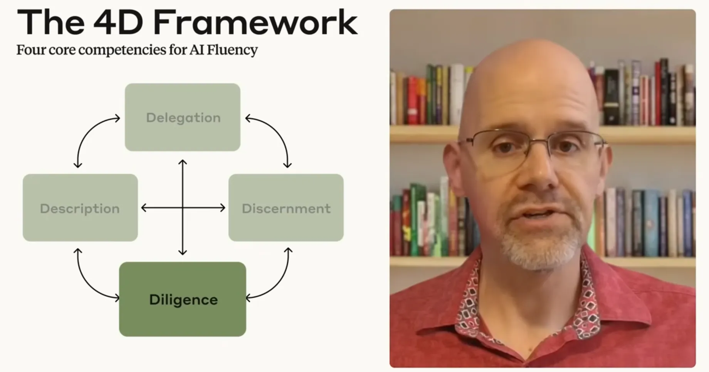
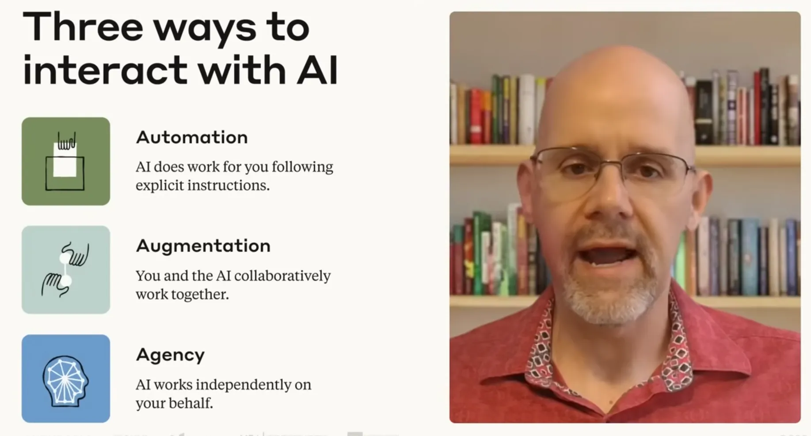
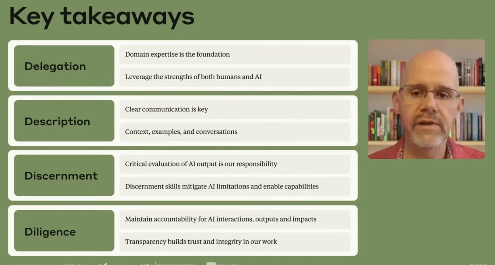
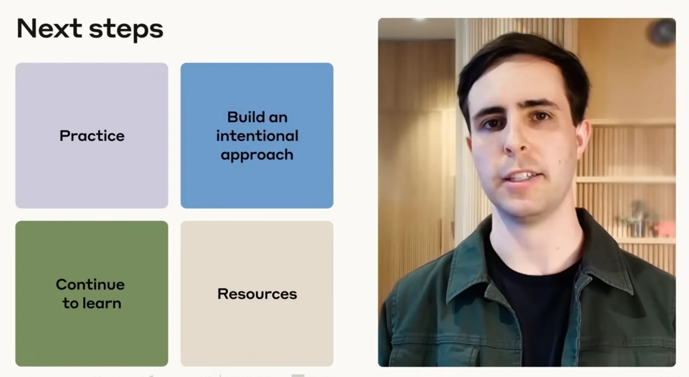

# Lesson 10.1: Course Conclusion — The AI Fluency Framework

---

## 1. Holistic Framework Synthesis: The Four Ds & Sub-Competencies

The AI Fluency Framework transforms AI interaction from basic tool usage into an expert-led, collaborative partnership. Mastery requires orchestrating the **Four Core Competencies (The Four Ds)** across their respective sub-competencies:

| Core Competency | Core Definition & Operational Scope | Sub-Competency Dimensions |
| :--- | :--- | :--- |
| **Delegation** | Deciding *what* work should be done by/with AI vs. humans alone by combining problem understanding, capability awareness, and effective task distribution. | **Task Decomposition, Human vs. AI Suitability, Strategic Collaboration** |
| **Description** | Articulating *how* to interact with AI through clear communication of human intent to guide outputs and foster true partnership. | **Product** (*what you want*), **Process** (*how to approach it*), **Performance** (*interaction style*) |
| **Discernment** | Critically *evaluating* AI outputs, reasoning chains, and collaborative behavior to ensure professional quality, accuracy, and safety. | **Product** (*deliverable quality*), **Process** (*reasoning integrity*), **Performance** (*interaction UX*) |
| **Diligence** | Ensuring AI interactions remain responsible, ethical, and safe through system evaluation, open disclosure, and personal accountability. | **Creation** (*system selection & data safety*), **Transparency** (*disclosure*), **Deployment** (*verification & accountability*) |

---

<div align="center">
  
  <p><b><u>Holistic Framework Synthesis: The Four Ds & Sub-Competencies</u></b></p>
</div>

---

## 2. Navigating the Three Modes of Interaction

The Four Ds serve as the foundational skill set across all three primary modes of AI engagement:

```
                  ┌─────────────────────────────────────────────────────────────┐
                  │                The 4D Competency Engine                     │
                  │   Delegation  •  Description  •  Discernment  •  Diligence  │
                  └───────────────────────────┬─────────────────────────────────┘
                                              │
         ┌────────────────────────────────────┼────────────────────────────────────┐
         ▼                                    ▼                                    ▼
┌──────────────────┐               ┌──────────────────┐               ┌──────────────────┐
│    Automation    │               │   Augmentation   │               │      Agency      │
│  AI executes     │               │  Human & AI act  │               │  AI configured   │
│  specific tasks  │               │  as interactive  │               │  to act          │
│  via direct      │               │  thinking        │               │  independently   │
│  instructions    │               │  partners        │               │  on your behalf  │
└──────────────────┘               └──────────────────┘               └──────────────────┘
```

* **Dynamic Fluidity**: Fluent professionals shift seamlessly between these modes depending on the task's complexity, risk profile, and required human oversight.

---

<div align="center">
  
  <p><b><u>Navigating the Three Modes of Interaction</u></b></p>
</div>

---

## 3. Four Strategic Pillars: Essential Takeaways

### 1. Delegation: The Human Anchor & Synergistic Outcomes
* **Expertise as Foundation**: Your domain knowledge and professional judgment remain the non-negotiable anchor of all effective delegation.
* **Iterative Synergy**: The most powerful outcomes emerge when human and AI build upon each other's complementary strengths, creating deliverables neither could produce alone.

### 2. Description: Conversational Collaboration Over Static Prompts
* **Bridge of Intention**: Clear communication connects human intentions with model capabilities.
* **Thoughtful Dialogue**: The most impactful instructions are not elaborate, one-off prompts, but dynamic, back-and-forth conversations incorporating rich context, concrete examples, and real-time feedback.

### 3. Discernment: Non-Negotiable Safeguard
* **Essential Quality Control**: Rigorous evaluation of machine output is an inescapable user responsibility.
* **Mitigating Limitations**: Continuous discernment safeguards against hallucinations, contextual lapses, and logic flaws, unlocking high-standard results.

### 4. Diligence: Non-Transferable Accountability & Trust
* **Ultimate Human Responsibility**: Accountability for AI use and its real-world impact remains strictly with the human user—it cannot be delegated to software.
* **Proactive Transparency**: Forthright disclosure about AI's role maintains stakeholder trust, respect, and professional integrity.

---

<div align="center">
  
  <p><b><u>Four Strategic Takeaways</u></b></p>
</div>

---

## 4. Adaptability & The Growth Mindset

$$\text{Deliberate Practice} + \text{Intentional Approach} \Longrightarrow \text{Durable, Future-Proof AI Fluency}$$

* **Competency Over Static Hacks**: Specific prompts and interface buttons will become obsolete, but the 4D framework is engineered for longevity. It is model-agnostic and remains durable across all future generative AI systems.
* **Progress Over Perfection**: AI fluency is not mastered overnight. It evolves naturally through routine, intentional application across everyday workflows.

---

## 5. The Closing Charge: Shaping the Future of Collaboration

> [!IMPORTANT]
> **Key Insight:** Generative AI systems are exceptionally powerful, but they are neither silver bullets nor magical solutions. They are only as useful, safe, and ethical as we, the human practitioners, enable them to be.

### Three Actionable Imperatives for Every Practitioner
1. **Invest in Your Own Expertise**: Deepen your domain knowledge and stay attuned to technological shifts so you can delegate with strategic precision.
2. **Master Description and Discernment**: Engage in rigorous, two-way dialogue that transforms AI from a basic execution engine into a genuine thinking partner.
3. **Own Your Collaborations**: Take full, unapologetic responsibility for the systems you select, the disclosures you make, and the work you release into the world.

---

<div align="center">
  
  <p><b><u>Next Steps</u></b></p>
</div>

---