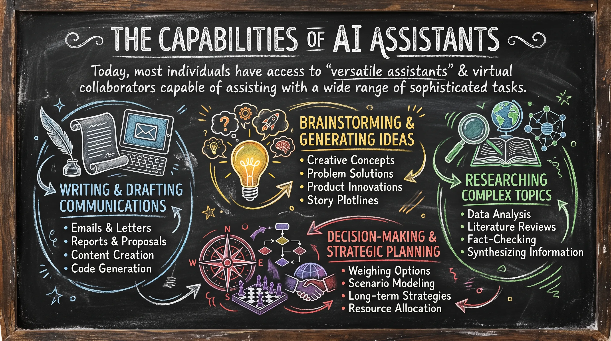
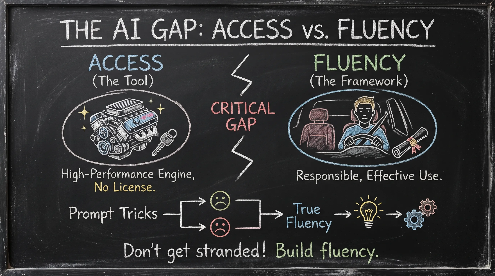
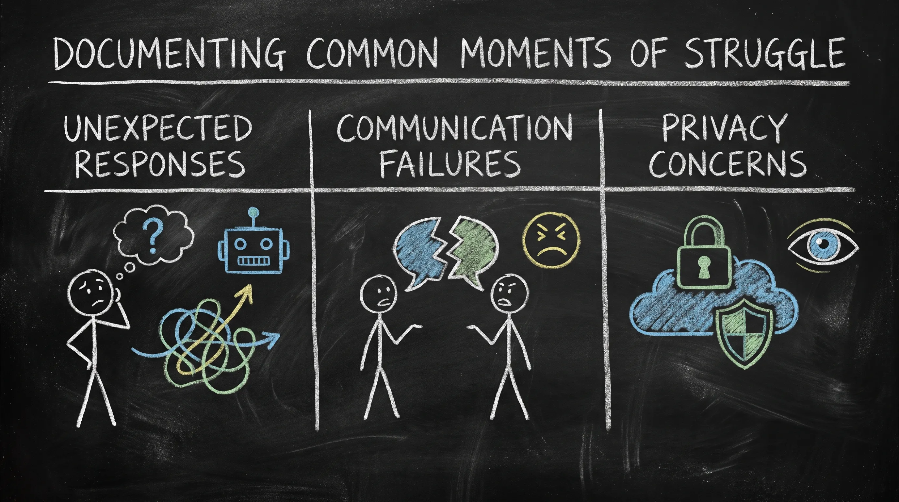
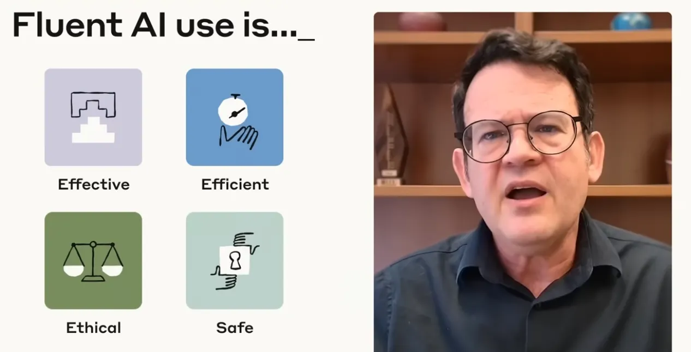
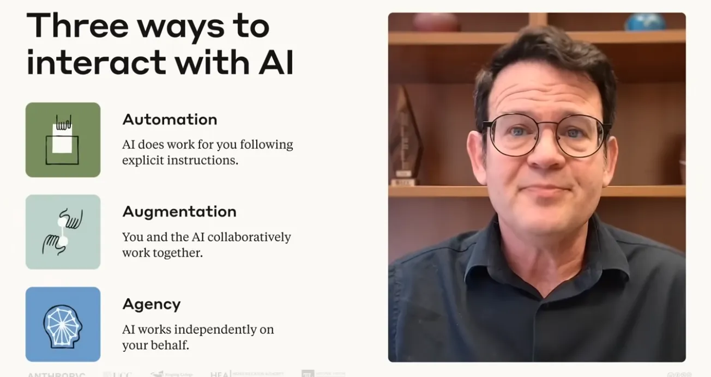
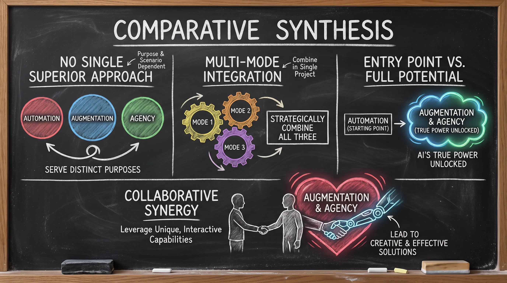
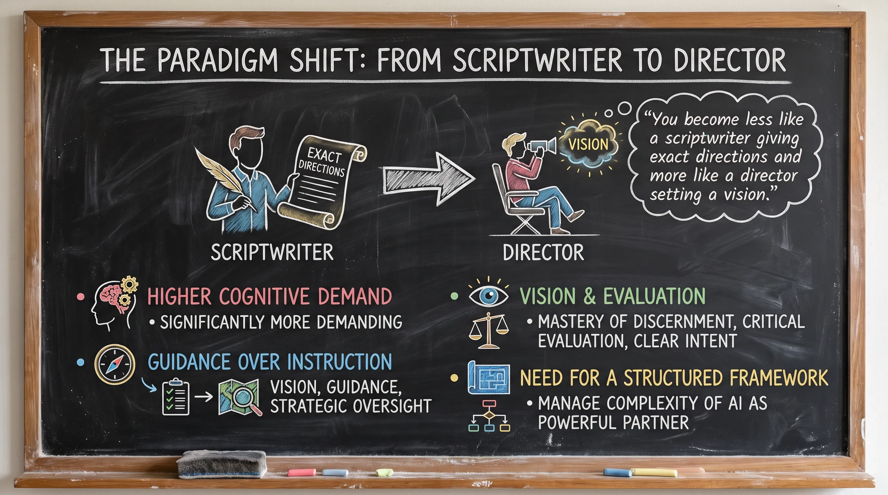
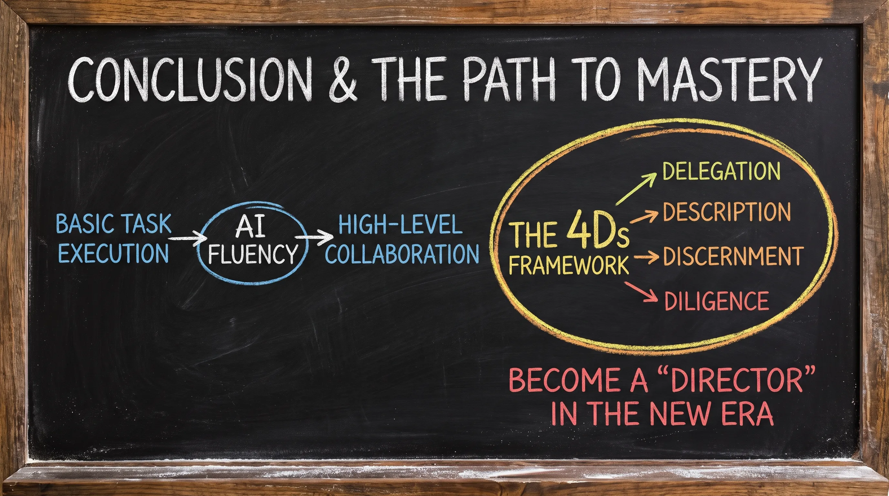

# Lesson 2.1: Why Do We Need AI Fluency?

---

## 1. Contextual Overview: The AI Access Gap

What does it really mean to be fluent with AI? Why does it matter? The current technological landscape is defined by a fascinating moment of change, characterized by a dual nature of intense excitement and underlying uncertainty. Artificial Intelligence is fundamentally reshaping how we communicate, create, learn, and solve problems across both professional and personal domains.

---

## 2. The Capabilities of AI Assistants

Today, most individuals have access to "versatile assistants" and virtual collaborators capable of assisting with a wide range of sophisticated tasks. According to the transcript, these systems can help with:

* **Writing and drafting communications**
* **Brainstorming and generating new ideas**
* **Researching complex topics**
* **Decision-making and strategic planning**

---

  
  
<b><u>The Capabilities of AI Assistants</u></b>

---

## 3. Analyzing the Gap

Having access to these powerful systems is essentially like possessing a high-performance engine without having a driver’s license. A critical gap exists between simply having access to AI and being truly fluent with it. Access provides the tool, but fluency provides the framework for responsible and effective use. Without this fluency, users often rely on "prompt tricks" that eventually fail, leaving them stranded when a task evolves or the technology changes.

---

  
  
<b><u>Analyzing the Gap</u></b>

---

## 4. Documenting Common Moments of Struggle

Consider a time when an unexpected response from an AI arrives and the user is unsure how to proceed. Or when struggling to explain exactly what is needed, leaving the interaction feeling frustrating. Or perhaps wondering if the information being shared is being properly protected.

This gap is most visible during these "moments of struggle," where a lack of a cohesive framework leads to three specific failures:

* **Unexpected Responses**: Receiving confusing or irrelevant outputs and being unsure of how to troubleshoot or proceed.
* **Communication Failures**: Feeling frustrated when unable to explain specific needs clearly to the system, resulting in failed interactions.
* **Privacy Concerns**: Navigating uncertainty regarding whether shared information is being properly protected, highlighting the need for a secure approach.

---

  
  
<b><u>Documenting Common Moments of Struggle</u></b>

---

## 5. Defining AI Fluency: Beyond the "Prompt Hack"

> **AI Fluency** is a collection of practical skills, knowledge, insights, and values that reinforce each other and adapt as the technology changes.

* **Beyond Tactical Memorization**: Fluency is distinct from narrow technical expertise or memorizing ephemeral "trending tasks" and prompt tricks.
* **Holistic & Future-Proof**: It represents a comprehensive mindset that keeps professionals adaptable and relevant regardless of how underlying models evolve.
* **Interdependent Skills**: The dimensions of fluency are interconnected—true effectiveness cannot be achieved without also being ethical and safe.

| Pillar | Description |
| :--- | :--- |
| **Effective** | Interacting with AI systems in ways that achieve the desired outcome and maximize the value of the interaction. |
| **Efficient** | Achieving results without wasting time and energy. |
| **Ethical** | Engaging with AI in an honest and responsible manner. |
| **Safe** | Protecting the privacy and security of oneself and others during every interaction. |

---

  
  
<b><u>The Four Pillars of AI Fluency</u></b>

---

## 6. The Three Modes of AI Engagement

Understanding how we engage with AI helps us move beyond simple prompt engineering and into deeper collaboration. There are three primary modes of engagement:

### 1. Automation

* **Definition**: The AI assistant executes a specific, defined task based on direct instructions.
* **Ideal Use Case**: When the user has a clear, predefined outcome in mind.
* **Real-World Examples**: Summarizing a document, drafting an email, creating an image, or planning a trip itinerary.

### 2. Augmentation

* **Definition**: The AI acts as a creative thinking and problem-solving partner, collaborating with the user to improve their work.
* **Ideal Use Case**: When solutions are not straightforward and the user needs space to explore, experiment, and refine ideas.
* **Real-World Examples**: Developing a character for a story by bouncing ideas back and forth, elaborating on backstories, experimenting with dialogue, solving a difficult architectural problem with an app you are building, or formulating thoughts on complex research topics.

### 3. Agency

* **Definition**: The AI works independently on the user's behalf based on established patterns and knowledge.
* **Ideal Use Case**: When the user establishes behavior patterns and knowledge bases rather than defining every specific action.
* **Real-World Examples**: Setting up an assistant to categorize incoming emails by topic or urgency and drafting responses, or creating dynamic, interactive website experiences and game characters.

---

  
  
<b><u>Modes of AI Interaction: Automation vs. Augmentation vs. Agency</u></b>

---

## 7. Comparative Synthesis

* **No Single Superior Approach**: None of these modes are inherently better than the others; each serves distinct purposes and excels in different scenarios.
* **Multi-Mode Integration**: A user can strategically combine all three modes within a single project.
* **Entry Point vs. Full Potential**: While automation is the most common starting point for beginners, the true power of AI is unlocked through augmentation and agency.
* **Collaborative Synergy**: Augmentation and agency leverage the unique, interactive capabilities of AI, leading to the most creative and effective solutions.

---

  
  
<b><u>Comparative Synthesis</u></b>

---

## 8. The Paradigm Shift: From Scriptwriter to Director

As we become more fluent, our relationship with technology shifts. AI transitions from being a simple tool to becoming a medium, a partner, and a co-creator. This evolution requires us to adopt a new professional identity.

> *"You become less like a scriptwriter giving exact directions and more like a director setting a vision."*

* **Higher Cognitive Demand**: This shift is significantly more demanding than mastering traditional technical skills alone.
* **Guidance Over Instruction**: Moving from "scripting" to "directing" means transitioning from rigid, step-by-step commands to providing high-level vision, guidance, and strategic oversight.
* **Vision & Evaluation Over Syntax**: It requires mastery of discernment, critical evaluation, and clear intent rather than just memorizing prompts or syntax.
* **Need for a Structured Framework**: Operating in this new collaborative role necessitates a cohesive framework to effectively manage the complexity of AI as a powerful partner.

---

  
  
<b><u>The Paradigm Shift: From Scriptwriter to Director</u></b>

---

## 9. Conclusion & The Path to Mastery

AI Fluency is the essential skillset required to ensure that AI interactions are maximized in an honest, responsible, and secure manner. It provides the necessary foundation to adapt as technology evolves, moving users from basic task execution to high-level collaboration.

To achieve this mastery, we must look toward the 4Ds Framework. This framework serves as our roadmap to mastery, detailing the four key areas of competence that will be the focus of the remainder of this course. By developing these competencies, you will be equipped to lead as a "director" in this new technological era.

---

  
  
<b><u>Conclusion & The Path to Mastery</u></b>

---