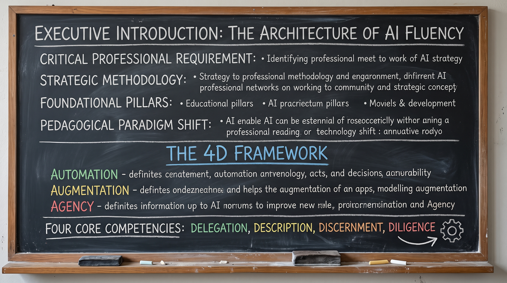
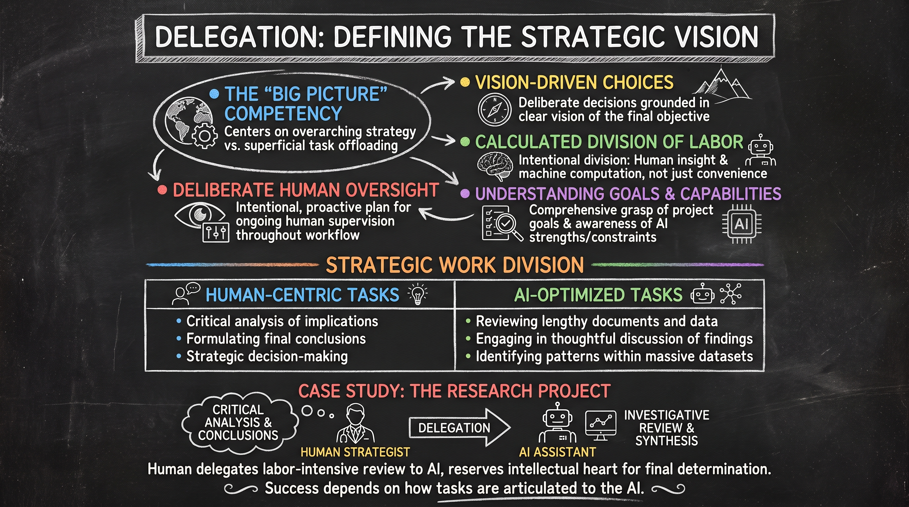
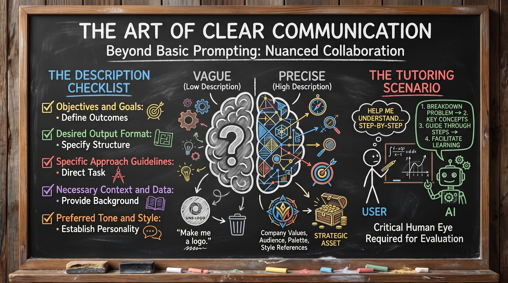
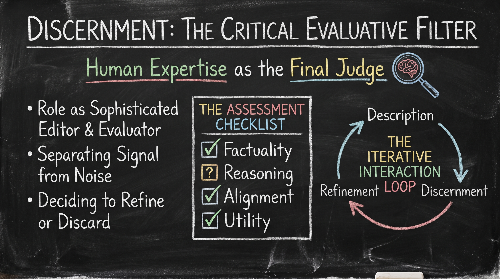
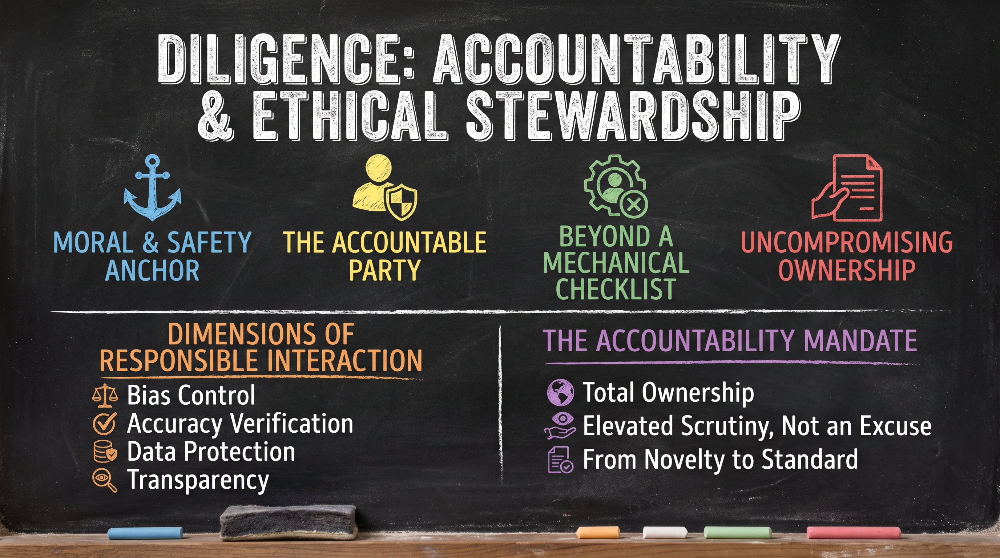
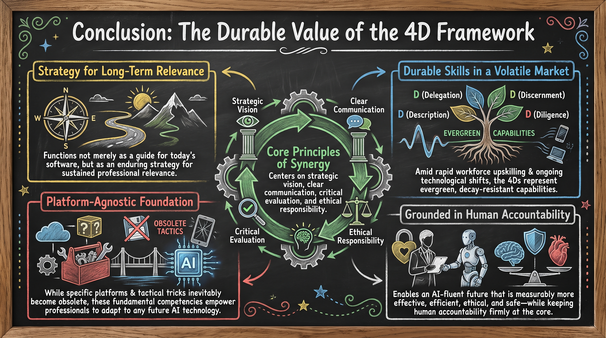

# Lesson 03: The 4D Framework for Effective AI Collaboration

---

## 1. Executive Introduction: The Architecture of AI Fluency

* **Critical Professional Requirement**: In the contemporary landscape of digital transformation, AI fluency has emerged as an essential competency for modern professionals.
* **Strategic Methodology**: Grounded in the 4D Framework introduced by Rick Dacon (Ringling College of Art and Design), moving beyond mere technical instructions.
* **Foundational Pillars**: Provides a robust foundation for navigating AI collaboration effectively, efficiently, ethically, and safely.
* **Pedagogical Paradigm Shift**: Transforms users from passive tool operators into active, strategic partners with generative technologies.

The 4D Framework is designed to operate regardless of the specific interaction mode being utilized:

* **Automation**: Executing tasks with minimal human intervention.
* **Augmentation**: Enhancing and expanding existing human capabilities.
* **Agency**: Utilizing AI to act on behalf of the user to achieve specific objectives.

The framework is structured around four core competencies—Delegation, Description, Discernment, and Diligence. These pillars transform the user’s relationship with AI, evolving the technology from a simple tool into a sophisticated collaborative partner.

---

  
  
<b><u>The Architecture of AI Fluency</u></b>

---

## 2. Delegation: Defining the Strategic Vision

* **The "Big Picture" Competency**: Centers on overarching strategy rather than superficial task offloading.
* **Vision-Driven Choices**: Requires professionals to make deliberate decisions grounded in a clear vision of the final objective.
* **Calculated Division of Labor**: Serves not as a mere convenience, but as an intentional division of tasks between human insight and machine computation.
* **Understanding Goals & Capabilities**: Requires a comprehensive grasp of project goals paired with a realistic awareness of AI strengths and constraints.
* **Deliberate Human Oversight**: Demands an intentional, proactive plan for ongoing human supervision throughout the workflow.

### Strategic Work Division

The success of this competency relies on identifying which aspects of a project demand human nuance and which benefit from the processing power of AI.

| Human-Centric Tasks | AI-Optimized Tasks |
| :--- | :--- |
| Critical analysis of implications | Reviewing lengthy documents and data |
| Formulating final conclusions | Engaging in thoughtful discussion of findings |
| Strategic decision-making | Identifying patterns within massive datasets |

### Case Study: The Research Project

Consider a large-scale research project. A professional acting with delegation competency serves as the strategist, while the AI functions as an investigative assistant. The human delegates the labor-intensive review of hundreds of pages of documentation to the AI to synthesize findings. However, the human intentionally reserves the critical analysis and the final determination of conclusions. This ensures that while the AI accelerates the process, the intellectual heart of the work remains human-led.

Once the labor is strategically divided, the success of the collaboration depends entirely on how those tasks are articulated to the AI.

---

  
  
<b><u>Delegation: Defining the Strategic Vision</u></b>

---

## 3. Description: The Art of Clear Communication

* **Beyond Basic Prompting**: Marks the crucial transition from simplistic prompting to nuanced, context-rich collaborative conversation.
* **Primary Driver of Success**: Serves as the foundational determinant of quality, accuracy, and depth in any AI interaction.
* **Precision of Vision & Need**: Requires professionals to articulate goals, constraints, and requirements with precision to set up the collaboration for maximum impact.

### The Description Checklist

To ensure high-quality, professional output, the user must communicate several critical layers of context:

* **Objectives and Goals**: Defining the specific intended outcome.
* **Desired Output Format**: Specifying the structure of the result.
* **Specific Approach Guidelines**: Directing how the AI should tackle the task.
* **Necessary Context and Data**: Providing the background information required for the task.
* **Preferred Tone and Style**: Establishing the personality of the interaction.

### Comparative Analysis of Precision

The difference between a vague command and a high-description instruction is the difference between a generic output and a strategic asset.

* **Vague (Low Description)**: "Make me a logo."
* **Precise (High Description)**: A description of company values, target audience, preferred color palettes, and specific style references.

### The Tutoring Scenario

This competency is best illustrated in a tutoring context. Rather than asking for a final answer, a skilled user specifies the "how" of the process: "Don't tell me the answer; just help me work through this problem step-by-step so I can better understand the concept." This level of description ensures the AI facilitates learning rather than merely providing a shortcut.

Even the most precise description, however, requires a critical human eye to evaluate the resulting output.

---

  
  
<b><u>Description: The Art of Clear Communication</u></b>

---

## 4. Discernment: The Critical Evaluative Filter

* **Human Expertise as the Final Judge**: Establishes human domain knowledge and critical thinking as the ultimate evaluative filter.
* **Role as Sophisticated Editor & Evaluator**: Counterbalances AI’s tendency to produce plausible yet flawed outputs through active auditing and rigorous interrogation.
* **Separating Signal from Noise**: Demands sharp judgment to separate genuinely valuable outputs from irrelevant or superficial content.
* **Deciding to Refine or Discard**: Empowers professionals with the critical insight to recognize when an output should be iteratively refined versus discarded entirely.

### The Assessment Checklist

Evaluating AI output requires a formal assessment based on four key criteria:

* **Factuality**: Are the facts presented accurate and verifiable?
* **Reasoning**: Does the underlying logic of the output hold up under scrutiny?
* **Alignment**: Does the content align with brand values and the specific needs of the audience?
* **Utility**: Does the output actually move the project forward toward its goal?

### The Iterative Interaction Loop

Discernment is rarely a one-time event; it is part of a cyclical "Description-Discernment" loop. The user describes a need, evaluates the output, and uses that discernment to refine the next description. This iterative process ensures that the final product meets a professional standard of quality. While discernment ensures quality, the final D—Diligence—ensures the interaction remains safe and ethical.

---

  
  
<b><u>Discernment: The Critical Evaluative Filter</u></b>

---

## 5. Diligence: Accountability and Ethical Stewardship

* **Moral & Safety Anchor**: Serves as the non-negotiable ethical and risk-mitigation foundation of the 4D Framework.
* **The Accountable Party**: Demands that the human user remains the ultimately responsible and accountable party for all AI-assisted outcomes.
* **Beyond a Mechanical Checklist**: Represents an overarching professional standard of conduct rather than a superficial checklist.
* **Uncompromising Ownership**: Mandates total ownership of the final deliverable, regardless of the extent of AI involvement.

### Dimensions of Responsible Interaction

To ensure ethical and safe collaboration, professionals must adhere to several authoritative directives:

* **Bias Control**: Proactively ensuring fairness in high-stakes tasks, such as drafting job descriptions or reviewing applications, to prevent algorithmic bias.
* **Accuracy Verification**: Maintaining a strict mandate to cross-check AI claims and data against reliable, primary sources.
* **Data Protection**: Rigorously protecting sensitive, proprietary, or private data from improper exposure to AI systems.
* **Transparency**: Maintaining openness regarding the role AI played in the creative or analytical process.

### The Accountability Mandate

* **Total Ownership**: Demands absolute ownership—if a final deliverable contains an AI-introduced error or bias, the responsibility lies solely with the human who failed to catch it.
* **Elevated Scrutiny, Not an Excuse**: Utilizing AI does not excuse a lack of oversight; rather, it demands a higher standard of professional review and vigilance.
* **From Novelty to Standard**: Transitions AI usage from an experimental novelty into an authoritative, rigorous standard of professional practice.

---

  
  
<b><u>Diligence: Accountability and Ethical Stewardship</u></b>

--- 

## 6. Conclusion: The Durable Value of the 4D Framework

* **Strategy for Long-Term Relevance**: Functions not merely as a guide for today's software, but as an enduring strategy for sustained professional relevance.
* **Durable Skills in a Volatile Market**: Amid rapid workforce upskilling and ongoing technological shifts, the 4Ds (Delegation, Description, Discernment, and Diligence) represent evergreen, decay-resistant capabilities.
* **Platform-Agnostic Foundation**: While specific platforms and tactical tricks inevitably become obsolete, these fundamental competencies empower professionals to adapt to any future AI technology.
* **Core Principles of Synergy**: Centers on strategic vision, clear communication, critical evaluation, and ethical responsibility.
* **Grounded in Human Accountability**: Enables an AI-fluent future that is measurably more effective, efficient, ethical, and safe—while keeping human accountability firmly at the core.

---

  
  
<b><u>Conclusion: The Durable Value of the 4D Framework</u></b>

--- 
