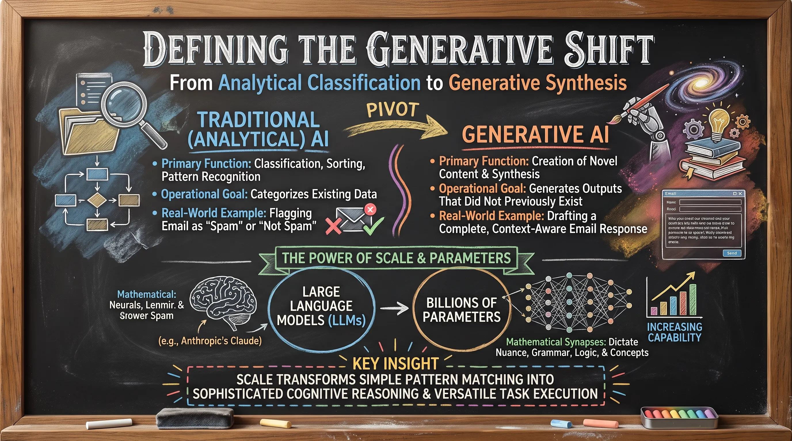
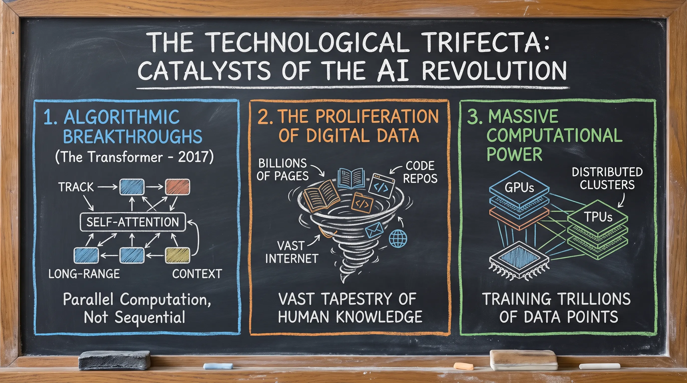
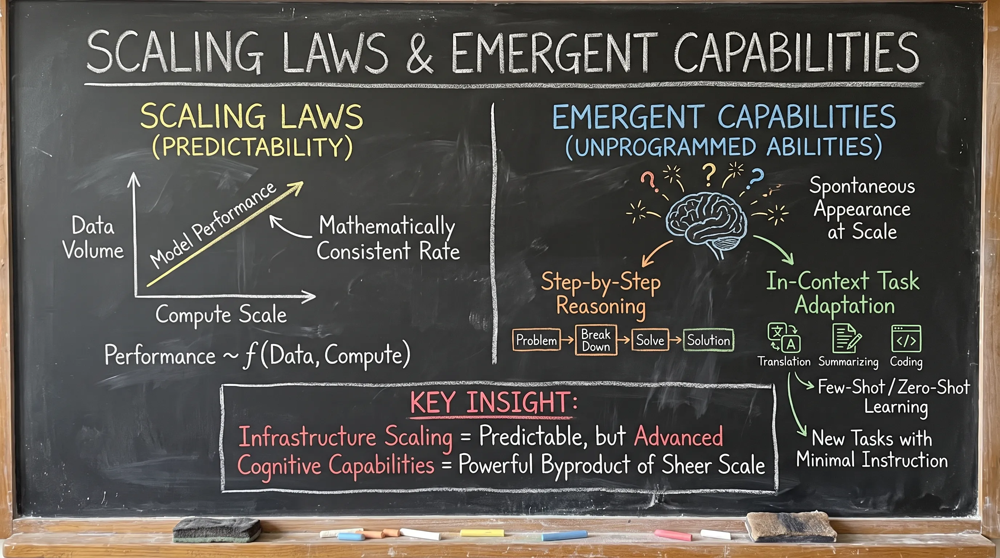
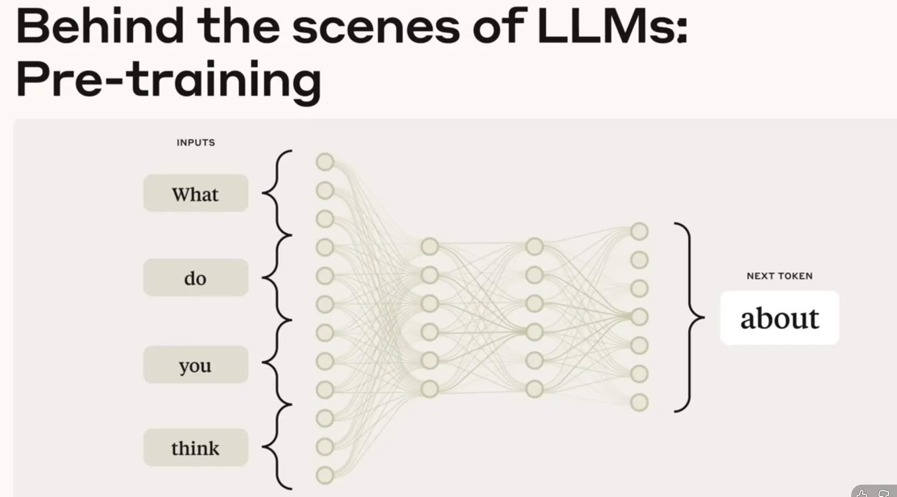
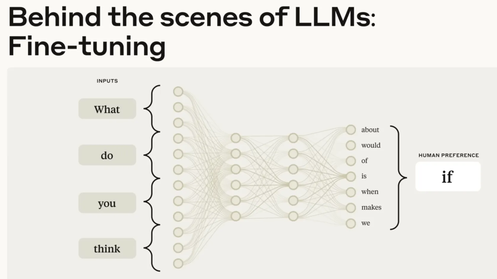
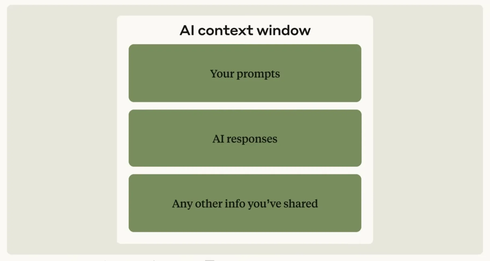
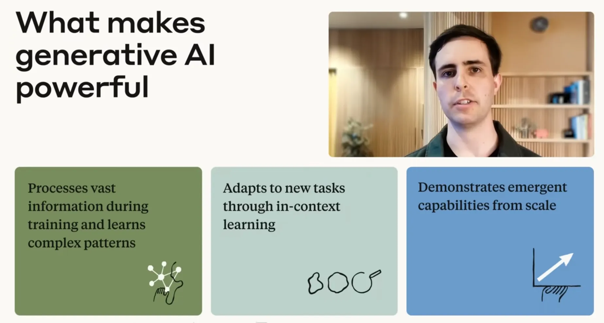

# Lesson 3.1: Technical Brief — The Foundations and Mechanics of Generative AI

---

## 1. Defining the Generative Shift

Artificial intelligence is undergoing a strategic pivot from **analytical classification** to **generative synthesis**. While traditional AI analyzes and categorizes existing data, generative AI synthesizes entirely new content.

| Attribute | Traditional (Analytical) AI | Generative AI |
| :--- | :--- | :--- |
| **Primary Function** | Classification, sorting, and pattern recognition | Creation of novel content and synthesis |
| **Operational Goal** | Categorizes existing data | Generates outputs that did not previously exist |
| **Real-World Example** | Flagging an email as "spam" or "not spam" | Drafting a complete, context-aware email response |

### The Power of Scale & Parameters
* **Large Language Models (LLMs)**: Prominent generative architectures (e.g., Anthropic's Claude) trained to predict and generate human language.
* **Billions of Parameters**: Act as the "mathematical synapses" of the model. The sheer volume of parameters directly dictates the model's ability to internalize nuanced grammar, logic, and concepts.

**Key Insight:** Scale transforms simple pattern matching into sophisticated cognitive reasoning and versatile task execution.

---

  
  
<b><u>Defining the Generative Shift</u></b>

---

## 2. The Technological Trifecta: Catalysts of the AI Revolution

The modern AI renaissance was ignited by the simultaneous convergence of three technological pillars:

* **1. Algorithmic Breakthroughs (The Transformer - 2017)**: Replaced sequential processing with parallel computation via the **Self-Attention** mechanism. This enabled models to track long-range word relationships and preserve complex context across extensive documents.
* **2. The Proliferation of Digital Data**: Billions of internet pages, code repositories, and books provided a "vast tapestry" representing the digitized sum of human knowledge.
* **3. Massive Computational Power**: Specialized hardware architectures—**GPUs** (Graphics Processing Units) and **TPUs** (Tensor Processing Units)—networked into distributed clusters made training over trillions of data points computationally feasible.

---

  
  
<b><u>The Technological Trifecta: Catalysts of the AI Revolution</u></b>

---

## 3. Scaling Laws and Emergent Capabilities

The interaction of data, compute, and architectural scale yielded two groundbreaking discoveries:

* **Scaling Laws (Predictability)**: Empirical principles showing that model performance improves at a mathematically consistent rate as dataset volume and compute scale increase.
* **Emergent Capabilities (Unprogrammed Abilities)**: Abilities that spontaneously appear at scale without explicit programming by engineers, including:
  * **Step-by-Step Reasoning**: Deconstructing and solving multifaceted logical problems.
  * **In-Context Task Adaptation**: Pivoting to brand-new, unencountered tasks with minimal or zero instruction (few-shot / zero-shot learning).

**Key Insight:** While infrastructure scaling is mathematically predictable, the emergence of advanced cognitive capabilities remains a powerful byproduct of sheer model scale.

---

  
  
<b><u>Scaling Laws and Emergent Capabilities</u></b>

---

## 4. Under the Hood: The Two-Phase Training Process

Transitioning raw neural networks into safe, production-grade AI assistants requires two distinct stages:

### Phase 1: Pre-Training (Statistical Knowledge Mapping)
* **Mechanism**: Self-supervised learning across billions of diverse text examples.
* **Core Objective**: Performs **next-token prediction** (anticipating the most probable subsequent word).
* **Outcome**: Constructs an internal "statistical map of language, facts, and reasoning patterns" without requiring human labels.

---

  
  
<b><u>Phase 1: Pre-Training (Statistical Knowledge Mapping)</u></b>

---

### Phase 2: Fine-Tuning (Alignment & Instruction Following)
* **Mechanism**: Supervised tuning paired with **Reinforcement Learning** from human feedback (RLHF), using reward/penalty signals to guide model behavior.

---

  
  
<b><u>Phase 2: Fine-Tuning (Alignment & Instruction Following)</u></b>

---

* **Core Objective**: Aligns the statistical model to Anthropic's **HHH Standard**:
  * **Helpful**: Accurately follows user instructions and executes tasks.
  * **Honest**: Remains grounded and transparent about its limitations.
  * **Harmless**: Strictly avoids generating biased, harmful, or toxic content.

---

  
  
<b><u>Anthropic Goals of fine tuning</u></b>

---

## 5. Operational Mechanics and Constraints

To deploy generative AI effectively, professionals must understand its operating constraints:

> *"LLMs do not 'know' facts; they predict the most likely sequence of information based on mathematical probability."*

* **Generation vs. Retrieval**: LLMs do not look up pre-written answers in a static database; they generate outputs word-by-word based on statistical patterns learned during training.
* **The Context Window (Working Memory)**:
  * Represents the finite limit of text an LLM can process in an active session (including user prompts, prior conversational turns, and attached documents).
  * The model cannot "see" or recall information outside this window without external augmentation tools (such as web search or retrieval systems).

---

  
  
<b><u>AI Context Window</u></b>

---

## 6. Synthesis: The Three Core Strengths of Generative AI

Modern Generative AI acts as a flexible, real-time reasoning engine defined by three core superpowers:

1. **Vast Information Processing**: Internalizes and synthesizes nuanced patterns across the breadth of human knowledge.
2. **In-Context Learning**: Adapts on the fly to custom tasks and instructions directly within the prompt without costly retraining.
3. **Emergent Capabilities**: Harnesses spontaneous reasoning, synthesis, and creative problem-solving unlocked by model scale.

**Key Insight:** Generative AI is not merely a tool for routine automation—it is a scalable cognitive architecture that adapts dynamically to human intent in real time.

---

  
  
<b><u>The Three Core Strengths of Generative AI</u></b>

---