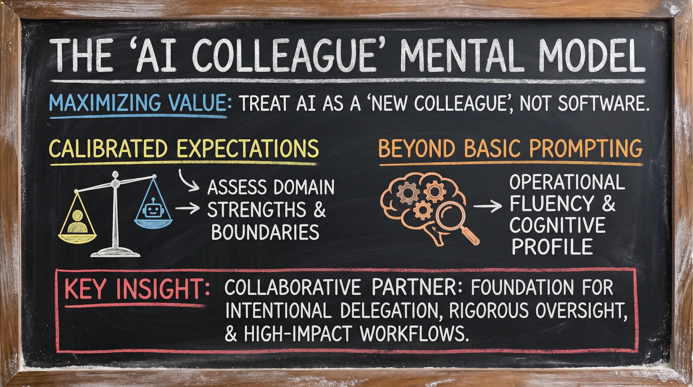
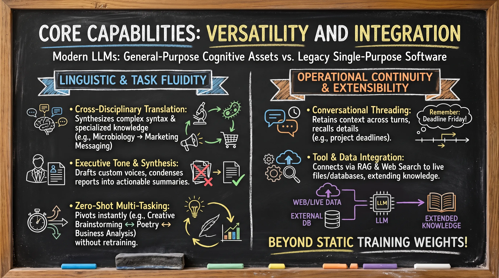
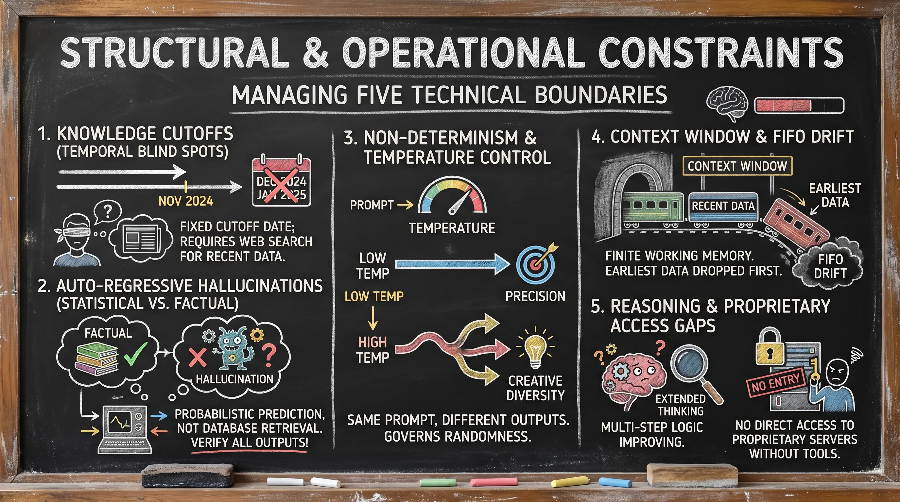
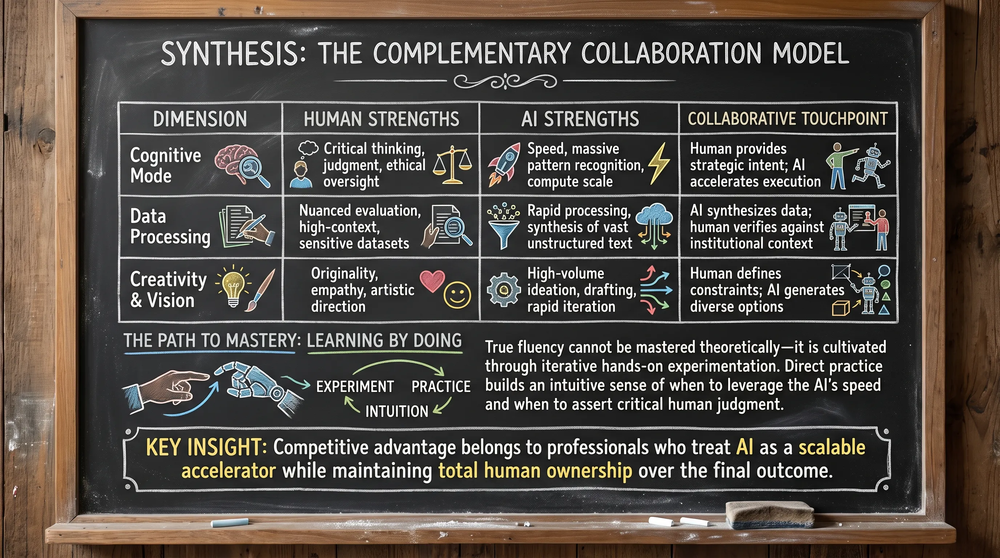

# Lesson 3.2: Strategic Capabilities and Operational Limitations of LLMs

---

## 1. The "AI Colleague" Mental Model

Maximizing value from Large Language Models (LLMs) requires a fundamental shift: **treat the AI as a "new colleague" rather than traditional software.** 

* **Calibrated Expectations**: Just as a manager assesses a human colleague's unique domain strengths and boundaries to optimize delegation, professionals must understand an LLM's specific proficiencies and blind spots.
* **Beyond Basic Prompting**: Moving past surface-level prompting into true operational fluency requires understanding both sides of the model's cognitive profile.

> [!IMPORTANT]
> **Key Insight:** Viewing AI as a collaborative partner establishes the foundation for intentional delegation, rigorous oversight, and high-impact workflows.

---

  
  
<b><u>The 'AI Colleague' Mental Model</u></b>

---

## 2. Core Capabilities: Versatility and Integration

Unlike legacy single-purpose software, modern LLMs function as general-purpose cognitive assets:

### Linguistic & Task Fluidity
* **Cross-Disciplinary Translation**: Synthesizes complex syntax and specialized knowledge—such as translating dense microbiology concepts into clear marketing messaging.
* **Executive Tone & Synthesis**: Drafts communications in custom voices and condenses voluminous reports into actionable executive summaries.
* **Zero-Shot Multi-Tasking**: Instantly pivots within the same session from creative brainstorming and poetry to rigorous quarterly business trend analysis without retraining.

### Operational Continuity & Extensibility
* **Conversational Threading**: Retains context across conversational turns, seamlessly recalling earlier details (such as project deadlines mentioned in passing).
* **Tool & Data Integration**: Connects via **Retrieval-Augmented Generation (RAG)** and web search to ingest live files and external databases, extending knowledge beyond static training weights.

---

  
  
<b><u>Core Capabilities: Versatility and Integration</u></b>

---

## 3. Structural and Operational Constraints

Treating AI outputs as infallible introduces severe operational risk. Professional fluency requires managing five key technical boundaries:

### 1. Knowledge Cutoffs (Temporal Blind Spots)
* Models possess a fixed cutoff date (e.g., November 2024) and have zero innate awareness of subsequent events.
* *Analogy*: Like a colleague returning from a remote retreat without internet access—they require web search or RAG tools to access recent developments.

### 2. Auto-Regressive Hallucinations (Statistical vs. Factual)
* LLMs generate text token-by-token based on **probabilistic prediction**, not database retrieval.
* Models can generate factually baseless statements with absolute confidence, mandating rigorous human verification for all high-stakes outputs.

### 3. Non-Determinism & Temperature Control
* Identical prompts yield variable outputs by default.
* **Temperature** governs this randomness:
  * **Low Temperature**: Minimizes variance for high-precision analytical tasks.
  * **High Temperature**: Maximizes creative diversity for brainstorming and ideation.

### 4. Context Window & FIFO Drift
* The context window represents the model's finite working memory.
* When conversation length exceeds this ceiling, the model drops earliest data on a **First-In, First-Out (FIFO)** basis, causing "contextual drift" where early project constraints are lost.

### 5. Reasoning & Proprietary Access Gaps
* **Multi-Step Logic**: Historically vulnerable in complex mathematics and logic, now being bridged by specialized **extended thinking** models.
* **Data Isolation**: Without explicit agentic tool integration, models lack access to proprietary company servers—functioning like a brilliant colleague locked out of the company database.

---

  
  
<b><u>Structural and Operational Constraints</u></b>

---

## 4. Synthesis: The Complementary Collaboration Model

High-performing human-AI workflows rely on **Complementary Strengths**—uniting machine processing scale with human discernment:

| Dimension | Human Strengths | AI Strengths | Collaborative Touchpoint |
| :--- | :--- | :--- | :--- |
| **Cognitive Mode** | Critical thinking, judgment, and ethical oversight | Speed, massive pattern recognition, and compute scale | Human provides strategic intent; AI accelerates execution |
| **Data Processing** | Nuanced evaluation of high-context, sensitive datasets | Rapid processing and synthesis of vast unstructured text | AI synthesizes data; human verifies against institutional context |
| **Creativity & Vision** | Originality, empathy, and artistic direction | High-volume ideation, drafting, and rapid iteration | Human defines constraints; AI generates diverse options |

### The Path to Mastery: Learning by Doing
True fluency cannot be mastered theoretically—it is cultivated through iterative hands-on experimentation. Direct practice builds an intuitive sense of when to leverage the AI's speed and when to assert critical human judgment.

> [!IMPORTANT]
> **Key Insight:** Competitive advantage belongs to professionals who treat AI as a scalable accelerator while maintaining total human ownership over the final outcome.

---

  
  
<b><u>Synthesis: The Complementary Collaboration Model</u></b>

---
