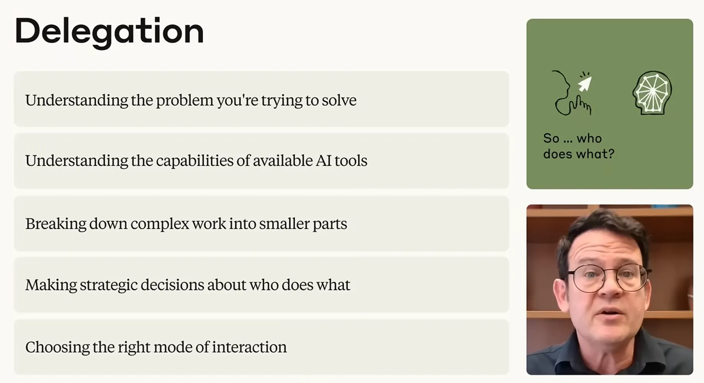
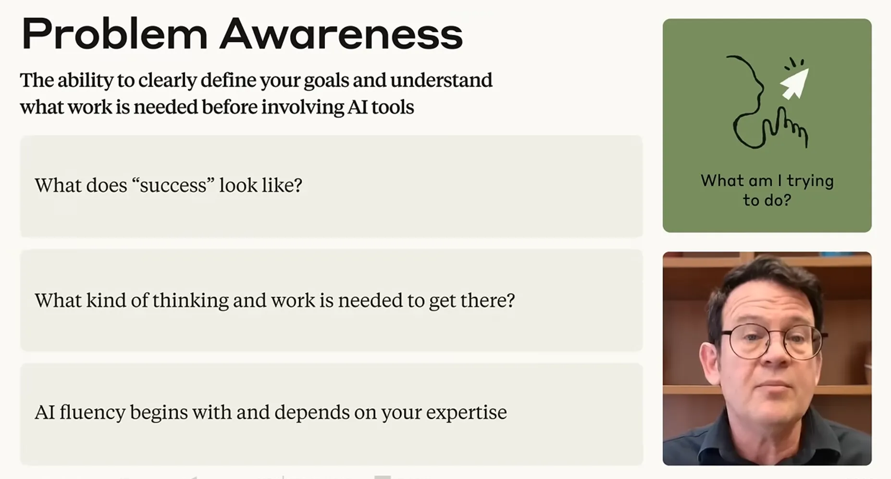
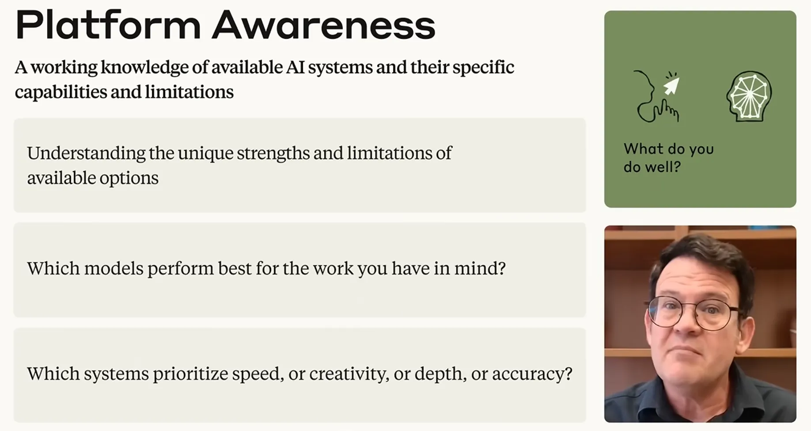
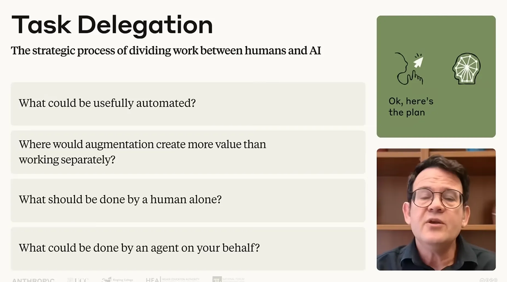
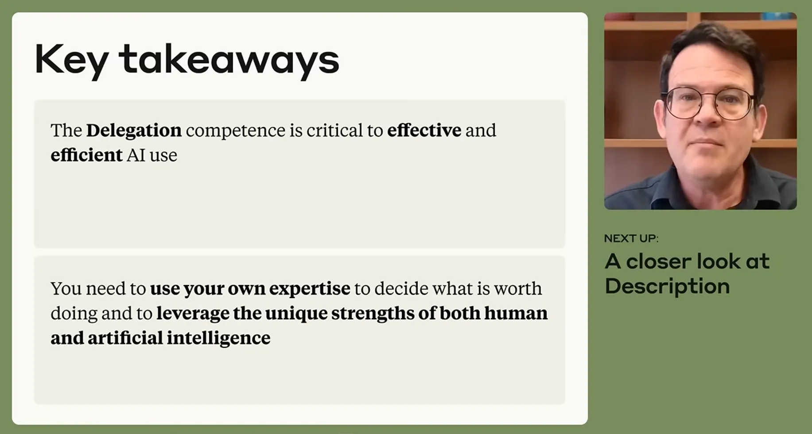

# Lesson 4.1: A Closer Look at Delegation

---

## 1. The Core of Delegation

Delegation is the strategic decision-making process of determining how work is divided between human intelligence and AI assistants. Within the AI Fluency Framework, delegation is the primary driver of **Effectiveness** and **Efficiency**.

* **Strategic Orchestration**: Moves beyond casual tool usage to intentionally deciding *what* work should be done, *who* should do it, and *how* it should be executed.
* **Core Competencies of the Delegator**:
  * **Workflow Deconstruction**: Breaking complex projects into manageable, strategic sub-tasks.
  * **Suitability Analysis**: Evaluating which tasks leverage AI processing scale vs. which demand human oversight.
  * **Mode Selection**: Assigning the optimal execution model (automation, augmentation, agency, or exclusive human).

> [!IMPORTANT]
> **Key Insight:** Effective delegation is not about technical prompt hacks—it is fundamentally anchored in your own domain expertise and clarity of purpose.

---

  
  
<b><u>The Core of Delegation</u></b>

---

## 2. Concept 1: Developing Problem Awareness

The foundation of effective delegation begins entirely with human domain expertise and clear goal definition. Without a clear destination, even the most advanced model cannot reach the objective.

### The "Experts First" Rule
* **The Principle**: The most successful AI collaborators are **experts in their fields first, and AI delegators second**.
* **Why It Matters**: Domain mastery provides the critical mental models required to define project vision, evaluate output quality, and detect when human intervention is necessary.

### Diagnostic Problem Scoping
Before involving AI, answer four essential questions:
1. *What exactly am I trying to accomplish, create, or solve?*
2. *What is the central project goal and core vision?*
3. *What does concrete success look like?*
4. *What specific cognitive effort or labor is required to get there?*

### The 4 Work Categories
Categorize your workflow to determine the appropriate intervention:

| Work Category | Problem Context | AI Collaboration Role |
| :--- | :--- | :--- |
| **Simple but Time-Consuming** | High-volume, repetitive, routine tasks | Full automation to reclaim time |
| **Uncertainty** | Ambiguous problem space, creative blocks | AI as a "trusted thinking partner" (Augmentation) |
| **Ignorance** | Information deficits, complex research needs | AI for data retrieval, summarization, and synthesis |
| **Critical Judgment** | High-stakes ethical, strategic, or nuanced decisions | **Reserved exclusively for human execution** |

---

  
  
<b><u>Developing Problem Awareness</u></b>

---

## 3. Concept 2: Building Platform Awareness

Platform awareness is a working, up-to-date knowledge of available AI models and their specific strengths, constraints, and operational tradeoffs.

* **Navigating Strategic Trade-offs**:
  * **Speed vs. Depth**: Rapid, lightweight task completion vs. deep, multi-step analytical reasoning.
  * **Accuracy vs. Creativity**: Factually grounded, deterministic precision vs. open-ended, divergent brainstorming.
* **The Experimentation Mandate**: Because AI architectures evolve rapidly, static theoretical knowledge quickly depreciates. Mastery requires continuous hands-on experimentation to build intuitive, empirical insights into which models excel at specific tasks.

---

  
  
<b><u>Building Platform Awareness</u></b>

---

## 4. Concept 3: Executing Task Delegation

Task delegation is the strategic distribution of labor that matches each task to the comparative advantage of either the human or the AI.

### The Four Modes of Work Distribution

| Distribution Mode | Operational Dynamic | Strategic Use Case |
| :--- | :--- | :--- |
| **Automation** | AI executes defined tasks with minimal human intervention | Standardized, predictable, rules-based tasks |
| **Augmentation** | Collaborative feedback loop between human and AI | Complex problem-solving yielding results neither could achieve alone |
| **Exclusive Human** | Zero delegation to machine systems | Critical judgment, ethical oversight, and strategic accountability |
| **Agency** | AI acts independently on your behalf based on set parameters | Multi-step workflows, routine routing, and dynamic interactions |

---

  
  
<b><u>Executing Task Delegation</u></b>

---

## 5. Conclusion: The Active Collaboration Cycle

Effective AI collaboration is never about **"handing over the wheel and calling it a day."** It is an ongoing, proactive cycle of assessment, distribution, and oversight:

$$\text{Problem Awareness} \longrightarrow \text{Platform Awareness} \longrightarrow \text{Task Delegation}$$

> [!IMPORTANT]
> **Key Insight:** True AI fluency pairs machine processing scale and speed with irreplaceable human judgment—ensuring AI amplifies your expertise rather than replacing it.

---

  
  
<b><u>The Active Collaboration Cycle</u></b>

---