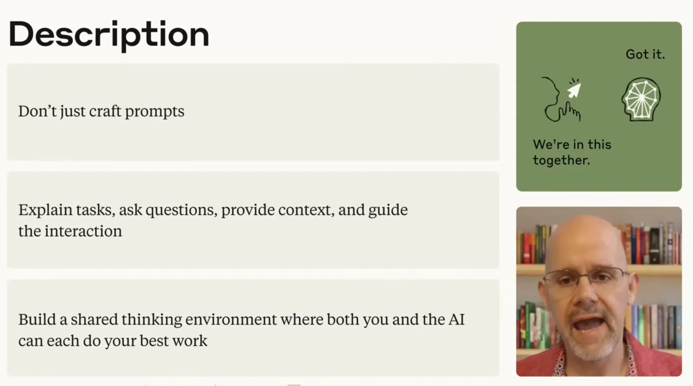
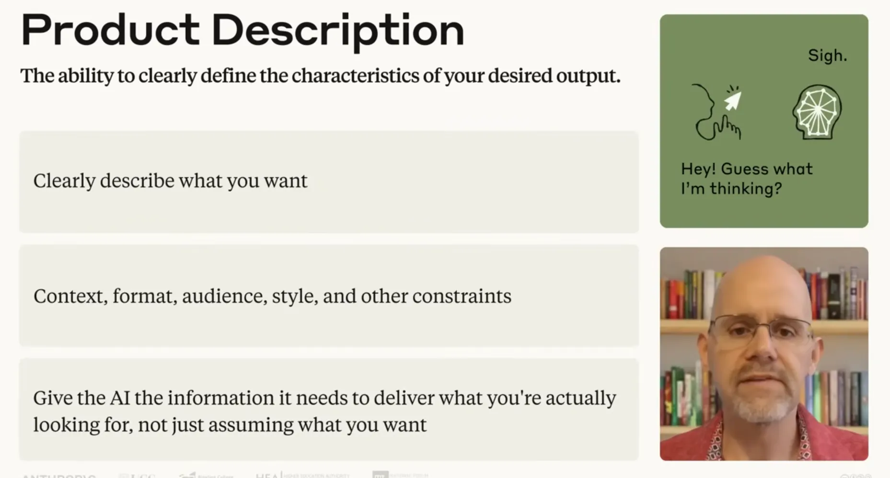
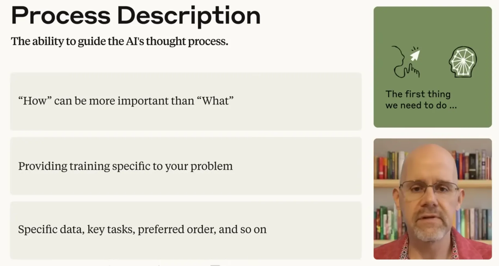
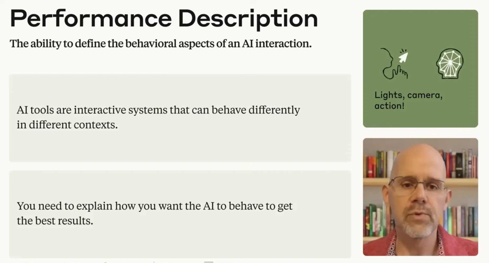
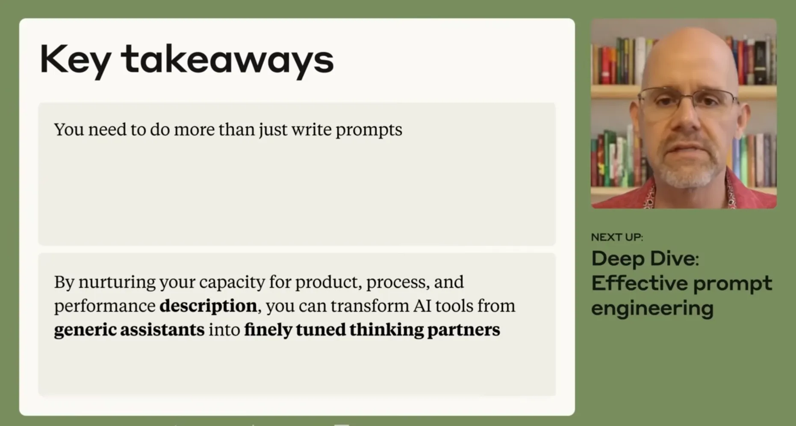

# Lesson 5.1: A Closer Look at Description

---

## 1. The Foundation of Description: Beyond Prompting

Description is the communication backbone of AI Fluency, serving as the strategic bridge between **human intention** and **machine capability**.

* **Beyond Clever Prompts**: True description moves beyond superficial prompt tricks into architecting a deliberate **"thinking environment"** where both human and AI perform at their best.
* **Steering & Correction**: Serves as the primary operational lever for guiding logical reasoning and actively steering interactions back on track when they go astray.
* **The Core Metaphor**:
  * *Low Description (Asking for Dinner)*: Assuming the AI inherently knows your preferences—inevitably producing generic, misaligned results.
  * *High Description (Providing a Recipe)*: Supplying the exact ingredients, sequence, and constraints needed to guarantee a tailored outcome.

> [!IMPORTANT]
> **Key Insight:** AI tools cannot read your mind. The quality of the output directly mirrors the clarity and depth of the thinking environment you establish.

---

  
  
<b><u>The Foundation of Description: Beyond Prompting</u></b>

---

## 2. Concept 01: Product Description - Defining the "What"

Product Description specifies exactly what you want the AI to create or deliver, eliminating guesswork and reducing auditing overhead.

### The 5-Layer Prompt Specification

| Dimension | Core Question | Strategic Impact |
| :--- | :--- | :--- |
| **Context** | *What is the background and situational "why"?* | Grounds the AI in reality; prevents generic platitudes |
| **Task** | *What is the exact, singular objective to execute?* | Keeps the system focused on the core deliverable without drift |
| **Format** | *What precise structure should the output take?* | Dictates layout (Markdown table, executive brief, code) for immediate utility |
| **Audience** | *Who is the end stakeholder consuming this work?* | Calibrates technical complexity, vocabulary, and relevance |
| **Style** | *What specific tone and professional voice is required?* | Protects organizational brand standards and communication norms |

---

  
  
<b><u>Product Description: Defining the What</u></b>

---

## 3. Concept 02: Process Description - Guiding the "How"

Specifying *how* an AI approaches a task is often as critical as defining the end goal. Just as you would guide a human colleague to solve a problem using a proven methodology, process description prescribes the AI's execution path.

### Three Instructional Methodologies

| Guidance Approach | Operational Analogy | Best Use Case |
| :--- | :--- | :--- |
| **General Guidance** | *The Manual* | Broad guidelines, high-level operational boundaries, and principles |
| **Step-by-Step Instructions** | *The Cookbook* | Rigid, sequential procedures requiring auditability and consistency |
| **Demonstration** | *Few-Shot Examples* | Showing *"Here's how I'd do it"* to model voice, reasoning, and structure |

* **Contextual Constraints**: Explicitly dictate the specific data sources to reference, the sequential order of issues to address, and the analytical framework to apply (e.g., SWOT, PESTLE).

---

  
  
<b><u>Process Description: Guiding the How</u></b>

---

## 4. Concept 03: Performance Description - Calibrating the "Thinking Partner"

AI models are not static databases or vending machines—they are **interactive systems** whose behavior must be dynamically calibrated to the task at hand.

### The Behavioral Choice Menu

Before prompting, decide what kind of thinking partner you need across four behavioral dimensions:

1. **Convergence vs. Divergence**:
   * *Narrowing Down*: Converging toward a single, optimal, decisive solution.
   * *Exploring Possibilities*: Generating a wide, diverse spectrum of creative options.
2. **Dynamic Stance**:
   * *Challenging (Red Teaming)*: Interrogating assumptions, stress-testing logic, and finding blind spots.
   * *Following*: Faithfully executing directions and aligning with your lead.
3. **Information Density**:
   * *Rich Detail*: Providing exhaustive, multi-layered, deep technical analysis.
   * *Conciseness*: Delivering crisp, high-velocity, executive-level summaries.
4. **Transparency**:
   * *Explaining Reasoning*: Showing the step-by-step chain of thought and rationale behind conclusions.
   * *Direct Answers*: Supplying unadorned, immediate solutions.

---

  
  
<b><u>Performance Description: Calibrating the Thinking Partner</u></b>

---

## 5. Strategic Synthesis: Transforming AI into a Thinking Partner

The complete Description Competency unites all three dimensions:

$$\text{Product (What)} + \text{Process (How)} + \text{Performance (Behavior)} = \text{Finely Tuned Thinking Partner}$$

* **From Cost Center to Value Driver**: Moving from transactional questions to layered specifications eliminates the cycle of generic outputs and costly rework.
* **Collaborative Mastery**: Empowers professionals to steer, shape, and calibrate AI to meet the most demanding enterprise challenges.

> [!IMPORTANT]
> **Key Insight:** When you master Product, Process, and Performance descriptions, you transform AI from a generic assistant into a customized, high-leverage intellectual partner.

---

  
  
<b><u>Strategic Synthesis: Transforming AI into a Thinking Partner</u></b>

---