# Lesson 6.1: Technical Brief — Effective Prompting Techniques

---

## 1. The Philosophy of Prompting as a Competency

Prompting is not a technical programming hurdle; it is the practical execution of the **Description Competency**—communicating what you want, how you want it done, and how you want to interact throughout the process.

---

  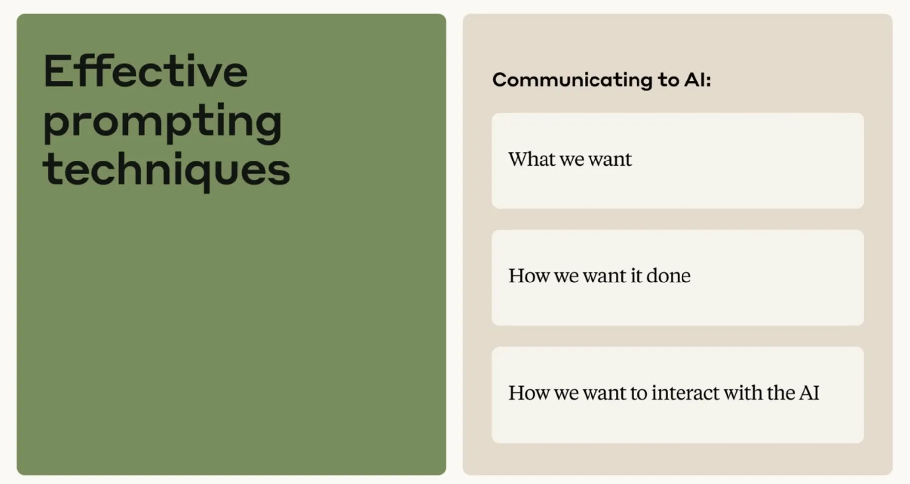
  
<b><u>Effective Prompting Techniques</u></b>

---

* **The Core Metaphor**: Treat the model like a **"helpful new colleague"** who is eager and highly capable, but requires clear directions and explicit expectation-setting to deliver exceptional work.
* **Human Conversation vs. AI Prompting**:

| Human Conversation | AI Prompting |
| :--- | :--- |
| Relies on unstated inference and shared intuition | Requires being explicit about nuances humans naturally assume |
| Operates with lifelong contextual memory | Bounded by the session's **context window** |
| Uses subtle social cues | Requires structured formatting, parameters, and constraints |

> [!IMPORTANT]
> **Key Insight:** Prompt engineering is the deliberate practice of designing an optimal "thinking environment" where the AI can succeed without guessing.

---

  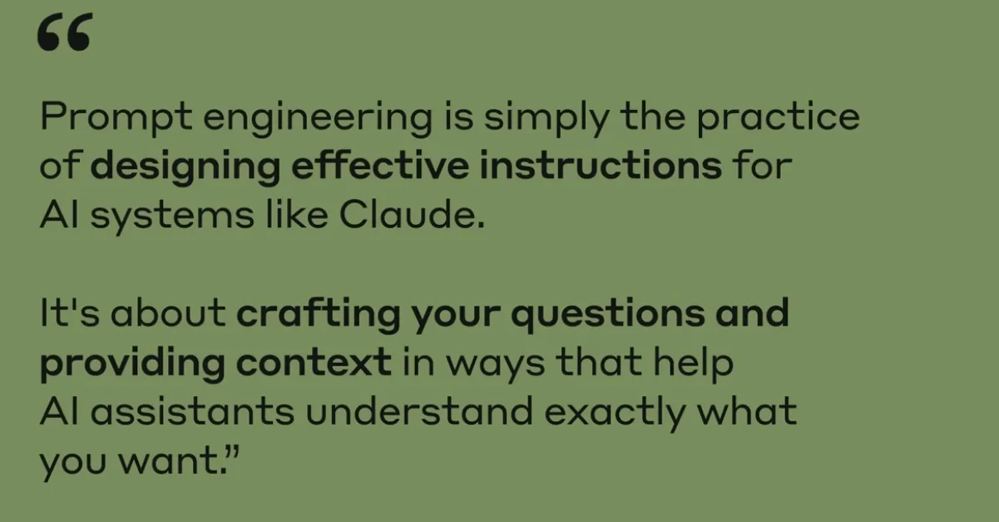
  
<b><u>What is Prompt Engineering?</u></b>

---

## 2. The Six Foundational Prompting Principles

Implementing these six structural habits transforms prompt interactions from hit-or-miss queries into reliable, high-value outputs:

---

  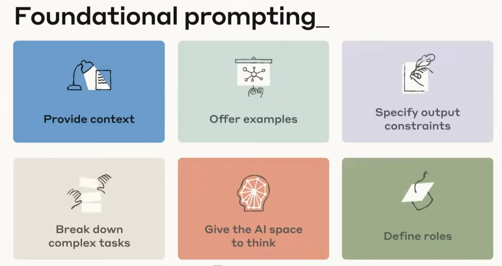
  
<b><u>The Six Foundational Prompting Principles</u></b>

---

### 1. Strategic Contextual Anchoring (Give Claude Context)
* **Define "Who, What, Why, and Who You Are"**: Explicitly state your background so the AI calibrates the knowledge gap appropriately.
* **Case Study (From Baseline to Optimized)**:
  * *Vague*: "Tell me about climate change." (Leaves AI guessing depth and audience).
  * *Context-Rich*: "Explain three major impacts of climate change on agriculture in tropical regions with examples from the past decade."
  * *Optimized*: *"I am preparing for a job interview at an agricultural research lab in Indonesia. I have a degree in ecology but no specific knowledge of climate change. Write a summary of key concepts to help me speak intelligently."*

---

  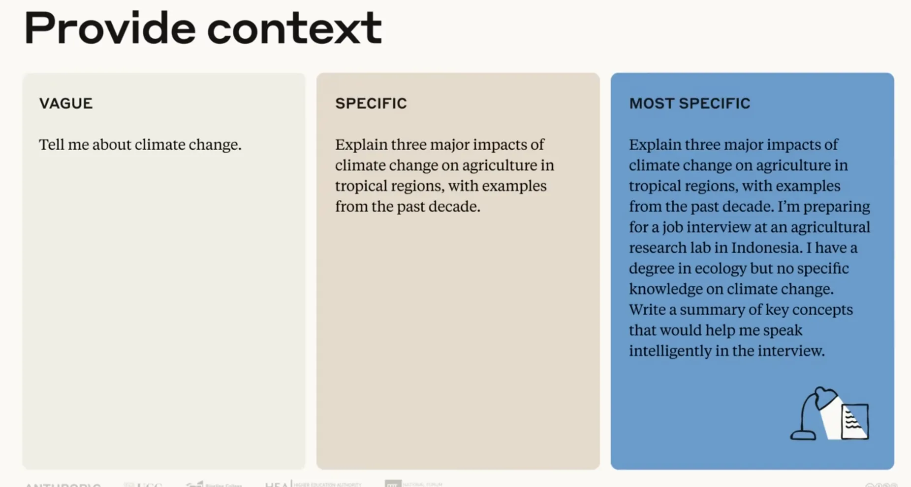
  
<b><u>Provide Context</u></b>

---

### 2. Demonstrating Quality through Examples (Show Examples)
* **Few-Shot / N-Shot Prompting**: "Showing" is always more effective than "telling."
* **Plain Language Conversion Example**:
  * *Original*: "The quantum algorithm exhibits quadratic speed up."
  * *Plain*: "The new method solves problems roughly twice as fast as previous methods."
  * *Rule of Thumb*: If a simple instruction suffices, use it first; supply examples when tone, formatting, or style require exact imitation.

---

  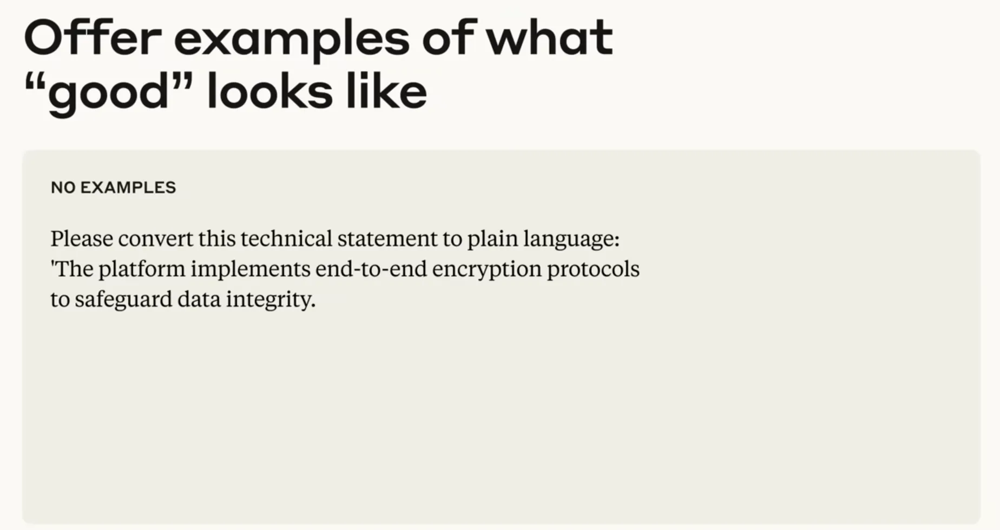
  
<b><u>Offer Examples</u></b>

---

  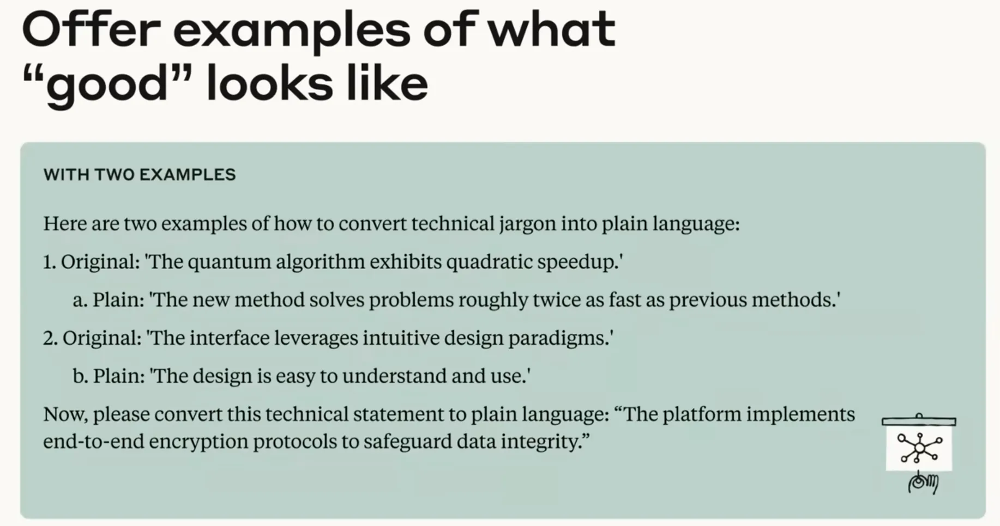
  
<b><u>Offer Examples of what 'good' looks like</u></b>

---

### 3. Defining Output Constraints (Specify Constraints)
* Set clear boundaries to receive production-ready deliverables without reformatting overhead.
* **Key Constraints**: Format (Markdown, JSON, Artifact), length (summary vs. deep dive), code language, and specific UI elements (e.g., *sticky navigation, sunset color palette, dark/light mode toggle*).

---

  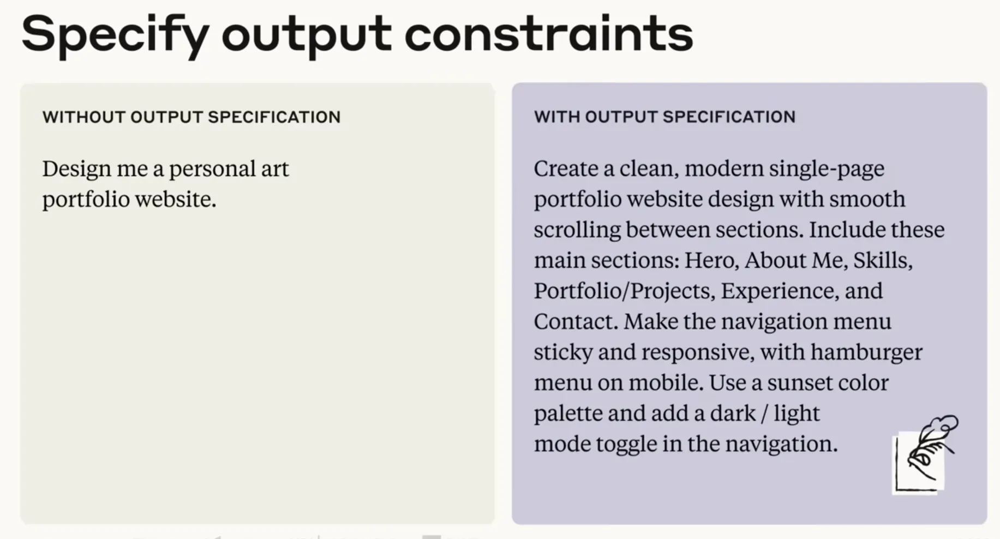
  
<b><u>Specify Output Constraints</u></b>

---

### 4. Decomposing Complex Tasks (Chain of Thought)
* Break multi-step workflows into an explicit sequential roadmap to enforce domain-expert logic.
* **Quarterly Sales Analysis Script**:
  1. *Look through sales records to identify top-performing products.*
  2. *Compare current quarter results to the previous quarter.*
  3. *Highlight unusual trends or anomalies.*
  4. *Suggest plausible strategic explanations for these trends.*

---

  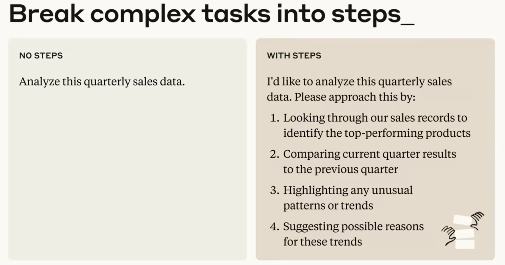
  
<b><u>Break complex tasks into smaller steps</u></b>

---

### 5. Prioritizing Pre-Computation (Think Before Acting)
* Explicitly mandate: *"Before answering, think through this problem carefully. Consider different factors, potential constraints, and approaches before recommending the best solution."*
* **The Strategic Benefit**: Thinking *before* executing increases output quality and allows human experts to audit the AI's logic to steer the process.

---

  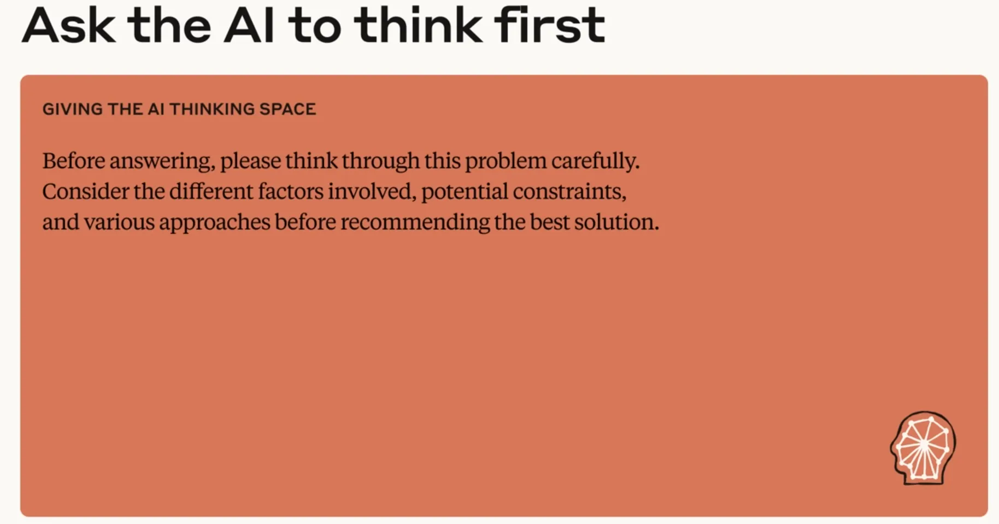
  
<b><u>Ask the AI to Think First</u></b>

---

### 6. Establishing Roles and Personas (Role & Tone)
* Calibrate depth and voice by assigning a specialized persona:
  * *Pedagogical*: Explain physics from the perspective of **Richard Feynman** speaking to a 10-year-old.
  * *Professional*: Act as a **Senior UX Design Expert** reviewing a wireframe for accessibility and user navigation.

---

  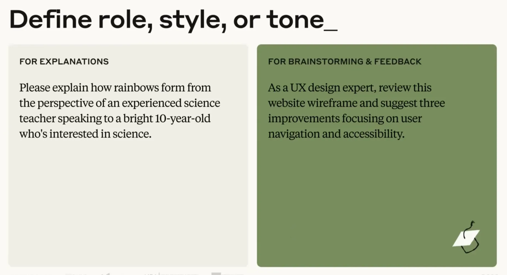
  
<b><u>Define Role, Style or Tone</u></b>

---

## 3. The Secret Weapon: Meta-Prompting for Optimization

When a task is complex or an initial prompt misses the mark, delegate the prompt design directly to the AI:

> *"I'm trying to get you to help me with [insert goal]. I'm not sure how to phrase my request to get the best results. Can you help me craft an effective prompt for this?"*

**Operational Impact:** Transforms the user from a solo author into an executive director, leveraging the model's internal understanding of its own architecture to craft the ideal instruction.

---

  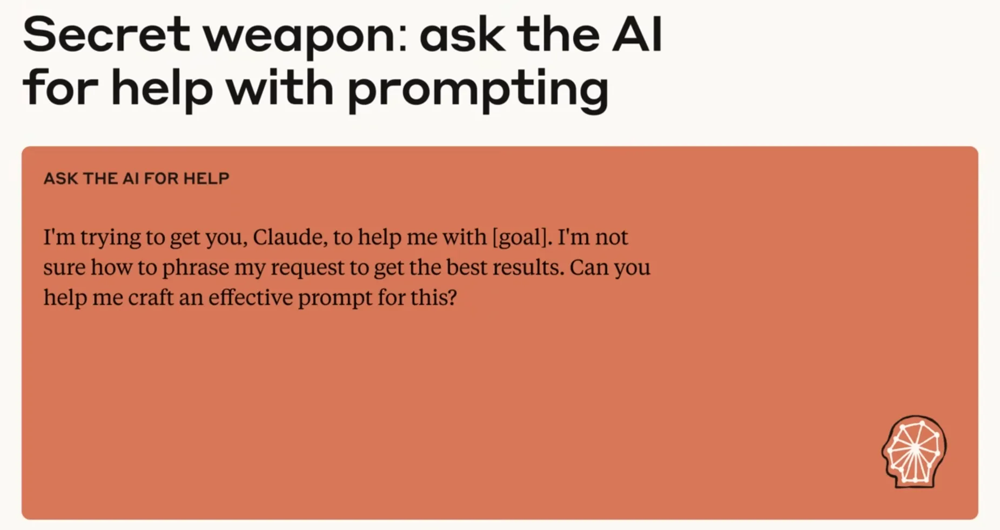
  
<b><u>The Secret Weapon - Ask the AI for help with Prompting</u></b>

---

## 4. Operational Excellence: Best Practices, Checklists, and Pitfalls

Prompting is an iterative discipline where refinement drives mastery:

### Iterative Refinement Toolkit
* **Request Variations**: Ask for 3 distinct versions to evaluate alternative angles.
* **Utilize Artifacts**: Request dedicated artifact windows for complex code, documents, or visualizations.
* **Confidence Checks**: For factual inquiries, ask: *"How confident are you about this answer?"*
* **The Reset Rule**: When a thread goes off-track or becomes polluted with bad context, **start a fresh conversation** rather than attempting to fix a derailed session.

---

  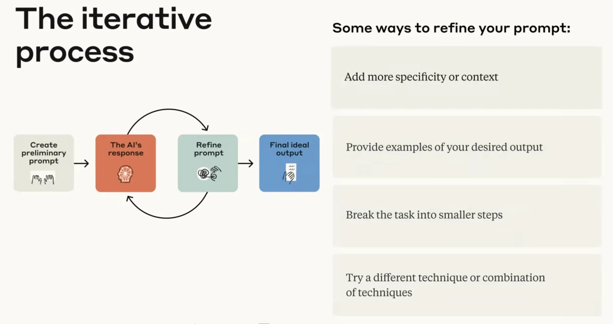
  
<b><u>The Iteration Process</u></b>

---

  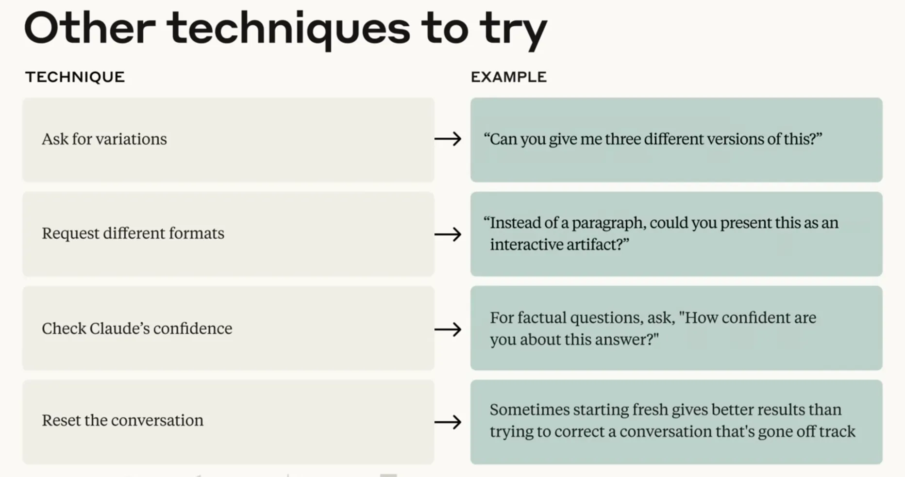
  
<b><u>Other Prompting Techniques to Try</u></b>

---

### Do's vs. Don'ts Checklist

| Do's (Best Practices) | Don'ts (Common Pitfalls) |
| :--- | :--- |
| **Start with a clear overview** of the primary goal | **Never assume mind-reading**; state unwritten assumptions |
| **Set explicit constraints** (format, tone, audience) | **Avoid task overloading**; don't crowd unrelated tasks |
| **Provide concrete examples** for complex styling | **Avoid vagueness**; define what "success" looks like |
| **Provide immediate feedback** within the session | **Never ignore feedback**; guide adjustments iteratively |

---

  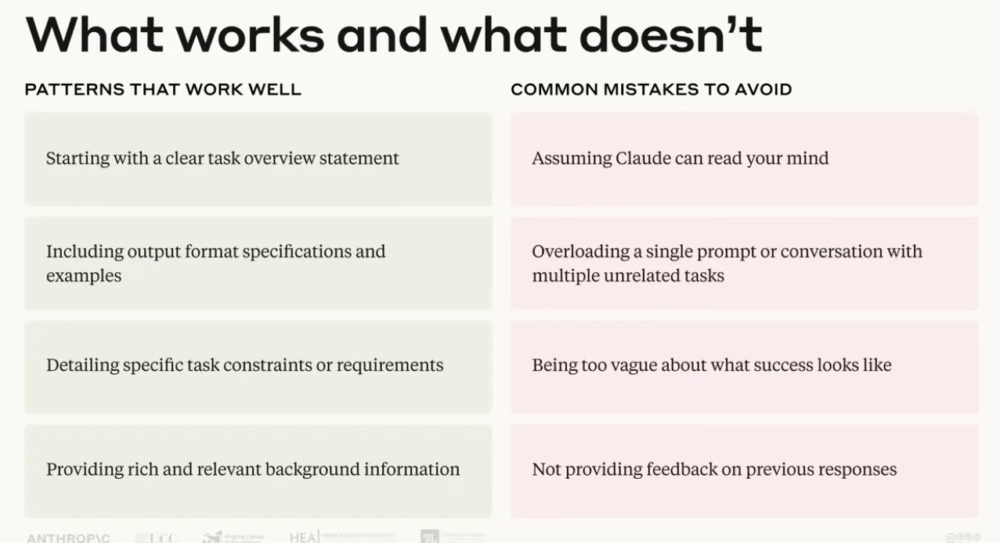
  
<b><u>Do's vs. Don'ts Checklist</u></b>

---

## 5. Synthesis: The Iterative Path to Mastery

Mastering prompt engineering is the operational core of the Description Competency. By replacing vague queries with **structured context, few-shot examples, explicit constraints, and pre-computation**, professionals transform AI into an indispensable thinking partner.

> [!IMPORTANT]
> **Key Insight:** True prompting mastery is not about memorizing static templates—it is an iterative process of experimentation that adapts dynamically as models evolve.
