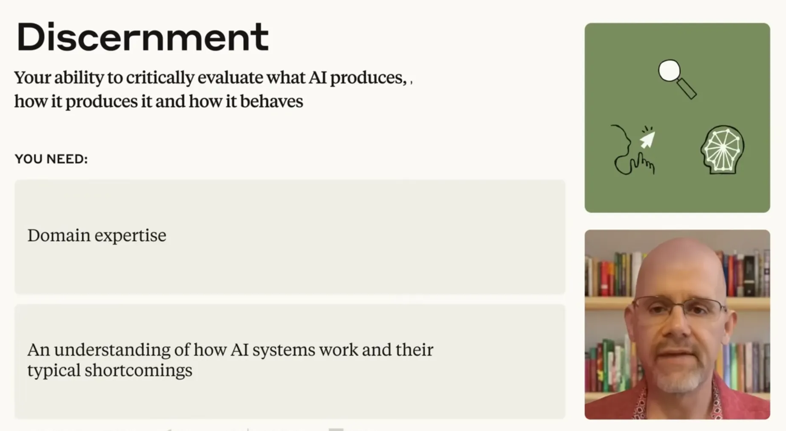
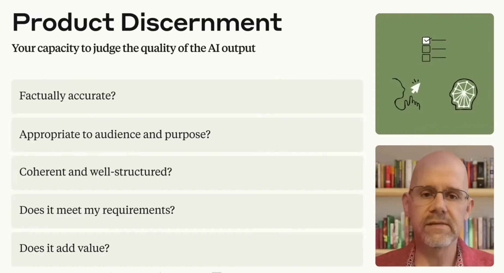
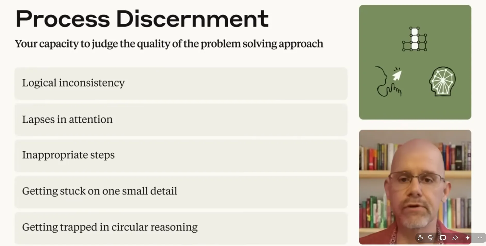
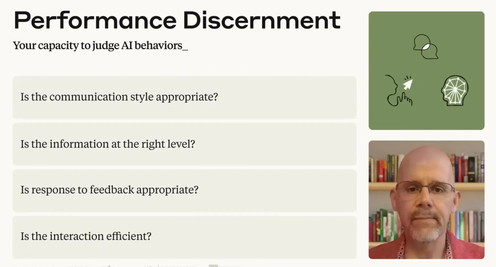
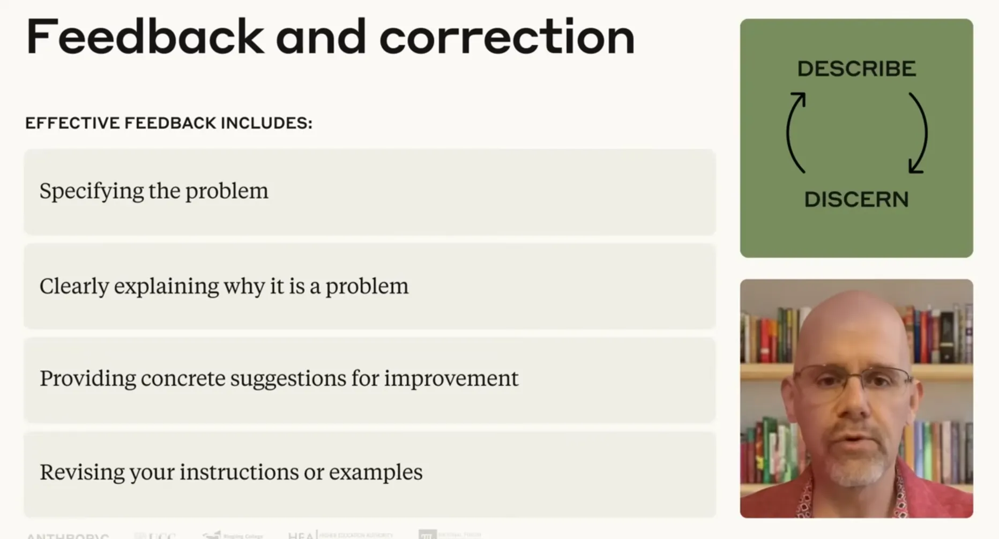
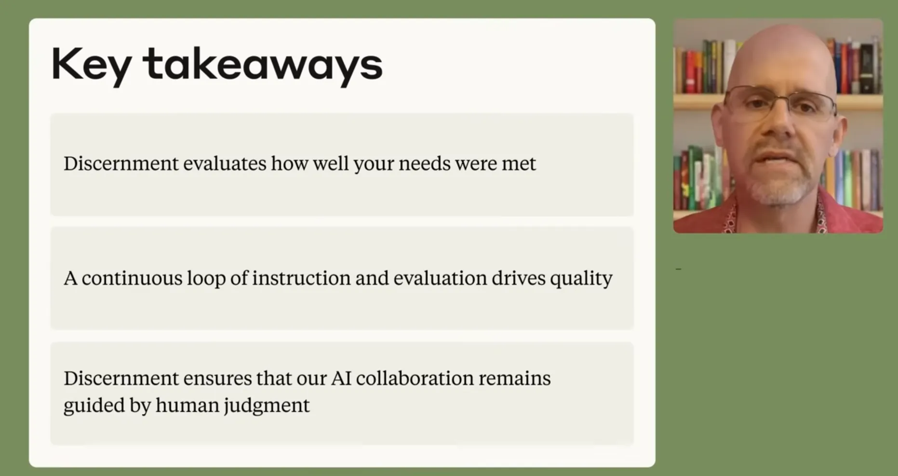

# Lesson 7.1: A Closer Look at Discernment

---

## 1. The Foundations of Discernment: The Quality Control System

Discernment is the **quality control system** and vital safeguard of the AI Fluency Framework, ensuring that speed and automation never compromise professional standards.

* **The Flip Side of Description**: If Description is the precision-engineered input (*communicating what you want*), Discernment is the critical evaluation of the return (*deciding if what you get back meets your needs*).
* **Cognitive Safeguard**: Protects workflows against reasoning errors, factual hallucinations, and unexpected behavioral deviations.
* **The Two Non-Negotiable Prerequisites**:
  1. **Domain Expertise**: Deep subject-matter knowledge required to accurately judge quality and set standards.
  2. **Understanding AI Shortcomings**: Realistic awareness of model boundaries, attention lapses, and probabilistic failure modes.

> [!IMPORTANT]
> **Key Insight:** Without expert human discernment, the velocity of AI generation becomes a compounding liability rather than a competitive advantage.

---

  
  
<b><u>A Closer Look at Discernment</u></b>

---

## 2. Concept 01: Product Discernment — Evaluating the "What"

Product Discernment is the direct evaluation of the final deliverable to determine whether it is ready for production use.

### The 5-Point Interrogation Checklist

| Evaluation Criterion | Diagnostic Question | Quality Objective |
| :--- | :--- | :--- |
| **Factuality** | *Is this factually accurate and verifiable?* | Eliminates hallucinations and false claims |
| **Relevance** | *Is it appropriate for my audience and purpose?* | Aligns tone, depth, and vocabulary to stakeholder needs |
| **Coherence** | *Is it logically structured and cohesive?* | Ensures clear flow, readable structure, and professional syntax |
| **Compliance** | *Does it fulfill all prompt requirements and constraints?* | Validates that format, length, and parameters were respected |
| **Utility** | *Does it genuinely solve the problem or add measurable value?* | Confirms the deliverable advances the core business objective |

---

  
  
<b><u>Product Discernment</u></b>

---

## 3. Concept 02: Process Discernment — Monitoring the "How"

Process Discernment monitors the AI's internal reasoning methodology to ensure human and machine remain **"thinking in sync"**—particularly in complex, open-ended problem solving where the correct answer is not immediately obvious.

### 5 Critical Process Failure Signs

* **1. Logical Breaks & Flaws**: Inconsistencies or non-sequiturs across the reasoning chain.
* **2. Attention Lapses (Context Loss)**: Forgetting earlier instructions or **reinserting previously rejected outline options** after multiple iterations.
* **3. Inappropriate Methodological Steps**: Taking illogical paths that diverge from required domain frameworks.
* **4. Limited Perspective (Tunnel Vision)**: Fixating rigidly on a single detail and failing to weigh viable alternatives.
* **5. Circular Reasoning**: Becoming trapped in self-justifying loops where premises are assumed as conclusions.

---

  
  
<b><u>Process Discernment</u></b>

---

## 4. Concept 03: Performance Discernment — Calibrating Interaction Dynamics

Performance Discernment assesses the **conversational user experience (UX)** between the user and the AI assistant.

### The Subtle Distinction
* **Process**: The underlying *work* the AI is doing.
* **Performance**: How smoothly and effectively the AI *interacts with you* while doing that work.

### Calibrating Interaction Dynamics

| High-Performing Dynamics | Signs of Performance Friction |
| :--- | :--- |
| **Adaptive to Guidance**: Accurately absorbs direction on the first attempt | **Instruction Resistance**: Ignores or misunderstands corrective feedback |
| **Calibrated Depth**: Delivers exact density required (concise or deep) | **Imbalance**: Overly verbose for simple asks, or too brief for complex analysis |
| **Streamlined Flow**: Keeps momentum focused on the objective | **Excessive Inquiries**: Derails flow by asking unnecessary, trivial questions |

---

  
  
<b><u>Performance Discernment</u></b>

---

## 5. Strategic Synthesis: The Description-Discernment Feedback Loop

Discernment does not end with passive critique; it directly triggers actionable feedback to drive continuous improvement:

### The 4-Step Actionable Feedback Protocol
1. **Specify the Problem**: Pinpoint the precise error or deviation.
2. **Explain the "Why"**: Contextualize why the output fails standards.
3. **Provide Concrete Suggestions**: Offer tangible guidance on the desired direction.
4. **Revise the Prompt / Examples**: Supply refined descriptions or few-shot examples.

$$\text{Description (Input)} \longrightarrow \text{Discernment (Evaluation)} \longrightarrow \text{Actionable Feedback} \longrightarrow \text{Strategic Alignment}$$

* **The Recalibration Rule**: While better description resolves most discernment flags, repeated failures signal a need to **rethink your delegation decision**—you may be using the wrong tool or framing the problem incorrectly.

---

  
  
<b><u>Feedback Loop</u></b>

---

> [!IMPORTANT]
> **Key Insight:** AI collaboration must remain firmly governed by human judgment. Discernment ensures that human expertise directs the machine, rather than the machine dictating the standard.

---

  
  
<b><u>Key Takeaways</u></b>

---