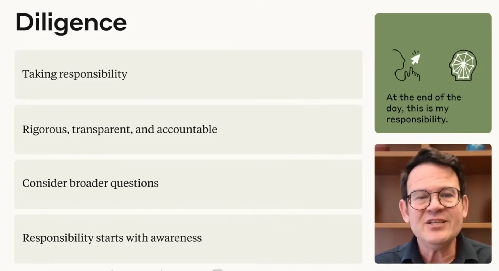
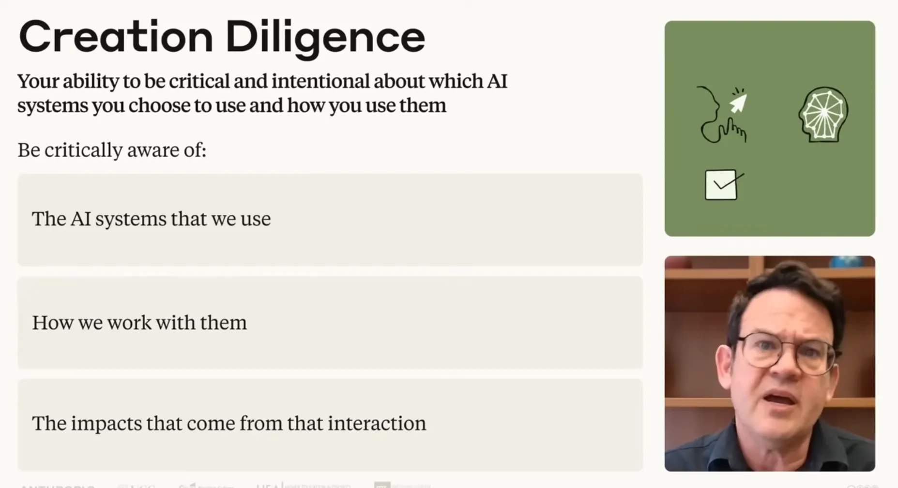
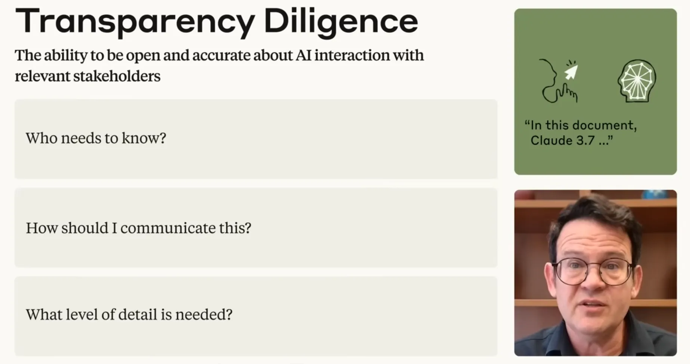
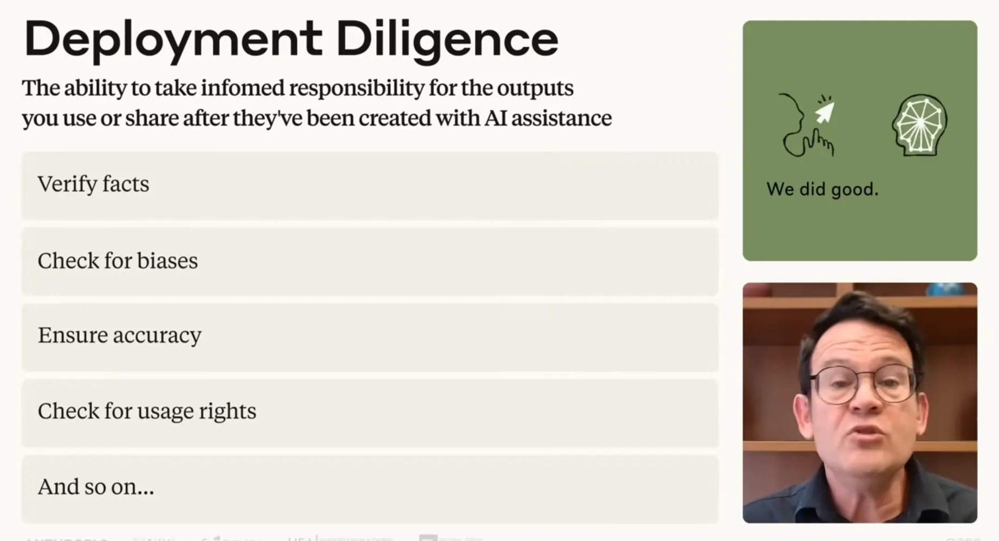
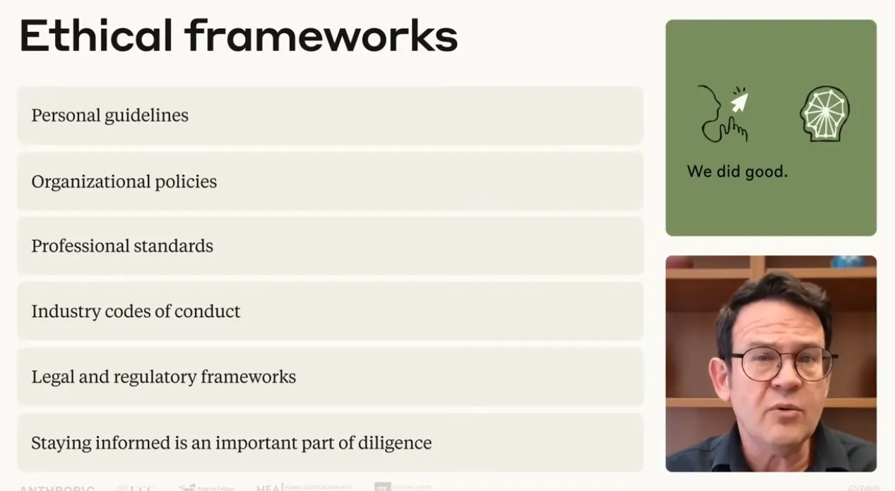
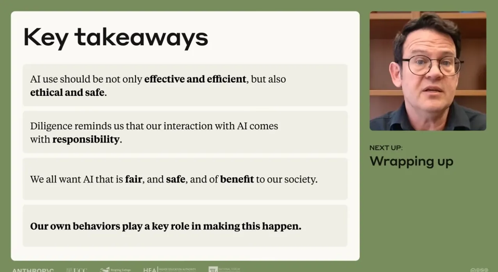

# Lesson 9.1: A Closer Look at Diligence

---

## 1. The Foundations of Diligence: Ethics & Responsibility Safeguards

While the first three competencies (**Delegation, Description, Discernment**) focus primarily on maximizing **efficiency and effectiveness**, **Diligence** governs the **ethical and safety** dimensions of AI collaboration. It ensures that speed and productivity never compromise professional standards, integrity, or public trust.

### The 4D Competency Matrix

| Competency | Primary Operational Focus | Strategic Purpose |
| :--- | :--- | :--- |
| **Delegation** | Efficiency & Effectiveness | Deciding *what* work to assign to AI vs. human |
| **Description** | Efficiency & Effectiveness | Communicating *how* work should be executed |
| **Discernment** | Efficiency & Effectiveness | Evaluating *if* outputs meet quality standards |
| **Diligence** | **Ethics & Safety** | Safeguarding *responsibility, impact, and accountability* |

### The Car-Driving Analogy
Operating an AI assistant is like driving a car:
* **Point A to B (Efficiency)**: Getting to your destination quickly is important.
* **Traffic Rules & Safety (Diligence)**: You must obey traffic laws, prioritize passenger/pedestrian safety, and remain continuously aware of how your actions impact others on the road. AI interactions do not exist in a vacuum.

> [!IMPORTANT]
> **Key Insight:** Diligence is the non-negotiable safeguard that prevents AI efficiency from turning into an organizational, ethical, or legal liability.

---

  
  
<b><u>Diligence: Ethics & Responsibility Safeguards</u></b>

---

## 2. Concept 01: Creation Diligence — Critical System Selection & Inputs

**Creation Diligence** is the ability to be **critical and intentional** about which AI systems you choose to work with and precisely how you engage with them before inputting data or executing workflows.

### System Evaluation & Input Checklist

| Dimension | Critical Inquiry | Operational Objective |
| :--- | :--- | :--- |
| **System Architecture** | *How was this system built and trained?* | Understand model capabilities, boundaries, and design intent |
| **Training Provenance** | *What data was used to train this model?* | Identify potential systemic blind spots or copyright issues |
| **Data Ownership** | *Who owns the data I am inputting right now?* | Protect intellectual property and proprietary business assets |
| **Access & Exposure** | *Who may access my input data once shared?* | Prevent exposure to third-party vendors or future model training |
| **Privacy & Security** | *How am I safeguarding user and stakeholder privacy?* | Ensure encryption and strict compliance with privacy standards |
| **Secondary Impacts** | *What broader environmental or societal impacts exist?* | Account for externalities and resource footprints |
| **Value Alignment** | *Does this align with my values and organizational policies?* | Ensure compliance with internal guidelines and personal ethics |

* **Corporate Data Protection Rule**: Never input proprietary, confidential, or sensitive company information into an AI tool without first verifying organizational authorization and confirming that the platform enforces robust enterprise data privacy safeguards.

---

  
  
<b><u>Creation Diligence: Critical System Selection & Inputs</u></b>

---

## 3. Concept 02: Transparency Diligence — Openness, Disclosure & Trust

**Transparency Diligence** is the ability to be **open and accurate** about AI involvement with everyone who has a legitimate interest or right to know.

### Navigating Contextual Expectations
Disclosure expectations vary significantly across domains—**personal, academic, creative, and professional**—but the responsibility always rests on the practitioner to understand and meet those standards.

### The 3 Core Disclosure Questions
1. **Who needs to know** about AI's role in this specific work?
2. **How and when** should I communicate this involvement?
3. **What level of detail** makes the most sense to share?

* **Trust Over Compliance**: Transparency is not a mere compliance checkbox; it is essential for maintaining mutual respect and professional credibility. Stakeholders have a fundamental right to know when AI has significantly influenced content creation or impactful decisions.
* **The Team Proposal Model**: When co-authoring a collaborative deliverable (e.g., a cross-functional proposal), clearly designate which specific sections were AI-assisted to preserve team trust and establish shared ownership.

---

  
  
<b><u>Transparency Diligence: Openness, Disclosure & Trust</u></b>

---

## 4. Concept 03: Deployment Diligence — Non-Transferable Accountability

**Deployment Diligence** is the ability to take **informed, personal responsibility** for AI-assisted outputs once they are published, shared, or integrated into downstream workflows.

### The Non-Transferability Rule
AI systems are probabilistic and prone to errors, hallucinations, and biases. **Accountability cannot be delegated to an algorithm.** When you share AI-generated material with the world, **you—not the AI—are fully accountable** for its accuracy and consequences.

### Pre-Deployment Verification Protocol
Before any AI output is shared or deployed, execute three mandatory reviews:
1. **Fact-Checking**: Rigorously verify every assertion, citation, dataset, and source against primary ground truth.
2. **Bias & Fairness Review**: Probe for subtle hallucinations, ungrounded assumptions, or demographic biases.
3. **Rights & Appropriateness**: Confirm copyright compliance, commercial usage permissions, and tone/audience suitability.

* **The Journalist Standard**: A journalist using AI to draft an article must verify every fact and source independently. The final published piece must satisfy the exact same rigorous professional standards as if written entirely by hand—no exceptions.

---

  
  
<b><u>Deployment Diligence: Non-Transferable Accountability</u></b>

---

## 5. Strategic Synthesis: Guidelines, Governance & Shared Responsibility

$$\text{Creation Diligence (Inputs)} + \text{Transparency Diligence (Disclosure)} + \text{Deployment Diligence (Outputs)} \Longrightarrow \text{Ethical \& Safe AI Fluency}$$

### Navigating the Dynamic Frontier
* **Develop Personal Ethics Guidelines**: Because expectations differ across stakeholders, formulate personal operating principles aligned with your core values.
* **Master Organizational & Industry Policy**: Actively align your day-to-day AI interactions with internal corporate governance and evolving industry codes.
* **Track Emerging Regulation**: AI law and regulatory frameworks are fluid and rapidly developing. Staying educated on compliance mandates is an ongoing diligence requirement.

---

  
  
<b><u>Strategic Synthesis: Guidelines, Governance & Shared Responsibility</u></b>

---

> [!IMPORTANT]
> **Key Insight:** Responsible, fair, and beneficial AI is not determined solely by model architectures—it is defined by human agency, professional diligence, and individual behavioral choices.

---

  
  
<b><u>Key Takeaways</u></b>

---
