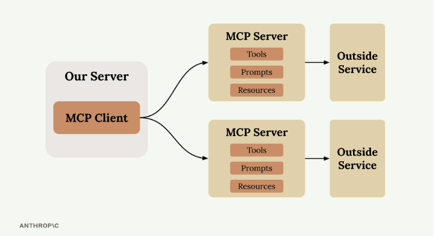
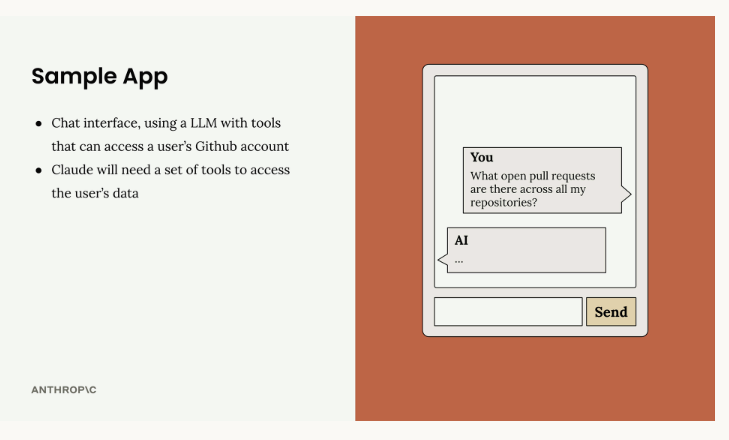
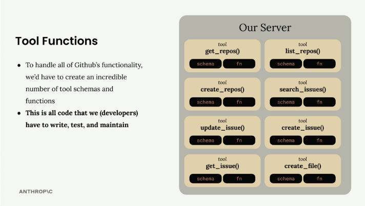
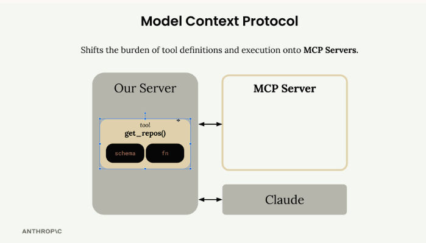
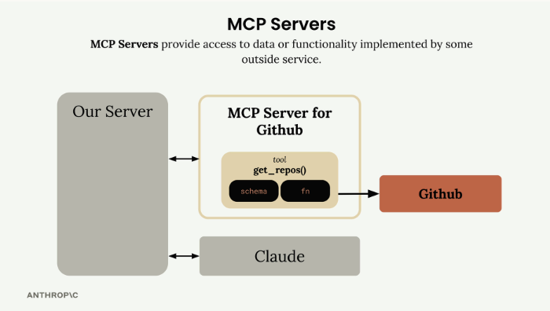
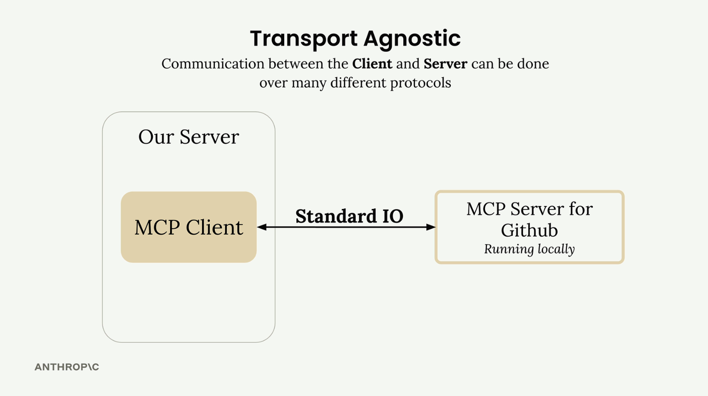
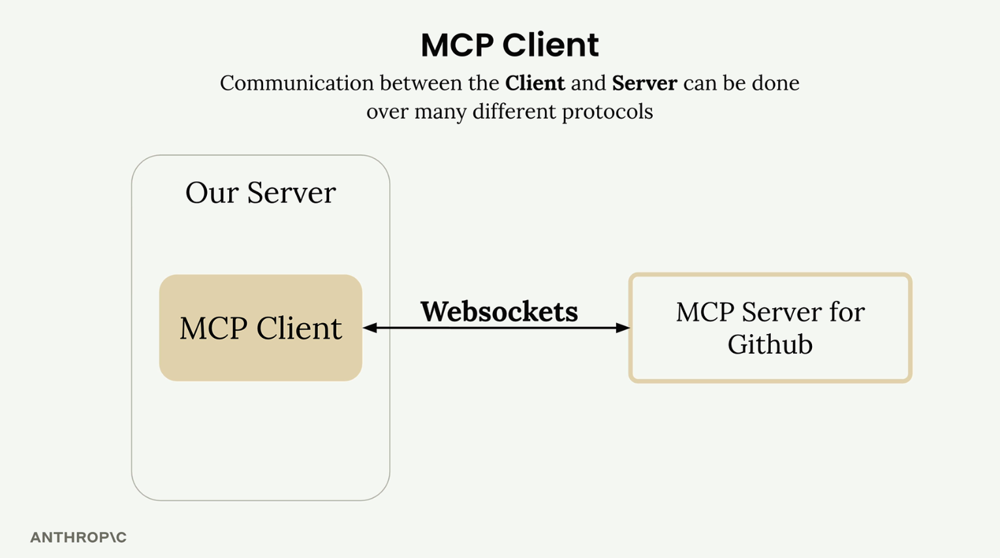
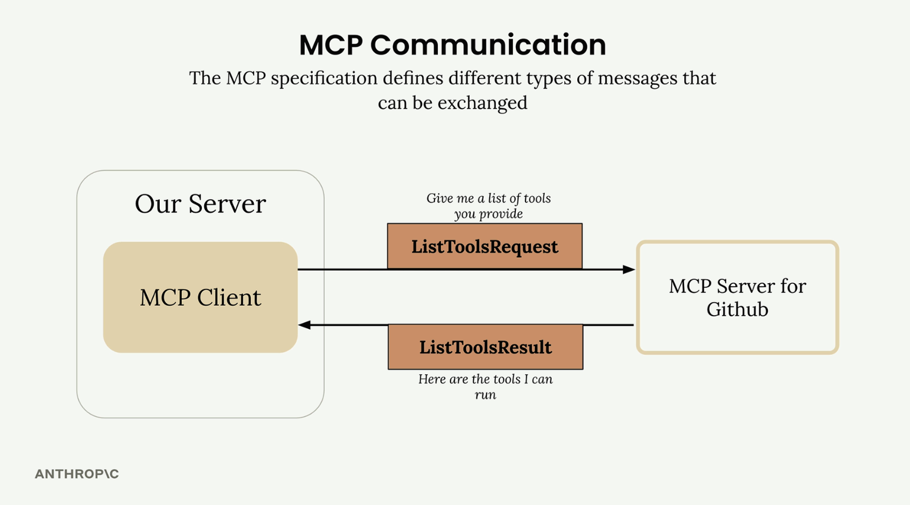
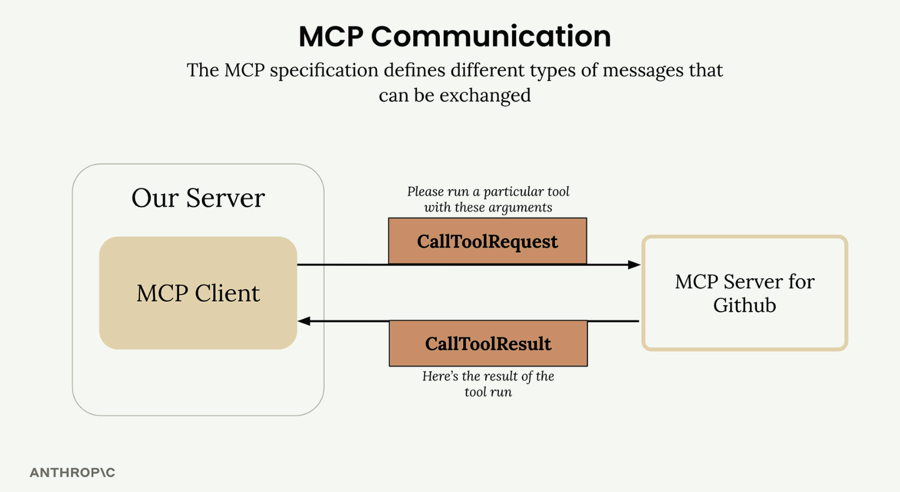
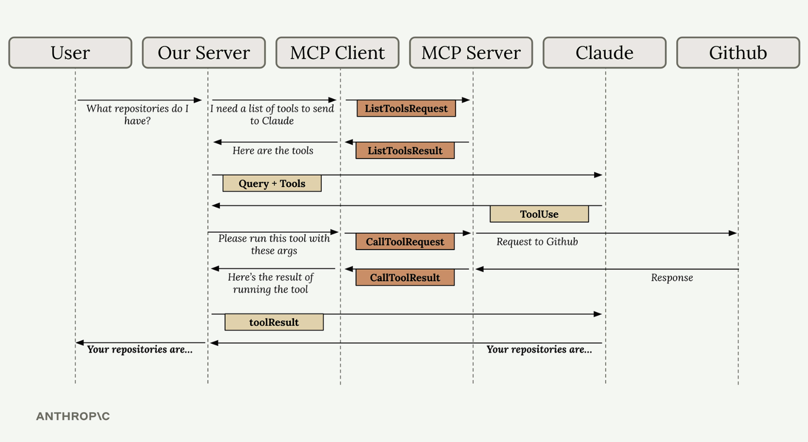

# Lesson 01: Introduction

## 1. Welcome to the course

### Course goals:

- **Overview of MCP:** Understand what problems MCP solves
- **MCP Clients and Servers:** Server host resources, tools and more. Clients use servers.
- **Tools:** Tools are implemented on a server and extend an LLM's capabilities
- **Resources:** Servers can deliver any kind of document or information to clients
- **Prompts:** Servers can provide clients with pre-optimized prompts

### What you need?

- **Basic Python fundamentals:** Essential syntax, loops, functions
- **Python installation with UV CLI:** Install directive for UV at github.com/astral-sh/uv

## 2. Introducing MCP

Model Context Protocol (MCP) is a communication layer that provides Claude with context and tools without requiring you to write a bunch of tedious integration code. Think of it as a way to shift the burden of tool definitions and execution away from your server to specialized MCP servers.

When you first encounter MCP, you'll see diagrams showing the basic architecture: an MCP Client (your server) connecting to MCP Servers that contain tools, prompts, and resources. Each MCP Server acts as an interface to some outside service.

### The Problem MCP Solves

Let's say you're building a chat interface where users can ask Claude about their GitHub data. A user might ask "What open pull requests are there across all my repositories?" To handle this, Claude needs tools to access GitHub's API.

GitHub has massive functionality - repositories, pull requests, issues, projects, and tons more. Without MCP, you'd need to create an incredible number of tool schemas and functions to handle all of GitHub's features.

This means writing, testing, and maintaining all that integration code yourself. That's a lot of effort and ongoing maintenance burden.

### How MCP Works

MCP shifts this burden by moving tool definitions and execution from your server to dedicated MCP servers. Instead of you authoring all those GitHub tools, an MCP Server for GitHub handles it.

The MCP Server wraps up tons of functionality around GitHub and exposes it as a standardized set of tools. Your application connects to this MCP server instead of implementing everything from scratch.

### MCP Servers Explained

MCP Servers provide access to data or functionality implemented by outside services. They act as specialized interfaces that expose tools, prompts, and resources in a standardized way.

In our GitHub example, the MCP Server for GitHub contains tools like `get_repos()` and connects directly to GitHub's API. Your server communicates with the MCP server, which handles all the GitHub-specific implementation details.

### Common Questions

#### Who authors MCP Servers?

Anyone can create an MCP server implementation. Often, service providers themselves will make their own official MCP implementations. For example, AWS might release an official MCP server with tools for their various services.

#### How is this different from calling APIs directly?

MCP servers provide tool schemas and functions already defined for you. If you want to call an API directly, you'll be authoring those tool definitions on your own. MCP saves you that implementation work.

#### Isn't MCP just the same as tool use?

This is a common misconception. MCP servers and tool use are complementary but different concepts. MCP servers provide tool schemas and functions already defined for you, while tool use is about how Claude actually calls those tools. The key difference is who does the work - with MCP, someone else has already implemented the tools for you.

The benefit is clear: instead of maintaining a complex set of integrations yourself, you can leverage MCP servers that handle the heavy lifting of connecting to external services.

## 3. MCP Clients

The MCP client serves as the communication bridge between your server and MCP servers. It's your access point to all the tools that an MCP server provides, handling the message exchange and protocol details so your application doesn't have to.

### Transport Agnostic Communication

One of MCP's key strengths is being transport agnostic - a fancy way of saying the client and server can communicate over different protocols depending on your setup.

The most common setup runs both the MCP client and server on the same machine, communicating through standard input/output. But you can also connect them over:

- HTTP
- WebSockets
- Various other network protocols

### MCP Message Types

Once connected, the client and server exchange specific message types defined in the MCP specification. The main ones you'll work with are:

**ListToolsRequest/ListToolsResult:** The client asks the server "what tools do you provide?" and gets back a list of available tools.

**CallToolRequest/CallToolResult:** The client asks the server to run a specific tool with given arguments, then receives the results.

### How It All Works Together

Here's a complete example showing how a user query flows through the entire system - from your server, through the MCP client, to external services like GitHub, and back to Claude.

Let's say a user asks "What repositories do I have?" Here's the step-by-step flow:

1.  **User Query:** The user submits their question to your server
2.  **Tool Discovery:** Your server needs to know what tools are available to send to Claude
3.  **List Tools Exchange:** Your server asks the MCP client for available tools
4.  **MCP Communication:** The MCP client sends a `ListToolsRequest` to the MCP server and receives a `ListToolsResult`
5.  **Claude Request:** Your server sends the user's query plus the available tools to Claude
6.  **Tool Use Decision:** Claude decides it needs to call a tool to answer the question
7.  **Tool Execution Request:** Your server asks the MCP client to run the tool Claude specified
8.  **External API Call:** The MCP client sends a `CallToolRequest` to the MCP server, which makes the actual GitHub API call
9.  **Results Flow Back:** GitHub responds with repository data, which flows back through the MCP server as a `CallToolResult`
10.  **Tool Result to Claude:** Your server sends the tool results back to Claude
11.  **Final Response:** Claude formulates a final answer using the repository data
12.  **User Gets Answer:** Your server delivers Claude's response back to the user

Yes, this flow involves many steps, but each component has a clear responsibility. The MCP client abstracts away the complexity of server communication, letting you focus on your application logic while still getting access to powerful external tools and data sources.

Understanding this flow is crucial because you'll see all these pieces when building your own MCP clients and servers in the upcoming sections.
