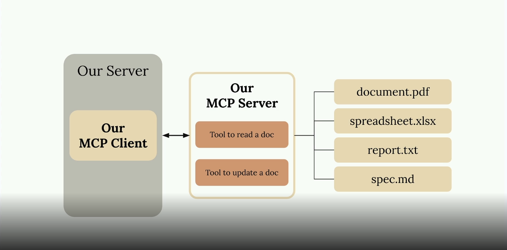
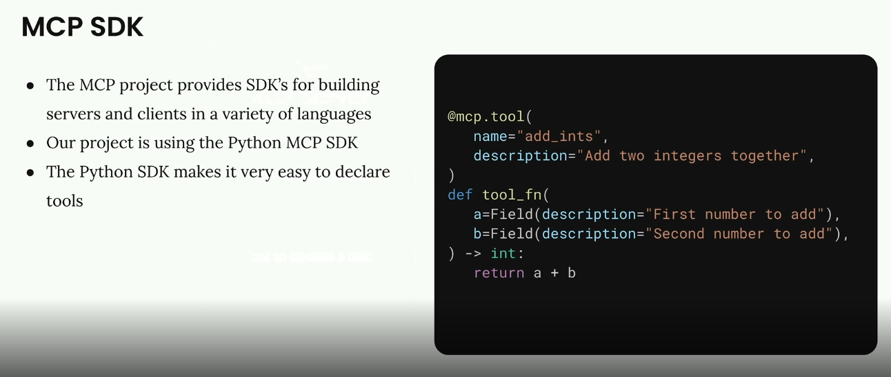
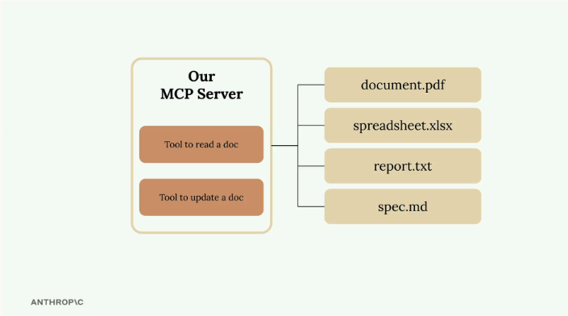
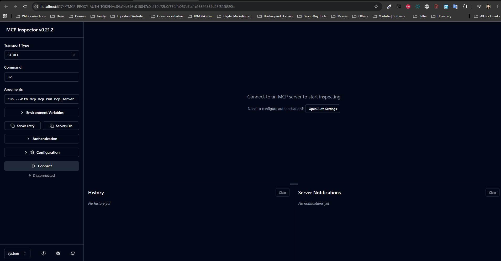
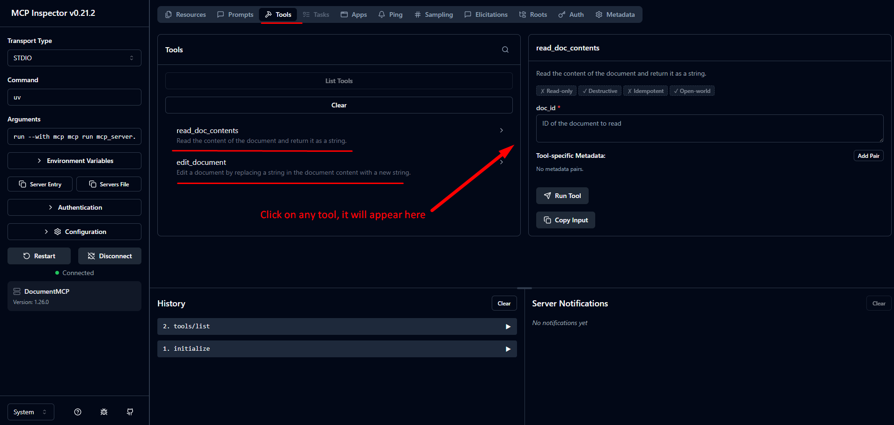
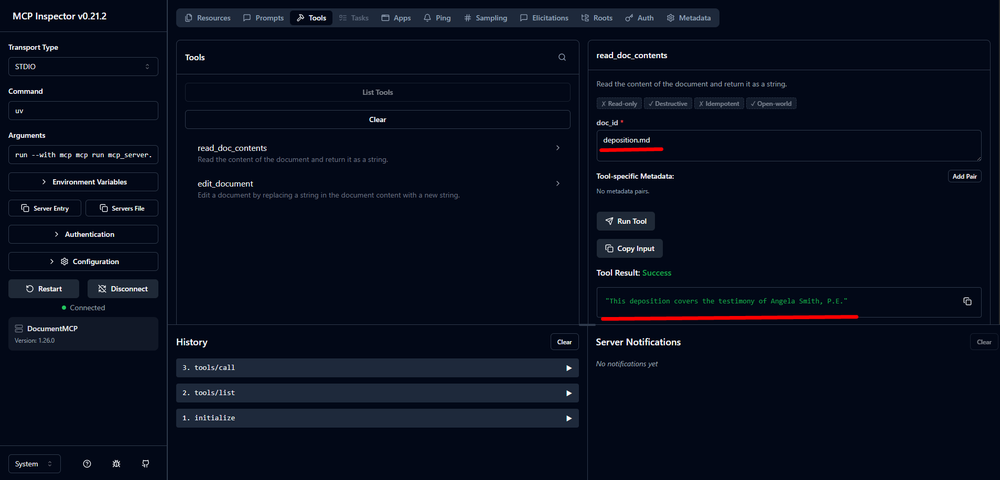
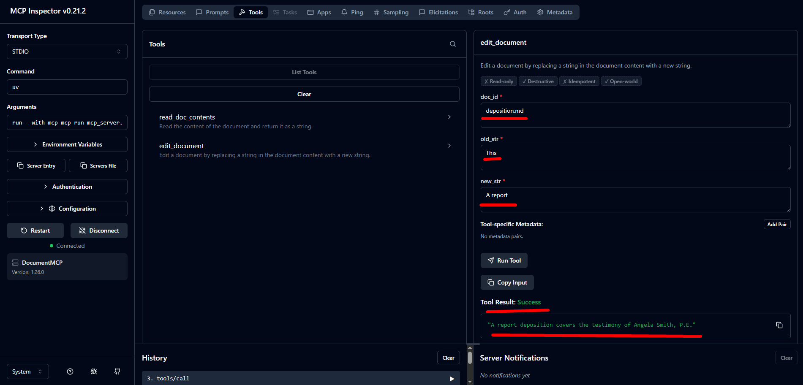

# Lesson 2: Hands-on with MCP servers

## Project Setup

- Claude based chatbot that allows users to chat with a set of documents
- Claude should be able to read a document
- Claude should be able to edit a document
- Users can "mention" a document by writing out "@doc_name"
    * The doc's content will automatically be included in context
- Users can run a "command" with `/command_name`

We are going to build CLI-based Chatbot, for this we have downloaded prebuild setup from lesson and save file in [CLI Project](cli_project_setup/), which has two tools, and fake random docs, see below picture, we will use **OpenAI Agent SDK** instead of **Claude Agent SDK**



Normally a project will implement **either** a MCP client **or** a MCP server. Our project will implement **both** just so we understand how they work.


## Defining tools with MCP

Building an MCP server becomes much simpler when you use the official Python SDK. Instead of writing complex JSON schemas by hand, you can define tools with decorators and let the SDK handle the heavy lifting.



---



In this example, we're creating a document management server with two core tools: one to read documents and another to update them. All documents exist in memory as a simple dictionary where keys are document IDs and values are the content.

### Setting Up the MCP Server

See [mcp_server.py](cli_project_setup/mcp_server.py) file:

The Python MCP SDK makes server creation straightforward. You can initialize a server with just one line:

``` python
from mcp.server.fastmcp import FastMCP

mcp = FastMCP("DocumentMCP", log_level="ERROR")
```

Your documents can be stored in a simple dictionary structure:

``` python
docs = {
    "deposition.md": "This deposition covers the testimony of Angela Smith, P.E.",
    "report.pdf": "The report details the state of a 20m condenser tower.",
    "financials.docx": "These financials outline the project's budget and expenditures",
    "outlook.pdf": "This document presents the projected future performance of the system",
    "plan.md": "The plan outlines the steps for the project's implementation.",
    "spec.txt": "These specifications define the technical requirements for the equipment"
}
```

### Tool Definition with Decorators

The SDK uses decorators to define tools. Instead of writing JSON schemas manually, you can use Python type hints and field descriptions. The SDK automatically generates the proper schema that Claude can understand.

### Creating a Document Reader Tool

The first tool reads document contents by ID. Here's the complete implementation:

``` python
@mcp.tool(
    name="read_doc_contents",
    description="Read the contents of a document and return it as a string."
)
def read_document(
    doc_id: str = Field(description="Id of the document to read")
):
    if doc_id not in docs:
        raise ValueError(f"Doc with id {doc_id} not found")
    
    return docs[doc_id]
```

The decorator specifies the tool name and description, while the function parameters define the required arguments. The `Field` class from Pydantic provides argument descriptions that help Claude understand what each parameter expects.

### Building a Document Editor Tool

The second tool performs simple find-and-replace operations on documents:

``` python
@mcp.tool(
    name="edit_document",
    description="Edit a document by replacing a string in the documents content with a new string."
)
def edit_document(
    doc_id: str = Field(description="Id of the document that will be edited"),
    old_str: str = Field(description="The text to replace. Must match exactly, including whitespace."),
    new_str: str = Field(description="The new text to insert in place of the old text.")
):
    if doc_id not in docs:
        raise ValueError(f"Doc with id {doc_id} not found")
    
    docs[doc_id] = docs[doc_id].replace(old_str, new_str)
```

This tool takes three parameters: the document ID, the text to find, and the replacement text. The implementation includes error handling for missing documents and performs a straightforward string replacement.

### Key Benefits of the SDK Approach

- No manual JSON schema writing required
- Type hints provide automatic validation
- Clear parameter descriptions help Claude understand tool usage
- Error handling integrates naturally with Python exceptions
- Tool registration happens automatically through decorators

The MCP Python SDK transforms tool creation from a complex schema-writing exercise into simple Python function definitions. This approach makes it much easier to build and maintain MCP servers while ensuring Claude receives properly formatted tool specifications.

## The Server Inspector

When building MCP servers, you need a way to test your functionality without connecting to a full application. The Python MCP SDK includes a built-in browser-based inspector that lets you debug and test your server in real-time.

### Starting the Inspector

First, make sure your Python environment is activated (check your project's README for the exact command). Then run the inspector with:

```bash
mcp dev mcp_server.py
```

This starts a development server and gives you a local URL, typically something like **http://127.0.0.1:6274**. Open this URL in your browser to access the MCP Inspector.



### Using the Inspector Interface

The inspector interface is actively being developed, so it may look different when you use it. However, the core functionality remains consistent. Look for these key elements:

- A **Connect** button to start your MCP server
- Navigation tabs for **Resources**, **Tools**, **Prompts**, and other features
- A tools listing and testing panel

Click the Connect button first to initialize your server. You'll see the connection status change from "Disconnected" to "Connected".

### Testing Your Tools

Navigate to the Tools section and click "List Tools" to see all available tools from your server. When you select a tool, the right panel shows its details and input fields.



For example, to test a document reading tool:

1. Select the `read_doc_contents` tool
2. Enter a document ID (like "deposition.md")
3. Click "Run Tool"
4. Check the results for success and expected output

The inspector shows both the success status and the actual returned data, making it easy to verify your tool works correctly.

### Testing Tool Interactions

You can test multiple tools in sequence to verify complex workflows. For instance, after using an edit tool to modify a document, immediately test the read tool to confirm the changes were applied correctly.

The inspector maintains your server state between tool calls, so edits persist and you can verify the complete functionality of your MCP server.



---



### Development Workflow

The MCP Inspector becomes an essential part of your development process. Instead of writing separate test scripts or connecting to full applications, you can:

- Quickly iterate on tool implementations
- Test edge cases and error conditions
- Verify tool interactions and state management
- Debug issues in real-time

This immediate feedback loop makes MCP server development much more efficient and helps catch issues early in the development process.