# <u>Connecting with MCP clients</u>

## <u>Implementing a Client</u>

Now that we have our MCP server working, it's time to build the client side. The client is what allows our application code to communicate with the MCP server and access its functionality.

### Understanding the Client Architecture

In most real-world projects, you'll either implement an MCP client or an MCP server - not both. We're building both in this project just so you can see how they work together.

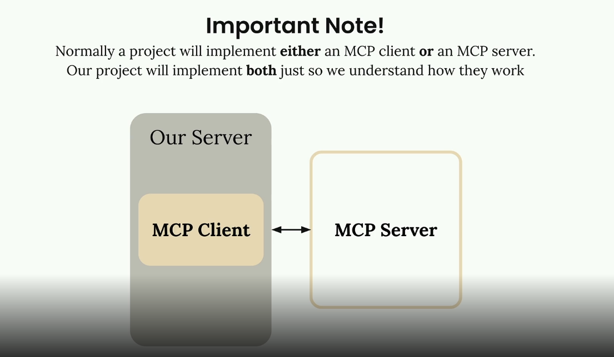

The MCP client consists of two main components:

- **MCP Client** - A custom class we create to make using the session easier
- **Client Session** - The actual connection to the server (part of the MCP Python SDK)

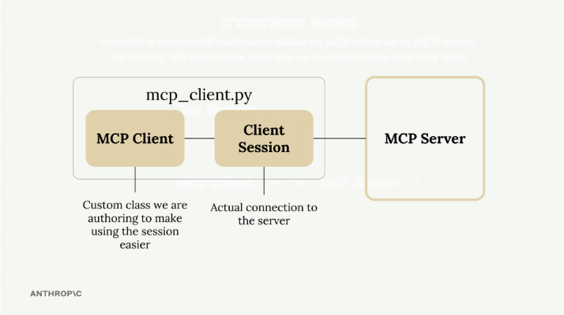

The client session requires careful resource management - we need to properly clean up connections when we're done. That's why we wrap it in our own class that handles all the cleanup automatically.

### How the Client Fits Into Our Application

Remember our application flow diagram? The client is what enables our code to interact with the MCP server at two key points:

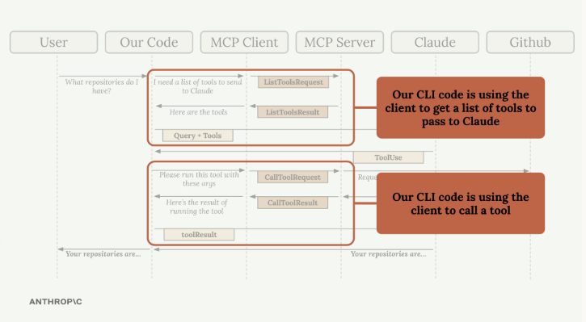

Our CLI code uses the client to:

- Get a list of available tools to send to Claude
- Execute tools when Claude requests them

### Implementing Core Client Functions

We need to implement two essential functions: `list_tools()` and `call_tool()`.

#### List Tools Function

This function gets all available tools from the MCP server:

```python
async def list_tools(self) -> list[types.Tool]:
    result = await self.session().list_tools()
    return result.tools
```

It's straightforward - we access our session (the connection to the server), call the built-in `list_tools()` method, and return the tools from the result.

#### Call Tool Function

This function executes a specific tool on the server:

```python
async def call_tool(
    self, tool_name: str, tool_input: dict
) -> types.CallToolResult | None:
    return await self.session().call_tool(tool_name, tool_input)
```

We pass the tool name and input parameters (provided by Claude) to the server and return the result.

### Testing the Client

The client file includes a simple test harness at the bottom. You can run it directly to verify everything works:

```bash
uv run mcp_client.py
```

This will connect to your MCP server and print out the available tools. You should see output showing your tool definitions, including descriptions and input schemas.

### Putting It All Together

Once the client functions are implemented, you can test the complete flow by running your main application:

```bash
uv run main.py
```

Try asking: "What is the contents of the report.pdf document?"

Here's what happens behind the scenes:

1.  Your application uses the client to get available tools
2.  These tools are sent to Claude along with your question
3.  Claude decides to use the read\_doc\_contents tool
4.  Your application uses the client to execute that tool
5.  The result is returned to Claude, who then responds to you

The client acts as the bridge between your application logic and the MCP server's functionality, making it easy to integrate powerful tools into your AI workflows.

## <u>Defining resources</u>

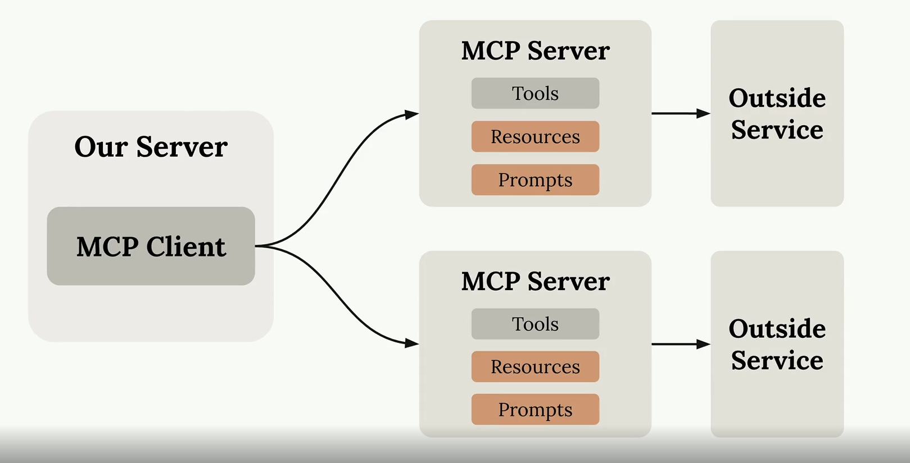

Resources in MCP servers allow you to expose data to clients, similar to GET request handlers in a typical HTTP server. They're perfect for scenarios where you need to fetch information rather than perform actions.

### Understanding Resources Through an Example

Let's say you want to build a document mention feature where users can type `@document_name` to reference files. This requires two operations:

- Getting a list of all available documents (for autocomplete)
- Fetching the contents of a specific document (when mentioned)


When a user mentions a document, your system automatically injects the document's contents into the prompt sent to Claude, eliminating the need for Claude to use tools to fetch the information.

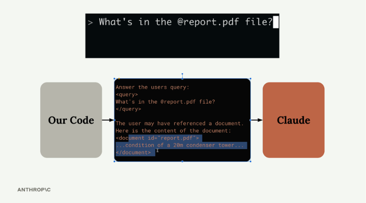

---


### Resources


### How Resources Work

Resources follow a request-response pattern. When your client needs data, it sends a `ReadResourceRequest` with a URI to identify which resource it wants. The MCP server processes this request and returns the data in a `ReadResourceResult`.

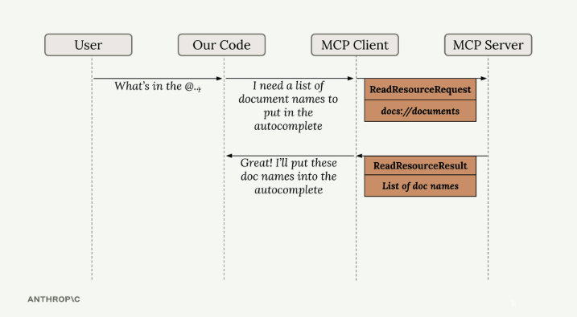

The flow looks like this: your code requests a resource from the MCP client, which forwards the request to the MCP server. The server processes the URI, runs the appropriate function, and returns the result.

### Types of Resources

There are two types of resources:

#### Direct Resources

Direct resources have static URIs that never change. They're perfect for operations that don't need parameters.

```python
@mcp.resource(
    "docs://documents",
    mime_type="application/json"
)
def list_docs() -> list[str]:
    return list(docs.keys())
```

#### Templated Resources

Templated resources include parameters in their URIs. The Python SDK automatically parses these parameters and passes them as keyword arguments to your function.

```python
@mcp.resource(
    "docs://documents/{doc_id}",
    mime_type="text/plain"
)
def fetch_doc(doc_id: str) -> str:
    if doc_id not in docs:
        raise ValueError(f"Doc with id {doc_id} not found")
    return docs[doc_id]
```


### Implementation Details

Resources can return any type of data - strings, JSON, binary data, etc. Use the `mime_type` parameter to give clients a hint about what kind of data you're returning:

- `"application/json"` for structured data
- `"text/plain"` for plain text
- `"application/pdf"` for binary files

The MCP Python SDK automatically serializes your return values. You don't need to manually convert objects to JSON strings - just return the data structure and let the SDK handle serialization.

## <u>Testing Your Resources</u>

You can test resources using the MCP Inspector. Start your server with:

```bash
uv run mcp dev mcp_server.py
```

Then connect to the inspector in your browser. You'll see two sections:

- **Resources** - Lists your direct/static resources
- **Resource Templates** - Lists your templated resources


Click on any resource to test it. For templated resources, you'll need to provide values for the parameters. The inspector shows you the exact response structure your client will receive, including the MIME type and serialized data.


Resources provide a clean way to expose read-only data from your MCP server, making it easy for clients to fetch information without the complexity of tool calls.

## <u>Accessing Resources</u>

Resources in MCP allow your server to expose information that can be directly included in prompts, rather than requiring tool calls to access data. This creates a more efficient way to provide context to AI models.

<div align="center">
  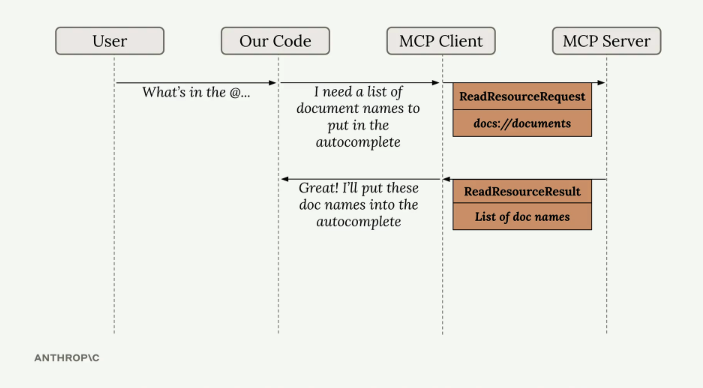
</div>

The diagram above shows how resources work: when a user types something like "What's in the @..." our code recognizes this as a resource request, sends a ReadResourceRequest to the MCP server, and gets back a ReadResourceResult with the actual content.

### Implementing Resource Reading

To enable resource access in your MCP client, you need to implement a `read_resource` function. First, add the necessary imports:

```python
import json
from pydantic import AnyUrl
```

The core function makes a request to the MCP server and processes the response based on its MIME type:

```python
async def read_resource(self, uri: str) -> Any:
    result = await self.session().read_resource(AnyUrl(uri))
    resource = result.contents[0]
    
    if isinstance(resource, types.TextResourceContents):
        if resource.mimeType == "application/json":
            return json.loads(resource.text)
    
    return resource.text
```

### Understanding the Response Structure

When you request a resource, the server returns a result with a `contents` list. We access the first element since we typically only need one resource at a time. The response includes:

- The actual content (text or data)
- A MIME type that tells us how to parse the content
- Other metadata about the resource

### Content Type Handling

The function checks the MIME type to determine how to process the content:

-   If it's `application/json`, parse the text as JSON and return the parsed object
-   Otherwise, return the raw text content

This approach handles both structured data (like JSON) and plain text documents seamlessly.

### Testing Resource Access

Once implemented, you can test the resource functionality through your CLI application. When you type "@" followed by a resource name, the system will:

1.  Show available resources in an autocomplete list
2.  Let you select a resource using arrow keys and space
3.  Include the resource content directly in your prompt
4.  Send everything to the AI model without requiring additional tool calls

This creates a much smoother user experience compared to having the AI model make separate tool calls to access document contents. The resource content becomes part of the initial context, allowing for immediate responses about the data.

<div align="center">
  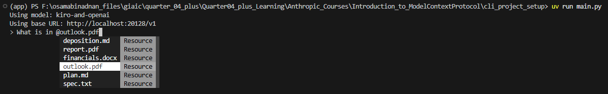
</div>

---

<div align="center">
  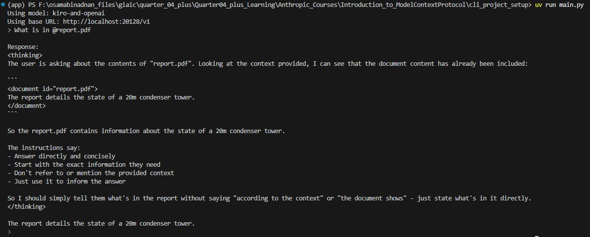
</div>

---

## <u>Defining Prompts</u>

<div align="center">
  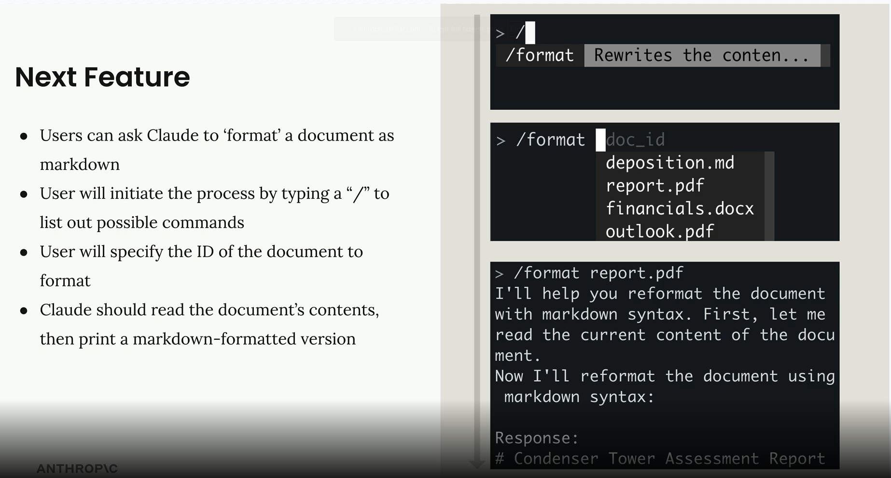
</div>


Prompts in MCP servers let you define pre-built, high-quality instructions that clients can use instead of writing their own prompts from scratch. Think of them as carefully crafted templates that give better results than what users might come up with on their own.

<div align="center">
  
</div>

### Prompts

<div align="center">
  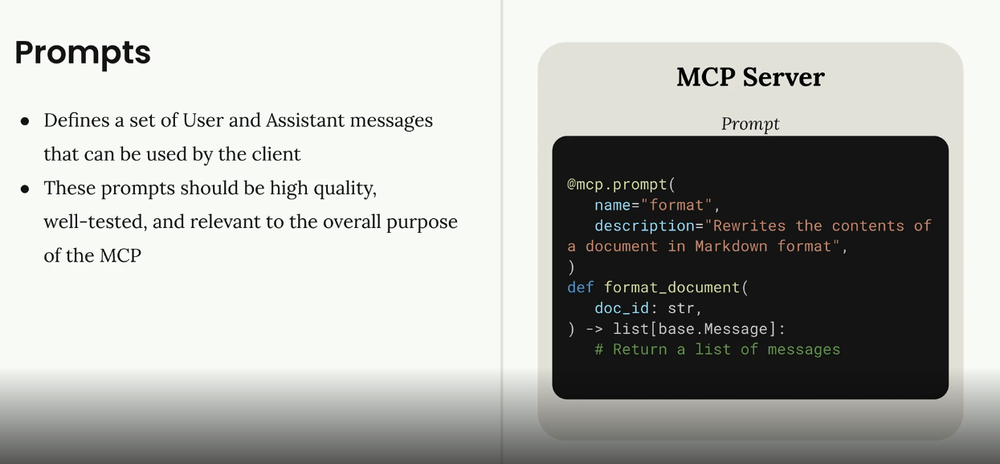
</div>


### Why Use Prompts?

Here's the key insight: users can already ask Claude to do most tasks directly. For example, a user could type "reformat the report.pdf in markdown" and get decent results. But they'll get much better results if you provide a thoroughly tested, specialized prompt that handles edge cases and follows best practices.

As the MCP server author, you can spend time crafting, testing, and evaluating prompts that work consistently across different scenarios. Users benefit from this expertise without having to become prompt engineering experts themselves.

<div align="center">
  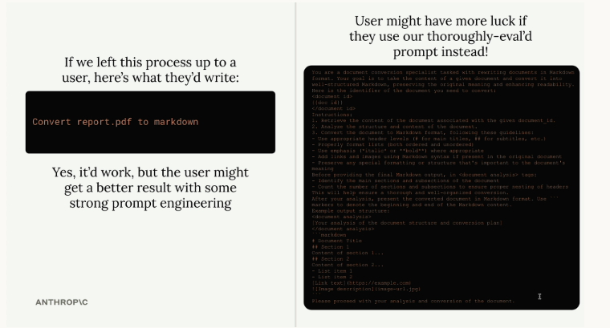
</div>

### Building a Format Command

Let's implement a practical example: a format command that converts documents to markdown. Users will type `/format doc_id` and get back a professionally formatted markdown version of their document.

The workflow looks like this:

- User types `/` to see available commands
- They select `format` and specify a document ID
- Claude uses your pre-built prompt to read and reformat the document
- The result is clean markdown with proper headers, lists, and formatting

### Defining Prompts

Prompts use a similar decorator pattern to tools and resources:

```python
@mcp.prompt(
    name="format",
    description="Rewrites the contents of the document in Markdown format."
)
def format_document(
    doc_id: str = Field(description="Id of the document to format")
) -> list[base.Message]:
    prompt = f"""
Your goal is to reformat a document to be written with markdown syntax.

The id of the document you need to reformat is:
<document_id>
{doc_id}
</document_id>

Add in headers, bullet points, tables, etc as necessary. Feel free to add in structure.
Use the 'edit_document' tool to edit the document. After the document has been reformatted...
"""
    
    return [
        base.UserMessage(prompt)
    ]
```

The function returns a list of messages that get sent directly to Claude. You can include multiple user and assistant messages to create more complex conversation flows.

### Testing Your Prompts

Use the MCP Inspector to test your prompts before deploying them:

<div align="center">
  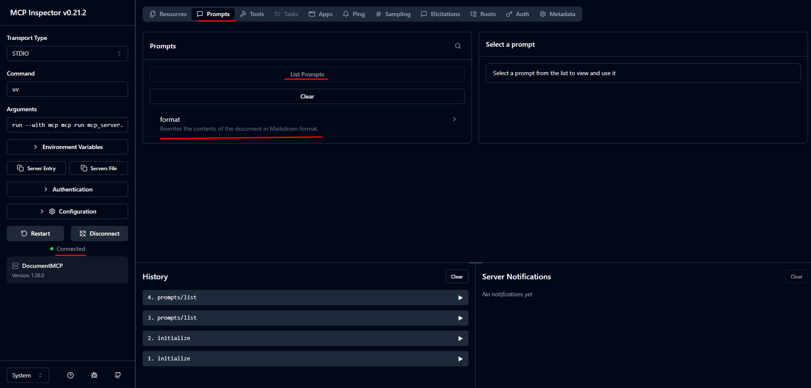
</div>

---

<div align="center">
  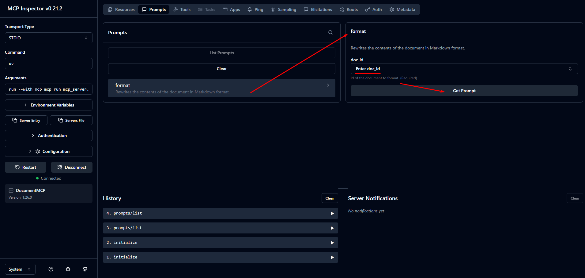
</div>

---

<div align="center">
  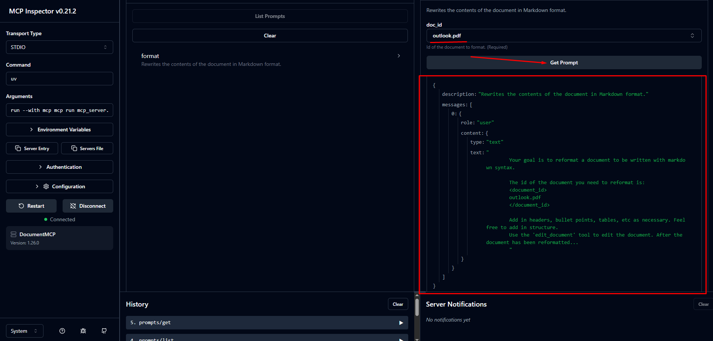
</div>

The inspector shows you exactly what messages will be sent to Claude, including how variables get interpolated into your prompt template. This lets you verify the prompt looks correct before users start relying on it.

### Key Benefits

- **Consistency** - Users get reliable results every time
- **Expertise** - You can encode domain knowledge into prompts
- **Reusability** - Multiple client applications can use the same prompts
- **Maintenance** - Update prompts in one place to improve all clients

Prompts work best when they're specialized for your MCP server's domain. A document management server might have prompts for formatting, summarizing, or analyzing documents. A data analysis server might have prompts for generating reports or visualizations.

The goal is to provide prompts that are so well-crafted and tested that users prefer them over writing their own instructions from scratch.

## <u>Prompts in the client</u>

The final step in building our MCP client is implementing prompt functionality. This allows us to list all available prompts from the server and retrieve specific prompts with variables filled in.

### Implementing List Prompts

The `list_prompts` method (in mcp_client.py) is straightforward. It calls the session's list prompts function and returns the prompts:

```py
async def list_prompts(self) -> list[types.Prompt]:
    result = await self.session().list_prompts()
    return result.prompts
```

### Getting Individual Prompts

The `get_prompt` method (in mcp_client.py) is more interesting because it handles variable interpolation. When you request a prompt, you provide arguments that get passed to the prompt function as keyword arguments:

```py
async def get_prompt(self, prompt_name, args: dict[str, str]):
    result = await self.session().get_prompt(prompt_name, args)
    return result.messages
```

For example, if your server has a `format_document` prompt that expects a `doc_id` parameter, the arguments dictionary would contain `{"doc_id": "plan.md"}`. This value gets interpolated into the prompt template.

### Testing Prompts in Action

Once implemented, you can test prompts through the CLI. When you type a slash (`/`), available prompts appear as commands. Selecting a prompt like "format" will prompt you to choose from available documents.

<div align="center">
  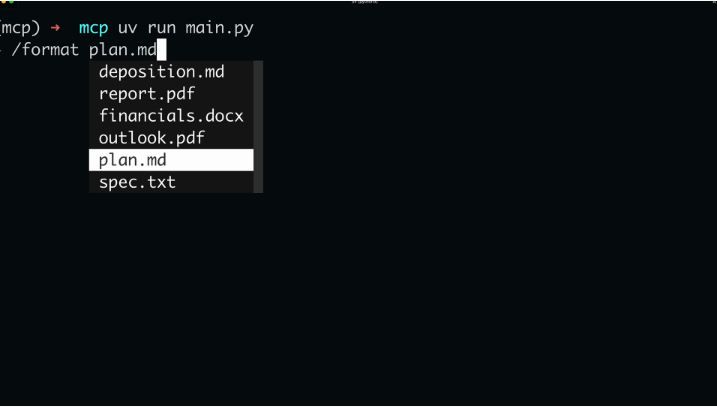
</div>

After selecting a document, the system sends the complete prompt to Claude. The AI receives both the formatting instructions and the document ID, then uses available tools to fetch and process the content.

### How Prompts Work

<div align="center">
  
</div>

Prompts define a set of user and assistant messages that clients can use. They should be high-quality, well-tested, and relevant to your MCP server's purpose. The workflow is:

- Write and evaluate a prompt relevant to your server's functionality
- Define the prompt in your MCP server using the `@mcp.prompt` decorator
- Clients can request the prompt at any time
- Arguments provided by the client become keyword arguments in your prompt function
- The function returns formatted messages ready for the AI model

This system creates reusable, parameterized prompts that maintain consistency while allowing customization through variables. It's particularly useful for complex workflows where you want to ensure the AI receives properly structured instructions every time.