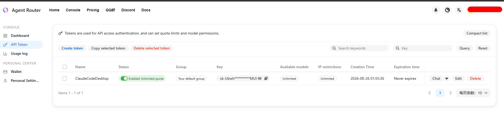
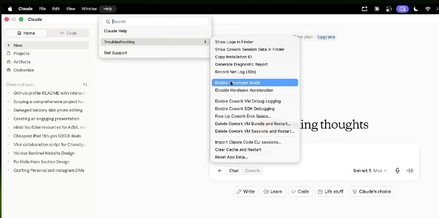
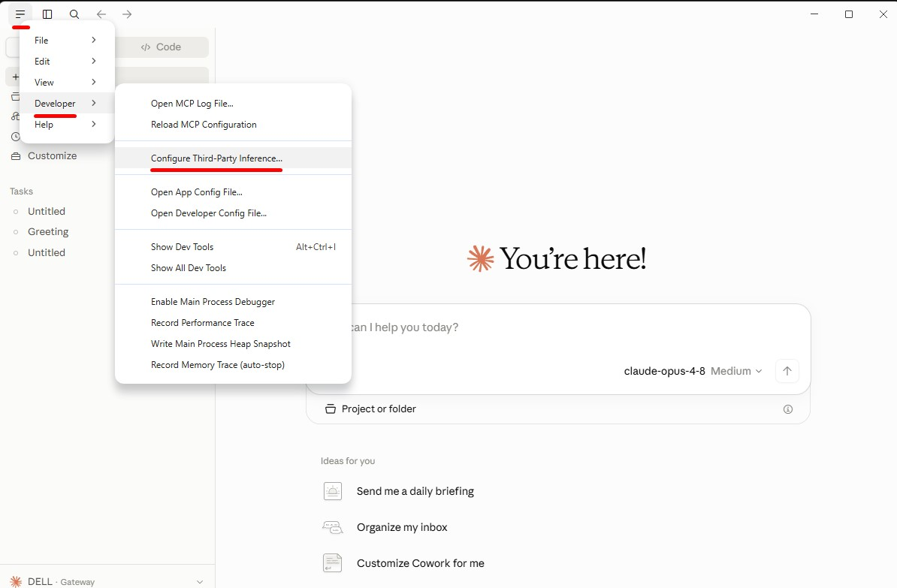
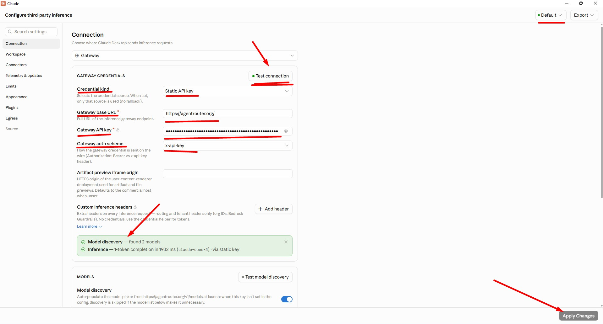
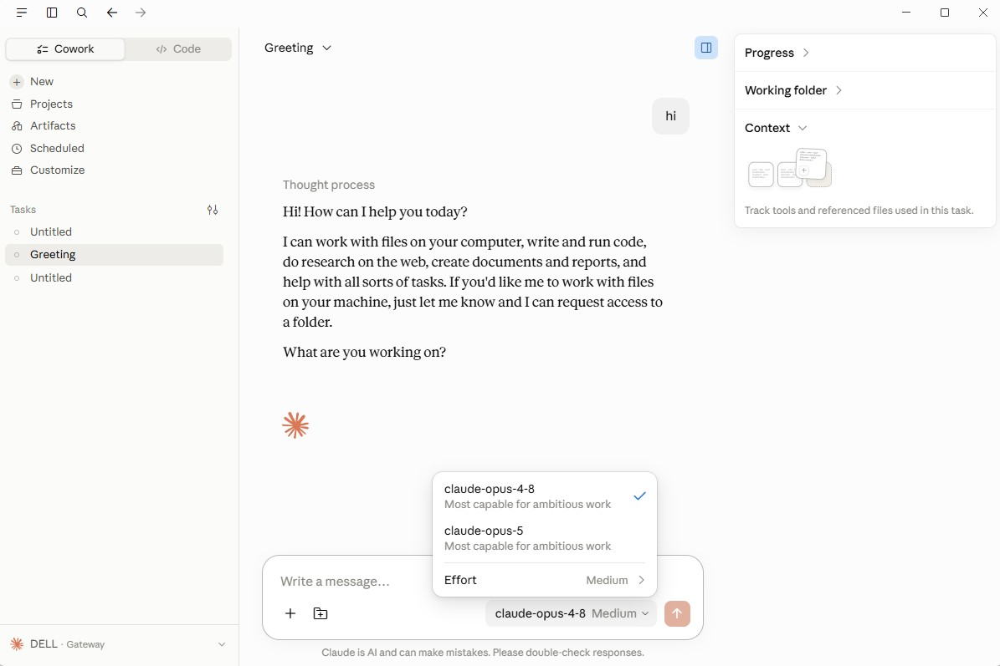

# Claude Code Desktop App via Agent Router

## 1. The Strategic Shift: Decoupling Client and Provider Endpoints

In AI engineering, consumer-grade interfaces can become bottlenecks. Agent Router helps decouple Claude Desktop from throttled endpoints and routes requests through a gateway for better limits and stability.

It acts as a bridge to backend providers, giving more control over resources and latency. This creates a faster, more flexible, professional-grade workspace.

## 2. Foundation and Prerequisites: Identity Maturity and Initial Credits

Identity Maturity is the main gatekeeper for high-value credit access, since providers use account reputation to reduce abuse and keep systems stable.

For signup, authenticate through GitHub; ideally the account should be **7–8 months old**, with 1–2 years being the best standard for smooth access.

A referral signup also unlocks an immediate **$175 credit balance**, which serves as the starting runway for inference tasks.

### Checklist for Success

* **Identity Reputation**: Verify the GitHub account is **7-8 months old** (ideally **1–2 years**).
* **Credit Verification**: Ensure the **$175** balance is visible in the primary dashboard post-authentication.
* **Referral Execution**: Confirm registration via the referral link to trigger the **$175** sign-up provisioning.

With the account established, the next phase involves securing the communication channel through precise tokenization and quota management.

## 3. API Token Orchestration and Quota Management

Secure, permission-based access is critical for Claude Desktop to work with Agent Router, and API tokens define how your client talks to the gateway.

Go to the API Token section, create a token with a clear name like `Claude_Desktop_Internal`, and enable the **Unlimited quota** toggle. This prevents trial-rate limits from interrupting your workflow.

Copy the token immediately and store it securely, since it is the primary credential for the final integration.

---

    
    
<b><u>API Token Orchestration</u></b>

## 4. Claude Desktop Configuration: Activating Developer Capabilities

Standard AI apps run in a restricted mode, so Developer Mode is needed for advanced networking and third-party inference.

Open Help to find it:
* Mac: Help menu
* Windows: Three-bar menu > Help

Then choose Troubleshooting > Enable Developer Mode and restart Claude Desktop to expose the third-party inference settings.

---

    
    
<b><u>Activating Developer Capabilities</u></b>

---

## 5. Third-party Gateway Integration: The Technical Handshake

After restarting Claude Desktop, go to Developer → Configure Third-party Inference to connect Agent Router with the correct authentication h
eaders.

---

    
    
<b><u>Third-party Gateway Integration</u></b>

---

Set Credential Kind to a **static API key**, paste the **Base URL** from the Agent Router dashboard, use the token from Section 3 with **Unl
imited quota** enabled, and select **Bearer** as the auth scheme.

| Parameter | Value / Instruction |
| --- | --- |
| Credential Kind | Static API key (Mandatory: Do not use other types) |
| Base URL | Copy the primary URL from the main Dashboard home page |
| API Key | Use the token generated in Section 3 (with Unlimited quota enabled) |
| Auth Scheme | Explicitly select the Bearer scheme |

Run **Test Connection**; when the **Model Discovery** notification appears, the gateway is connected and backend models are available.

---

    
    
<b><u>Model Discovery</u></b>

---

## 6. Model Selection and Operational Effort Levels

Sophisticated AI orchestration requires a strategic balance between model reasoning capabilities and token efficiency. Upon discovery, the system typically exposes two models: Opus 4.8 and Opus 5.

Opus 5 (frequently associated with "Anti-gravity" and "HQ" output levels) is the preferred choice for engineering tasks. It demonstrates a superior output-to-token-limit ratio, delivering more accurate and extensive code blocks per request than its predecessors.

Furthermore, the interface allows for the configuration of "Effort Levels." While several settings exist, the Ultra Code level is the professional standard. Ultra Code significantly increases the reasoning tokens and computational overhead assigned to a task. This creates a depth of logic typically gated behind Pro-tier subscriptions, made possible here through the gateway's optimized resource management.

---

    
    
<b><u>Model Selection and Operational Effort Levels</u></b>

---

To create a self-sustaining, professional-grade resource without personal financial outlay, utilize the platform's Referral Loop:

* Inviter Reward: You receive $150 in credits for every successful registration via your link.
* Friend Reward: The referred user receives a 50** bonus in addition to the base **175 initial balance.
* Architectural Value: Through this compounding effect, 10 successful referrals generate $1,500 in credit reserves. Combined with the initial $175, this creates a massive credit runway that effectively transforms Claude Code into an unlimited, high-availability resource for professional development.