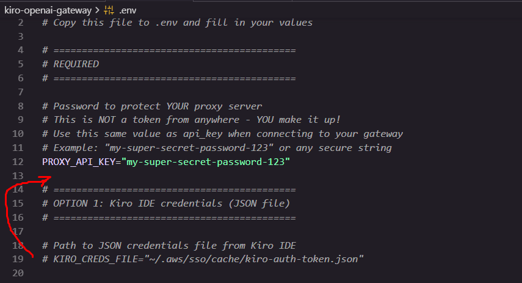

# Kiro Free Tier with Claude Code

## How to use Kiro Free Tier with Claude Code 🎉

Below is the step-by-step guide.

### **Phase 1: Get Your Free Kiro Credits**

1.  **Download Kiro IDE**: Go to [kiro.dev](https://kiro.dev/) (or search for Kiro IDE) and download the application.
2.  **Sign Up & Login**: Open Kiro IDE and sign in.

-   _Note:_ Just by signing up and logging in, you typically receive **500 free credits** as a trial/bonus.
-   Keep Kiro IDE logged in for the next steps.

### **Phase 2: Set Up the Kiro OpenAI Gateway**

This tool creates a local server that looks like OpenAI to other apps, but secretly talks to Kiro using your free credits.

1.  **Install Python**: Ensure you have Python (3.10 or newer) installed.
2.  **Clone the Gateway Repository**: Open your terminal/command prompt and run:

```bash
git clone https://github.com/Jwadow/kiro-openai-gateway.git
cd kiro-openai-gateway
```

3. **Install Dependencies:**
```bash
pip install -r requirements.txt
```

4. **Setup Your Kiro Credentials:**

Below is bash command to setup your Kiro credentials, if you are using PowerShell or CMD, then you have to simply copy detail of `.env.example` and paste it in `.env` file.

```bash
cp .env.example .env
```

```bash
python main.py
```

- When you run above command you will see below error message:

```bash
2026-01-09 23:35:47 | ERROR    | __main__:validate_configuration:245 - 
2026-01-09 23:35:47 | ERROR    | __main__:validate_configuration:246 - ============================================================   
2026-01-09 23:35:47 | ERROR    | __main__:validate_configuration:247 -   CONFIGURATION ERROR
2026-01-09 23:35:47 | ERROR    | __main__:validate_configuration:248 - ============================================================   
2026-01-09 23:35:47 | ERROR    | __main__:validate_configuration:251 -   No Kiro credentials configured!
2026-01-09 23:35:47 | ERROR    | __main__:validate_configuration:251 -   
2026-01-09 23:35:47 | ERROR    | __main__:validate_configuration:251 -      Configure one of the following in your .env file:
2026-01-09 23:35:47 | ERROR    | __main__:validate_configuration:251 -   
2026-01-09 23:35:47 | ERROR    | __main__:validate_configuration:251 -   Set you super-secret password as PROXY_API_KEY
2026-01-09 23:35:47 | ERROR    | __main__:validate_configuration:251 -      PROXY_API_KEY="my-super-secret-password-123"
2026-01-09 23:35:47 | ERROR    | __main__:validate_configuration:251 -   
2026-01-09 23:35:47 | ERROR    | __main__:validate_configuration:251 -      Option 1 (Recommended): JSON credentials file
2026-01-09 23:35:47 | ERROR    | __main__:validate_configuration:251 -         KIRO_CREDS_FILE="path/to/your/kiro-credentials.json"   
2026-01-09 23:35:47 | ERROR    | __main__:validate_configuration:251 -   
2026-01-09 23:35:47 | ERROR    | __main__:validate_configuration:251 -      Option 2: Refresh token
2026-01-09 23:35:47 | ERROR    | __main__:validate_configuration:251 -         REFRESH_TOKEN="your_refresh_token_here"
2026-01-09 23:35:47 | ERROR    | __main__:validate_configuration:251 -   
2026-01-09 23:35:47 | ERROR    | __main__:validate_configuration:251 -      Option 3: kiro-cli SQLite database (AWS SSO)
2026-01-09 23:35:47 | ERROR    | __main__:validate_configuration:251 -         KIRO_CLI_DB_FILE="~/.local/share/kiro-cli/data.sqlite3"
2026-01-09 23:35:47 | ERROR    | __main__:validate_configuration:251 -   
2026-01-09 23:35:47 | ERROR    | __main__:validate_configuration:251 -      See README.md for how to obtain credentials.
2026-01-09 23:35:47 | ERROR    | __main__:validate_configuration:252 - ============================================================   
2026-01-09 23:35:47 | ERROR    | __main__:validate_configuration:253 - 
```

- To solve this error, you need to go to `.env` file, copy KIRO_CREDS_FILE="~/.aws/sso/cache/kiro-auth-token.json" and paste it below the Proxy_API_KEY and uncomment it.

```bash
# KIRO_CREDS_FILE="~/.aws/sso/cache/kiro-auth-token.json"
```

- See picture below



-   You should see a message that the server is running at `http://localhost:8000`. **Keep this terminal window open.**

- But this host will not run, to solve this hosting issue we need to go to `main.py` file scrollw down to the bottom and remove host and rerun the terminal

```bash
 uvicorn.run(
        "main:app",
        host=final_host, # Remove this line
        port=final_port,
        log_config=UVICORN_LOG_CONFIG,
    )
```

### **Phase 3: Set Up Claude Code Router**

This tool wraps the official Claude CLI and redirects its requests to your local Kiro gateway.

1.  **Install Node.js**: Ensure you have Node.js installed.
2.  **Install the Tools**: Run these commands to install the official Claude Code CLI and the Router:

```bash
npm install -g @anthropic-ai/claude-code
npm install -g @musistudio/claude-code-router
```
3. Configure the Router: Create (or edit) the configuration file at ~/.claude-code-router/config.json. Paste this configuration:

```json
{
  "LOG": true,
  "LOG_LEVEL": "debug",
  "Providers": [
    {
      "name": "kiro",
      "api_base_url": "http://localhost:8000/v1/chat/completions",
      "api_key": "my-super-secret-password-123",
      "models": [
        "claude-sonnet-4-5",
        "claude-haiku-4-5",
        "claude-opus-4-5"
      ],
      "transformer": {
        "use": ["openrouter"]
      }
    }
  ],
  "Router": {
    "default": "kiro,claude-sonnet-4-5",
    "think": "kiro,claude-sonnet-4-5",
    "background": "kiro,claude-sonnet-4-5",
    "longContext": "kiro,claude-sonnet-4-5",
    "webSearch": "kiro,claude-sonnet-4-5"
  }
}
```

-   _Note:_ Ensure the `api_key` matches the `PROXY_API_KEY` you set in Phase 2. The model name `claude-sonnet-4-5` corresponds to the models provided by the Kiro Gateway.

### **Phase 4: Launch**

1.  **Start the Router Service**: In a new terminal window, start the router background service:

```bash
ccr start
```

2. **Run Claude Code**: Now, instead of running `claude`, run:

```bash
ccr code
```

3. Test it out by typing a prompt, for example:

```bash
Hi!
```

Once your Kiro IDE credits are used up, you can install the Kiro CLI with the same account to get more 500 free credits, But you need to setup some stuff to start using Kiro CLI credits now with Claude Code Router.

To install Kiro CLI, go to: [https://kiro.dev/docs/cli/installation/](https://kiro.dev/docs/cli/installation/)

Once you have Kiro CLI installed and logged in, you need to commit out or remove the `KIRO_CREDS_FILE="~/.aws/sso/cache/kiro-auth-token.json"` environment variable in your `.env` file and add `KIRO_CLI_DB_FILE="~/.local/share/kiro-cli/data.sqlite3"`

Use IDE codebase find and replace feature to replace `KIRO_CREDS_FILE` with `KIRO_CLI_DB_FILE` in the whole codebase of Kiro OpenAI Gateway.

Run the server again using:

```bash
python main.py
```

Your Kiro CLI credits should now be used when you run Claude Code via the router.