# OpenClaw

**[Official Website](https://openclaw.ai/)**

## Install OpenClaw[​](https://agentfactory.panaversity.org/docs/Building-OpenClaw-Apps/meet-your-personal-ai-employee/install-and-connect#install-openclaw "Direct link to Install OpenClaw")

OpenClaw installs through a single terminal command. The installer detects your OS, checks prerequisites (Homebrew and Node.js on macOS), and installs the OpenClaw package automatically.

```bash
# MacOS
curl -fsSL https://openclaw.ai/install.sh | bash
```

```sh
# Open PowerShell as Administrator:
iwr -useb https://openclaw.ai/install.ps1 | iex
```

```bash
# Linux
curl -fsSL https://openclaw.ai/install.sh | bash
```

## Setup Images

---
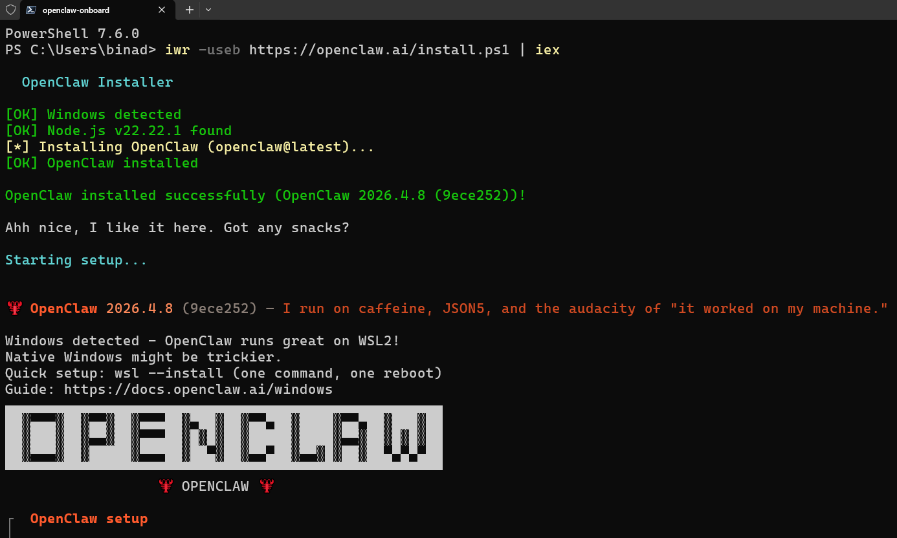

---
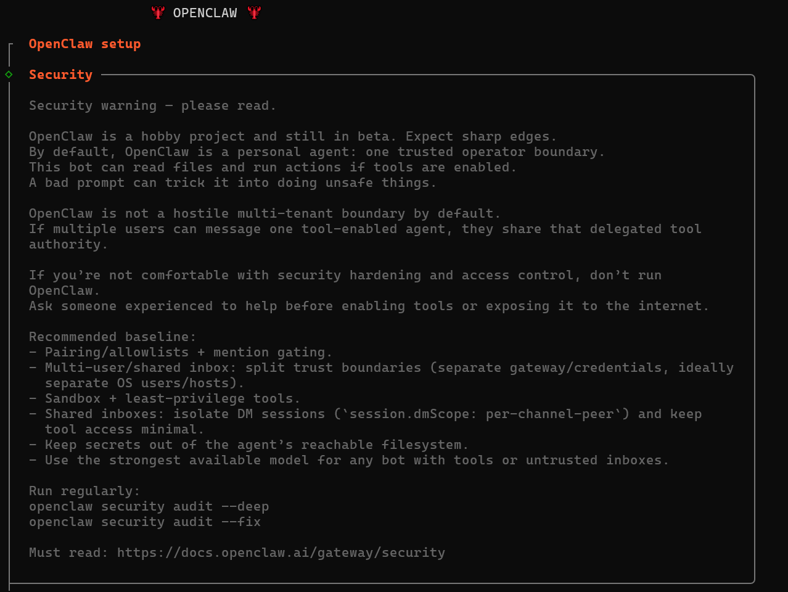

---
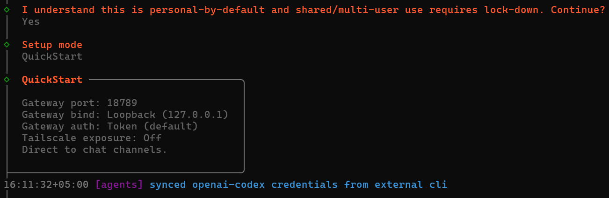

---
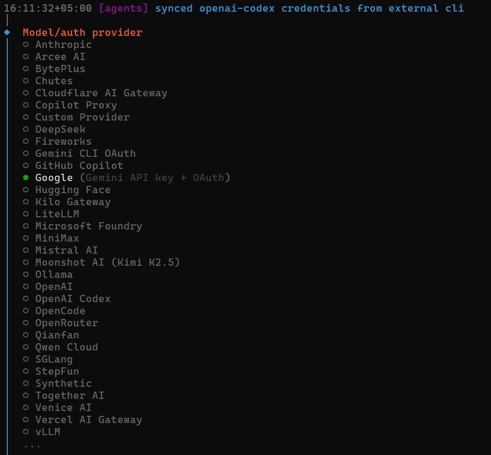

---
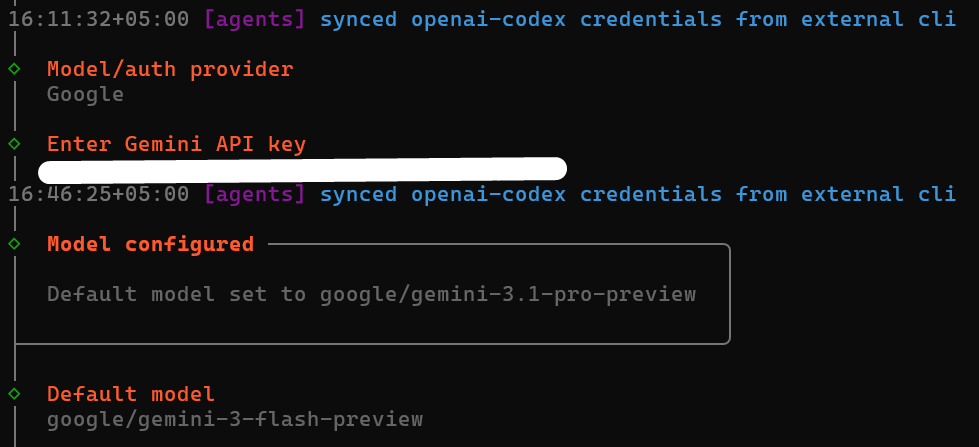

---
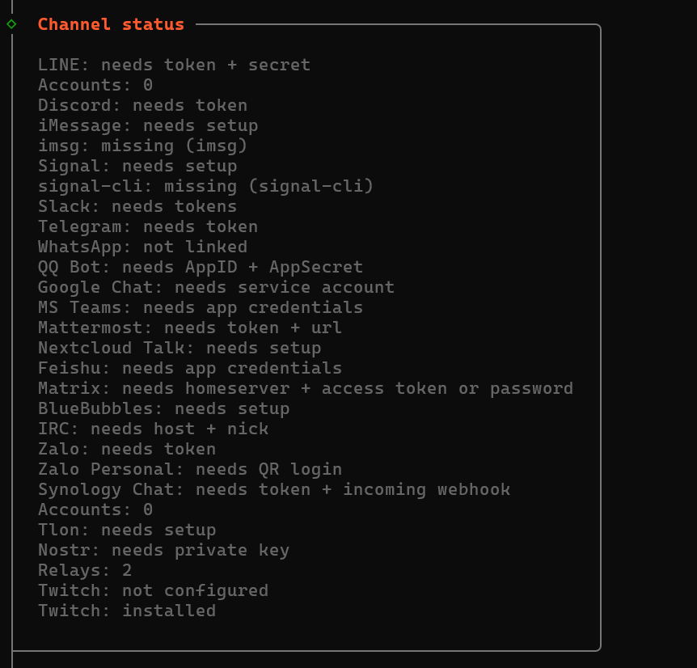

---
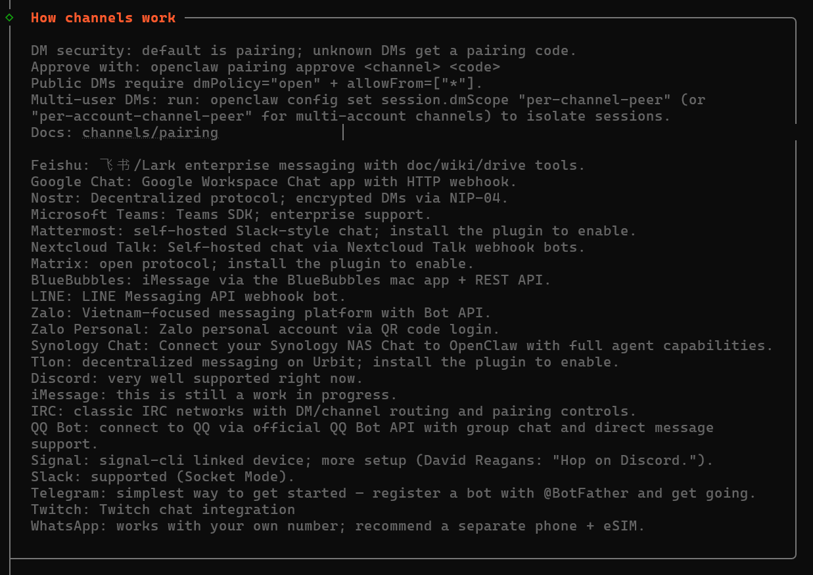

---
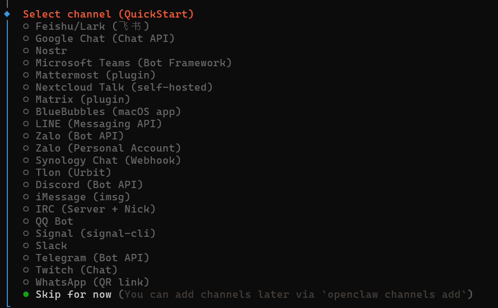

---
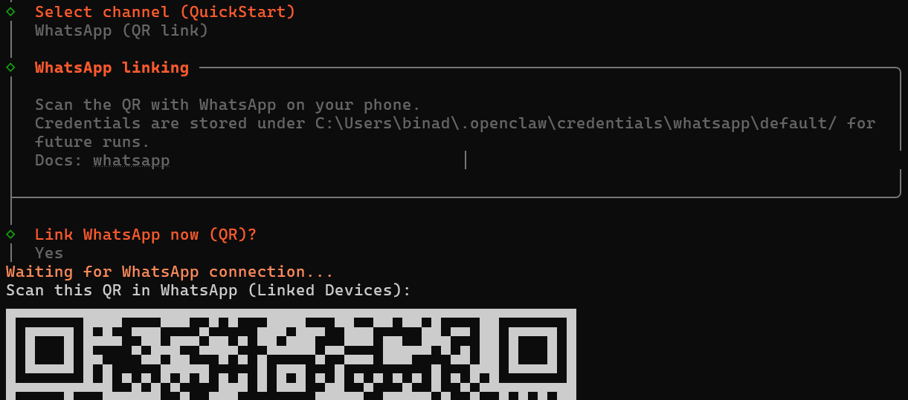

---
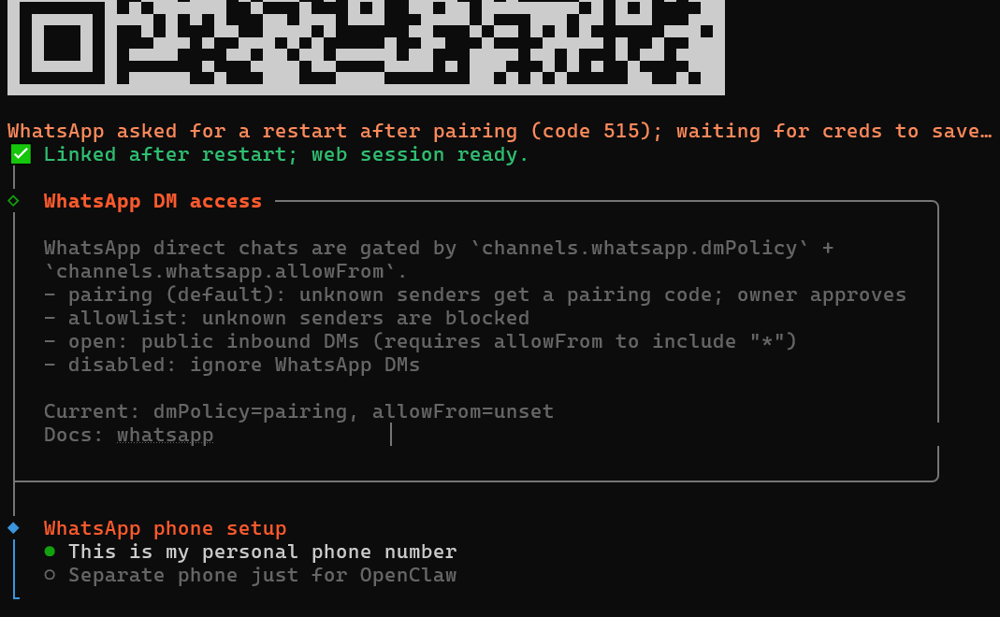

---
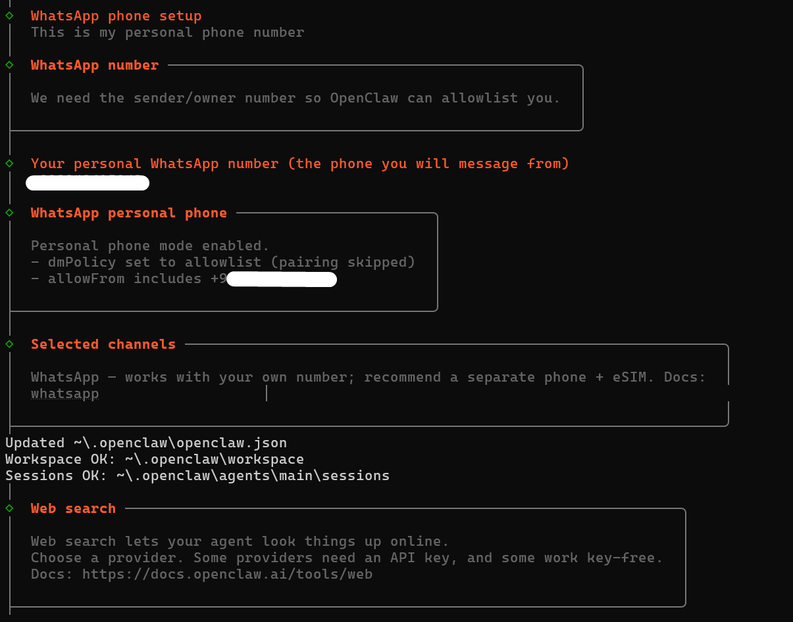

---
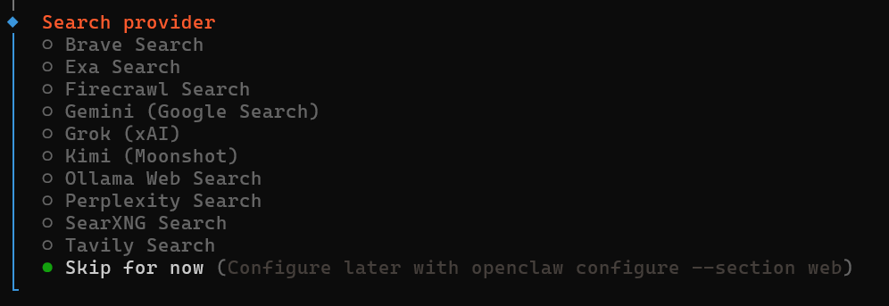

---
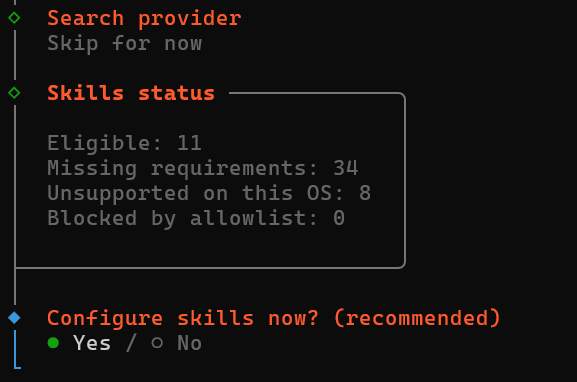

---
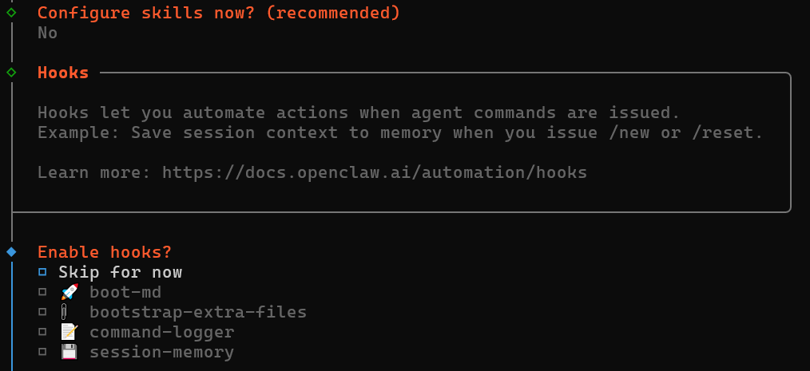

---
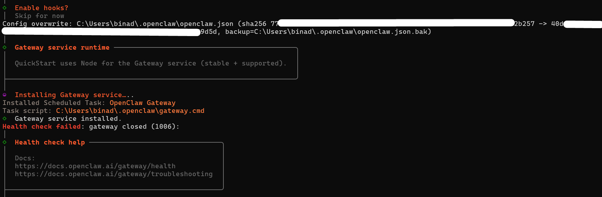

---
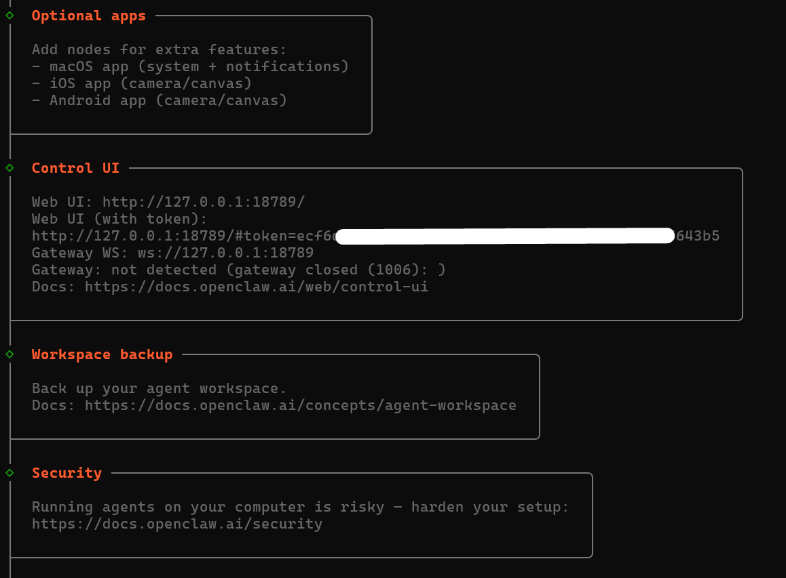

---
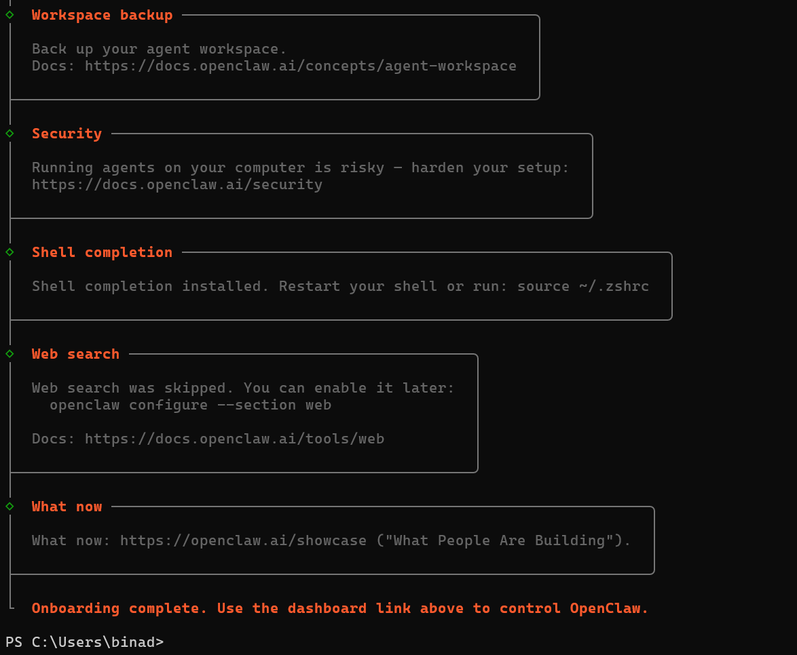

---

## [Configure Your LLM Provider](https://agentfactory.panaversity.org/docs/Building-OpenClaw-Apps/meet-your-personal-ai-employee/install-and-connect#configure-your-llm-provider)

The wizard shows a long list of providers: Google, Anthropic, OpenAI, OpenRouter, DeepSeek, Ollama, and 25+ others. Select **Google (Gemini API key + OAuth)**.

The wizard then offers two authentication methods:

-   **Google Gemini CLI OAuth**: A browser window opens for Google sign-in. No API key to create. Fastest path.
-   **Google Gemini API key**: Visit [aistudio.google.com/app/api-keys](https://aistudio.google.com/app/api-keys), create a key, copy it, and paste it into the wizard. Use this if OAuth does not work in your environment.

Either method is free. No credit card required.

The wizard then asks you to pick a default model. Scroll down and **select `google/gemini-3.1-flash-lite-preview`** (1024k context, reasoning capable). It gets the most free daily requests of any available model, enough for every exercise in this chapter. If quota runs out during a session, switch to `google/gemini-2.5-flash` (separate quota, slightly slower).

If you prefer not to use Google, select **OpenRouter** from the provider list. Visit [openrouter.ai](https://openrouter.ai/) to create a free API key, then choose any model tagged "free." OpenRouter rotates free models, so availability varies.

To check or change your model later:

```bash
# See your current model
openclaw config get agents.defaults.model

# Change the default model directly
openclaw config set agents.defaults.model.primary "google/gemini-2.5-flash"
openclaw gateway restart
```

## [Connect Your Channel](https://agentfactory.panaversity.org/docs/Building-OpenClaw-Apps/meet-your-personal-ai-employee/install-and-connect#connect-your-channel)

```bash
openclaw plugins enable whatsapp
openclaw channels add --channel whatsapp
openclaw channels login --channel whatsapp
openclaw gateway restart
```

For more detail Read Part 5 of **Agent Factory** [Part 5: Building OpenClaw Apps](https://agentfactory.panaversity.org/docs/Building-OpenClaw-Apps)
