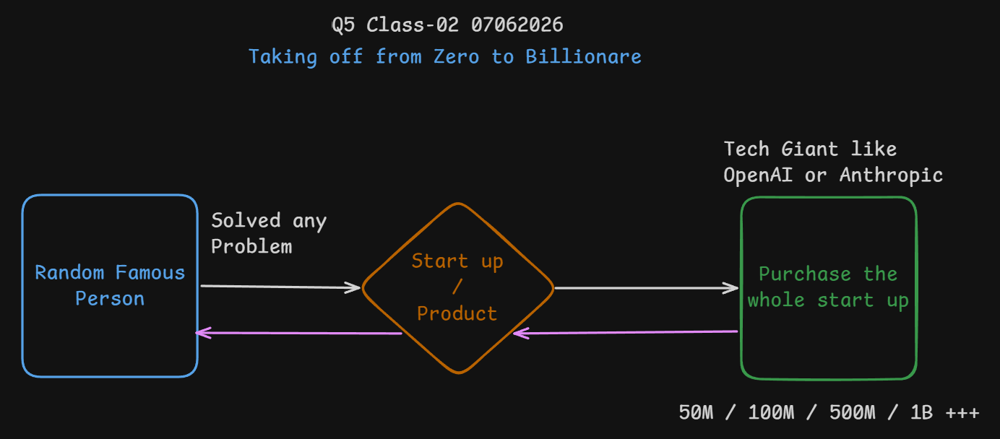

# Class 02 - 07 June 2026

- OpenClaw founder is `Peter Steinberger`
- With OpenClaw, `Agent Harness` concept starts

## What is Agent Harness?

An **Agent Harness** is like a **wrapper or framework** around an AI agent. Think of it like this:

- The **AI model** (like Claude or GPT) is the **brain** — it thinks and answers.
- The **Agent Harness** is everything **around** the brain — it gives the brain **tools**, **memory**, and **rules** to actually do real work.

### Simple Example:
Imagine you hire a smart person (the AI). But they need:
1. **Tools** — a computer, phone, access to files
2. **Instructions** — what to do, what NOT to do
3. **Memory** — a notebook to remember past work
4. **Guardrails** — boundaries so they don't do something wrong

The **Agent Harness** provides all of this. It turns a raw AI model into a **useful working agent** that can:

- Use tools (search the web, read files, run code)
- Remember things across conversations
- Follow rules and permissions
- Work on tasks step by step without constant supervision

### In Short:
> **Agent Harness = AI Brain + Tools + Memory + Rules + Control**
>
> Without a harness, AI is just a chatbot. With a harness, AI becomes a real worker that can get things done.

## OpenClaw Acquisition by OpenAI (2026)

**What Actually Happened:**
- **February 15, 2026**: Peter Steinberger (OpenClaw creator) joined OpenAI to lead personal AI agents work
- This was an **"acqui-hire"** — OpenAI hired the talent, not bought the product
- OpenClaw remained **open source** and moved to independent foundation governance
- OpenAI became a major sponsor/supporter, not the owner

**Why the Confusion:**
Some said "OpenAI acquired OpenClaw," but Peter himself clarified OpenAI didn't fully purchase it. The deal was: creator joined OpenAI + OpenClaw became foundation-backed open source project.

**Why OpenAI Was Interested:**
OpenClaw proved people want **agentic AI** (AI that takes actions, not just chats). OpenAI wanted:
- Personal AI assistants
- Long-running autonomous agents
- Multi-step task execution
- Real-world workflow automation

**Timeline:**
- **Nov 2025**: OpenClaw launched (originally called Clawdbot)
- **Jan 2026**: Renamed to OpenClaw after trademark issues
- **Feb 15, 2026**: Peter joined OpenAI; OpenClaw moved to foundation
- **Mar 2026**: Meta acquired Moltbook (separate OpenClaw-related social network)

**Key Facts:**
- No official acquisition price disclosed (billion-dollar reports are speculation)
- OpenClaw = open source AI agent framework
- Meta bought Moltbook, NOT OpenClaw

    

---
Sir Asharib and his collegue made this startup [Safock](https://www.safock.com/)
**[Browserbase](https://www.browserbase.com/)** **is a cloud infrastructure platform designed to run headless web browsers at scale**, allowing AI agents and automation scripts to interact with the internet exactly like humans do. It eliminates the need for developers to manage complex, resource-heavy browser fleets, proxies, or security infrastructure locally.
---

## Building Your Developer Presence & Getting Hired

You need to showcase your work in order to hire, get work even freelance projects, You need to focus on these

- Github profile and open-source contributions
    - You need to active on X in order to get know how about upcoming projects
    - By default, many projects are open-source now a days
    - Then go to github, understand whole repo
    - You will need to find bugs, for that, you can see `Issue` section of repo
    - If you find any, fork repo then clone it then solve that issue, create PR and push
    - If your PR merge then it will mark as contribution
- X profile and posting

## Certification Exam L1 - Agent Foundation and Prompting (AFAP)

- Orientation Presentation
- The Thesis 
- The Operating Layer
- Getting Started Overview
- AI Prompting in 2026

---

### Vertical Agent

A **vertical agent** is an AI agent built for a **specific industry, domain, or business function**.

Examples:

-   Healthcare diagnosis assistant
-   Legal contract review agent
-   Recruitment screening agent
-   Real-estate lead qualification agent

It has deep knowledge, workflows, tools, and integrations for one domain.

* * *

### Vertical Engineering

**Vertical engineering** is the process of designing and optimizing AI systems for a specific vertical (industry/domain) instead of building a generic solution.

Example:

-   A healthcare agent may integrate EHR systems, medical databases, and healthcare regulations.
-   A recruitment agent may integrate ATS systems, LinkedIn, and resume parsers.

* * *

### Vertical Agent vs General Agent

| Vertical Agent | General Agent |
| --- | --- |
| Focused on one domain | Works across many domains |
| Deep expertise | Broad knowledge |
| Specialized tools | Generic tools |
| Higher accuracy in its niche | More flexible but less specialized |
| Example: ATS Resume Screening Agent | Example: ChatGPT, Gemini, Claude |

### Simple Rule

-   **General Agent** = "Can do many things."
-   **Vertical Agent** = "Can do one thing extremely well."

----
## Being a developer you should know these:

### 1. **5 Important System Design Components:**

- **Client:** The client is the user-facing application, such as a web browser, mobile app, or desktop app. It sends requests to the server and displays the received data to users.
- **Server:** The server processes incoming requests, applies business logic, and returns responses to clients. It acts as the central brain of the application.
- **Database:** A database stores and manages application data persistently. It allows applications to create, read, update, and delete data efficiently.
- **Load Balancer or Reverse Proxy:** A load balancer distributes incoming traffic across multiple servers to improve performance and reliability. A reverse proxy sits in front of servers to handle routing, security, caching, and SSL termination.
These load balancer tools can be grouped into distinct categories based on their primary use case:
    - **Industry Standards (Most Popular)**
        - **NGINX:** The standard choice for system design. It handles huge amounts of traffic easily and doubles as a regular web server
        - **HAProxy:** A dedicated, ultra-fast proxy made strictly for high-performance load balancing and traffic management.
        **Envoy:** Built by Lyft for cloud-native apps. It is widely used to handle traffic between microservices in large companies    
    - **Developer-Friendly & Cloud-Native**            
        - **Traefik:** Specially built to work with modern container tools like Docker and Kubernetes. It updates its routing automatically when you add new containers.
        - **Caddy:** Famous for its simplicity. It automatically creates and handles secure SSL certificates for your websites with zero configuration.
        - **NGINX Proxy Manager:** A visual tool that places a clean, easy-to-use dashboard over NGINX, making it popular for personal home servers.
    - **Cloud & Large-Scale Infrastructure**
        - **Cloudflare:** A massive cloud-based proxy that handles security and speed before traffic even reaches your physical servers.
        - **AWS Application Load Balancer:** Amazon's built-in cloud proxy that automatically scales with your cloud apps.
        - **Apache (httpd):** One of the oldest web servers in the world. While it can act as a reverse proxy, newer systems usually prefer NGINX or Envoy for better speed.
    - **Specialized Proxies**
        - **Pomerium:** Focused entirely on security, authorizing users based on identity.
        - **Zoraxy:** A newer choice providing a visual web dashboard for individuals who dislike text configuration files.

- **Cache:** A cache stores frequently accessed data temporarily for faster retrieval. It reduces database load and improves application response time.

### 2. **2 Famous Software Architecture Styles:**

- **Monolithic Architecture:** In a monolithic architecture, the entire application is built as a single unified codebase and deployed together. It is simpler to start with but can become harder to scale and maintain as the application grows.
- **Microservices Architecture:** Microservices architecture breaks an application into small, independent services that communicate over APIs. It improves scalability and flexibility, but adds complexity in deployment and service coordination.

### 3. **5 Famous API Communication Styles / Technologies**

- **RESTful APIs:** REST APIs use HTTP methods like GET, POST, PUT, and DELETE to communicate between systems. They are simple, widely adopted, and ideal for standard web applications.
- **GraphQL:** GraphQL allows clients to request exactly the data they need through a single endpoint. It reduces over-fetching and is useful for complex frontend applications.
- **WebSockets:** WebSockets provide a persistent, two-way connection between client and server. They are commonly used for real-time features like chat, notifications, and live updates.
- **gRPC:** gRPC is a high-performance communication framework built on HTTP/2 and Protocol Buffers. It is efficient for microservices and internal service-to-service communication.
- **SSE (Server-Sent Events):** SSE allows servers to push real-time updates to clients over a single HTTP connection. It is simpler than WebSockets for one-way streaming scenarios like live feeds or notifications.

### 4. **Popular Database Platforms (SQL vs Non-SQL):**

- **PostgreSQL (SQL):**
PostgreSQL is a powerful open-source relational database known for reliability and advanced SQL features. It is widely used for transactional applications and scalable backend systems.
    - **Neon:** A serverless PostgreSQL platform optimized for modern cloud applications with autoscaling and branching features.
    - **Supabase:** An open-source backend platform built on PostgreSQL, offering authentication, storage, APIs, and real-time features.
    - **PlanetScale:** A cloud-native database platform focused on scalability and developer experience, built around MySQL-compatible technology.

- **Non-SQL Databases:**
Non-SQL databases are designed for flexible schemas, horizontal scaling, and high-performance distributed systems. They are ideal for applications with unstructured or rapidly changing data.
    - **MongoDB:** A document-oriented database that stores data in flexible JSON-like documents, making it popular for modern web applications.
    - **Firebase:** A Google-backed backend platform offering real-time NoSQL databases, authentication, hosting, and serverless functions for mobile and web apps.
    - **Convex:** A modern reactive backend platform with a developer-friendly NoSQL database and real-time synchronization built in. Convex was developed by BOX developer

[BOX](https://www.box.com/home) is `Intelligent Content Management platform provides seamless collaboration, content security, and AI capabilities that empower developers`

### 5. **Famous Object-Relational Mapping (ORM)
We use an ORM because it lets you write database code in your favorite programming language instead of SQL. It acts as a bridge between your code and your database. Famous Object-Relational Mapping (ORM) names vary by programming language, but several dominate their respective ecosystems by streamlining database interactions and replacing raw SQL.

- **JavaScript / TypeScript**
    - **[Prisma](https://www.prisma.io/):** A highly popular, type-safe next-generation ORM for Node.js and TypeScript known for its declarative data model and auto-completion capabilities.
    - **[TypeORM](https://typeorm.io/):** A mature ORM that supports decorators and integrates incredibly well with frameworks like NestJS.
    - **[Sequelize](https://sequelize.org/):** One of the oldest and most widely used traditional promise-based Node.js ORMs supporting multiple SQL dialects.
    - **[Drizzle ORM](https://orm.drizzle.team/):** A lightweight, TypeScript-first SQL query builder and ORM built for serverless environments

- **Python**
    - **[SQLAlchemy](https://www.sqlalchemy.org/):** The most famous Python ORM, providing a full suite of well-known enterprise-level persistence patterns.
    - **[Django ORM](https://www.djangoproject.com/):** The built-in ORM for the Django web framework, known for its rapid development cycle and strict model definitions.

- **Java**
    -   **[Hibernate](https://hibernate.org/):** The de facto standard for Java ORM, mapping object-oriented domain models to relational databases.
    -   **[Spring Data JPA](https://spring.io/projects/spring-data-jpa):** A popular abstraction layer built on top of Hibernate used ubiquitously in enterprise Java applications. 

- **.NET (C#)**
    -   **[Entity Framework Core (EF Core)](https://learn.microsoft.com/en-us/ef/core/):** Microsoft's premier ORM for .NET, famous for its speed, stability, and LINQ support.

- **PHP**
    - **[Doctrine](https://www.doctrine-project.org/):** The undisputed leader in PHP, providing object persistence and relational mapping, usually paired with the Symfony framework.
    - **[Eloquent](https://laravel.com/docs/master/eloquent):** Laravel's built-in, highly intuitive ActiveRecord-style ORM.

- **Go / Rust**
    - **[GORM](https://gorm.io/):** The most popular and developer-friendly ORM for the Go (Golang) ecosystem.
    - **[Diesel](https://diesel.rs/):** The leading ORM and query builder in Rust, known for enforcing safety and compile-time validation

---
