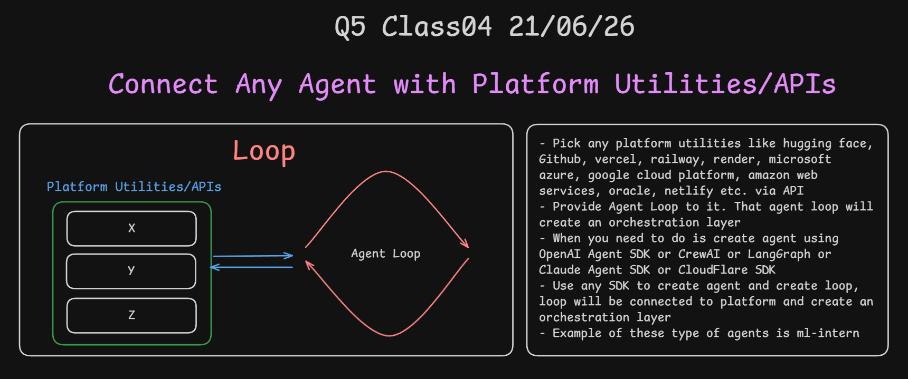
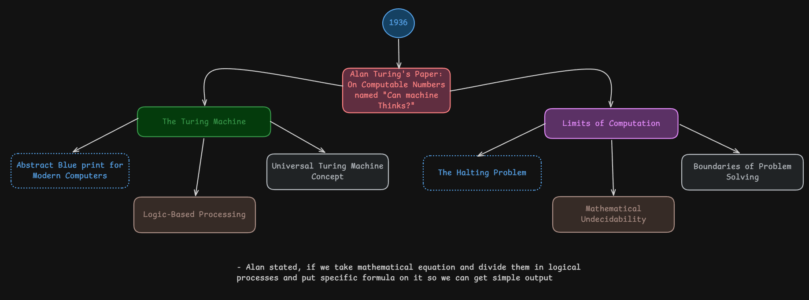
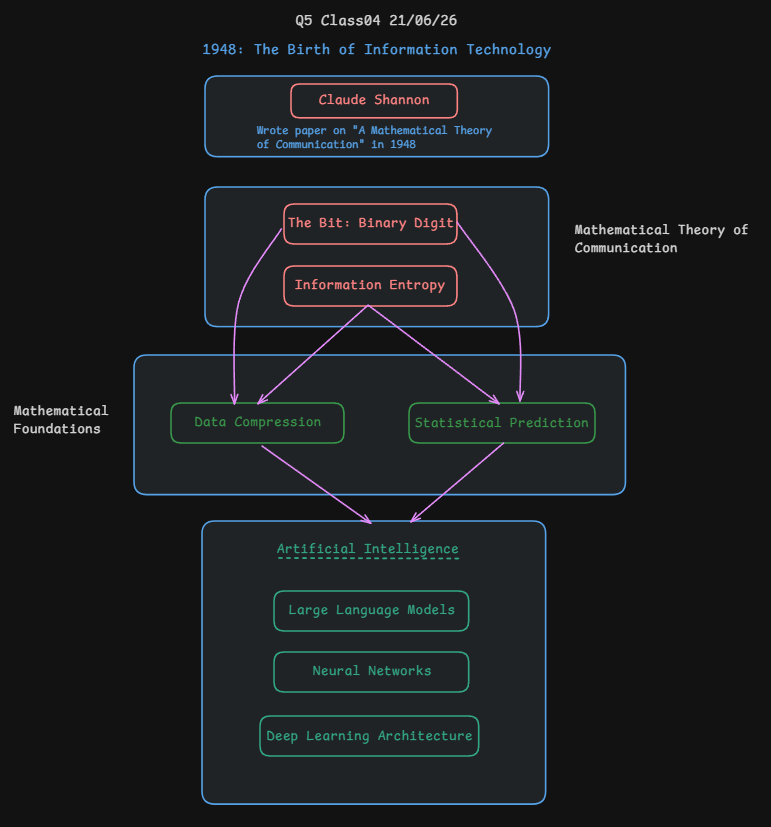

# Class 04 - 21st June 2026

## 📢 Mid-Term Examination Topics:

```md
* Orientation Presentation
https://agentfactory.panaversity.org/docs/about#new-here-start-with-the-orientation

* Foundations: Start in the Browser
https://agentfactory.panaversity.org/docs/foundations

* What AI Actually Is
https://agentfactory.panaversity.org/docs/what-ai-actually-is-crash-course

* AI Prompting in 2026
https://agentfactory.panaversity.org/docs/ai-prompting-2026

* Markdown In, HTML Out
https://agentfactory.panaversity.org/docs/markdown-html-crash-course

* Code Without Writing Code
https://agentfactory.panaversity.org/docs/code-you-never-write-crash-course

* Using and Building Skills and Connectors
https://agentfactory.panaversity.org/docs/skills-connectors-crash-course

Please make sure you are well prepared for all topics.
```

## Loop in Orchestration

In AI agent orchestration, a **loop** is when an agent repeats a process until a goal is achieved.

**How it works:**
1. Agent performs a task
2. Checks the result
3. If not done → repeat the task
4. If done → move to next step

**Common Loop Patterns:**
- **Retry Loop**: Keep trying until success (e.g., retry failed API calls)
- **Refinement Loop**: Keep improving until quality is good (e.g., edit code until tests pass)
- **Monitoring Loop**: Keep checking until condition is met (e.g., wait for deployment to finish)

**Example:**
```
while task is not complete:
    do work
    check results
```

Loops are essential for autonomous agents because they allow the agent to handle uncertainty, retry failures, and iterate toward a goal without human intervention.

## What is Agent Orchestration?

**Orchestration** is the process of **coordinating and managing multiple AI agents** to work together on complex tasks — like a conductor directing an orchestra.
- It simply means `Communication between components`

**How it works:**
- A **main orchestrator agent** decides the workflow
- It **assigns subtasks** to specialized agents
- Agents work in **sequence or parallel**
- Results are **collected and combined**

**Relation between Agent, Loop, and Orchestration:**

| Concept | Role |
|---------|------|
| **Agent** | The worker — performs individual tasks (read file, search web, write code) |
| **Loop** | The repeater — lets an agent retry until success |
| **Orchestration** | The manager — coordinates multiple agents and loops to complete a big goal |

**Simple Example:**
```
Orchestrator (Manager Agent)
├── Agent 1: Research the topic (with retry loop)
├── Agent 2: Write the code (with refinement loop)
└── Agent 3: Test and deploy (with monitoring loop)
```

**In Short:**
> **Agent** = one worker | **Loop** = one worker repeating | **Orchestration** = many workers coordinated together

## What is Hono?

**Hono** is a **fast, lightweight web framework** for building APIs and web apps in **JavaScript/TypeScript**.

**Why use it:**
- Very **small** and **fast**
- Works on **Node.js, Cloudflare Workers, Deno, Bun, and more**
- Simple syntax for building **routes, APIs, and middleware**
- Good choice for **modern edge apps**

**In short:**
> **Hono = a tiny, fast framework for building web APIs and apps**

**Example use:**
- Create API endpoints
- Add middleware
- Build serverless/edge applications quickly.

## What is Express.js?

**Express.js** is a **popular web framework for Node.js** used to build web apps and APIs.

**Why use it:**
- Easy to learn and very common
- Flexible and simple for routing
- Huge ecosystem and community support
- Good for building REST APIs and web servers

**In short:**
> **Express.js = a simple and widely used Node.js framework for building APIs and web apps**

## What is FastAPI?

**FastAPI** is a **modern Python web framework** for building APIs quickly.

**Why use it:**
- Very fast and easy to use
- Built with Python type hints
- Great automatic API docs
- Best for building high-performance APIs

**In short:**
> **FastAPI = a fast and modern Python framework for building APIs**

**Example use:**
- Build REST APIs
- Create backend services
- Generate API docs automatically.

## What is Hugging Face?

**Hugging Face** is an **AI platform and community** for sharing, using, and building machine learning models.

**Why use it:**
- Huge collection of ready-made AI models
- Easy to try models without training from scratch
- Useful for NLP, vision, audio, and generative AI
- Supports datasets, model hosting, and AI apps

**In short:**
> **Hugging Face = a platform to find, use, and share AI models**

**Example use:**
- Use pretrained AI models
- Host and share your own models
- Build AI demos and applications quickly.

## What is [ML Intern](https://github.com/huggingface/ml-intern)?

**ML Intern** is an **AI agent CLI** from Hugging Face that can research, write, and ship ML-related code automatically.

**Why use it:**
- Uses the Hugging Face ecosystem for docs, models, datasets, and compute
- Can work in **interactive** or **headless** mode
- Supports **local models** and hosted models
- Can use tools like file access, GitHub, and HF sandbox tools

**In short:**
> **ML Intern = an AI coding assistant for ML tasks using Hugging Face tools**

**Example use:**
- Research ML ideas
- Write and test ML code
- Automate small ML workflows quickly.

## Connect Any Agent with Platform Utilities/APIs

An **agent loop** can be connected to platform tools and APIs like **Hugging Face, GitHub, Vercel** etc.

**What it means:**
- The agent can call APIs to do real work
- It can read, write, deploy, test, or manage resources
- The loop keeps repeating until the task is finished

**Why it matters:**
> When you connect an agent to platform APIs, the agent loop becomes an **orchestration layer** that can manage tasks across different services.

**In short:**
> **Agent + Loop + Platform APIs = Orchestration layer for real-world automation**

**Example use:**
- Deploy code to Vercel
- Push updates to GitHub
- Run ML tasks on Hugging Face
- Manage cloud services through APIs.

**Platforms could be:**
- Hugging Face
- GitHub
- Vercel
- Railway
- Render
- AWS
- Azure
- Oracle 
- Netlify
- Digital Ocean
- Github Pages
- [Linear](https://linear.app/)
- [Slack](https://slack.com/)
- [Jira](https://www.atlassian.com/software/jira)

There are 100 of **developer platforms** which provide us **API**

**Additional points:**
- Pick any platform utilities like Hugging Face, GitHub, Vercel, Railway, Render, Microsoft Azure, Google Cloud Platform, AWS, Oracle, and Netlify via API
- Provide an agent loop to it; that agent loop creates an orchestration layer
- Create the agent using an SDK like OpenAI Agent SDK, CrewAI, LangGraph, Claude Agent SDK, or Cloudflare SDK
- Use the SDK to connect the agent loop with platform APIs
- **[ML Intern](https://github.com/huggingface/ml-intern)** is an example of this type of agent

**In short:**
> **Create an agent + add a loop + connect APIs = orchestration layer**

**Example flow:**
1. Build agent with an SDK
2. Connect it to platform APIs
3. Add loop for repeated actions
4. Let the loop manage the workflow automatically.

<div align="center">
    
</div>

## What is [SuperMemory](https://supermemory.ai/)?

**SuperMemory** is a **memory layer for AI agents** and a context engineering platform that powers enterprise APIs, developer plugins, and personal apps that remember everything.

**Why use it:**
- Provides a **memory graph** for storing and recalling information
- Allows AI agents to **remember and reason** about past interactions
- Supports **user profiles** and personalized context
- Has connectors for tools like Notion, Google Drive, S3, and Gmail

**In short:**
> **SuperMemory = a memory layer that helps AI agents remember and retrieve information**

**Example use:**
- Add memory to AI agents
- Store and retrieve user context
- Build apps that learn from past interactions.

## Alan Turing's Paper — "Can Machine Think?"

In **1936**, **Alan Turing** published a paper which asked the question: **"Can machine think?"**

This paper led to two major ideas:

### 1. The Turing Machine
- An **abstract blueprint for modern computers**
- Based on **logic-based processing**
- Led to the **Universal Turing Machine** concept — a single machine that can simulate any computation

**How it works:**
- An infinite tape divided into cells, each holding one symbol
- A read/write head that moves left or right on the tape
- A state register that tracks the current state
- A transition table that defines what to do for each state and symbol

**Example:**
```
Tape:  [1] [0] [1] [1] [0] [ ] [ ]
        ↑
      Head reads 1, writes 0, moves right
```

### 2. Limits of Computation
- **The Halting Problem** — some problems cannot be solved by any algorithm
- **Mathematical Undecidability** — there are things computers can never decide
- **Boundaries of Problem Solving** — not everything is computable

**The Halting Problem explained:**
> There is no general algorithm that can determine whether any given program will finish running or continue forever.

### The Turing Test (1950)
Turing later proposed a practical test called the **Imitation Game**:
- A judge types messages to two hidden participants
- One is a human, one is a machine
- If the judge cannot tell which is which, the machine passes

This test became the foundation for measuring AI intelligence.

### Nine Objections Turing Addressed:
1. **Theological objection** — thinking is a function of the soul
2. **Heads in the sand** — consequences would be too dangerous
3. **Mathematical objection** — based on Gödel's incompleteness theorem
4. **Lady Lovelace's objection** — machines can only do what they are told
5. **Argument from consciousness** — machines cannot have feelings
6. **Arguments about disabilities** — machines cannot learn or be creative
7. **Informality of behavior** — human behavior cannot be described by rules
8. **Lady Lovelace's extended objection** — machines lack originality
9. **Argument from extra-sensory perception** — telepathy as evidence

### Alan's Key Idea:
> If we take mathematical equations and divide them into **logical processes** with specific formulas, we can get simple outputs.

This is the foundation of how all computers and AI systems work today.

<div align="center">
    
</div>

## 1948: The Birth of Information Technology — Claude Shannon

In **1948**, **Claude Shannon** published a paper called **"A Mathematical Theory of Communication"** which is considered the founding work of **information theory**.

### The Paper
- Originally published in **Bell System Technical Journal** in 1948
- Republished as a book in **1949** with commentary by Warren Weaver
- Called the **"Magna Carta of the Information Age"** and **"blueprint for the digital era"**
- Has **tens of thousands of citations** — one of the most influential scientific papers ever written

### Fun Fact — Anthropic Named "Claude" After Claude Shannon
- **Anthropic**, the AI company behind the **Claude** model, named it after **Claude Shannon**
- Shannon is known as the **father of information theory** — the science that makes modern AI possible
- So every time you use **Claude AI**, you are using a name that honors the person who gave us the bit, entropy, and the math behind how AI models work

### Key Concepts Introduced

#### 1. The Bit (Binary Digit)
- Shannon formally introduced the term **"bit"** as a unit of information
- A bit is the smallest unit of data — either **0 or 1**
- Everything in a computer is built on bits

#### 2. Information Entropy
- **Entropy** measures the amount of uncertainty or surprise in information
- More unpredictable data = higher entropy
- This concept helps quantify how much information something carries

#### 3. Mathematical Theory of Communication
Shannon outlined **5 elements of communication:**
1. **Information Source** — produces the message
2. **Transmitter** — encodes the message
3. **Channel** — carries the signal (with possible noise)
4. **Receiver** — decodes the message
5. **Destination** — receives the final message

### Mathematical Foundations

#### Data Compression
- Using entropy, Shannon showed that data can be compressed efficiently
- Removing redundancy saves storage and bandwidth
- This is the basis of ZIP, JPEG, MP3, and video compression

#### Statistical Prediction
- Shannon proved that predictable patterns in data can be used for compression
- This connects directly to how modern AI models work
- **LLMs predict the next token** using statistical patterns — the same idea

### How It Led to AI

```
Claude Shannon (1948)
├── The Bit → Binary representation of all data
├── Information Entropy → Measuring information content
│
├── Data Compression → Efficient storage (ZIP, JPEG, MP3)
├── Statistical Prediction → Pattern recognition in data
│
└── These foundations led to:
    ├── Artificial Intelligence
    │   ├── Large Language Models (predict next token)
    │   ├── Neural Networks (learn statistical patterns)
    │   └── Deep Learning Architecture (layers of pattern recognition)
```

### In Short:
> **Shannon's 1948 paper gave us the bit, entropy, and the math behind data compression and prediction — which became the foundation for modern AI and LLMs.**

<div align="center">
    
</div>

