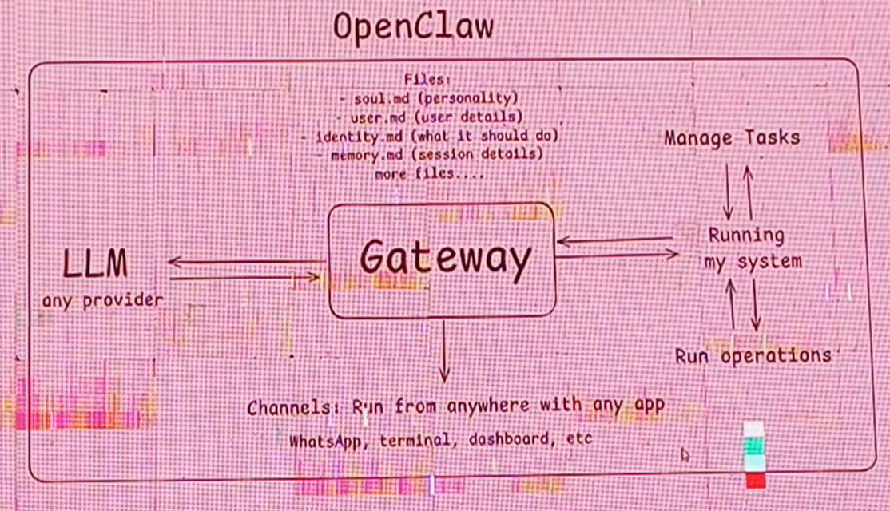

# OpenClaw

> **Course Roadmap — Class 05 (12-07-2026)**
>
> 
>
> *Overview slide covering: Open Source Personal AI Agent • OpenAI acquired OpenClaw (Peter Steinberger) • Trending AI Agent • Multi-Channel Support • MCP (Model Context Protocol) Support*

---

## 📌 Executive Summary

The GIAIC (Governor Initiative for Artificial Intelligence and Computing) program is nearing its end in **August 2026**, and the final classes are now shifting focus toward **"Truly Agentic" AI** — meaning AI that can actually *do things*, not just chat.

The main topic of this session is **OpenClaw**, an open-source personal AI agent originally built by **Peter Steinberger**, and recently **acquired by OpenAI**. This system shows the shift from passive chatbots to **active AI agents** that interact with the outside world through tools, APIs, and the **Model Context Protocol (MCP)**.

### Key Takeaways

- **Open Source Personal AI Agent:** OpenClaw is open and extensible, unlike closed assistants.
- **OpenAI Acquisition:** OpenAI acquired OpenClaw (developed by **Peter Steinberger**) — a strong industry signal that personal AI agents are the next frontier.
- **Trending AI Agent:** OpenClaw is positioned as one of the most talked-about agentic systems of the year.
- **Multi-Channel Support:** Operates across WhatsApp, Telegram, Discord, Slack, Microsoft Teams, and more.
- **MCP Support:** Natively supports the **Model Context Protocol (MCP)** for connecting with any external system.
- **Beyond CRUD Apps:** Success today means moving beyond simple CRUD apps toward **AI-native enterprise solutions**.
- **Market Dynamics:** Case studies (Elon Musk's valuation strategy, the Apple vs. OpenAI lawsuit) show how technology, politics, and intellectual property now collide.

---

## 1. Program Context & Professional Evolution

### Assessment & Integrity
The recent GIAIC assessment was meant to help students measure their own technical level. The instructors noted that some students tried to cheat — described as a waste of energy and personal growth, especially since their details were tracked.

### Program Timeline
The GIAIC program ends by the **end of August**. The remaining classes will focus on:
- Deepening the technical understanding of **agentic systems**
- Turning technical skills into **real income and revenue**
- Wrapping up **certificates** and **final projects**

### Redefining Success & Vision
The class pushed a mindset shift from small-scale work to **high-level system design**:

- **Beyond CRUD:** Most developers are stuck building simple CRUD apps for a few hundred users. Industry leaders like Elon Musk think in terms of massive equity and multi-company integration.
- **Creative Value:** High income comes from creativity. Doing what thousands of others do = low value. Unique, creative solutions = higher respect and higher pay.

---

## 2. Strategic Business Case Studies

### 🟢 The Elon Musk "Valuation" Strategy
Elon Musk's trillionaire status comes from **company equity**, not cash. The lecture outlined his political approach to growth:

- **Acquisition Loops:** Musk used **xAI** to acquire **X (Twitter)**, then used **SpaceX** to acquire **xAI**. By chaining acquisitions, he merged valuations and raised his paper net worth past a trillion dollars — stacking Tesla, SpaceX, X, xAI, and The Boring Company.
- **The Boring Company:** Cited as a "failed" or heavily criticized project. Despite billions spent solving NYC traffic with underground tunnels, backlash followed when *traffic jams happened inside the tunnels themselves*.

### ⚖️ Apple vs. OpenAI Legal Conflict
A major lawsuit is underway:

- **The Dispute:** Apple has sued OpenAI, claiming theft of thousands of secret files and trade secrets.
- **The Cause:** OpenAI acquired **IO** — a hardware company co-founded by former Apple designer **Johnny Ive** and Apple's former Chief Hardware Officer — for about **$6.5 billion**. This led to mass hiring of Apple employees and alleged transfer of proprietary information.

---

## 3. Technical Foundation of AI Assistants

### What Is an AI Assistant?
An AI assistant is an **LLM (Large Language Model)** that has access to an **external environment**. Early LLMs were nothing more than chatbots — they could only generate text. The introduction of **Function Calling in early 2023** transformed them into true assistants by allowing them to interact with the outside world.

### The Core Principle: LLMs Understand Schemas, Not Functions
A critical concept behind agentic AI is this:

> **LLMs do not understand functions or code directly — they only understand schemas.**

This is why every tool a model uses must be **wrapped in a structured description** the model can read and reason about. Without this wrapper, the LLM has no way of knowing what the function does, what arguments it needs, or what it returns.

### OpenAPI Specification — The Universal Standard
To make tools understandable to LLMs (and to other systems), the industry uses a standard called the **OpenAPI Specification (OAS)**.

- **What it is:** A **language-agnostic, standard interface for HTTP APIs** that allows both humans and computers to **discover and understand the capabilities of a service** without needing access to its source code, internal documentation, or network traffic inspection.
- **Why it matters:** It gives every API a universal "instruction manual" that any client — including an LLM — can read.
- **Official reference:** [https://swagger.io/specification/](https://swagger.io/specification/)

In simple terms:
- You write a function (e.g. in JavaScript/TypeScript).
- You describe that function inside a **JSON Schema** that follows the **OpenAPI Specification**.
- The LLM reads the schema — not the code — to figure out **when** to call the function and **what arguments** to pass.

### From OpenAPI to Function Calling — How It All Connects
The full historical chain looks like this:

1. **OpenAPI Specification** was created as the universal standard for describing HTTP APIs.
2. **OpenAI took OpenAPI**, wrapped its schema format inside a `function` definition, and built **Function Calling** on top of it.
3. OpenAI then launched the **Assistant API**, exposing **Function Calling capabilities to the world** so any developer could give an LLM access to external tools.

This is why today's agentic systems feel almost magical — they're built on a simple but powerful idea: *describe your tools in a language the model can read, and the model will use them.*

### Tool Calling vs Function Calling — A Terminology Note
You'll often see two terms used interchangeably in documentation: **tool calling** and **function calling**. They refer to the same underlying capability but sit at different levels of abstraction:

| Term | Level | Meaning |
|------|-------|---------|
| **Tool Calling** | High-level / abstracted | The broader concept of an LLM using *any* external capability, regardless of how it's wired up |
| **Function Calling** | Low-level / technical | The actual mechanism — JSON Schema describing a function, and the LLM deciding to invoke it |

**In simple words:**
> *"Tool calling" is an abstracted term. Its low-level word is "function calling."*

In practice:
- When you talk about the **mechanism** (the JSON Schema, the actual invocation) → say **function calling**
- When you talk about the **concept** (an LLM using external capabilities) → say **tool calling**

Modern APIs (OpenAI, Anthropic, Google) expose both terms in their docs, often swapping them loosely. Knowing the distinction helps you read technical documentation more precisely.

### From Chatbot to Assistant — The Turning Point
This is the key inflection point in the evolution of AI:

> **Because of tool/function calling capabilities, the chatbot was converted into an assistant.**

Before this, an LLM could only generate text — it was essentially a sophisticated autocomplete engine. By giving it the ability to **call external tools and functions**, we transformed it into something far more powerful: an **assistant** that can actually take actions in the real world.

This single capability is what separates the two:

| Chatbot | Assistant |
|---------|-----------|
| Answers questions with text only | Answers questions **and** performs tasks |
| Reads inputs, generates outputs | Reads inputs, **takes actions**, generates outputs |
| No access to external systems | Connected to **APIs, databases, apps, services** |
| Reactive — responds when asked | Proactive — can trigger workflows autonomously |

The OpenAI Assistant API made this capability widely available to developers, and it became the foundation that all modern agentic systems — including OpenClaw — are built on.

### Why Assistants Are Powerful — External Environment Access
What truly separates an assistant from a chatbot is this:

> **An assistant has access to the external environment — APIs, servers, databases, and other systems.**

This is what makes an assistant *useful* in the real world. A chatbot is limited to whatever knowledge was baked into its training data. An assistant, on the other hand, can reach *outside* itself to:

- **APIs** — call external services (payment gateways, weather data, social media, search engines)
- **Servers** — execute code, run jobs, deploy applications
- **Databases** — read, write, query, and update records in real time
- **Internal systems** — trigger workflows, send notifications, manage files

This external access is what turns an LLM from a *text generator* into a **system of action**. Without it, the model is trapped inside its own context window. With it, the model can interact with the same digital world humans use every day.

**The formula is simple:**

```
LLM  +  External Access (APIs, Servers, Databases)  =  Assistant
```

Every modern agentic system — from OpenAI's Assistants API to Claude's Tool Use to OpenClaw's Gateway — is essentially this same idea, packaged differently.

### Workflow Summary
1. Write a normal function (JavaScript/TypeScript) to perform a task.
2. Wrap it in a **JSON Schema**.
3. Make sure the schema follows the **OpenAPI Specification** so it's universally understandable.
4. Register the tool with the LLM (e.g. via the **OpenAI Assistant API**).
5. The LLM *reads the schema* — it doesn't understand your function code — and decides **when and how** to trigger the tool based on the user's request.

---

## 4. OpenClaw — The "Truly Agentic" System

### Origins & Acquisition
OpenClaw was built by **Peter Steinberger**, who spent years creating **AI-native CLI (Command Line Interface)** tools.

- **Renaming:** Originally called **"Claw Bot"**, the name was changed after **Anthropic's lawyers threatened legal action**.
- **Acquisition:** OpenAI acquired OpenClaw for an estimated **$500–600 million**, hiring Peter Steinberger to keep developing it as an open-source tool.

### Core Capabilities
OpenClaw is described as *"the AI that really does things."* Features include:

- **Local Execution:** Runs directly on the user's machine.
- **Multi-Channel Support:** Can be controlled via **WhatsApp, Telegram, Discord, Slack, and Microsoft Teams**.
- **MCP (Model Context Protocol):** Lets the agent connect with and manage virtually any system or industry task.

### Internal Architecture
The **"Gateway"** is the heart of OpenClaw — a **Node.js process** that manages **four critical Markdown files** defining the agent's behavior:

| File Name     | Purpose                                                                                  |
|---------------|------------------------------------------------------------------------------------------|
| `Soul.md`     | Defines the agent's **personality, vibes, and operating style**.                         |
| `User.md`     | Details about the **owner/master** (name, preferences, etc.).                            |
| `Identity.md` | Defines **who the agent is** and its specific tasks.                                     |
| `Memory.md`   | Stores the **history of communications** and long-term context.                          |

---

## 5. Implementation & Setup

### Installation Requirements
OpenClaw works on **Windows, macOS, and Linux** via a PowerShell command.

- **Dependencies:** Requires **Node.js** and the **winget** package manager.
- **Provider Selection:** You must choose an LLM provider — **OpenAI, Anthropic, Google, or OpenRouter**.
- **Search Tools:** Integration with search APIs like **Exa, Firecrawl, or Brave Search** is needed for web browsing.

### Channel Configuration
To control the agent remotely, you link it to a communication channel. **WhatsApp** is highlighted as the preferred option — it requires **scanning a QR code** to link the agent's Gateway to a mobile number.

### Strategic Tips for Developers
- **Recreate Enterprise Products:** Look at big enterprise tools (IBM, Oracle, Microsoft) and recreate them as **AI-native versions**.
- **Observation Tools:** Tools like **Datadog** (which OpenAI pays $175 million/year for) show the huge market for **AI-powered observability and security**.
- **Free Resources:** If you don't have paid API credits, try **OpenRouter** and **Google Gemini** (with multiple free accounts) to access LLMs without immediate cost.

---

## 6. Conclusion & Future Directions

The final phase of GIAIC is about turning students into **architects of AI-native systems**. Moving from simple assistants to **"AI Employees"** requires:

- Understanding the **OpenClaw Gateway**
- Using **MCP** effectively
- Integrating AI into complex professional workflows (project management, security systems, large-org tools)

---

## 📚 Quick Reference — Key Terms

| Term | Meaning |
|------|---------|
| **LLM** | Large Language Model |
| **MCP** | Model Context Protocol — connects agents to external tools |
| **Tool Calling** | High-level / abstracted term for an LLM using any external capability |
| **Function Calling** | Low-level term — the JSON-Schema-based mechanism for invoking a specific function |
| **OAS** | Open API Specification — language-agnostic API standard |
| **CRUD** | Create, Read, Update, Delete — basic app operations |
| **CLI** | Command Line Interface |
| **Gateway** | The Node.js engine that runs OpenClaw |
| **AI-Native** | A product built from the ground up *around* AI, not just with AI added |

---

> 📝 **Note:** More details will be added to this document in upcoming sessions. Sections above will be expanded, edited, or restructured as new material is provided.
