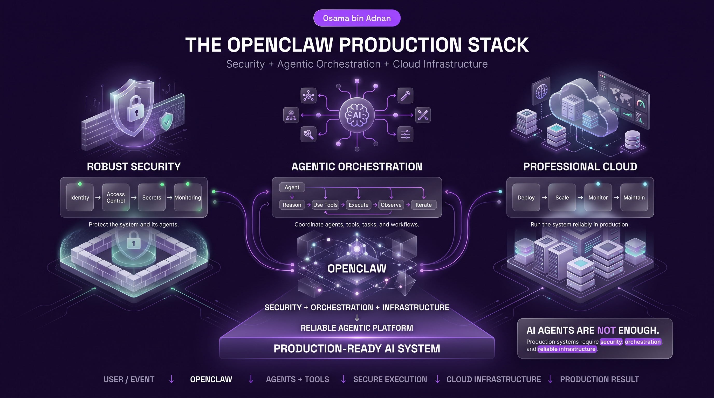
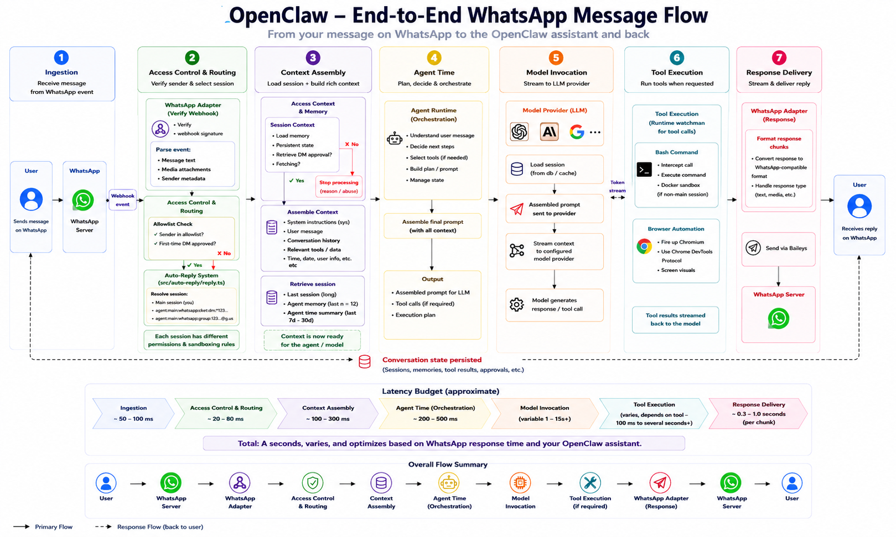
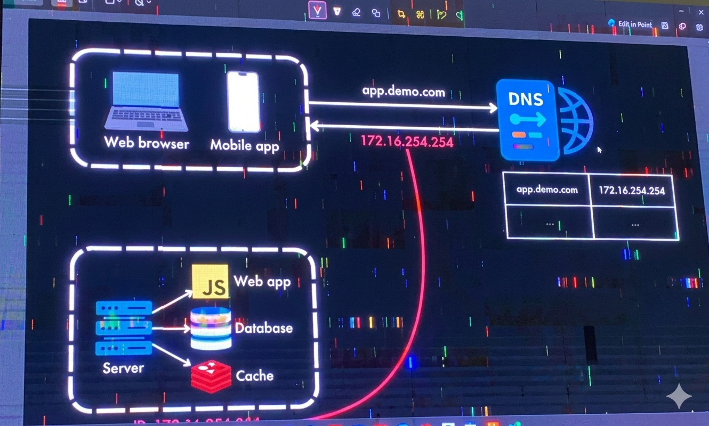

# GIAIC Quarter 5 Class 8 – Agentic Orchestration and Enterprise Deployment

---

## 1. Executive Summary

The GIAIC Quarter 5 Class 8 workshop represents a pivotal strategic pivot in the curriculum, serving as the formal bridge between local SDK development and industrial-scale **Enterprise Orchestration**. While previous sessions focused on the mechanics of individual LLM calls, this session addresses the architectural rigors required to transition autonomous agents from experimental *"toy"* scripts into secure, high-availability production environments.

The high-level objective is the synthesis of three core pillars:

1. **Robust security architecture.**
2. **Agentic orchestration** via the OpenClaw framework.
3. **Professional cloud infrastructure.**

---

<div align='center'>
    
    <p><strong><u>Three core pillars of OpenFlo</u></strong></p>
</div>

---

By examining the shift from fragmented *"amateur"* stacks to unified enterprise deployments, this report outlines the requirements for building AI systems that are not only *capable* but also *defensible* and *scalable*.

---

## 2. The OpenClaw 6-Layer Security Architecture

In professional solution design, connecting personal communication channels (WhatsApp, Telegram, Discord) to internal AI logic introduces significant surface area for *"untrusted message"* risks. Every incoming message is essentially a **payload** that must be treated as a potential **injection attack**.

The architecture begins with **Phase 1: Ingestion**. Incoming data is captured by the **OpenClaw Gateway** — a web server typically communicating via WebSockets — where the raw payload is intercepted. Before the agent can *"reason"* on the input, the message must pass through a **6-layer security stack** to mitigate risks ranging from prompt injection to resource exhaustion.

---

<div align='center'>
    
    <p><strong><u>OpenClaw End to End WhatsApp Message Flow</u></strong></p>
</div>

---


### The 6 Security Layers

To ensure **State Isolation** and system integrity, OpenClaw implements the following layers:

| Layer | Mechanism | Risk Mitigated |
|---|---|---|
| **Layer 1: Channel Access (Authentication)** | Verify allowlist settings and specific plugin permissions. | **Unauthorized access.** Ensures that only validated accounts can interact with the agent gateway. |
| **Layer 2: Process/Session Isolation** | Chat segregation and context visibility controls. | **Contextual Injection and Data Leaks.** Prevents the *"memory"* of one user session from bleeding into another user's prompt window. |
| **Layer 3: Agent Runtime** | Planning and model selection, often leveraging MCP (Model Context Protocol) servers for standardized tool interaction. | **Orchestration failure.** Coordinates sub-agents (e.g., separating transcription from summarization) to prevent logical hallucinations. |
| **Layer 4: Tools Policy Approval** | Operational scoping and boundary checks for individual plugins. | **Escalation of Privileges.** Even if an agent is authorized, this layer prevents it from using a *"web search"* tool to access restricted internal APIs. |
| **Layer 5: Execution Boundary** | Sandboxing the workspace and managing OS/Network boundaries, including hardware resource allocation (CPUs, GPUs, and Cores) for local LLMs. | **Denial of Service (DoS) and System Compromise.** |
| **Layer 6: Monitoring & Recovery** | Audit logs, security alerts, and automated backup generation. | **Forensic Blindness.** Provides the trail necessary to recover from *"edge case"* failures or security breaches. |

---

## 3. OpenClaw Internals and Workspace Configuration

OpenClaw operates through a centralized **Gateway** that acts as the primary coordinator for all asynchronous events. A critical technical function of this gateway is **Payload Normalization**.

### Adapter-based Normalization

Different platforms use heterogeneous schemas for message data; for instance, WhatsApp may transmit text within a `content` property, whereas Telegram or Discord.js might use a `text` property. OpenClaw's **Adapters** resolve this *"Property Name Collision"* by mapping various raw inputs into a **unified schema**. This ensures the LLM receives a consistent data structure regardless of the source channel.

### Workspace Metadata and Memory Management

The agent's persona and operational constraints are defined within specific Markdown files:

| File Name | Functional Purpose |
|---|---|
| `user.md` | Metadata defining the user's profile and permissions. |
| `identity.md` | The agent's name, role, and functional boundaries. |
| `soul.md` | Definition of conversational tone, *"vibe,"* and personality. |
| `memory.md` | High-level persistent memory and contextual summaries. |
| `tools.md` | Descriptions and restrictions for MCP/MCP Servers. |
| `agents.md` | Behavioral definitions for specialized sub-agents. |
| `heartbeat.md` | Cron schedules for periodic, automated tasks. |

> **Architectural Insight: Token & Cost Optimization**
>
> To bypass LLM context window limitations, OpenClaw distinguishes between **Persistent High-Level Memory** (summarized in `memory.md`) and **Volatile Day-to-Day Logs**. By only injecting relevant summaries or fetching logs *"on-demand,"* the system achieves significant **Token Optimization**, reducing operational costs while maintaining long-term contextual awareness.

---

## 4. Solution Design Philosophy: The *"Simplest Possible Solution"*

As Senior Architects, we must guard against **Architectural Over-abstraction**. A common source of technical debt is forcing a multi-agent framework onto a procedural problem that is better solved with a simple script.

### Case Study: K-Electric Bill Extraction

- **The Over-Engineered Trap:** Deploying a full OpenClaw stack with multiple agents and MCP servers just to monitor an inbox for a monthly utility bill.
- **The Simplest Possible Solution:**
  - **Email Listener:** A Python script monitors a specific domain.
  - **Gemini API:** A direct call for JSON extraction (Amount, Due Date).
  - **Twilio API:** An automated WhatsApp/SMS notification.

This procedural approach is more maintainable, easier to deploy via a simple VM, and significantly more cost-effective. **We only move toward agentic orchestration when the problem requires autonomous reasoning and multi-tool coordination.**

---

## 5. Project Case Study: The Autonomous AI Meeting Assistant

When complexity is justified, we move to high-value products like the **Autonomous Meeting Assistant**. This is not a simple chatbot but a multi-layered **orchestration system**.

### Workflow and Automated Resource Allocation

1. **Google Calendar:** Trigger mechanism for schedule detection.
2. **Otter.ai / Fathom.ai:** Joins the meeting to capture and generate JSON/Text transcripts.
3. **OpenClaw Orchestrator:** Processes the transcript to identify action items.
4. **Trello API:** Automated Resource Allocation. The agent creates cards and assigns tasks to specific team members (represented by initials like `'MS'` or `'SS'`) based on the meeting dialogue.
5. **Discord Gateway:** Delivers scheduled morning briefings (upcoming tasks) and evening summaries (Status: In-progress, Complete, or Blocked) with direct links to Trello cards.

This system justifies the agentic approach by automating the *"human-in-the-loop"* coordination required for project management.

---

## 6. Infrastructure, Cloud Deployment, and Networking

Transitioning to production requires moving away from *"distributed amateur stacks"* (e.g., combining Vercel, Render, and Supabase) which suffer from significant inter-service latency and vendor lock-in. A professional deployment favors a **unified cloud provider** (AWS, GCP, or Azure) within a secure **Virtual Private Cloud (VPC)**.

### The Progressive Deployment Path

1. **Local Development:** Initial workspace testing.
2. **Virtual Machines (AWS EC2):** Deployment to *"bare metal"* cloud instances accessible via SSH.
3. **Git Version Control:** Implementation of branch-based deployments (e.g., `git pull` on the server) to replace manual file transfers.
4. **Docker Containerization:** Standardizing the environment to prevent *"it works on my machine"* failures.
5. **Enterprise Networking:** Mapping a domain (e.g., `humzabiryani.pk`) to a Static IP via DNS and implementing Load Balancers for high availability.

### Modern Three-Tier Architecture

Enterprise applications are structured into three distinct layers:

| Layer | Role |
|---|---|
| **Presentation Layer** | The UI (Web/Mobile). |
| **Business Logic Layer** | The server-side orchestration (OpenClaw/Python). |
| **Data Layer** | The persistent database (Relational or Non-Relational). |

By hosting these tiers within a single VPC and utilizing **CIDR blocks** for internal networking, we eliminate the latency and security vulnerabilities inherent in fragmented, multi-vendor setups. The architectural goal is to **start with the simplest script possible but ensure the infrastructure is designed for enterprise-level scale.**

## 7. Basic System Design

A foundational concept in system design that demonstrates how a basic web application handles traffic before it scales out to support heavy user demand.

### Clean Frontal Architecture Diagram

```
┌─────────────────────────────────┐                 ┌─────────────────────────────────┐
│        CLIENT TERMINALS         │                 │         DNS NAME SERVER         │
│  ┌───────────┐   ┌───────────┐  │  app.demo.com   │  ┌──────────────┬─────────────┐ │
│  │    💻    │   │    📱     │  ├────────────────►│  │ app.demo.com │172.16.254.25│ │
│  │Web Browser│   │ Mobile App│  │                 │  ├──────────────┼─────────────┤ │
│  └───────────┘   └───────────┘  │◄────────────────┤  │     ...      │     ...     │ │
└────────────────┬────────────────┘ 172.16.254.254  │  └──────────────┴─────────────┘ │
                 │                                  └─────────────────────────────────┘
                 │ (Establishes Network Request)
                 ▼
┌─────────────────────────────────────────────────────────────────────────────────────┐
│                            SINGLE BACKEND SERVER HOST                               │
│                                                                                     │
│    ┌──────────────┐         ┌───────────────────┐ (Application Logic Layer)         │
│    │  ┌────────┐  │────────►│  🟨 JavaScript JS│ Web App Layer                     │
│    │  │ 💾 💾 │  │         └───────────────────┘                                   │
│    │  │ 💾 💾 │  │         ┌───────────────────┐ (Data Persistence Layer)          │
│    │  └────────┘  │────────►│  🛢️ Database     │ Structured storage                │
│    │  Host Server │         └───────────────────┘                                   │
│    └──────────────┘         ┌───────────────────┐ (In-Memory Latency Reduction)     │
│                  └─────────►│  🟥 Cache        │ Fast lookups (e.g., Redis)        │
│                             └───────────────────┘                                   │
└─────────────────────────────────────────────────────────────────────────────────────┘

```

### Step-by-Step Flow Explanation

1. **Domain Lookup Request:** The user interacts with a client application (a Web browser or a Mobile app) and requests access to `app.demo.com`. Since networks communicate via numeric addresses, the client sends a query to the DNS Server to find out where that domain lives.

2. **IP Record Retrieval:** The DNS Name Server consults its internal domain registry table. It finds the entry for app.demo.com and maps it directly to the host's private network address: `172.16.254.254`.

3. **DNS Resolution Response:** The DNS Server relays the resolved numeric IP address back to the initiating client terminal.

4. **Targeted Server Connection:** Armed with the target IP address, the client bypasses the DNS system and makes a direct, long-distance network request straight to the physical host Server.

5. **Monolithic Architecture Processing:** The request reaches a single machine running all backend tiers simultaneously: 
    - **Web App (JS):** Handles incoming connection requests, processes application logic via JavaScript, and routes requests to other system blocks.
    - **Database:** Queries persistent data tables to process user transactions or save state.
    - **Cache:** Acts as an in-memory acceleration layer to store hot data values, minimizing the processing strain on the slower underlying Database.

---

<div align='center'>
    
    <p><strong><u>Basic System Design</u></strong></p>
</div>

---

## 8. Types of Database

### Main database types

| Type | Stores data as | Best for | Examples |
| --- | --- | --- | --- |
| **Relational (SQL)** | Tables → rows/columns | Structured data, transactions | PostgreSQL, MySQL, SQL Server |
| **Document** | JSON/BSON documents | Flexible/semi-structured data | MongoDB, CouchDB |
| **Key-Value** | `key → value` | Extremely fast lookups, sessions/cache | Redis, DynamoDB |
| **Wide-Column** | Rows + flexible column families | Massive distributed datasets | Cassandra, HBase |
| **Graph** | Nodes + relationships/edges | Highly connected data | Neo4j, Neptune |
| **Vector** | Embeddings/vectors | AI, semantic search, RAG | Qdrant, Pinecone, Milvus |
| **Time-Series** | Timestamped records | Metrics, IoT, monitoring | InfluxDB, TimescaleDB |
| **Object-Oriented** | Objects/classes | Object-heavy applications | ObjectDB |
| **Hierarchical** | Parent → child tree | Legacy/tree structures | IBM IMS |
| **Network** | Records with many-to-many links | Legacy navigational systems | IDMS |

The commonly recognized NoSQL families are **document, key-value, wide-column, and graph**.

### Other important classifications

These aren't necessarily separate _data models_:

-   **OLTP** — optimized for frequent transactions: orders, payments, user updates.
-   **OLAP** — optimized for analytics over huge datasets: dashboards, BI, reporting.
-   **Data Warehouse** — analytical data, e.g. Snowflake, BigQuery.
-   **Data Lake / Lakehouse** — large-scale raw + structured data analytics.
-   **Search databases/engines** — full-text and relevance search, e.g. Elasticsearch/OpenSearch.
-   **In-memory databases** — keep working data primarily in RAM for very low latency.
-   **Distributed databases** — data is distributed across multiple machines/regions.
-   **Cloud databases** — managed databases running in cloud infrastructure.

### For AI/Agent development

The most useful mental model is:

**PostgreSQL → application/state**  
**Redis → cache/session/fast temporary state**  
**MongoDB → flexible documents**  
**Qdrant/Pinecone → semantic memory/RAG**  
**Neo4j → relationships/knowledge graphs**  
**ClickHouse → large-scale analytics**  
**Elasticsearch/OpenSearch → keyword/full-text search**

A modern AI agent can actually use **multiple databases simultaneously** rather than choosing only one. Vector databases are particularly relevant to RAG and semantic retrieval.

**Simple hierarchy:**

```
DATABASES
│
├── Relational
│   └── SQL
│
├── NoSQL
│   ├── Document
│   ├── Key-Value
│   ├── Wide-Column
│   └── Graph
│
├── Specialized
│   ├── Vector
│   ├── Time-Series
│   └── Search
│
├── Legacy Models
│   ├── Hierarchical
│   ├── Network
│   └── Object-Oriented
│
└── Workload / Architecture
    ├── OLTP
    ├── OLAP
    ├── Distributed
    ├── In-Memory
    ├── Data Warehouse
    └── Data Lake/Lakehouse
```

This is the practical taxonomy I'd recommend learning for **AI Agents + Backend + System Design**.