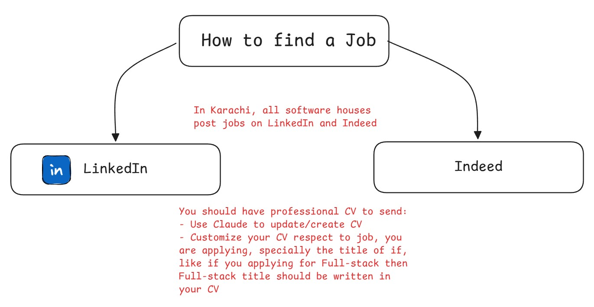
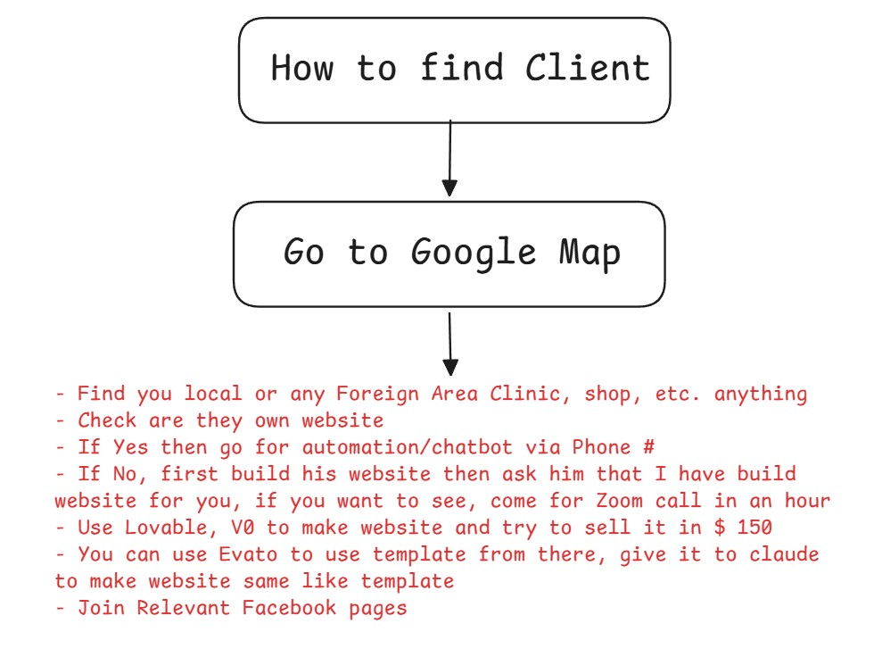

# GIAIC Quarter 5 Final Synthesis: A Strategic Roadmap from Education to Industry Leadership

---

## 1. The GIAIC 2.5-Year Retrospective: Socio-Economic Impact and Student Evolution

As a technical career strategist, I view the GIAIC initiative as a socio-economic catalyst rather than just a school. Its key KPI is how effectively it transforms absolute beginners into revenue-generating professionals, and over the last 2.5 years it has shown a strong "zero-to-one" progression. A notable example is the siblings who started with no programming knowledge and, by Quarter 3, were earning $500/month from a market-ready technical service.

The ecosystem is further strengthened by demographic diversity and peer-to-peer learning. Our cohort is balanced across generations: 50% post-2005, 30% between 2000–2005, and 20% pre-2000, blending digital-native agility with the experience of older students. This growth has been supported by the vision of the ex-governor and Syed Nihal Hashmi, who helped turn the Governor House into a hub for digital revolution.

With this foundation established, students must now pivot from academic milestones to the mechanics of high-tier wealth creation.

> **Strategic Insight:** Success in the digital economy is not about knowing the code; it is about knowing how to turn that code into a revenue-generating asset.

---

## 2. The Monetization Matrix: Jobs, Freelancing, and the Startup Paradigm

The modern digital economy demands a strategic shift from the "worker" mindset to the "entrepreneurial" mindset. While traditional employment offers stability, it is often a linear path that trades time for a fixed salary. To achieve exponential growth, one must navigate the three pillars of monetization:

- **Traditional Jobs:** Essential for foundational experience, typically requiring 8-hour daily commitments.
- **The Freelancing Boom (2017–2022):** A period where developers capitalized on the massive global demand for web and app presence. While still lucrative, it remains a service-based model.
- **The Startup Paradigm:** This is the superior route for wealth accumulation. We define a "Startup" as a venture created to develop a unique product, test a business model, and achieve rapid growth.

We look to industry benchmarks like Sir Zia's 1999/2000 Badr IT Initiative and his high-value achievement in 2017, where he closed a $1 million project. These milestones demonstrate that the highest financial rewards are reserved for those who solve complex problems at scale through unique products rather than just selling hours.

However, to move into the startup tier, one must first establish an undeniable presence in the global marketplace.

---

## 3. Digital Authority: Strategic Positioning on X (Twitter) and LinkedIn

In today's market, "Social Media Authority" is the primary engine for organic lead generation. It is the difference between hunting for projects and having projects find you. By being active on X and LinkedIn, a developer transitions from a passive learner to a recognized contributor.

The strategy is simple: document your journey and help the community. Active engagement on X—following and interacting with leaders like Amjad Masad (CEO of Replit) and Jordan Walk (Creator of React)—creates a "passive intake" funnel. As Sir Naeem's experience shows, active visibility leads to receiving high-value project offers directly without traditional bidding.

**Transitioning to Active Contributor Checklist:**

- [ ] **Optimize:** Professional headers and bios on X and LinkedIn.
- [ ] **Document:** Share one technical milestone or "aha!" moment per week.
- [ ] **Engage:** Reply to three industry leaders daily with value-additive comments.
- [ ] **Network:** Connect with fellow GIAIC peers to build a localized support web.

Professional visibility serves as the storefront; the technical curriculum provides the inventory.

---

## 4. Technical Curriculum Mastery: A Quarter-by-Quarter Strategic Review

The GIAIC curriculum follows a pedagogical logic that builds from low-level logical foundations to high-level Agentic AI.

### 4.1 Quarter 1: Logic Foundations and TypeScript

Sir Zia's decision to start with TypeScript over HTML/CSS was a strategic masterstroke designed to prioritize "logic first." Before a student learns to style a page, they must understand how a computer thinks.

- **Core Logic:** Mastery of functions, parameters, and return statements.
- **The Loop Analogy:** Loops (`for`, `while`, `for-of`, `for-in`) are best understood through the "5 AM Alarm" analogy—the process repeats until a specific condition (waking up) is met.

### 4.2 Quarter 2: React, Next.js, and the Deployment Lifecycle

The curriculum shifted to Next.js (built on React) to teach the difference between a library and a framework.

- **History & Utility:** React was created by Jordan Walk at Facebook in 2011 specifically to solve the "UI/Like button" update problem, where full page reloads were once required.
- **The "Build" Concept:** A critical technical distinction for any strategist is understanding that browsers do not understand React or Next.js code. Vercel converts this code into a "Build" (HTML/JS) that the browser can execute. This explains why senior developers might view raw "Build" code as "unclean"—it is machine-optimized, not human-optimized.
- **Industry Connection:** It is vital to note that Jordan Walk now contributes his expertise at Replit, showing the continued evolution of the industry.
- **Efficiency:** Sir Naeem's 6-hour celebrity footballer website project highlighted the power of modern deployment tools over traditional, cumbersome C-Panel methods.

### 4.3 Quarter 3: Backend Infrastructure with Python and FastAPI

Quarter 3 introduced Python and FastAPI. The industrial relevance of FastAPI cannot be overstated—it powers the backend of OpenAI, a company with 1 billion weekly active users. The introduction of FastAPI Cloud now allows for "one-click" deployments, bringing backend efficiency in line with Vercel's frontend standards.

### 4.4 Quarter 4: Agentic AI and Engineering Disciplines

This phase transitioned students into the "Agentic" era using OpenAI Agent SDK and LangGraph. We defined the four pillars of modern AI engineering:

1. **Prompt Engineering:** The instruction.
2. **Context Engineering:** The data environment.
3. **Harness Engineering:** The infrastructure.
4. **Loop Engineering:** The iterative reasoning cycle (the current frontier of AI). Graduates are encouraged to target the Y Combinator model, which offers $500,000 for 7.5% equity for AI-native startups.

### 4.5 Quarter 5: Advanced Agent Development and AI-Native Products

The final quarter focused on the "7 Pillars of Agent-Driven Development," applying AI to Shopify e-commerce and specialized agentic products. Technical proficiency here is the prerequisite for high-stakes job acquisition.

> **Consultant's Tip:** The foundational logic of Quarter 1 is the prerequisite for the Agentic AI logic of Quarter 5. You are not just learning a language; you are learning a thinking framework.

---

## 5. The "Go High Level" (GHL) Advantage: Mastering Business Automation

There is a major market shift from selling **generic AI capabilities** toward building **complete business automation systems**. [GoHighLevel](https://www.gohighlevel.com/?utm_source=chatgpt.com) is particularly relevant to this shift because it combines CRM, marketing, communication, sales pipelines, appointment booking, workflows, AI-powered conversations, and other business functions inside one platform.

Instead of simply building an AI chatbot, a GHL specialist can build an **end-to-end automated customer journey**:

**Lead enters → Lead is captured → CRM record is created → AI responds → Lead is qualified → Appointment is booked → Follow-ups are triggered → Sales team is notified → Customer receives reminders → Review request is sent → Lead/customer data is tracked.**

This changes the value proposition from:

> **"I can build you an AI chatbot."**

to:

> **"I can automate your customer acquisition and follow-up system."**

### What makes GHL powerful for automation?

GHL provides the infrastructure for building repeatable business processes through **workflows, CRM pipelines, calendars, forms, campaigns, two-way SMS/email, integrations and AI features**. Its workflow system can also connect with marketplace applications and external APIs.

For an AI/automation developer, this creates several practical opportunities:

-   **Lead-generation automation** — capture leads from websites, forms and campaigns.
-   **Instant lead response** — automatically respond through SMS, email or other connected channels.
-   **AI receptionist systems** — handle initial conversations, answer questions, qualify prospects and route them appropriately.
-   **Appointment automation** — allow prospects to schedule appointments and trigger reminders/follow-ups.
-   **Sales pipeline automation** — automatically move leads through stages based on their actions.
-   **Missed-call automation** — automatically follow up with prospects who call but do not connect.
-   **Review/reputation automation** — automate customer review-request processes.
-   **Reactivation campaigns** — identify old leads and automatically run targeted follow-up campaigns.
-   **Client onboarding** — automate forms, notifications, tasks and communication after a sale.
-   **Reporting** — track conversations, leads, appointments and other business activity.

### The real advantage: Build once, deploy repeatedly

One of GHL's strongest concepts for agencies is the **Snapshot**.

A Snapshot can capture reusable configurations such as workflows, funnels, calendars, forms, campaigns and custom fields, allowing an automation system to be replicated across multiple client accounts.

This means a developer does not necessarily need to build the same clinic automation from zero for every new clinic.

For example:

**Build once:**

> Dental Clinic AI Receptionist + Lead Qualification + Appointment Booking + Follow-up + Review Automation

Then:

**Deploy repeatedly:**

> Clinic A → Clinic B → Clinic C → Clinic D → Clinic E

This is where GHL becomes more than an automation tool. It can become a **productization platform** for an automation agency.

### The SaaS opportunity

GHL's Agency Pro plan currently includes **SaaS Mode, automated sub-account creation, advanced API access, and the ability to rebill supported services with markup**. The current listed Agency Pro price is $497/month.

This creates a different business model:

**Traditional freelancer**

> Client → One-time automation project → Payment

**GHL automation agency**

> Agency → GHL infrastructure → Multiple client sub-accounts → Monthly recurring revenue

**GHL SaaS model**

> Build automation system → Package it → Sell access to multiple businesses → Recurring revenue

GHL also now allows Snapshot creators to **sell Snapshots through its App Marketplace**, including one-time, monthly and yearly pricing models.

Therefore, a skilled developer can potentially monetize expertise in multiple ways:

1.  **Implementation fees**
2.  **Monthly automation retainers**
3.  **GHL account management**
4.  **AI receptionist services**
5.  **Workflow/template packages**
6.  **Snapshots**
7.  **SaaS subscriptions**
8.  **Usage-based services with appropriate rebilling**
9.  **Marketplace products**
10.  **Training and consulting**

### Why this matters for GIAIC graduates

For someone learning AI Agents, MCP, APIs, automation and business workflows, GHL provides a practical bridge between **technical skills and commercial outcomes**.

Instead of learning AI only as:

> LLM + Prompt + Chatbot

the learner can combine:

> **AI Agent + CRM + Workflow Automation + APIs + Communication + Business Process**

For example:

**AI Agent**

↓

**GHL CRM**

↓

**Lead Qualification**

↓

**Appointment Booking**

↓

**Automated Follow-up**

↓

**Human Handoff**

↓

**Sales Pipeline**

↓

**Customer Retention**

This is much closer to how businesses actually generate revenue.

### The "Automated Clinic Receptionist" example

Sir Naeem's automated clinic receptionist is a strong example of this model.

The important lesson is not simply that **AI answered a customer**.

The more important lesson is that the AI was connected to a **business workflow** where response speed, lead qualification, communication and appointment handling could be automated.

The reported **60-second response time** illustrates the commercial value: a prospect does not have to wait for a human receptionist to become available before receiving an initial response.

That is the difference between:

**AI as a technology**

and

**AI as a business system.**

### Strategic Scarcity

Your **0.03%** figure should be treated carefully unless you have a source for it. I would phrase it as:

> **"GHL specialization remains a relatively niche skill among developers in Pakistan, creating an opportunity for professionals who can combine GHL with AI, APIs and business automation."**

The opportunity becomes particularly interesting when targeting **US, UK and other international SMB markets**, where businesses already spend money on lead generation, CRM, appointment management, follow-up and marketing automation.

The competitive advantage is therefore not simply:

> **"I know GHL."**

It is:

> **"I can understand a business process, design the automation, connect the required systems, add AI where it creates measurable value, deploy it through GHL, and maintain the system."**

That combination of **business understanding + GHL + AI + automation + APIs** is substantially more valuable than knowing any one tool in isolation.

### The core lesson

**Don't sell the tool. Sell the outcome.**

A client does not fundamentally want:

> "A GoHighLevel setup."

They want:

> **More leads → faster response → more appointments → more conversions → less manual work → higher revenue.**

That is the real **GHL advantage**.
---

## 6. Career Optimization Masterclass: CV Writing and Volume Application

Your CV is your primary marketing document. For modern recruitment, a "Claude-optimized" CV is mandatory.

- **Formatting:** Single-page, professional white-space. Zero "poster-style" or colorful designs.
- **The Fatal Error:** Sir Naeem's HR data shows that many applicants are rejected simply because they fail to include contact details (phone/email). Ensure these are prominent.
- **The Volume Funnel:** To land a role, you must treat the search as a numbers game. Graduates must execute a 300+ applications per month strategy on Indeed. Use LinkedIn AI extensions to bypass gatekeepers and reach CEOs and HR heads directly.

    
    
<b><u>How to find jobs</u></b>

---

## 7. Outbound Acquisition: Sourcing and Prototyping for Global Clients

Top-tier earners do not "apply"; they "hunt."

- **The Google Maps Strategy:** Source US/UK/Dubai-based Dental Clinics, Real Estate Firms, and Schools. These niches have high budgets and a high need for automation.
- **The Rapid Mockup Technique:** Do not ask for the job; show the value. Use tools like `Lovable` or `V0` to build a 40-minute prototype of a modernized site or AI agent for a specific client. Presenting this finished "mockup" in a meeting is the fastest way to secure deals worth 150–500+.
- **Agency Outsourcing:** Join specialized Facebook groups where international agencies outsource their "overflow" work.

    
    
<b><u>How to find client</u></b>

---

## 8. Graduation Protocols: Schedule Reforms and Exam Integrity

The graduation phase demands peak rigor.

- **Schedule:** Starting in late August, classes will transition to twice-weekly weekend sessions (4-hour slots).
- **LMS Reforms:** The final graduation exam will be held under strict, reformative anti-cheating measures. The GIAIC certificate must remain a gold standard of actual competence.

---

This synthesis serves as your final strategic roadmap. The path from student to industry leader is now yours to execute.

**Pakistan Zindabad.**
