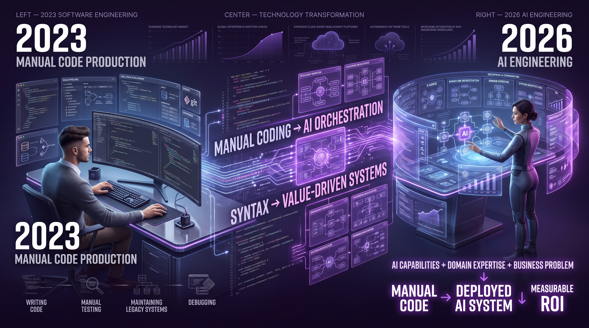
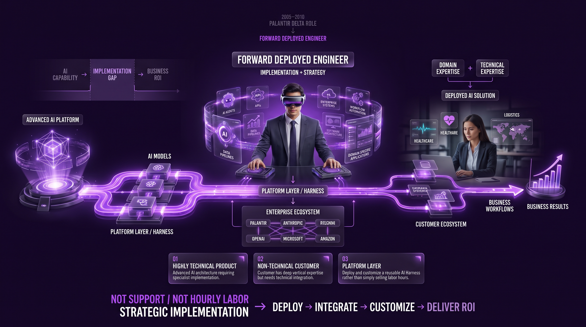
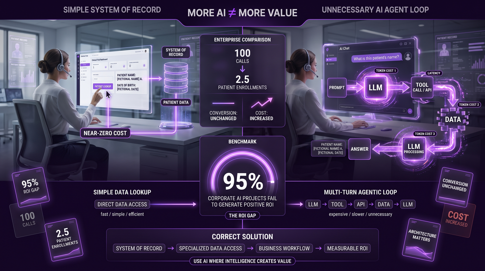
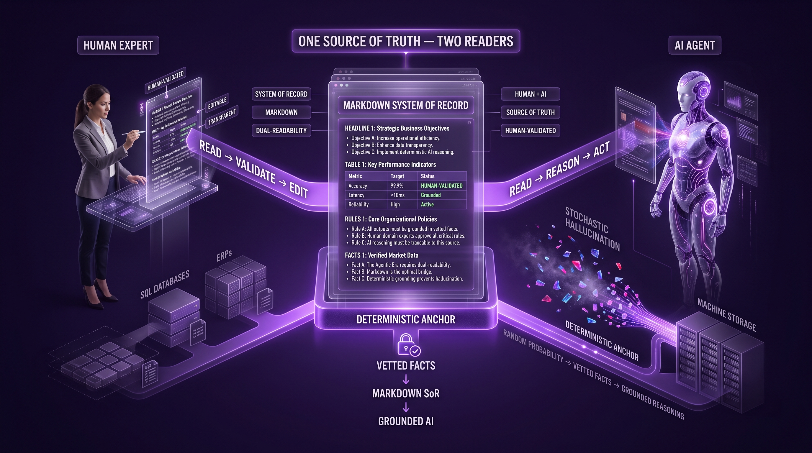
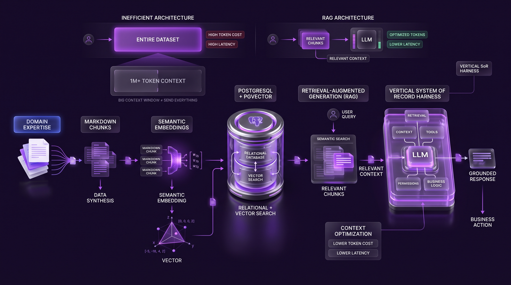
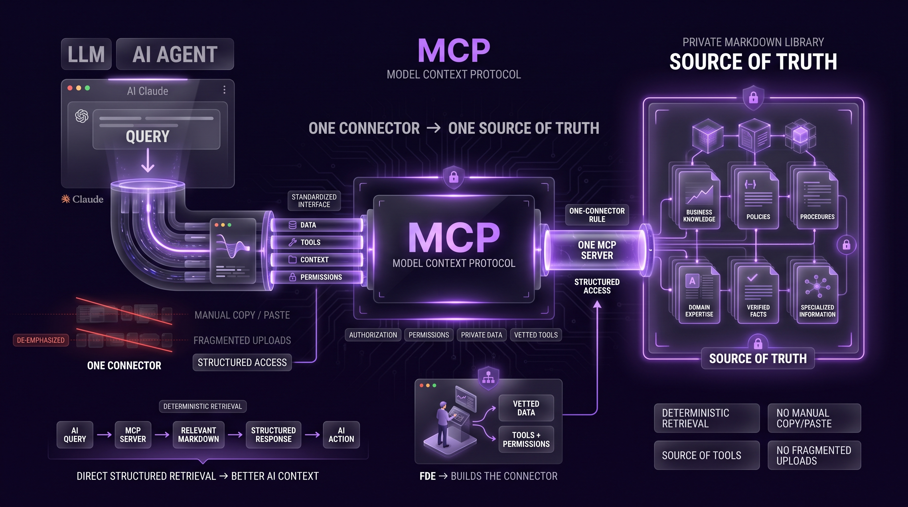
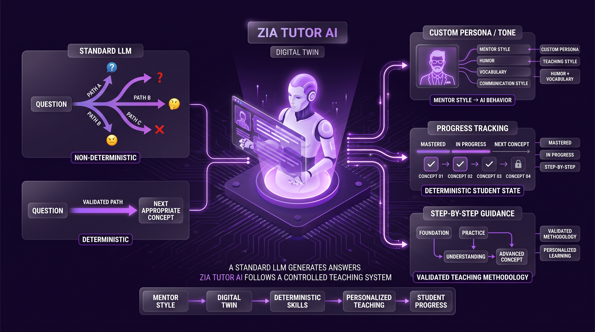
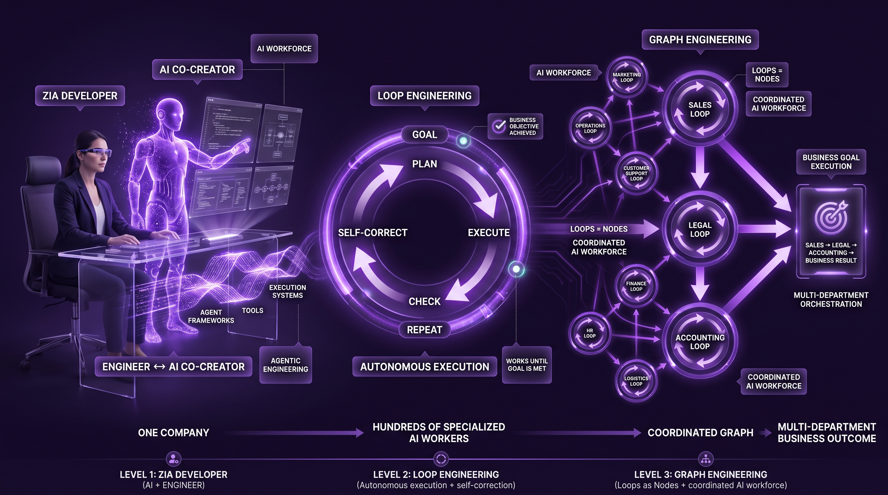
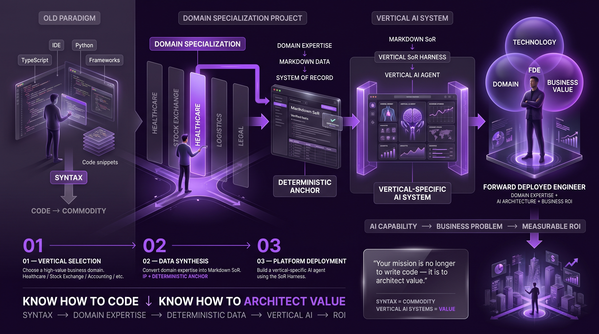
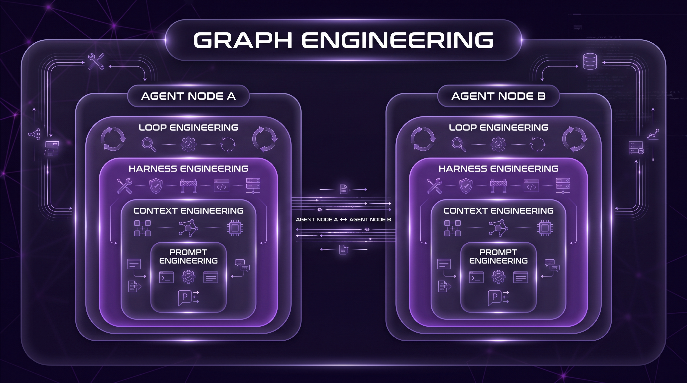

# The Future of AI Integration: From Software Development to Forward Deployed Engineering and Systems of Record

---

## 1. The Great Transition: The 2026 Tech Job Market Shift

- The traditional software engineering lifecycle is facing **forced obsolescence**.
- The global tech landscape has shifted from manual code production to strategic **AI orchestration**.
- Traditional coding skills — TypeScript, Python, basic full-stack — are now **commoditized utilities**.
- The market no longer rewards writing syntax; it rewards the ability to **architect value-driven systems**.
- **Upwork's** stock prices are under significant downward pressure as AI agents replace entry-level freelancers.
- **Microsoft** executed layoffs affecting **100,000 personnel** to pivot toward AI-centric operations.
- This marks the end of *"body shopping"* — selling human labor hours for repetitive coding tasks.

### The 2023 vs. 2026 Market Paradigm

| Feature | Traditional Developer Roles (2023) | The AI Era Specialist (2026) |
|---|---|---|
| **Primary Skill Set** | Syntax (TypeScript, Python), Frameworks | AI Implementation, Vertical Domain Expertise |
| **Code Production** | Manual / Hand-written labor | Agentic / Prompt-driven orchestration |
| **Job Security** | High (Historical scarcity) | High (Only for Forward Deployed Engineers) |
| **Market Value** | Declining (Commoditized by LLMs) | Exponentially Increasing (High-value ROI focus) |
| **Work Model** | Freelancing / Task-based "Body Shopping" | On-site Strategic Implementation |
| **Market Indicator** | High Upwork/Freelance demand | Microsoft Pivot / 100k+ AI-driven layoffs |

As cloud-based generators and AI agents democratize technical execution, the primary solution to this industry-wide disruption is the emergence of the **Forward Deployed Engineer (FDE)**.

---

    
    
<b><u>The Great Transition: The 2026 Tech Job Market Shift</u></b>

---

## 2. Defining the Forward Deployed Engineer (FDE)

The Forward Deployed Engineer is an *"implementation warrior"* tasked with operationalizing AI within a client's specific ecosystem. This is not a support role; it is a **strategic position** where highly technical specialists are embedded on the front lines with customers to ensure complex AI architectures actually yield results.

Historically, this model was pioneered by **Palantir** between 2005 and 2010. Before the title was standardized as FDE, Palantir utilized the *"Delta"* role—specialists who bridged the gap between a high-tech platform and non-technical government agencies. Today, this model is being aggressively adopted by **Anthropic, OpenAI, Microsoft, and Amazon**. These giants have realized that advanced AI is not *"plug-and-play"*; it requires a technical vanguard to deploy a **Platform Layer** rather than mere labor.

### Core Requirements of the FDE Model:

- **Highly Technical Product:** The solution is too sophisticated for standard consumer-grade implementation.
- **Non-Technical Customer:** The client possesses vertical domain expertise (e.g., healthcare, logistics) but requires a technical partner to bridge the integration gap.
- **Platform Layer Deployment:** The FDE does not sell hours; they deploy a foundational software *"Harness"* and customize it to solve specific business problems.

The FDE's existence is a direct response to the most pressing issue in corporate tech: the **AI ROI gap**.

---

    
    
<b><u>Defining the Forward Deployed Engineer (FDE)</u></b>

---

## 3. The Corporate AI ROI Gap: The Cost of Unnecessary Intelligence

Currently, **95% of corporate AI projects fail** to generate a positive Return on Investment. This is the *"ROI Gap"*—a chasm created when technical fascination supersedes business utility. Organizations are integrating AI because it is trendy, often destroying value in the process by making efficient tasks more expensive.

### Case Study: Clinical Trial Patient Recruitment

Consider a recruiter for clinical trials whose baseline performance is making 100 calls to achieve 2.5 patient enrollments.

1. **The Traditional Efficiency:** The recruiter clicks a button in a standard UI to see a patient's name and Date of Birth (DOB). The cost is near zero.
2. **The "AI-First" Value Destruction:** A firm replaces this with an AI chat interface. The recruiter now asks the AI: *"What is this patient's name?"*
3. **The Hidden Cost Spiral:** This triggers a *"multi-turn agentic loop."* The LLM receives the prompt (Token Cost 1), realizes it needs data, executes a *"tool call"* to an API (Latency), receives the data (Token Cost 2), and finally processes the response (Token Cost 3).
4. **The Strategic Failure:** The company has spent significant capital on tokens and infrastructure to achieve the same 2.5 enrollments. The cost-per-acquisition has increased while the conversion rate remains stagnant.

This *"unnecessary intelligence"* is a failure of architecture. The solution is not more AI, but better-structured data accessed through a specialized **System of Record**.

---

    
    
<b><u>The Corporate AI ROI Gap: The Cost of Unnecessary Intelligence</u></b>

---

## 4. The "System of Record" (SoR) in the Agentic Era

A **System of Record** is the foundational source of truth for an organization. While traditional SoRs (SQL databases, ERPs) were built for human queries and machine storage, the Agentic Era requires a shift toward **Dual-Readability**.

The modern AI SoR must be structured in **Markdown**. This is a strategic choice: Markdown is clean enough for a human expert to validate and edit—ensuring the data isn't a *"black box"*—while being structured enough for an AI agent to reason from. In an era where *"Stochastic Hallucination"* (random AI errors) is a major liability, the Markdown SoR acts as the **Deterministic Anchor**. It forces the AI to ground its intelligence in vetted, human-validated facts rather than random probability.

---

    
    
<b><u>The System of Record (SoR) in the Agentic Era</u></b>

---

## 5. Technical Implementation: RAG, Vector Databases, and the Harness

To turn a Markdown SoR into a functional business tool, we utilize the **Vertical System of Record Harness** framework. This infrastructure surrounds the LLM to provide it with the context it lacks. The core of this is **Retrieval-Augmented Generation (RAG)**.

### The Technical Workflow:

1. **Data Synthesis:** Domain expertise is converted into Markdown *"chunks."*
2. **Semantic Embeddings:** These chunks are transformed into mathematical vectors representing meaning.
3. **Vector Database:** We utilize **PostgreSQL with PGVector**. This is the architect's choice because it combines the structural reliability of a relational database with high-performance vector search.

This architecture solves the *"Context Window"* problem. Even with million-token windows, sending entire datasets to an LLM is a cost and latency nightmare. RAG ensures the system only sends the relevant *"chunks"* to the model, optimizing token spend and maximizing accuracy.

---

    
    
<b><u>Technical Implementation: RAG, Vector Databases, and the Harness</u></b>

---

## 6. Connectivity via Model Context Protocol (MCP)

The bridge between the LLM (like Claude AI) and the custom System of Record is the **Model Context Protocol (MCP)**. This is a standardized interface that allows AI agents to interact with private data and specialized tools securely.

Strategically, MCP enables the *"One-Connector"* Rule. By building a single MCP server to expose a vetted, private Markdown library to the AI, an FDE eliminates data fragmentation. There is no longer a need for manual copy-pasting or fragmented uploads. The AI has a direct, structured line to the organization's *"Source of Truth,"* allowing for deterministic retrieval that is significantly more efficient than a general-purpose chatbot.

---

    
    
<b><u>Connectivity via Model Context Protocol (MCP)</u></b>

---

## 7. Next-Generation Pedagogy: Zia Tutor AI and Deterministic Skills

The FDE model is revolutionizing education by replacing static textbooks with *"Digital Twin"* tutors. However, a standard LLM is non-deterministic; it can be inconsistent or provide random teaching paths.

**Zia Tutor AI** solves this by implementing **Deterministic Skills**. These are hard-coded connectors that force the AI to follow a specific pedagogical path.

- **Custom Persona/Tone:** The digital twin adopts the specific teaching style, humor, and vocabulary of a mentor (e.g., Sir Zia).
- **Progress Tracking:** The system maintains a deterministic record of student progress, ensuring the AI knows exactly what has been mastered.
- **Step-by-Step Guidance:** The tutor doesn't just provide answers; it follows a validated teaching methodology, moving to complex concepts only when the student is ready.

---

    
    
<b><u>Next-Generation Pedagogy: Zia Tutor AI and Deterministic Skills</u></b>

---

## 8. The Future of Agentic Engineering: Loops and Graphs

We are moving beyond chatbots into the era of the *"AI Worker."* This is the domain of **Agentic Engineering**, where we move from simple prompts to complex execution.

1. **Zia Developer:** The AI as a co-creator, assisting engineers in building the very frameworks that house it.
2. **Loop Engineering:** Designing continuous execution cycles where an agent works autonomously until a specific business goal is met, self-correcting along the way.
3. **Graph Engineering:** This is the highest level of AI orchestration. In this model, **Loops are Nodes**. A Graph Engineer designs a directed graph where each node is a self-correcting agentic loop (e.g., a Sales Loop feeding a Legal Loop, which feeds an Accounting Loop).

This architecture allows a single company to deploy hundreds of specialized AI workers, coordinated through a sophisticated graph that solves multi-departmental business problems at scale.

---

    
    
<b><u>The Future of Agentic Engineering: Loops and Graphs</u></b>

---

## 9. Student Action Plan: Building the Vertical Systems of Record

To survive the 2026 market, you must pivot from *"knowing how to code"* to *"knowing how to architect value."* The path to becoming an FDE is the **Domain Specialization Project**.

### The Action Plan:

1. **Vertical Selection:** Identify a high-value business domain (Healthcare, Stock Exchange, Accounting, etc.).
2. **Data Synthesis:** Convert domain expertise into a Markdown-structured System of Record. This is your intellectual property and your *"Deterministic Anchor."*
3. **Platform Deployment:** Use the Vertical System of Record Harness to build a functional, vertical-specific AI agent.

> **Strategic Insight:** The shift is absolute: Syntax is now a commodity. Success in this economy belongs to those who can build verticalized, deterministic AI systems that bridge the ROI Gap. Your mission is no longer to write code—it is to architect value.

In the 2026 market, the ability to build a vertical-specific AI system of record is the only guaranteed path to professional relevance.

---

    
    
<b><u>Student Action Plan: Building the Vertical Systems of Record</u></b>

---

    
    
<b><u>Structure of Prompt, Context, Harness, Loop and Graph Engineerings</u></b>

---

