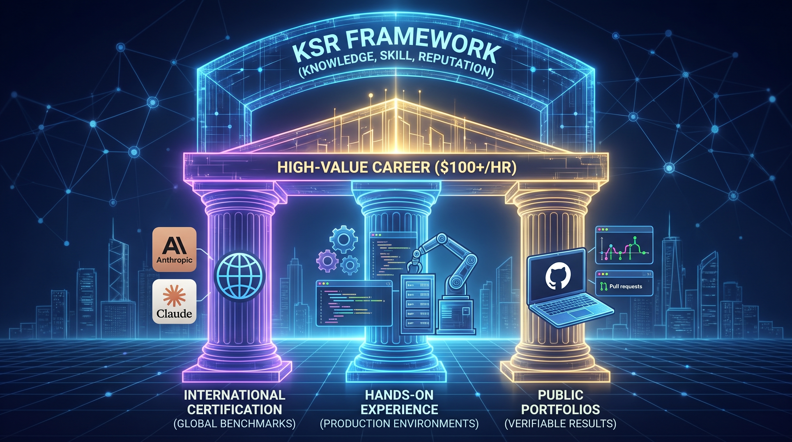
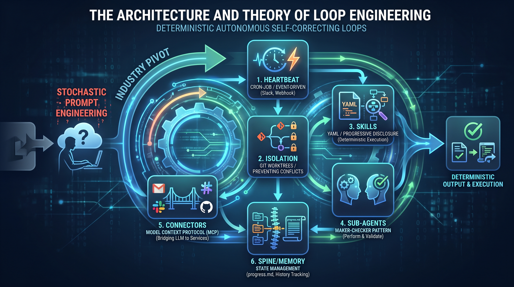
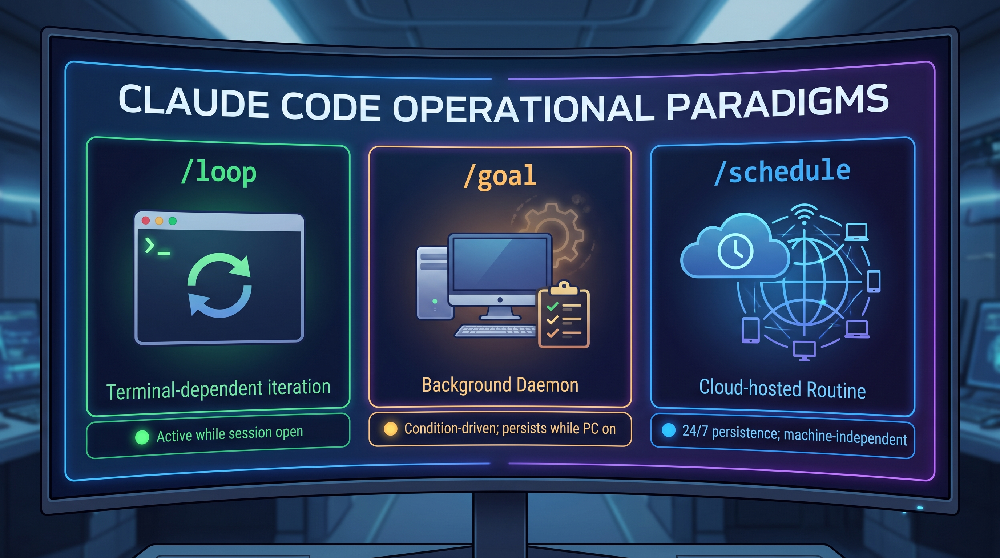

# Class02_29082026: THE FUTURE OF AGENTIC AI AND GLOBAL CAREER MASTERY

## 1. Executive Overview and the Global Career Philosophy

Traditional Pakistani academic credentials face severe devaluation in global markets. Sir Zia’s trajectory from US consultant to introducing Sun Microsystems, IBM UML, and Anthropic AI provides the blueprint for professional sovereignty.

To command $100+/hour rates, students must build careers on three pillars (KSR framework):

1. **International Certification**: Global benchmarks (Anthropic, Claude) bypassing local institutional bias
2. **Hands-on Experience**: Practical, repeatable application in production environments
3. **Public Open-Source Portfolios**: GitHub commits and PRs as verifiable "Proof of Result"

---

    
    
<b><u>Three Pillars of Professional Sovereignty (KSR Framework)</u></b>

---

Success proof: 10-11 year-old students securing MIT admissions and 20M PKR scholarships through this model.

## 2. The Anthropic AI Certification Roadmap & Implementation Pipeline

Anthropic positions as AI prestige leader approaching IPO. Claude ecosystem represents top professional opportunity. Certification structure: Associate/Fundamentals, Architecture Fundamentals, SDK/Developer, Enterprise Solutions. GIAIC focus: Exam 1 (Claude Certified Associate - Foundation) and Exam 2 (Architecture Fundamentals).

### Internal Screening & Preparatory Pipeline

GIAIC implements dedicated email server for 10,000-25,000 students. Panaverse/University domains required for proctoring—Gmail insufficient for scale and security.

| Assessment Criteria | Specification | Operational Context |
| --- | --- | --- |
| Question Bank | 1,000 Specialized Questions | Developed by Rehan and Wania for deep logic testing |
| Exam Format | 60 MCQs | Mirrors official Anthropic certification environment |
| Passing Threshold | 720/1,000 (72%) | Elite talent filter |
| Proctoring | Panaverse/Uni Domains | Strict anti-cheating via institutional email |

### Student Economics & Milestones

- **Claude Certification Fees**: $99 (Associate) + $125 (Architecture)
- **For Panaversity Exam Two-Attempt Rule**: 2 free internal attempts; 3rd+ attempts cost 3,000 PKR accountability fee
- **October 5th Deadline**: Sir Zia’s 66th birthday—mandatory completion for international certification and corporate internship transition

## 3. Corporate Training and Commercial Engagement Strategy

GIAIC enforces strict "Rate Card" policy following "Union Rule"—never sell expertise cheap. Corporate training: $5,000 per 8-hour day; max discount $1,000-$1,500 for preferred clients. Upcoming CBC engagement (Sept 5-6) led by Sir Zia, Talal, and Aneeq benchmarks student readiness—Talal’s 6-month Claude Code immersion sets industry proficiency standard.

## 4. The Architecture and Theory of Loop Engineering

Industry pivots from stochastic "Prompt Engineering" to deterministic Loop Engineering. Influenced by Boris Cherny (Claude Code) and Cognition’s Devin, this shift replaces human-to-AI chat with autonomous, self-correcting loops where AI writes prompts and executes tools.

### The Six Core Building Blocks of Loop Engineering

1. **Heartbeat**: Initiation via Cron-job (time-scheduled) or Event-driven (Slack, price flux, webhook)
2. **Isolation**: Git worktrees/branches preventing multi-agent code conflicts
3. **Skills**: YAML/Frontmatter and Progressive Disclosure for deterministic execution, optimizing token usage
4. **Sub-Agents**: "Maker-Checker" pattern—specialized agents perform, auditor agents validate
5. **Connectors**: Model Context Protocol (MCP) bridging LLM to Gmail, Slack, GitHub
6. **Spine/Memory**: State management via progress.md files and "beats" tracking agent history

---

    
    
<b><u>The Six Core Building Blocks of Loop Engineering</u></b>

---

### Claude Code Operational Paradigms

| Paradigm | Operational Context | System Status |
| --- | --- | --- |
| /loop | Terminal-dependent iteration | Active while session open |
| /goal | Background Daemon | Condition-driven; persists while PC on |
| /schedule | Cloud-hosted Routine | 24/7 persistence; machine-independent |

---

    
    
<b><u>Claude Code Operational Paradigms</u></b>

---

## 5. Practical Implementation: The Marriage Proposal Agent Case Study

Tests agent’s empathy, ethical guardrails, and deterministic logic via "Viba Kiran" Marriage Proposal Agent—handling high-stakes human sentiment and family logic within strict boundaries.

### State Machine Logic

- **Initial Outreach**: Gmail MCP integration sends polite, sincere proposal
- **Soft Rejection Handling**: Hesitation triggers empathy-based follow-ups (max 5 attempts)
- **Hard Rejection / Ethical Guardrails**: Definitive "No" halts agent immediately; faculty navigated Anthropic’s ethical filters to enable test without harassment flags
- **Timeout Safety**: 24-hour response window; no reply terminates loop

### Practical Business Adaptations

- **Automated B2B Sales**: Lead nurturing with persistent, intelligent follow-up until deal closure
- **Autonomous Trading**: Sentiment scoring, candlestick analysis, order execution, P/L management—zero human intervention

## 6. Student Governance, Study Groups, and Meritocracy

GIAIC operates on Pure Meritocracy—seniority and personal relationships secondary to verifiable technical performance.

- **Structured Study Circles**: 5-6 member groups, gender-segregated for focused environment maximizing "technical burn"
- **Merit-Based TA Model**: Only students exceeding 720/1,000 threshold eligible for faculty/TA roles
- **Closing Directive**: Students challenged to embrace technical competition, eventually replacing existing faculty through superior skill and verifiable KSR. This excellence culture ensures only highest-caliber AI Strategists emerge ready to dominate the global AI economy.
