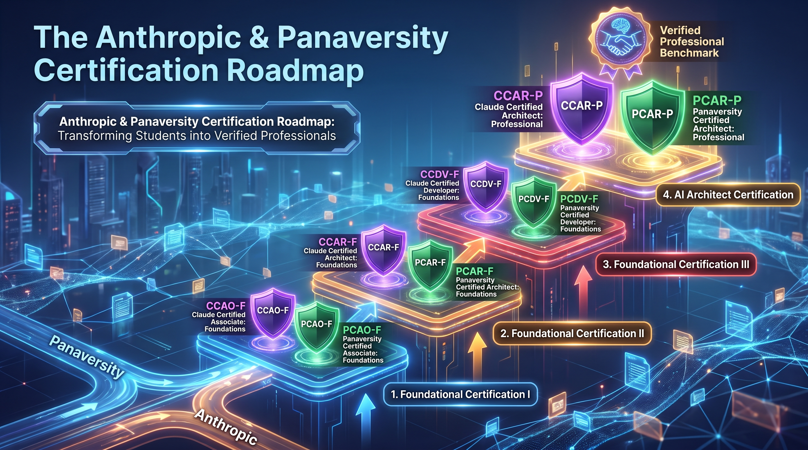
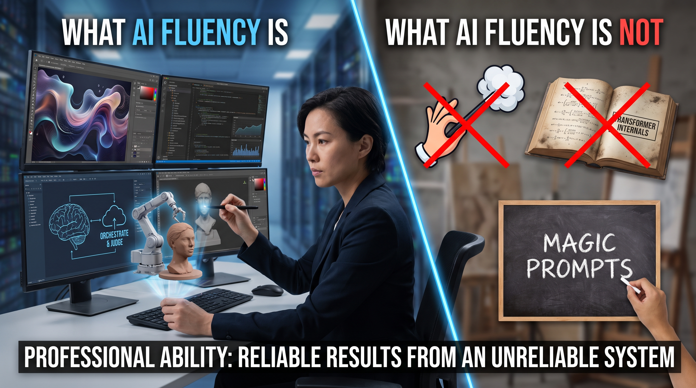
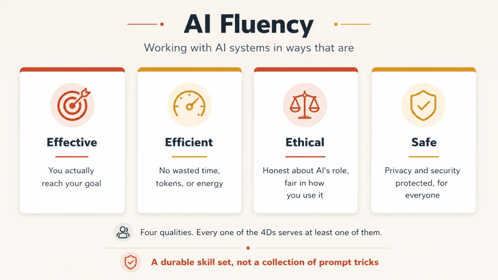
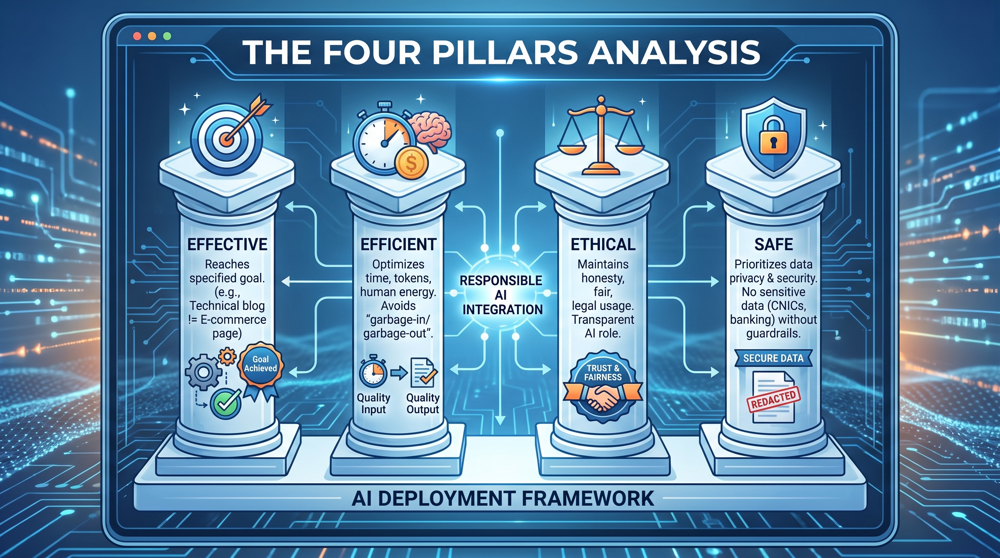
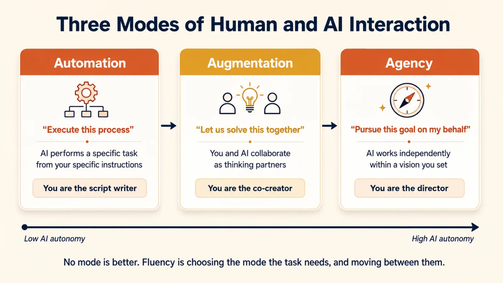
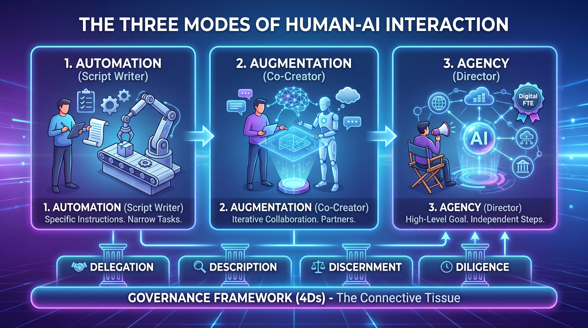
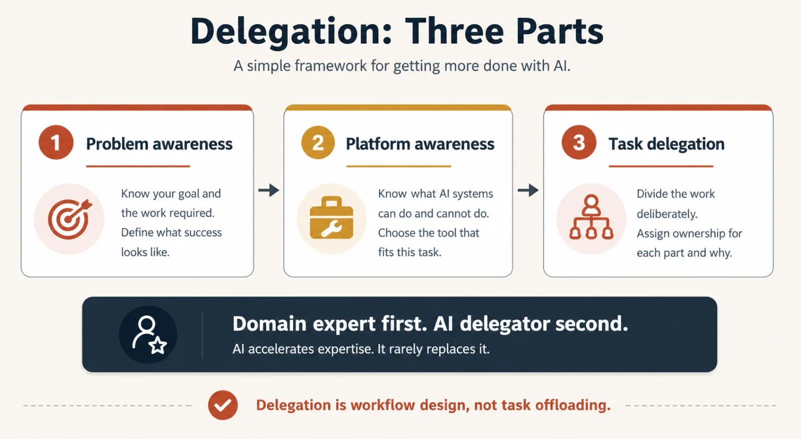
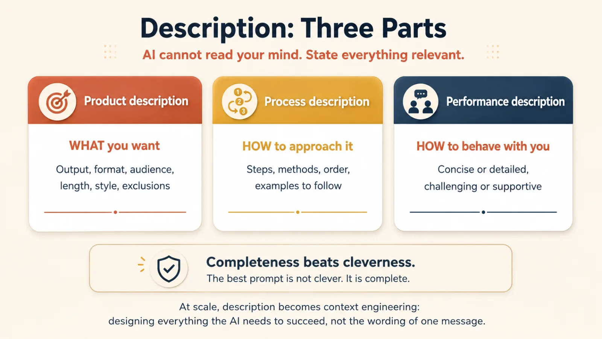
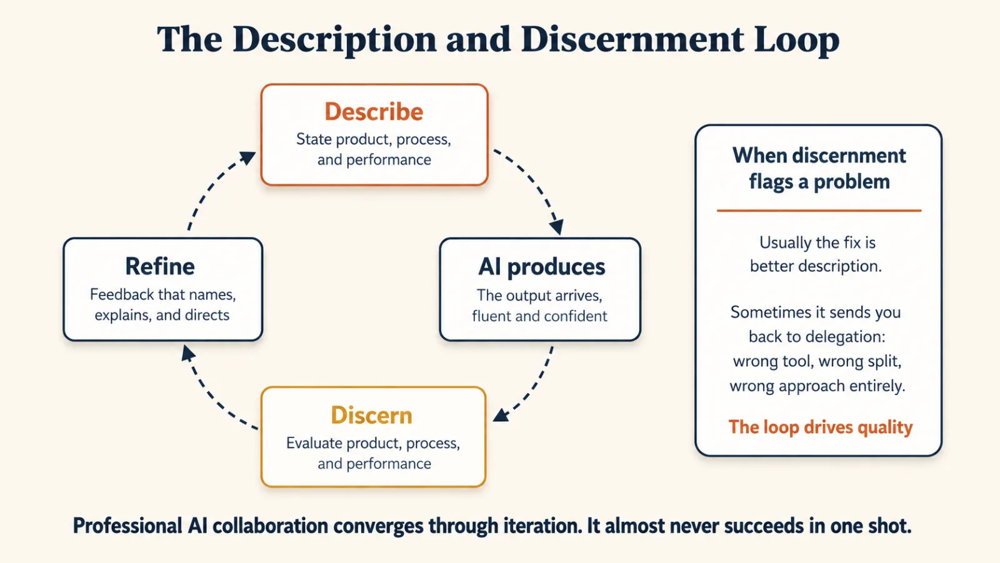
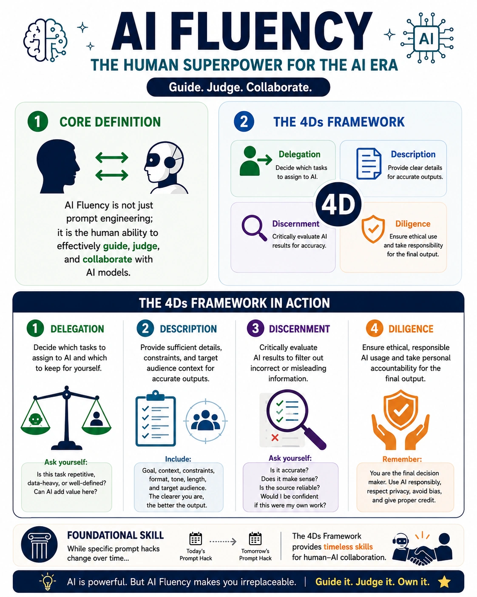

# GIAIC Session Report: The Strategic Shift to AI Fluency and Anthropic Certification

## 1. Strategic Evolution: Transitioning from Loop Engineering to Global Certification

The GIAIC program is executing a mandatory strategic pivot. We are moving beyond the experimental phase of "Loop Engineering" toward a formalized, global-standard "Anthropic Certification Roadmap." This transition is not elective; it is a requirement to align our students with international AI industry benchmarks. By adopting Anthropic’s rigorous standards, we are shifting the pedagogical focus from technical play toward the development of "Forward Deployed Engineers" capable of architecting professional-grade AI solutions.

### Pedagogical Evolution

| Feature | Legacy Focus: Loop/Prompt Engineering | Strategic Focus: Anthropic/Panaversity Certification |
| --- | --- | --- |
| Primary Goal | Technical experimentation and prompt testing. | Standardized professional proficiency and global accreditation. |
| Platform Scope | General AI tool usage. | Deep integration with the Anthropic/Claude ecosystem. |
| Validation | Informal project completion. | Tiered exams with specific scoring thresholds (720/1000). |
| Professional Identity | AI Hobbyist / Prompt Engineer. | Forward Deployed Engineer / AI Architect. |

### Market Positioning

The shift to Anthropic’s certification reflects a 99% adoption rate in high-growth technology markets like India. With a strategic outlook extending to July 2026, these certifications—specifically the CEOF and PCAR tracks—hold significantly higher professional currency than localized certificates. This infrastructure is a prerequisite for any student intending to operate as a high-value orchestrator in the global AI economy.

Connective Tissue: Mastering these certification logistics is irrelevant without first understanding the formal infrastructure of the Anthropic and Panaversity partnership.

## 2. The Anthropic & Panaversity Certification Roadmap

The partnership between Panaversity and Anthropic establishes the new benchmark for professional validation. This roadmap is designed to move students through a rigorous pipeline, transforming them from students into verified professionals.

### The Four-Tier Certification Structure

The roadmap consists of four distinct certifications designed for progressive mastery:

1. **Foundational Certification I**
    - From Claude, **`CCAO-F` Claude Certified Associate: Foundations**
    - From Panaversity, **`PCAO-F` Panaversity Certified Associate: Foundations**
2. **Foundational Certification II**
    - From Claude, **`CCAR-F` Claude Certified Architect: Foundations**
    - From Panaversity, **`PCAR-F` Panaversity Certified Architect: Foundations**
3. **Foundational Certification III**
    - From Claude, **`CCDV-F` Claude Certified Developer: Foundations**
    - From Panaversity, **`PCDV-F` Panaversity Certified Developer: Foundations**
4. **AI Architect Certification**
    - From Claude, **`CCAR-P` Claude Certified Architect: Professional**
    - From Panaversity, **`PCAR-P` Panaversity Certified Architect: Professional**

---

    
    
<b><u>The Four-Tier Certification Structure</u></b>

---

### The Internship Bridge and Exam Logistics

The path to certification contains a critical "bridge" requirement that students must adhere to:

- **Qualifying Exams**: Students must first pass two internal Panaversity exams (Foundational and Architect) to demonstrate readiness.
- **The Internship Requirement**: Passing these internal exams grants students access to an official Internship. This internship is the only mechanism through which students can obtain the verified partner email required to register for official Anthropic exams.
- **Email Mandate**: Personal Gmail/Outlook accounts are strictly prohibited for Anthropic exams. Only Panaversity partner emails are valid.
- **Attempt Rules**: Panaversity offers a "2 Free, 1 Paid" rule for internal attempts. However, the official Anthropic exams generally allow only one attempt to pass.
- **Scoring Thresholds**: All official exams are graded out of 1000, with a mandatory passing score of 720.
- **Financial Value**: While Panaversity facilitates free attempts for its students, the market value of these certifications is high (approximately $99 for CEOF and $125 for PCAR).

### Maintenance and Renewal

Certifications expire after one year. Renewal is typically managed through a free re-assessment process. However, in instances of extreme architectural shifts in AI modeling, a forced re-certification may be required to ensure skills remain current with the latest engineering paradigms.

Connective Tissue: Navigating this logistical roadmap is only possible if students master the specific technical scope defined in the Five-Module Framework.

## 3. Curriculum Architecture: The Five-Module Framework for Certified Associate

The updated curriculum utilizes a modular framework that builds from foundational literacy to the creation of autonomous agents.

### Module Breakdown

1. **[AI Fluency](https://agentfactory.panaversity.org/docs/ai-fluency-crash-course)**: A crash course in core concepts and human-AI collaboration.
2. **[Claude & ChatGPT 101](https://agentfactory.panaversity.org/docs/claude-chatgpt-101-crash-course)**: Comparative mastery of leading Large Language Models (LLMs).
3. **[Skills & Connectors](https://agentfactory.panaversity.org/docs/skills-connectors-crash-course)**: Technical methods for integrating AI with external data and tools.
4. **[General Agents on the Web](https://agentfactory.panaversity.org/docs/general-agents-web-crash-course)**: Developing collaborative AI agents for web environments.
5. **[Cowork and OpenWork on the Desktop](https://agentfactory.panaversity.org/docs/cowork-crash-course)**: Specialized content currently under development by senior faculty, including Sir Rehan and Sir Junaid, focused on the latest exam-specific updates.

**Connective Tissue:** This curriculum is designed to support the program’s core competency: the transformation of technical knowledge into deep AI Fluency.

## 4. Defining AI Fluency: The Four Pillars

AI Fluency is a **"Human Superpower"**. It is fundamentally about the quality of human decisions around the machine, rather than the mere knowledge of how the machine works.

### Definitive Boundaries

- **What AI Fluency IS**: The ability to orchestrate, guide, and judge non-deterministic AI outputs.
- **What AI Fluency IS NOT**: It is not "magic prompts," nor is it an academic understanding of transformer internals. Fluency is the professional ability to produce reliable results from an unreliable system.

---

    
    
<b><u>Definitive Boundaries</u></b>

---

### The Four Pillars Analysis

- **Effective**: Ensuring the AI reaches the specified goal. (e.g., If you need a technical blog but the AI produces an e-commerce landing page, the interaction was ineffective).
- **Efficient**: Optimizing for time, tokens, and human energy to avoid "garbage-in/garbage-out" cycles.
- **Ethical**: Maintaining honesty regarding the AI’s role and ensuring fair, legal usage.
- **Safe**: Prioritizing data privacy and security. Students must never feed sensitive data—such as CNICs or banking details—into an LLM without proper security guardrails.

---

    
    
<b><u>The Four Pillars Analysis</u></b>

---

    
    
<b><u>The Four Pillars Analysis</u></b>

---

**Connective Tissue:** Once these pillars are understood, they must be applied through the specific modes of human-AI interaction.

## 5. The Three Modes of Human-AI Interaction

We categorize the interface between humans and AI by the level of autonomy granted to the model:

1. **Automation (You are the Script Writer)**: The AI performs narrow, specific tasks based on specific instructions.
2. **Augmentation (You are Co-Creator)**: An iterative, collaborative mode where the human and AI "think together" as partners.
3. **Agency (You are the  Director)**: The most advanced mode. The human sets a high-level goal, and the AI independently determines the steps to achieve it. This is the "Digital FTE" (Full-Time Equivalent) concept.

**Connective Tissue:** Achieving "Agency" is impossible without a rigorous governance framework, specifically the 4Ds.

---

    
    
<b><u>The Three Modes of Human-AI Interaction</u></b>

---

    
    
<b><u>The Three Modes of Human-AI Interaction</u></b>

---

## 6. Methodological Framework: The 4Ds and the 10-80-10 Rule

Professional AI orchestration requires the 4Ds framework to manage the non-deterministic nature of LLMs.

### The 4Ds Deep Dive

- **Delegation**: Defining task allocation. You must decide what the human does vs. what the AI does based on Problem Awareness Platform Awareness.

    ---

    

        
        
<b><u>Delegation</u></b>

    

    ---

- **Description**: Defining the "What" (Product), "How" (Process), and "Behavior" (Performance).

    ---

    

        
        
<b><u>Description</u></b>

    

    ---

- **Discernment**: The critical act of human judgment. Because LLMs are non-deterministic (they do not always produce the same result for the same prompt) and stateless (the model itself has no memory; only the application saves history), humans must validate every output.
  - **Analogy**: Using AI without discernment is like following Google Maps blindly into a drainage ditch. You must trust the tool but verify the path with your own eyes.
- **Diligence**: Ownership and accountability. If the AI produces an error, the human is responsible for the final output.

    ---

    

        
        
<b><u>Diligence</u></b>

    

    ---

    
    
<b><u>The 4Ds Deep Dive</u></b>

---

### The 10-80-10 Execution Rule

- **10% Human Setup**: Delegation and Description.
- **80% AI Execution**: The model processes the instructions.
- **10% Human Evaluation**: Discernment and Diligence.

This creates the Description-Discernment Loop: a constant cycle of refining instructions and judging results until the goal is achieved.

Connective Tissue: This methodology serves as the operational engine for the enterprise-level "Agent Factory."

## 7. Enterprise Integration: Agent Factory and Digital FTEs

The "Agent Factory" is the strategic environment where we build Digital FTEs. Unlike hobbyist prompting, the Factory requires grounding AI in reality.

### Technical Implementation

- **Systems of Record (SOR)**: We do not let AI guess. We ground agents in verified, factual data sources (SOR) to ensure accuracy.
- **System Prompts**: We implement rigid behavioral guidelines that act as the agent’s "employment contract."
- **Governance Checkpoints**: Scaling discernment and diligence to ensure the factory produces safe, ethical outputs at high volume.

Connective Tissue: Mastering this factory approach requires moving from individual study to collaborative, professional structures.

## 8. Action Items and Operational Structure

Success in this track requires immediate adherence to the following mandate:

### Study Group Mandate

- **Composition**: Exactly 5 members per group (gender-segregated).
- **Leadership**: One designated leader must be selected to handle all faculty communications.
- **Communication**: Every group must establish a dedicated WhatsApp channel and connect to official faculty study channels.

## Final Summary

The era of hobbyist "prompt engineering" is over. We are now in the era of the AI Architect. Students must embrace the 4Ds, the 10-80-10 rule, and the modular curriculum with professional urgency. This is the only path to the Anthropic certifications—the CEOF and PCAR credentials—that will define the next generation of Forward Deployed Engineering.
