# Class 04: Blueprint for AI Fluency, Cockpit Mastery, and Career Advancement

> **Core Philosophy: 9 Concepts, 2 Cockpits, 1 Discipline**  
> The core thesis is that product interfaces, model names, and buttons constantly shift, but the underlying operational discipline remains constant across both Claude and ChatGPT.

---

## Macro Context: Evolution Toward Artificial General Intelligence (AGI)

AI is rapidly evolving from passive prompt-response interfaces to autonomous operating system agency and general problem-solving.

### IT Transition Chronology

| Phase | Timeline | Core Technical Capability |
| :--- | :--- | :--- |
| **Symbolic AI** | Pre-Nov 2022 | Deterministic, manual programming and symbolic coding. |
| **Generative AI** | Nov 2022 | ChatGPT launch; prompt engineering and text generation. |
| **Agentic AI** | 2024 | Autonomous multi-agent loops, SDKs (AutoGen, Claude Agent SDK), Odis/Mathews models. |
| **Operating System AI** | Oct 2025 | Direct system and CLI access; autonomous computer use. |
| **AGI Milestone** | Sept 4, 2026 | Launch of the Astra (Astro) model. |

- **The Astra Breakthrough:** Shifted benchmark accuracy on 100% human-verified "Golden Datasets" from the historical 33% plateau to **99.9%**.
- **Operational Definition of AGI:** The capability to perform untrained, non-simulated tasks on the spot via transfer of general intelligence.

---

    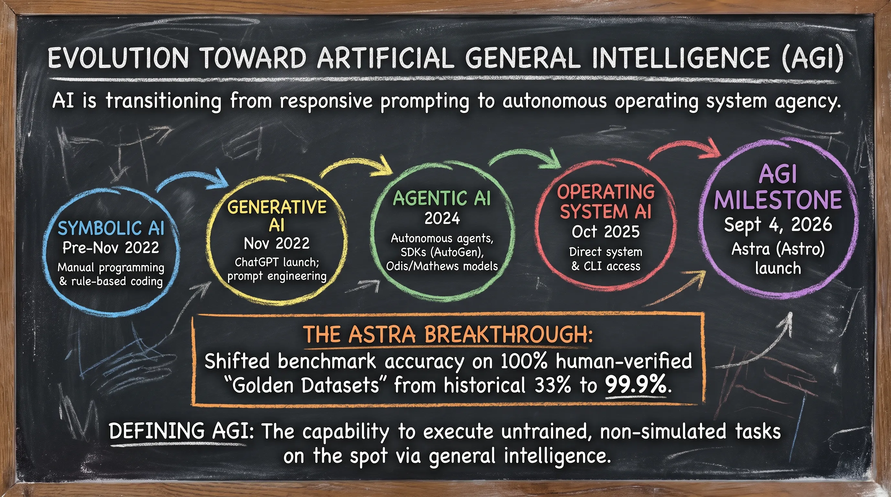
    
<b><u>Evolution Toward Artificial General Intelligence (AGI)</u></b>

---

## Part 1: The Cockpit

### 1. Two Cockpits, One Discipline

- **Shared Anatomy:** Both platforms feature chat history, message input, model/reasoning controls, attachment/tools menus, workspaces (Projects), memory/instructions, and web/research tools.
- **Platform Awareness:** Don't develop blind brand loyalty. Test the same complex tasks across both cockpits to observe differing model strengths.
- **The Colleague Habit:** Always provide 3 components before serious requests:
  1. **Set the stage:** Who you are and the target goal.
  2. **Define the task:** The exact assignment to execute.
  3. **Set the rules:** Tone, format, constraints, and negative rules.

### 2. Models & Thinking Modes (The 3-Tier Pattern)

Do not fixate on fluctuating model names. Think in three capability tiers:

- **Fast Default (Claude Haiku / ChatGPT Instant):** Fast, inexpensive; ideal for routine drafting, translation, and summaries.
- **Thinking / Extended Reasoning (Claude Thinking toggle / ChatGPT reasoning levels):** Multi-step planning, mathematical proofs, difficult debugging, architecture.
- **Heavy Flagship (Claude Opus / ChatGPT Pro):** Demanding, deep analytical work.
- **Rules of Thumb:** Start fast; escalate only when the task requires multi-step logic.

---

    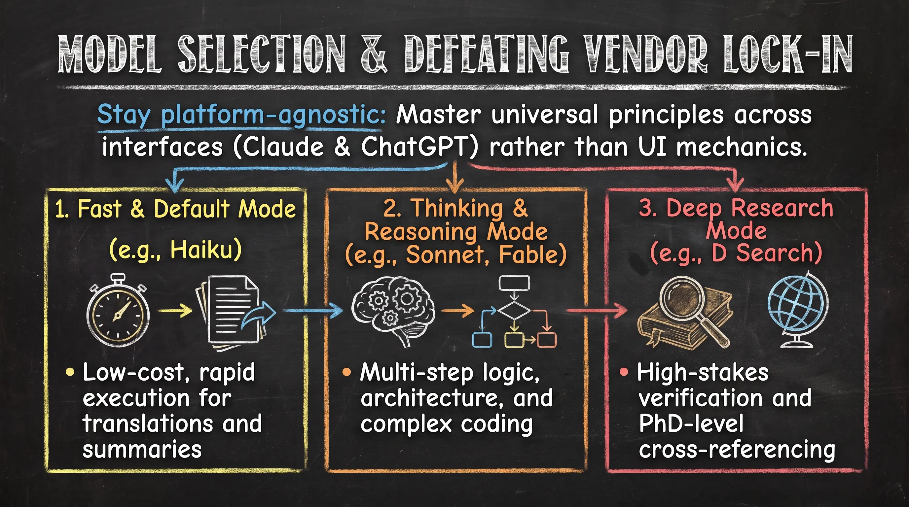
    
<b><u>Model Selection & Defeating Vendor Lock-In</u></b>

---

    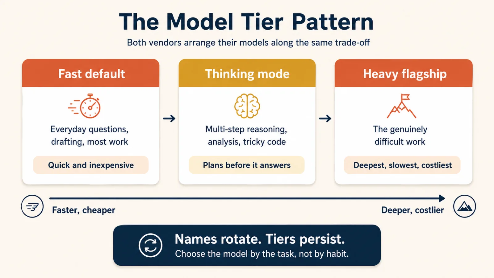
    
<b><u>The Model Tier Pattern: Names Rotate, Tiers Persist</u></b>

---

### 3. Context You Attach

- **Context Constraint:** AI outputs are constrained by the context provided (PDFs, docs, spreadsheets, code, screenshots).
- **Chat Staleness Warning:** Long threads degrade (forgetting rules, contradicting facts, drifting into generic prose).
- **The State Summary Pattern:** Before abandoning a long conversation, prompt:
  > *"Summarize what we have decided so far, what is open, and all rules set, to paste into a new chat."*

---

## Part 2: Making the Workspace Yours

### 4. Projects a Room for One Stream of Work

- **Scoped Work:** Keeps Chats, Project Knowledge (files), and Standing Instructions bundled for a single ongoing initiative (a mini System of Context).
- **Claude:** Uses automated Retrieval (RAG) when files exceed the context window (expanding capacity up to ~10x).
- **ChatGPT:** Features Project-Only Memory to isolate the project room from wider general memories.
- **Rule of Thumb:** If you have repeated background or re-uploaded a file 3 times, create a project.

---

    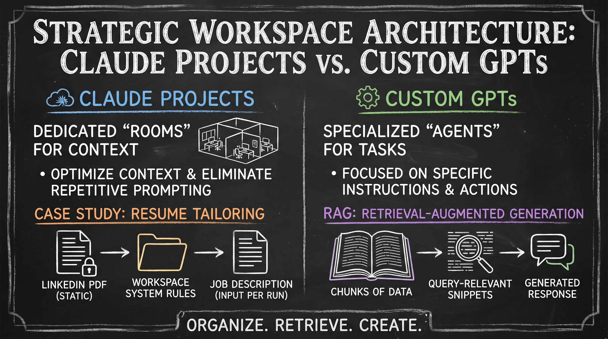
    
<b><u>Strategic Workspace Architecture: Claude Projects vs. GPT Projects (Custom GPTs)</u></b>

---

### 5. Memory and Standing Instructions (The Persistence Triad)

- **Standing Instructions:** Stable rules (role, general tone, formatting).
- **Memory:** Evolving context about you accumulated from interactions (viewable, editable, deletable; incognito/temporary chat is memory-free, not trace-free).
- **Projects:** Context strictly scoped to one project/client.
- **The Golden Rule:** *Instructions for stable rules, memory for evolving context, projects for scoped work.*
- **Caution:** Stored context fails silently when stale; schedule regular reviews.

---

    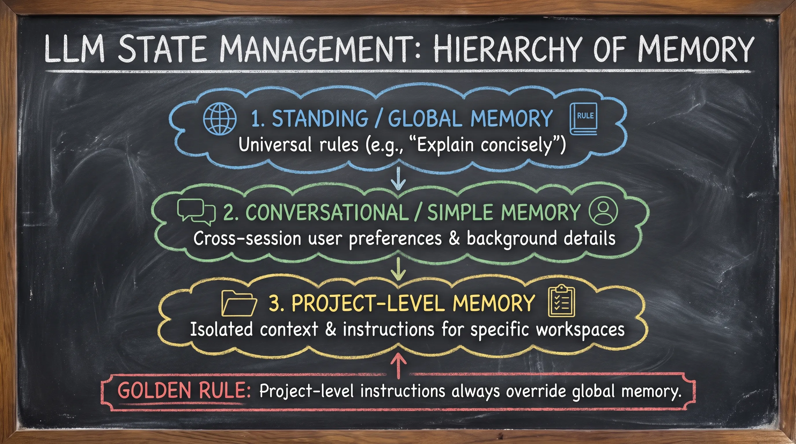
    
<b><u>LLM State Management: Hierarchy of Memory</u></b>

---

    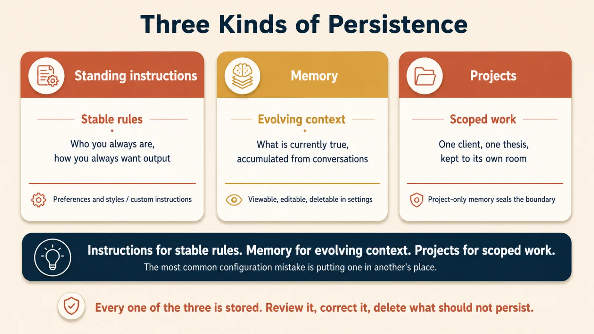
    
<b><u>The Persistence Triad</u></b>

---

    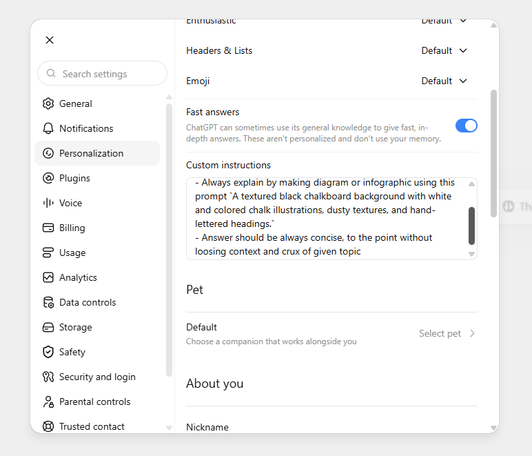
    
<b><u>Standing Instructions (Stable Rules): Setting Custom Instuction in ChatGPT</u></b>

---

    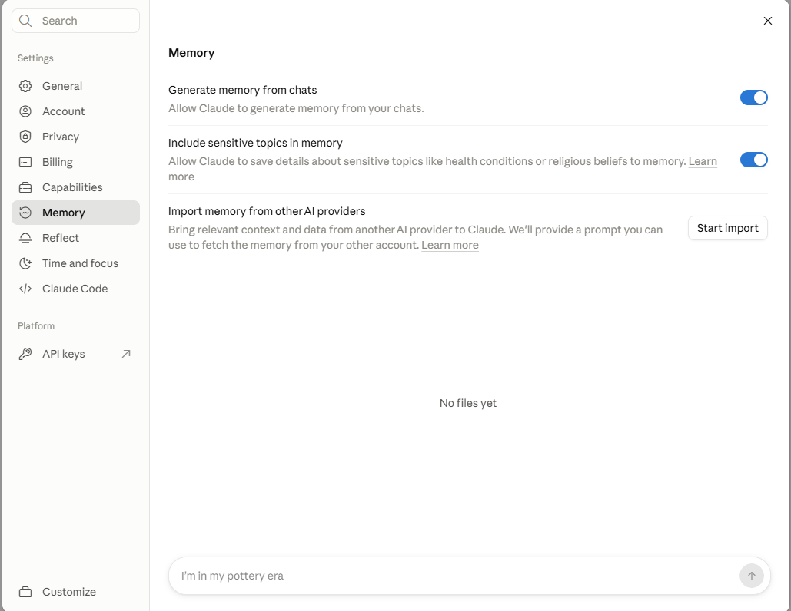
    
<b><u>Memory for evolving context in Claude.ai</u></b>

---

### 6. Artifacts & Writing Blocks: Work You Can Take Away

- **Work Containers:** Chat threads are communication media, not containers for finished deliverables.
- **Claude Artifacts:** Opens a dedicated side-by-side workspace for documents, code, interactive HTML/JS apps, and diagrams.
- **ChatGPT Writing & Code Blocks:** Inline editable regions inside the thread (replacing the retired Canvas).
- **Data Rule:** Always request structured output (tables, CSV, Excel) rather than narrative paragraphs so data can be sorted and manipulated.

---

    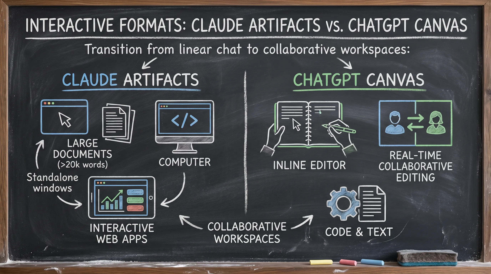
    
<b><u>Interactive Formats: Claude Artifacts vs. ChatGPT Canvas</u></b>

---

    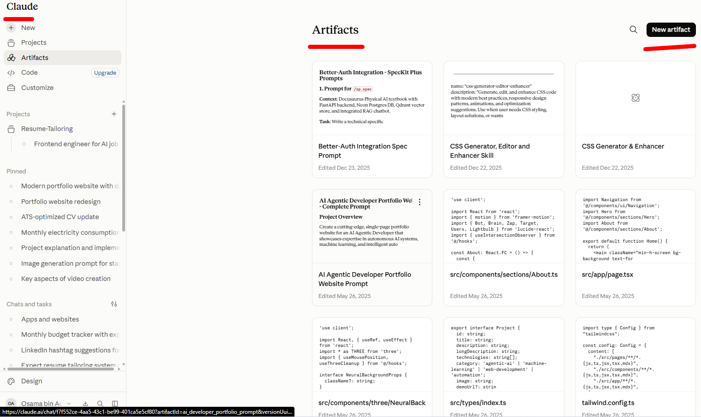
    
<b><u>Claude Artifacts</u></b>

---

### 7. Skills & Plugins: Packaged Ways of Working

- **Core Separation:** *Projects store knowledge (the WHAT); Skills perform tasks (the HOW).*
- **Agent Skills Standard (`agentskills.io`):** An open standard of Markdown directories with instructions and resources, making skills portable across platforms without server runtimes.
- **Plugins:** Bundles skills, connectors, and commands targeted at entire job functions.
- **Custom GPTs:** Separately configured standalone assistants.

---

## Part 3: Extending Reach

### 8. Connectors, Apps, and Routing the Question

- **External Reach:** Reaching external systems (email, calendar, Google Drive, databases).
- **Naming:** Claude calls them *Connectors*; ChatGPT calls them *Apps*.
- **MCP (Model Context Protocol):** The *"USB-C for AI"*—an open protocol connecting models to external tools and data sources.
- **Permission Decisions:** Before connecting, evaluate read permissions, write/action permissions, and organizational governance.
- **Routing Strategy:**
  - Quick factual lookup $\rightarrow$ **Web Search** (seconds).
  - Multi-step reasoning $\rightarrow$ **Thinking Mode**.
  - Deep investigation $\rightarrow$ **Research Mode** (multi-minute autonomous inquiry with citations).
  - Internal organizational records $\rightarrow$ **Workplace Search / Connected Apps**.

### 9. Prove It on Work You Already Know (The 5-Step Proving Loop)

Do not trust public benchmarks or slick demos.

- **The 5 Steps:**
  1. Pick a precise recurring task.
  2. Select an old, 100% human-verified golden benchmark.
  3. Have the assistant reproduce it using the raw inputs.
  4. Compare the output against known ground truth.
  5. Refine instructions until matching (or identify what must remain human-executed).
- **Accountability Rule:** Passing earns tested confidence, but *never transfers personal human accountability* (Extreme Ownership/Diligence).

---

    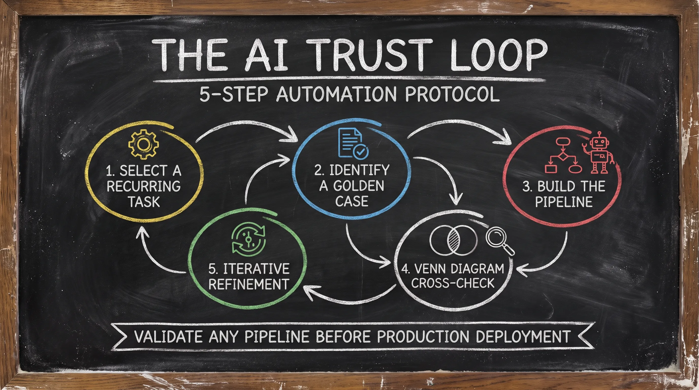
    
<b><u>The AI Trust Loop: 5-Step Automation Protocol</u></b>

---

    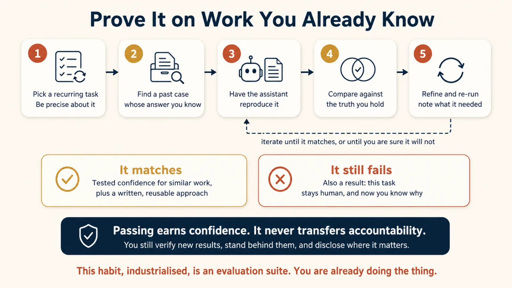
    
<b><u>Prove It on Work You Already Know</u></b>

---

## Career Strategy & The Wealth Blueprint

Escaping commodity salary dependency requires adopting an executive, AI-augmented business posture:

- **The "Dollar Taste":** Shift from low-value local hourly work to high-value global consulting ($1,000/hr advisory; managing large $70,000 corporate contracts and enduring 25-day international bank settlement cycles with professional patience).
- **The Income Mindset:**
  - Benchmark at **$10,000 USD/month** minimum for global AI orchestration work.
  - Build **5+ diversified income streams** to prevent single-employer leverage.
- **Professional Tooling Investment:** The $20/month subscription to premium AI platforms (Claude Pro, ChatGPT Plus) is not an expense—it is non-negotiable capital equipment for modern knowledge work.

---

    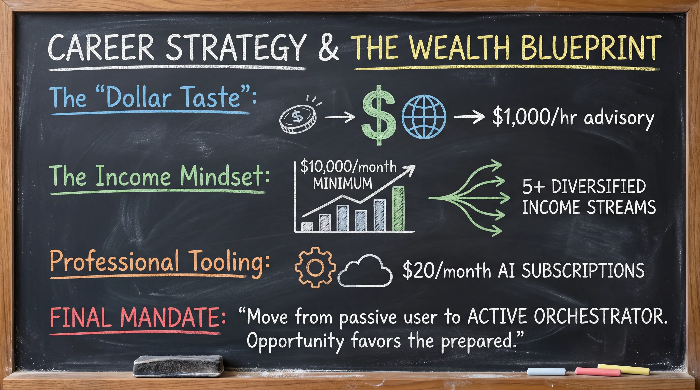
    
<b><u>Career Strategy & The Wealth Blueprint</u></b>

---

## Summary of Timeless Operational Axioms

1. **Names rotate, tiers persist:** Select model capability by task complexity, not by brand habit.
2. **Context dominates prompting:** High-quality attached context improves outputs more than clever prompt phrasing.
3. **The Persistence Triad:** Standing instructions for stable rules, memory for evolving user context, projects for scoped work.
4. **Knowledge vs. Action:** Projects store knowledge (the WHAT); skills execute tasks (the HOW).
5. **Diligence & Ownership:** AI extends reach and speed; it never relieves you of final professional responsibility.

> **Final Mandate:** *"Move from a passive user to an active orchestrator. Opportunity favors the prepared."*
