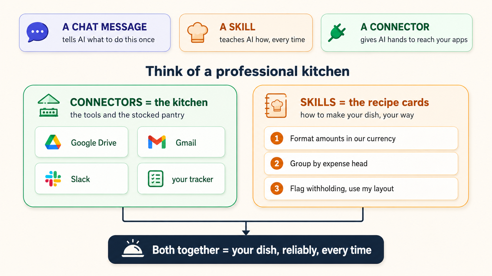
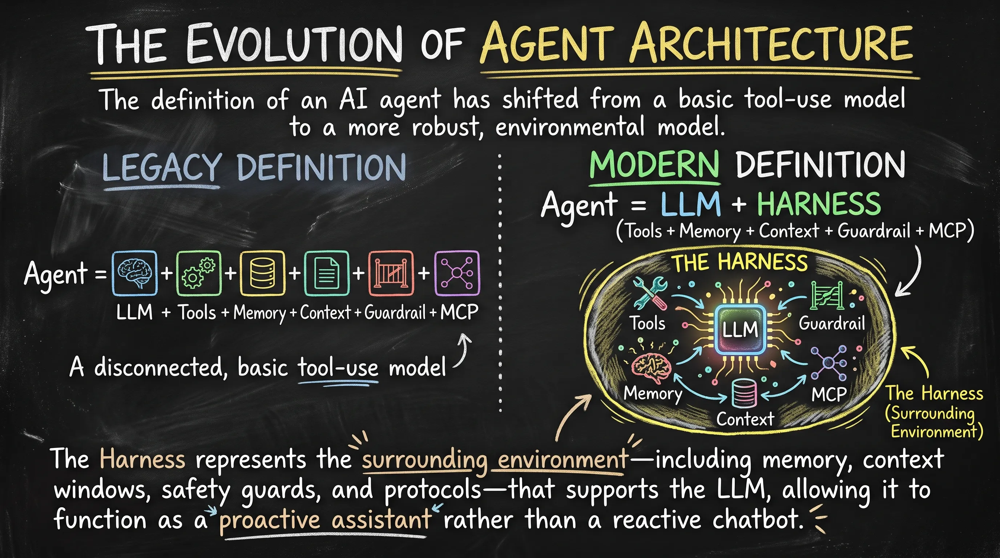
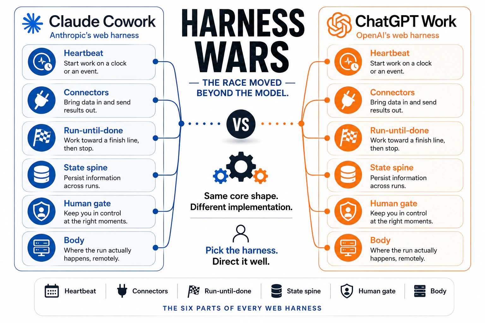
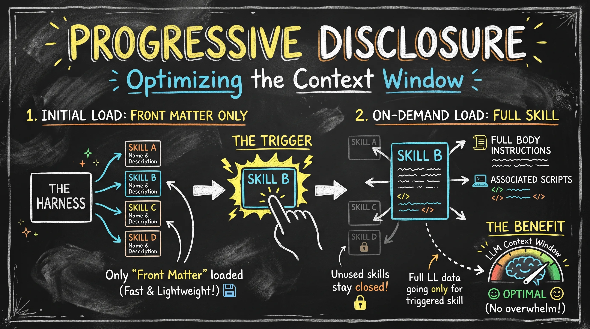
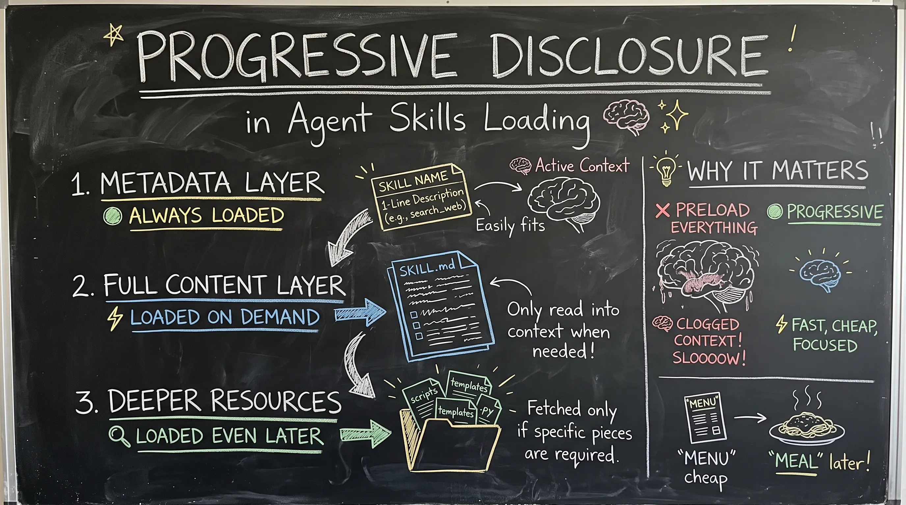
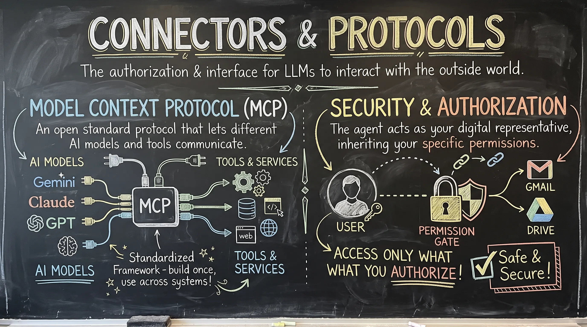
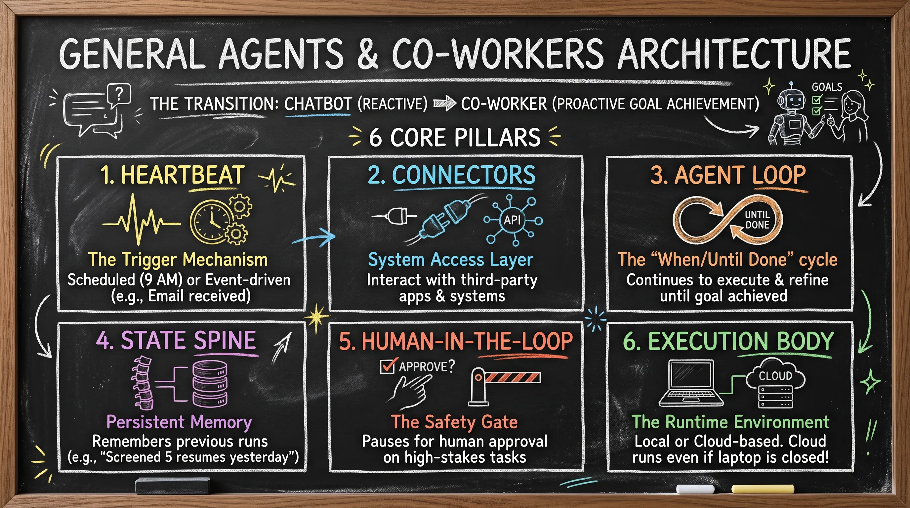

# Class 05: Engineering Skills and Connectors in AI Automation

This document provides detailed study notes on the architecture and implementation of AI automation, specifically focusing on skills, connectors, and the evolving framework of AI agents as discussed in the engineering curriculum.

## 1. Overview and Core Definitions

The modern AI automation landscape distinguishes between simple interactions and structured agentic behavior. Understanding these differences is fundamental to building reliable systems.

### Chat Messages vs. Skills vs. Connectors

* **Chat Messages:** One-off interactions or instructions provided to an LLM. While useful for simple tasks, they lack repeatability and consistency across different sessions.
* **Skills:** A packaged set of instructions (a "recipe") that tells the AI how to perform a repeatable task. Skills ensure that the AI follows a standardized process every time it is invoked.
* **Connectors:** The bridge between the AI and external systems. If a skill is the recipe, a connector is the "access to the kitchen." Connectors allow the AI to read data from or write data to third-party applications like Gmail, Trello, or Google Drive.

---

    
    
<b><u>Chat Messages vs. Skills vs. Connectors</u></b>

---

### The Evolution of Agent Architecture

The definition of an AI agent has shifted from a basic tool-use model to a more robust, environmental model:

* **Legacy Definition:** Agent = LLM + Tools + Memory + Context + Guardrail + MCP
* **Modern Definition:** Agent = LLM + Harness (Tools + Memory + Context + Guardrail + MCP).

The Harness represents the surrounding environment—including memory, context windows, safety guards, and protocols—that supports the LLM, allowing it to function as a proactive assistant rather than a reactive chatbot.

---

    
    
<b><u>The Evolution of Agent Architecture</u></b>

---

    
    
<b><u>The Harness Wars</u></b>

---

## 2. Skills in AI Automation

Skills encapsulate repeatable, complex prompt workflows. By packaging these instructions, developers eliminate the need for manual re-prompting and ensure the AI remains within a specific operational "scope."

### Scope Management

A critical factor in skill reliability is scope. Generic skills (e.g., "Social Media Management") often fail because they are too broad. High-performance skills have a narrowed scope (e.g., "Resume Screener for Senior AI Engineers"), which limits the variables and improves the quality of the output.

### Skill Directory and File Anatomy

Skills are stored in specific directory structures to be recognized by the agent harness.

| Component | Description |
| --- | --- |
| Directory Convention | Skills must be placed in a .cloud/skills or .claude/skills folder. |
| Naming Convention | Folder names must use kebab-case (e.g., resume-screener). |
| Front Matter | A triple-dash YAML header at the top of the skill.md file. It requires name and description. Optional fields include license, author, and compatibility. |
| Body | The core instructional prompts that define the step-by-step logic the AI must follow. |
| Supporting Folders | Used to prevent context clutter. Includes scripts/ (for code like Python), references/ (background context/data), and assets/ (images/logos). |

### Skill Invocation Modes

1. **Slash Commands:** Explicitly calling a skill using /skill-name.
2. **Implicit Keyword Matching:** The agent identifies keywords in a user's prompt (e.g., "Check my emails") and automatically triggers a matching skill (e.g., a Gmail screening skill).
3. **Explicit Prompt References:** Directly referencing the skill's purpose within a natural language request.

### Progressive Disclosure

To optimize the Context Window, agents utilize **"Progressive Disclosure."** The harness initially only loads the Front Matter (Name and Description) of all available skills. Only when a specific skill is triggered does the agent "on-demand" load the full body instructions and associated scripts. This prevents the LLM from being overwhelmed by irrelevant data.

---

    
    
<b><u>Progressive Disclosure</u></b>

---

**Progressive disclosure** in agent skills loading means the agent doesn't load full skill instructions upfront — it loads them in layers, only as needed:

1.  **Metadata layer (always loaded)** — just a skill's name + one-line description, kept in context so the agent knows what's available.
2.  **Full content layer (loaded on demand)** — the complete instructions/SKILL.md are only read into context when the agent decides a task actually needs that skill.
3.  **Deeper resources (loaded even later)** — scripts, templates, or reference files inside a skill are fetched only if the task requires that specific piece.

**Why it matters:** if every skill's full instructions were preloaded, the context window would fill with irrelevant content, slowing reasoning and diluting attention. Progressive disclosure keeps the "menu" cheap and defers the "meal" until it's actually ordered — matching exactly how I'm **(CLAUDE.ai)** working right now: I see short descriptions of skills, and only `view` the full SKILL.md when a task calls for it.

---

    
    
<b><u>Progressive Disclosure in Agent Skills</u></b>

---

## 3. Connectors and Protocols

Connectors provide the authorization and interface required to interact with the world outside the LLM.

* **Model Context Protocol (MCP):** An open standard protocol (introduced by Anthropic) that allows different AI models and tools to communicate using a standardized framework. This ensures that a skill built for one system can potentially work across others (e.g., Claude, GPT, or Gemini).
* **Security and Authorization:** Connectors inherit the user’s specific permissions. If an agent is connected to Gmail, it can only access the data the user has authorized. It acts as a digital representative of the user's own account.

---

    
    
<b><u>Connectors and Protocols</u></b>

---

## 4. Practical Case Studies

### Case Study 1: HR Resume Screening Automation

This workflow demonstrates the integration of connectors, skills, and scripts:

1. **Connector:** A Gmail connector monitors the inbox for emails with the subject "Job Application."
2. **Skill:** A "CV Screening Skill" is triggered. It contains instructions on what constitutes an ideal candidate (e.g., 3+ years of experience, proficiency in Python).
3. **Process:** The agent parses the attached PDF resumes.
4. **Output:** A Python script in the scripts/ folder processes the findings and generates a CSV file summarizing which candidates should be moved to the technical interview and which should be rejected.

### Case Study 2: Project Management Board Automation

This workflow automates the role of a Project Manager:

1. **Connector:** Accesses a Trello or similar project board via MCP.
2. **Input:** A project description is provided to the agent.
3. **Skill:** The agent breaks the description into specific, actionable tasks.
4. **Action:** The agent assigns these tasks to team members on the board and tracks progress (e.g., moving items from "Upcoming" to "In Progress" to "Done").

## 5. General Agents and Co-workers Architecture

The transition from a "Chatbot" to a "Co-worker" involves a shift from reactive responses to proactive goal achievement. This is supported by the Six Core Pillars of General Agent Architecture.

| Pillar | Description |
| --- | --- |
| 1. Heartbeat | The trigger mechanism. Can be `Scheduled` (run every day at 9 AM) or `Event-driven` (run whenever an email is received). |
| 2. Connectors | The system access layer that allows the agent to interact with third-party apps. |
| 3. Agent Loop | A "When/Until Done" cycle. The agent continues to execute and refine its actions until the defined goal is achieved. |
| 4. State Spine | Persistent memory. It allows the agent to remember what it did in previous runs (e.g., "I already screened 5 resumes yesterday"). |
| 5. Human-in-the-Loop | A safety gate for critical actions. The agent pauses for human approval before performing high-stakes tasks (e.g., sending a rejection email). |
| 6. Execution Body | The runtime environment. This can be Local (running on a desktop) or Cloud-based (server-side runtime). Cloud execution allows the agent to finish tasks even if the user closes their laptop. |

---

    
    
<b><u>General Agents and Co-workers Architecture</u></b>

---

## 6. Key Takeaways and Revision Points

* **Standardization:** The skill.md file is a standard format recognized across multiple agent platforms (Standardized as of December 2024).
* **Efficiency:** Progressive Disclosure is essential for managing token limits in the context window.
* **The "Harness" Concept:** An agent is only as good as its harness. Without memory (State Spine) and access (Connectors), an LLM is just a text generator, not an agent.
* **Folder Hygiene:** Always separate logic (scripts/) from instructions (skill.md) and background data (references/).
* **Kebab-case:** Ensure all skill folders follow this-naming-convention to ensure system compatibility.
