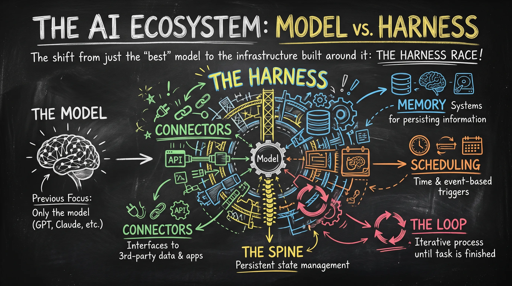
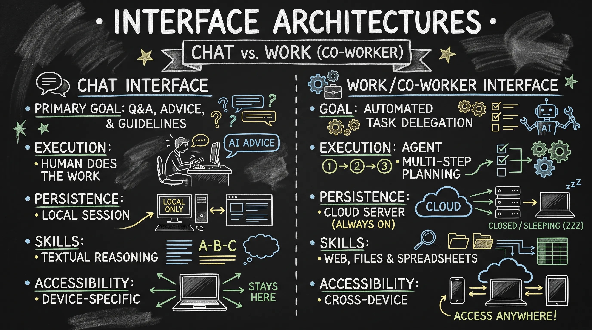
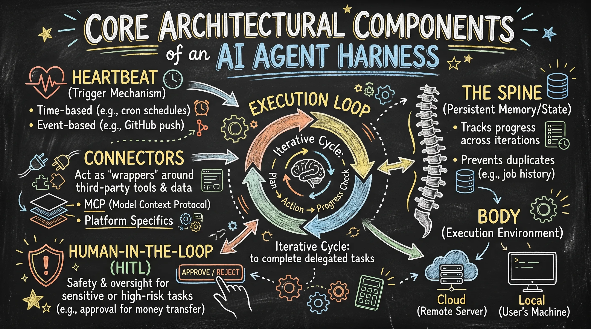
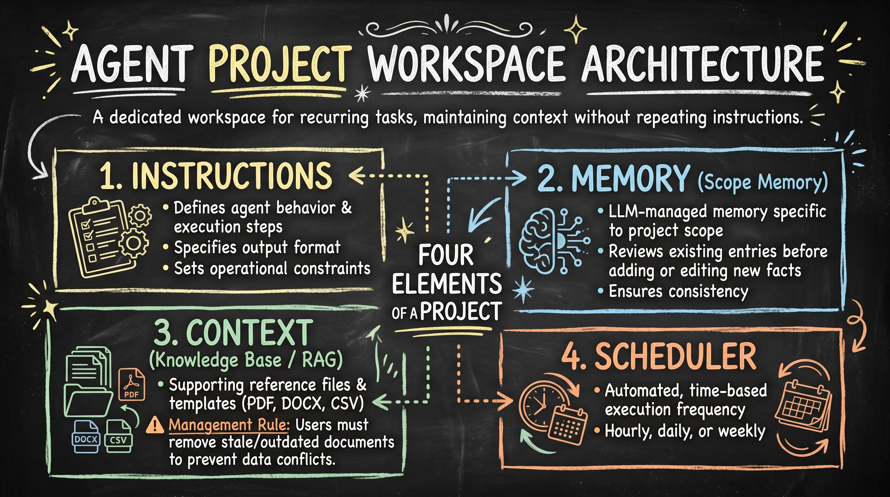
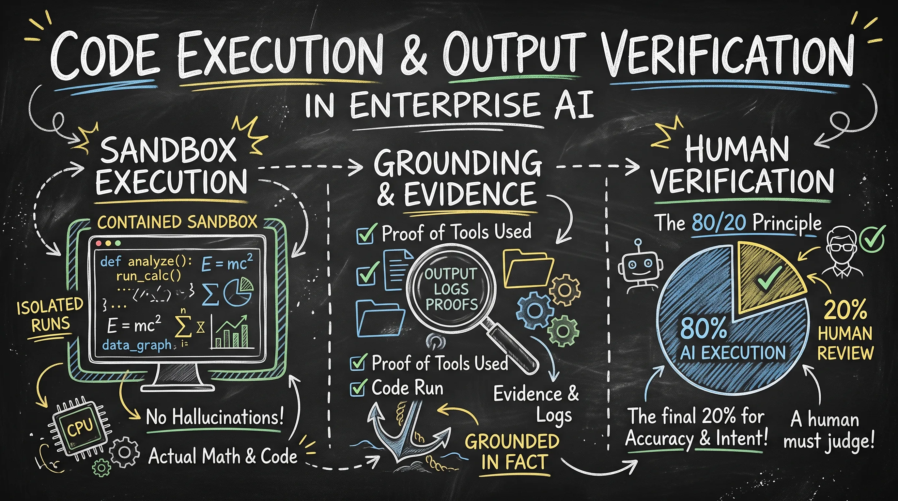
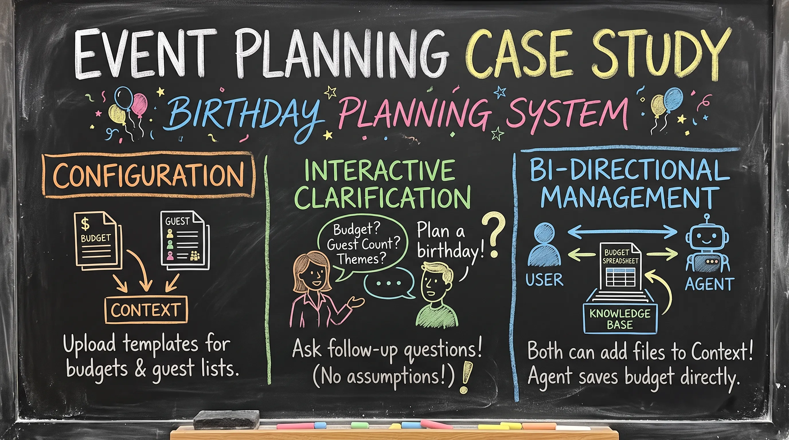
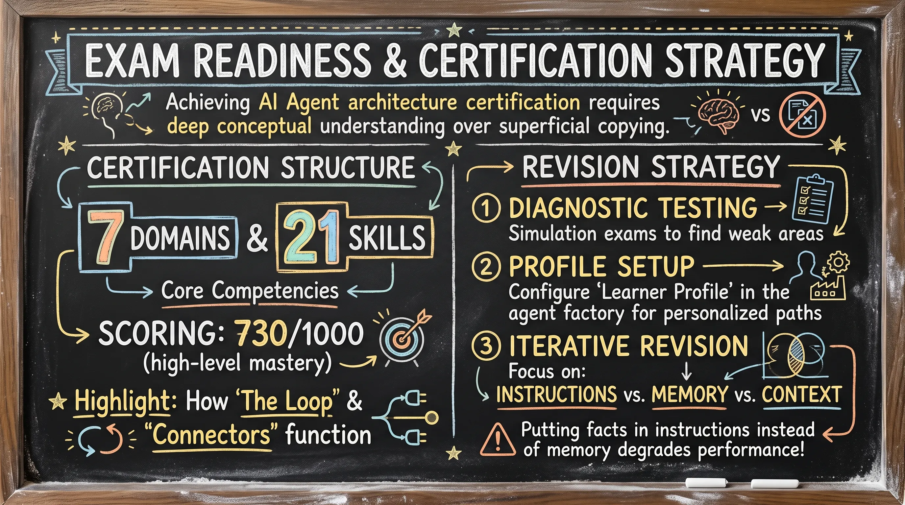

# Lesson 06: AI Agent Architecture and Ecosystem Study Guide

This document provides a comprehensive synthesis of AI agent architecture, focusing on the transition from standalone models to integrated "harness" systems, project workspace management, and the technical requirements for enterprise-grade execution and certification readiness.

---

## 1. The AI Ecosystem: Model vs. Harness

The landscape of Artificial Intelligence has shifted from a focus on individual model performance to the comprehensive ecosystem surrounding the model, known as the Harness.

### The "Harness Race"

In previous market cycles, competition focused solely on which company produced the "best" model (e.g., GPT vs. Claude). Currently, the competition has shifted to the Harness Race. A harness is defined as the entire architectural infrastructure built around an AI model to make it functional for real-world tasks.

**Key components of a Harness include:**

* **Connectors**: Interfaces to third-party data and applications.
* **Memory**: Systems for persisting information.
* **Scheduling**: The ability to trigger tasks based on time or events.
* **The Loop**: The iterative process the agent follows until a task is finished.
* **The Spine**: Persistent state management.

---

    
    
<b><u>The AI Ecosystem: Model vs. Harness</u></b>

---

## 2. Interface Architectures: Chat vs. Work (Co-worker)

Modern AI platforms are moving toward a dual-interface approach, distinguishing between casual conversation and task-oriented execution.

| Feature | Chat Interface | Work / Co-worker Interface |
| :--- | :--- | :--- |
| **Primary Goal** | Q&A, advice, and guidelines generation. | Automated task delegation and execution. |
| **Execution** | The human must execute the steps suggested by the AI. | The agent performs multi-step planning and sub-task execution. |
| **Persistence** | Session is often tied to the local browser/machine. | Tasks run on cloud servers; persists even if the laptop is closed. |
| **Skills** | Limited to textual reasoning. | Access to web search, file generation, and spreadsheet manipulation. |
| **Accessibility** | Device-specific sessions. | Cross-device persistence (access same work via mobile or desktop). |

---

    
    
<b><u>Interface Architectures: Chat vs. Work (Co-worker)</u></b>

---

## 3. Core Architectural Components of an AI Agent Harness

A functional agent harness consists of several structural layers that enable the model to interact with the world and maintain state.

### Heartbeat (Trigger Mechanism)

The "Heartbeat" is the point where a task is initiated. These triggers can be:

* **Time-based**: Cron schedules (e.g., running a job search every morning at 6:00 AM).
* **Event-based**: Triggers based on specific actions, such as pushing code to a GitHub repository.

### Connectors

Connectors act as "wrappers" around third-party tools and data.

* **MCP (Model Context Protocol)**: A standard for connectivity.
* **Platform Specifics**: While OpenAI may refer to these as "Apps" (using Function Calling), the core logic remains a connector for external utility.

### Execution Loop

The execution loop is the continuous cycle an agent enters to complete a delegated task. The agent iterates through its plan, checking progress until the desired output is achieved.

### Spine (Persistent Memory / State)

The Spine is the persistent state mechanism that tracks progress across loop iterations.

* **Example**: If an agent is searching for jobs daily, the Spine records which jobs have already been processed to avoid duplicates in the next "heartbeat" cycle.

### Human-in-the-Loop (HITL)

HITL is a critical safety component for sensitive or high-risk operations. For instance, if an agent is authorized to access a bank account, it must stop for human approval before finalizing a transaction.

### Body (Execution Environment)

The "Body" refers to the server or terminal where the work actually takes place.

* **Cloud Body**: Execution happens on a remote server (e.g., Anthropic or OpenAI servers).
* **Local Body**: Execution happens within the user’s local machine or terminal.

---

    
    
<b><u>Core Architectural Components of an AI Agent Harness</u></b>

---

## 4. Agent Project Workspace Architecture

A Project is a dedicated workspace designed for recurring tasks, allowing the agent to maintain context without the user needing to repeat instructions in every session.

### The Four Elements of a Project

1. **Instructions**: These define the agent's behavior, the specific steps for execution, the required output format, and any operational constraints.
2. **Memory (Scope Memory)**: This is LLM-managed memory specific to the project scope. The agent reviews existing memory entries before adding or editing new facts to ensure consistency.
3. **Context (Knowledge Base / RAG)**: This consists of supporting reference files (PDF, DOCX, CSV) and templates.
   * **Management Rule**: Users must remove stale or outdated documents (e.g., 2025 policies vs. 2026 policies) to prevent data conflicts.
4. **Scheduler**: This enables automated, time-based execution frequency (hourly, daily, or weekly).

---

    
    
<b><u>Agent Project Workspace Architecture</u></b>

---

## 5. Code Execution and Output Verification

In enterprise AI, simply receiving a text response is insufficient. High-stakes tasks require grounding and evidence.

* **Sandbox Execution**: Agents should run calculations and data analysis within isolated sandboxes. This ensures that mathematical results are derived from actual code execution rather than LLM "hallucination" or training data patterns.
* **Grounding and Evidence**: An output is only trustworthy if the agent can provide proof of the tools used and the code run to reach the conclusion.
* **Human Verification**: Architecture should follow an 80% AI execution / 20% human review principle. The human must judge the final 20% for accuracy and intent.

---

    
    
<b><u>Code Execution and Output Verification</u></b>

---

## 6. Practical Application: Event Planning Case Study

Using a Birthday Planning System as a scenario, the project architecture is applied as follows:

* **Configuration**: Upload templates for budgets and guest lists to the Context.
* **Interactive Clarification**: If the user provides a vague prompt (e.g., "Plan a birthday"), the agent is instructed to ask follow-up questions regarding budget, guest count, and themes rather than making assumptions.
* **Bi-directional Management**: Both the user and the agent can add files to the project context. The agent may generate a budget spreadsheet and save it directly into the project's Knowledge Base for the user to review.

---

    
    
<b><u>Practical Application: Event Planning Case Study</u></b>

---

## 7. Exam Readiness and Certification Strategy

Achieving certification in AI Agent architecture requires deep conceptual understanding rather than superficial project copying.

### Certification Structure

* **Domains**: The exam is divided into 7 Domains.
* **Skills**: There are 21 core competency skills tested.
* **Scoring**: High-level mastery (e.g., scoring 730/1000) requires a deep dive into how components like "The Loop" and "Connectors" function.

### Revision Strategy

1. **Diagnostic Testing**: Use available simulation exams to identify weak areas.
2. **Profile Setup**: Ensure the "Learner Profile" is accurately configured in the agent factory to receive personalized study paths.
3. **Iterative Revision**: Focus on the distinction between instructions, memory, and context. If a fact belongs in memory but is placed in instructions, the agent's performance will degrade.

---

    
    
<b><u>Exam Readiness and Certification Strategy</u></b>

---

### Key Takeaways / Revision Points

* **Harness vs. Model**: The model is the brain; the harness is the body and tools (Memory, Connectors, Heartbeat, Spine).
* **Chat vs. Work**: Chat is for talking; Work is for background execution on cloud servers with persistent task management.
* **Project Workspace**: Use Projects for recurring tasks to maintain a consistent Knowledge Base and Scope Memory.
* **Code Execution**: Never trust raw LLM math. Always require Sandbox Execution and evidence for numerical outputs.
* **Data Hygiene**: Regularly prune the Context (Knowledge Base) to remove outdated files and avoid conflicting instructions.
* **Human-in-the-Loop**: Mandatory for financial or sensitive "Work" sessions.
* **Heartbeat**: Understand the difference between time-triggered (Cron) and event-triggered (Git/API) activations.
