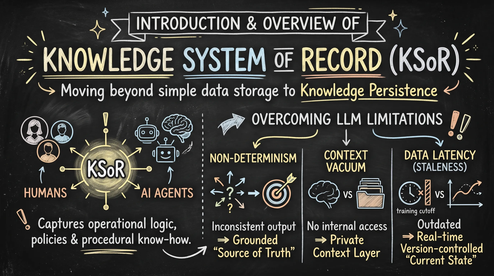
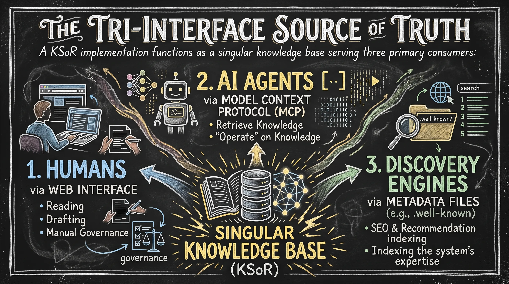
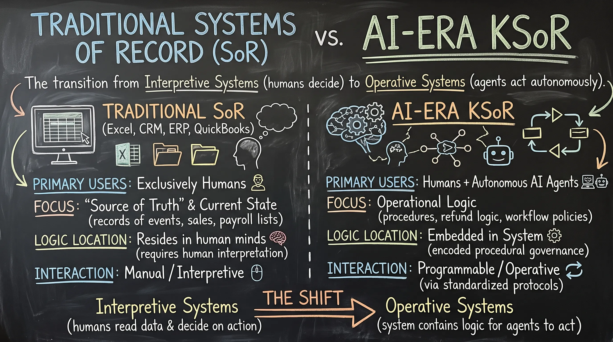
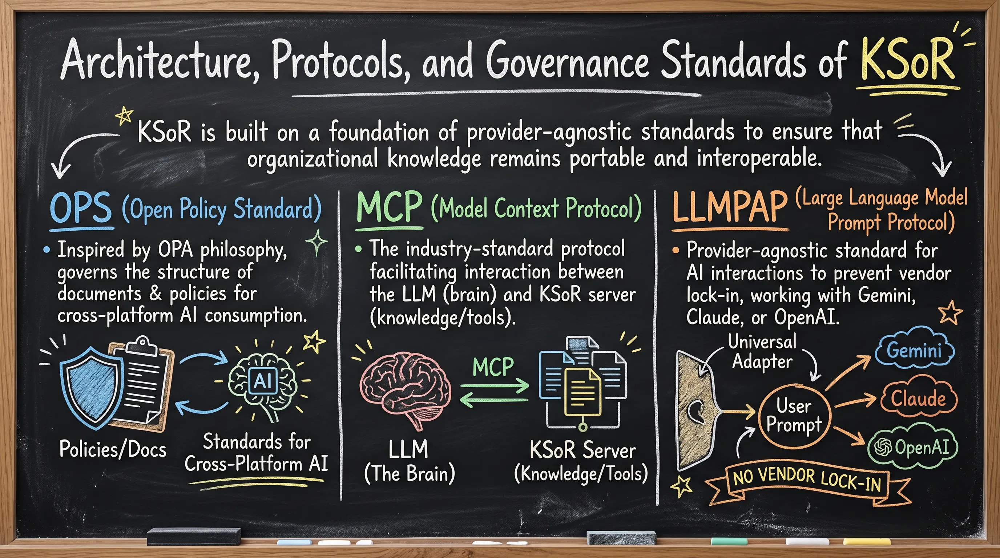
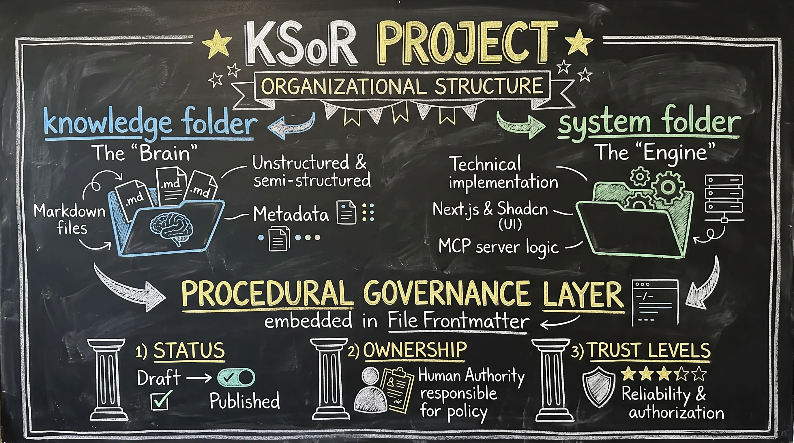
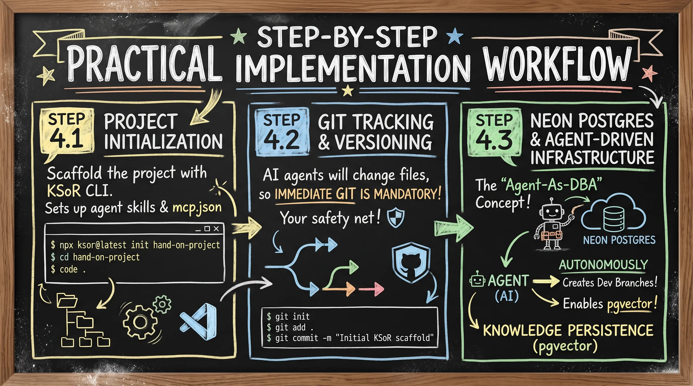
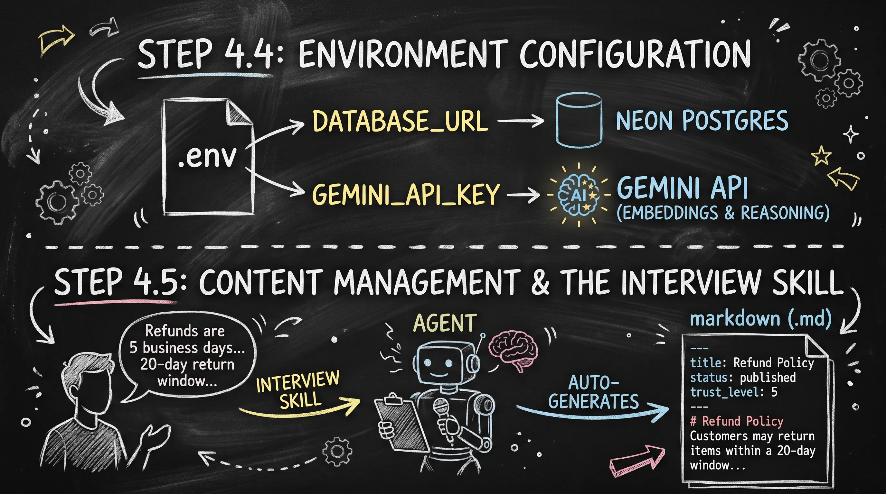
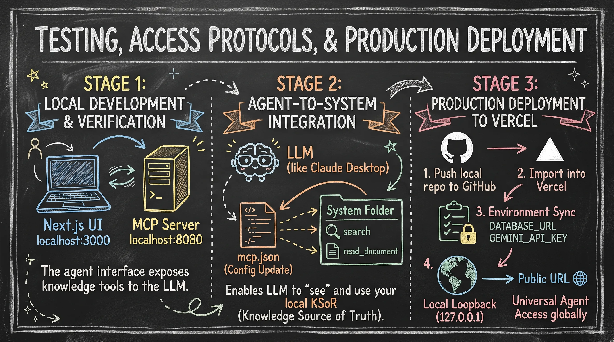
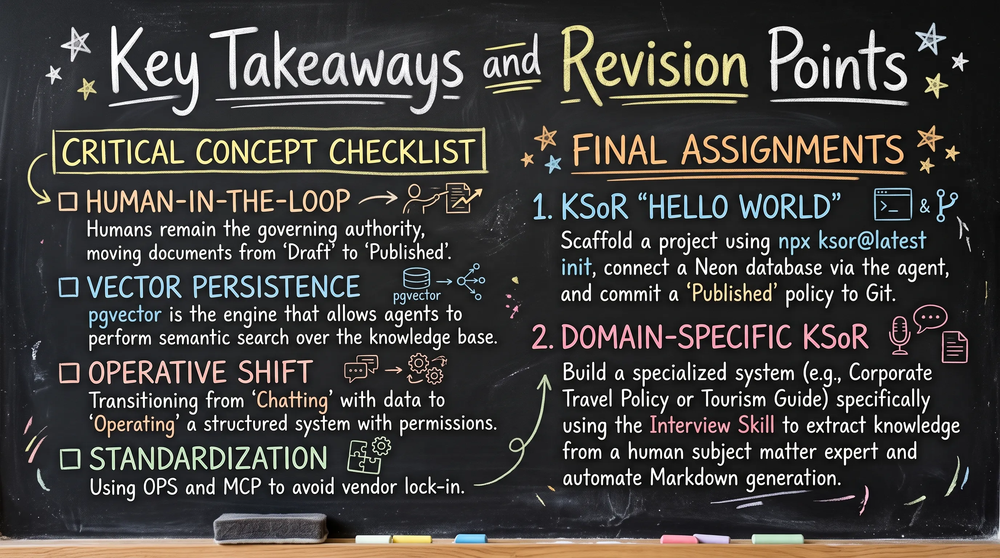

# Study Notes: KSoR (Knowledge System of Record) Framework and Implementation

## 1. Introduction & Overview of Knowledge System of Record (KSoR)

In the evolution of AI-driven architecture, we are moving beyond simple data storage toward Knowledge Persistence. A Knowledge System of Record (KSoR) is a framework designed to capture and govern the operational logic, policies, and procedural "know-how" of an organization in a format that is equally legible to humans and AI agents.

### The Core Problem: Overcoming LLM Limitations

KSoR is the architectural solution to three fundamental constraints of modern Large Language Models:

* **Non-Determinism:** Standard LLMs lack a fixed reference point, often producing inconsistent outputs. KSoR provides a grounded "Source of Truth" to ensure consistent reasoning.
* **Context Vacuum:** LLMs do not possess internal access to proprietary organizational data. KSoR bridges this gap by providing a private context layer.
* **Data Latency (Staleness):** LLMs are restricted by their training cutoff. KSoR provides real-time, version-controlled knowledge to ensure the agent operates on the "Current State" of the business.

---

<div align="center">
    
    <p><b><u>Knowledge System of Record (KSoR)</u></b></p>
</div>

---

### The Tri-Interface Source of Truth

A KSoR implementation functions as a singular knowledge base serving three primary consumers:

1. **Humans:** Accessed via a web interface for reading, drafting, and manual governance.
2. **AI Agents:** Accessed via the Model Context Protocol (MCP), allowing agents to retrieve and "operate" on knowledge.
3. **Discovery Engines:** Utilizing standardized metadata files (e.g., .well-known structures) to allow SEO and recommendation engines to index the system’s expertise.

---

<div align="center">
    
    <p><b><u>Traditional SoR vs. AI-Era KSoR</u></b></p>
</div>

---

## 2. Traditional Systems of Record (SoR) vs. AI-Era KSoR

The shift from Traditional SoR to KSoR represents a transition from Interpretive Systems (where humans read data and decide on action) to Operative Systems (where the system contains the logic for agents to act autonomously).

> Traditional System of Records includes Excel, Quickbook, Salesforce, ERPs, CRMs etc.

| Feature | Traditional SoR (Excel, CRM, ERP) | New AI-Era SoR (KSoR) |
| :--- | :--- | :--- |
| Primary Users | Exclusively Humans | Humans + Autonomous AI Agents |
| Focus | `Source of Truth` and `Current State of Business`: Records of events (e.g., sales figures, payroll lists). | Operational Logic: Records of procedures (e.g., refund logic, workflow policies). |
| Logic Location | Resides in human minds; data requires human interpretation. | Embedded in the system; agents follow encoded procedural governance. |
| Interaction | Manual/Interpretive | Programmable/Operative via standardized protocols. |

---

<div align="center">
    
    <p><b><u>Traditional Systems of Record (SoR) vs. AI-Era KSoR</u></b></p>
</div>

---

## 3. Architecture, Protocols, and Governance Standards of KSoR

`KSoR` is built on a foundation of provider-agnostic standards to ensure that organizational knowledge remains portable and interoperable.

* **OPS (Open Policy Standard):** Inspired by the Open Policy Agent (OPA) philosophy, this governs the structure of documents and policies, ensuring they are formatted for cross-platform AI consumption.
* **MCP (Model Context Protocol):** The industry-standard protocol that facilitates the interaction between the LLM (the "brain") and the KSoR server (the "knowledge/tools").
* **LLM.txt (Large Language Model .txt):** A provider-agnostic standard for AI interactions, specifically designed to prevent vendor lock-in, allowing the KSoR to work seamlessly with Gemini, Claude, or OpenAI.
* **OKF (Open Knowledge Format):** The Open Knowledge Format (OKF) is a standard way to organize data and documents using simple Markdown files and YAML tags so AI agents can read and navigate them easily, developed by Google in mid 2026.

    - **Core Structure of an OKF Bundle**
        An OKF bundle is a folder of text files that usually contains: 
        - **`index.md`**: A master list that introduces the bundle and helps agents read information step-by-step.
        - **`log.md`**: A history file tracking recent updates or changes.
        - **Concept Files (`.md`)**: Individual Markdown files covering specific topics, table schemas, or business rules.
        - **YAML Frontmatter**: A small header at the top of each file with tags, titles, timestamps, and author details
    
    - **Real-World OKF Examples**
        - **Database and Sales Schema Example**: This example shows how an OKF file documents a database table (like customer orders) and includes SQL query examples for AI agents to use:

    ``` md

    ---
    type: table
    title: Sales Orders
    description: Records of customer purchases
    tags: [sales, orders, revenue]
    timestamp: 2026-06-21T00:00:00Z
    ---

    # Schema | Column | Type | Description

    | `order_id` | STRING | Globally unique order identifier |
    | `customer_id` | STRING | Foreign key to customers table |
    | `total_usd` | NUMERIC | Order total in US dollars |

    # Example Query

    sql query:
        SELECT customer_id, SUM(total_usd) AS lifetime_value 
        FROM sales.orders 
        GROUP BY customer_id 
        ORDER BY lifetime_value DESC 
        LIMIT 100;

    ```

---

<div align="center">
    
    <p><b><u>KSoR Architecture</u></b></p>
</div>

---

### Organizational Structure

A KSoR project is architecturally divided into two core directories:

* **knowledge folder:** The "Brain." Contains unstructured or semi-structured Markdown files and metadata.
* **system folder:** The "Engine." Contains the technical implementation, typically built using Next.js + Fumadocs (React library) and Shadcn for the UI, along with the logic for the MCP server.

### Procedural Governance Layer

Knowledge reliability is managed through a governance layer embedded in file Frontmatter. This allows the system to track:

* **Status:** (e.g., Draft vs. Published) to ensure only vetted information is used by agents.
* **Ownership:** Identifying the human authority responsible for the specific policy.
* **Trust Levels:** Quantifying the reliability and authorization level of the content.

---

<div align="center">
    
    <p><b><u>Organizational Structure of KSoR</u></b></p>
</div>

---

## 4. Step-by-Step Practical Implementation Workflow

### Step 4.1: Project Initialization

To begin, use the KSoR CLI to scaffold the project structure. This initializes the agent skills and the mcp.json configuration.

```bash
npx ksor@latest init hand-on-project
cd hand-on-project
code .
```

### Step 4.2: Git Tracking and Versioning

As AI agents possess the capability to modify the codebase, immediate Git initialization is mandatory. This provides a safety net to review, audit, and revert agent-driven changes.

```bash
git init
git add .
git commit -m "Initial KSoR scaffold"
```

### Step 4.3: Neon Postgres & Agent-Driven Infrastructure

KSoR leverages Neon Postgres with the pgvector extension for Knowledge Persistence.

* **The "Agent-as-DBA" Concept:** By connecting the Neon MCP server, the AI agent can autonomously create database branches (e.g., a dev branch) and enable technical extensions like pgvector without requiring the human to use a web dashboard.
* This creates a seamless pipeline where the agent manages the infrastructure required to store its own embeddings.

---

<div align="center">
    
    <p><b><u>Step-by-Step Practical Implementation of KSoR Workflow</u></b></p>
</div>

---

### Step 4.4: Environment Configuration

Define the operational parameters in the .env file:

* **DATABASE_URL:** The connection string for your Neon Postgres branch.
* **GEMINI_API_KEY:** Utilized for generating vector embeddings and powering the agent's reasoning.

### Step 4.5: Content Management & The Interview Skill

Knowledge is primarily stored in Markdown. However, the bridge between human tacit knowledge and the KSoR is the "Interview" Skill.

* Instead of writing documentation manually, the agent interviews the human to extract specific details.
* **Example (Refund Policy):** The agent extracts specific logic—such as a 20-day return window and a 5-day refund processing time—and automatically generates a governed Markdown file.

Frontmatter Specification Example:

```markdown
---
title: Refund Policy
status: published
author: Senior Architect
trust_level: 5
last_reviewed: 2023-10-27
---
# Refund Policy
Customers may return items within a **20-day window**. 
Refunds will be processed within **5 business days**.
```

---

<div align="center">
    
    <p><b><u>Step-by-Step Practical Implementation of KSoR Workflow</u></b></p>
</div>

---

## 5. Testing, Access Protocols, and Production Deployment

### Stage 1: Local Development & Verification

* **Human Interface:** The Next.js UI is accessible at localhost:3000.
* **MCP Server:** The agent interface typically runs on localhost:8080, exposing the knowledge tools to the LLM.

### Stage 2: Agent-to-System Integration

To enable an LLM (like Claude Desktop) to utilize your KSoR locally, the mcp.json configuration must be updated to point to the local server. This allows the LLM to "see" the tools (e.g., search, read_document) defined in your system folder.

### Stage 3: Production Deployment to Vercel

1. **Repository Sync:** Push the local repository to GitHub.
2. **Vercel Deployment:** Import the repository into Vercel.
3. **Environment Sync:** Manually input DATABASE_URL and GEMINI_API_KEY into the Vercel Dashboard.
4. **Public Accessibility:** Deployment shifts the KSoR from a local loopback (127.0.0.1) to a public URL. This is essential for universal agent access, allowing external AI systems to interact with your "Source of Truth" globally.

---

<div align="center">
    
    <p><b><u>Test, Access Protocols, and Production Deployment of KSoR</u></b></p>
</div>

---

## 6. Key Takeaways and Revision Points

### Critical Concept Checklist

* **[ ] Human-in-the-Loop:** Humans remain the governing authority, moving documents from "Draft" to "Published."
* **[ ] Vector Persistence:** pgvector is the engine that allows agents to perform semantic search over the knowledge base.
* **[ ] Operative Shift:** Transitioning from "Chatting" with data to "Operating" a structured system with permissions.
* **[ ] Standardization:** Using OPS and MCP to avoid vendor lock-in.

### Final Assignments

1. **KSoR "Hello World":** Scaffold a project using `npx ksor@latest init`, connect a Neon database via the agent, and commit a "Published" policy to Git.
2. **Domain-Specific KSoR:** Build a specialized system (e.g., Corporate Travel Policy or a Tourism Guide) specifically using the Interview Skill to extract the knowledge from a human subject matter expert and automate the Markdown generation.

---

<div align="center">
    
    <p><b><u>Key Takeaways and Revision Points</u></b></p>
</div>

---