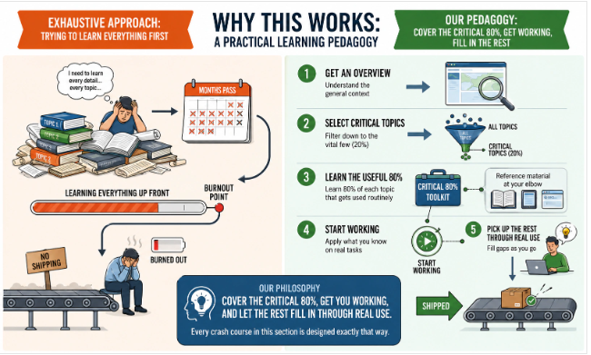
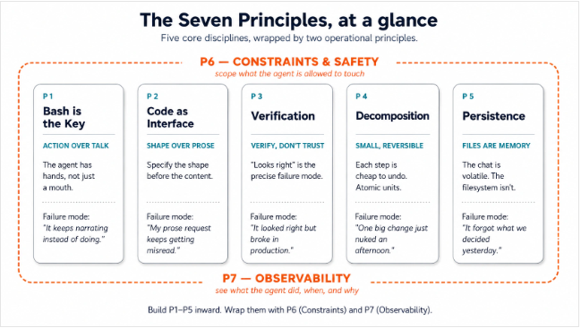
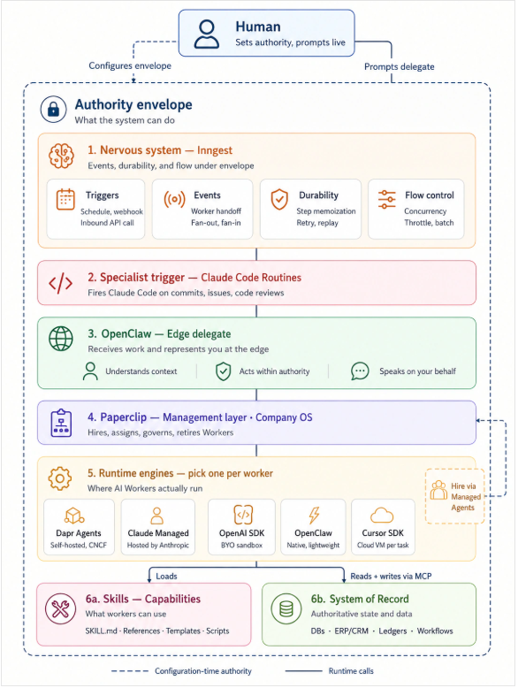

# Orientation Class for Quarter 05 (17/05/26)

Now the approach of learning any topic is change, our pedagogy will be:
- **Get an Overview:** Understand the general context
- **Select critical topic:** Filter down to the vital few (20%)
- **Learn the useful 80%:** Learn 80% of each topic that gets used routinely
- **Start Working:** Apply what you know on real tasks and remaining 20% of each critical topic you will learn during application.

## Quick Start: Crash Courses

Check book for crash courses in `Agent Fatory` Book, [Quick Start: Crash Courses](https://agentfactory.panaversity.org/docs/getting-started)

## The Agent Factory Learning Path

1. **Beginner:** Thesis + Course 1-2 - Prompting and thinking
2. **Agent User:** Courses 3-6 - General Agent, principles, personal AI Employee
3. **Agent Builder:** Course 7 - Build AI Agent with OpenAI Agent SDK
4. **Worker Builder:** Course 8 - Turn an Agent into a durable Digital FTE
5. **Workforce Builder:** Course 9-10 
6. **AI-Native Company Architect:** 

## The Seven Principle, at a glance
- **Bash is the Key.** The agent can act, not just describe.
- **Code as Universal Interface.** Precision through structured formats — schemas, tables, code blocks — not prose.
- **Verification as Core Step.** Every meaningful output is checked before it ships. "Looks right" is the failure mode.
- **Small, Reversible Decomposition.** Work moves in atomic steps; every step can be undone.
- **Persisting State in Files.** The conversation is volatile; the filesystem is durable. What mattered lives in a file.
- **Constraints and Safety.** Explicit permissions, explicit scope. Autonomy is earned per task type, not granted by default.
- **Observability.** You can see what the agent did. No black boxes, no surprises.

## [The Seven Invariants of the Agent Factory](https://agentfactory.panaversity.org/docs/thesis#the-seven-invariants-of-the-agent-factory)

1. Invariant 1: The human is the principal.
2. Invariant 2: Every human needs a delegate.
3. Invariant 3: The workforce needs a management layer.
4. Invariant 4: Each worker picks its own engine.
5. Invariant 5: Every Worker runs against a system of record.
6. Invariant 6: The workforce is expandable under policy.
7. Invariant 7: The workforce runs on a nervous system (events, durability, and flow under envelope).

Seven invariants. One chain. Swap any named product in the middle column tomorrow and the architecture still stands — because the architecture was never the products. It was the invariants.

### Inngest
[Inngest](https://www.inngest.com/) is an event-driven workflow engine for backend automation. It lets developers run reliable background jobs and multi-step workflows triggered by events (like user signups or payments). It handles retries, scheduling, state persistence, and step-by-step execution so you don’t need to manage queues, cron jobs, or worker infrastructure manually. It is commonly used for SaaS automation and AI workflows in frameworks like Next.js and Node.js.

### Paperclip
[Paperclip](https://paperclip.ing/) is a control plane for coordinating multiple AI agents as if they were employees in an organization. It provides an org structure, task hierarchy, budgets, governance, and real-time monitoring so agents can work together on shared goals instead of isolated prompts. It focuses on orchestration, accountability, and cost control across agent teams, effectively acting as an “operating system” for multi-agent systems.

### Identic AI
Agentic AI acts as an autonomous, goal-oriented digital worker. `Identic AI` is a specialized concept for a personalized "digital twin" designed to reflect your individual values, risk profile, and ethical code.

**Identic AI** (derived from identity) is an emerging concept that takes autonomous agents a step further by personalizing them. Rather than serving as a generic assistant, an Identic AI learns your specific preferences, professional instincts, moral codes, and communication styles to operate as a digital extension of yourself. 

**Personalization:** Tailors outcomes based on your unique worldview rather than a standardized algorithm.
**Representation:** Conducts negotiations, drafts documents, and curates information exactly as you would.
**Use Cases:** Executing legal reviews based on your company's risk profile or drafting client communications using your distinct narrative voice. 

## [The Two Modes of General Agent Use](https://agentfactory.panaversity.org/docs/thesis#the-two-modes-of-general-agent-use)

1. **Problem-solving engagement:**
    - `Audience and tools:` Engineer with Claude Code or OpenCode. Domain expert with Claude Cowork or OpenWork
    - `What ships at the end:` An immediate outcome
    - `Governed by:` Seven Principles
2. **Manufacturing engagement:**
    - `Audience and tools:` Anyone, always with Claude Code or OpenCode
    - `What ships at the end:` A piece of workforce
    - `Governed by:` Seven Invariants

Read [Thesis](https://agentfactory.panaversity.org/docs/thesis), [Quick Start Crash Courses](https://agentfactory.panaversity.org/docs/getting-started) and [AI Prompting in 2026](https://agentfactory.panaversity.org/docs/ai-prompting-2026) before next class
