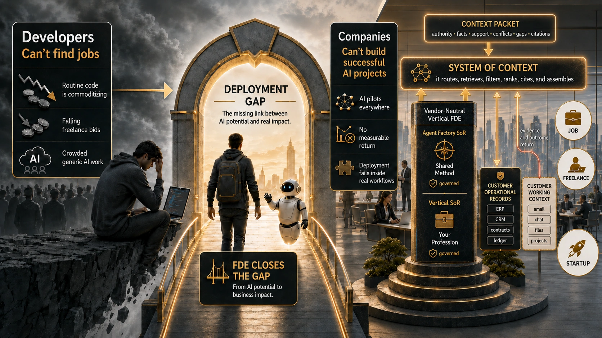
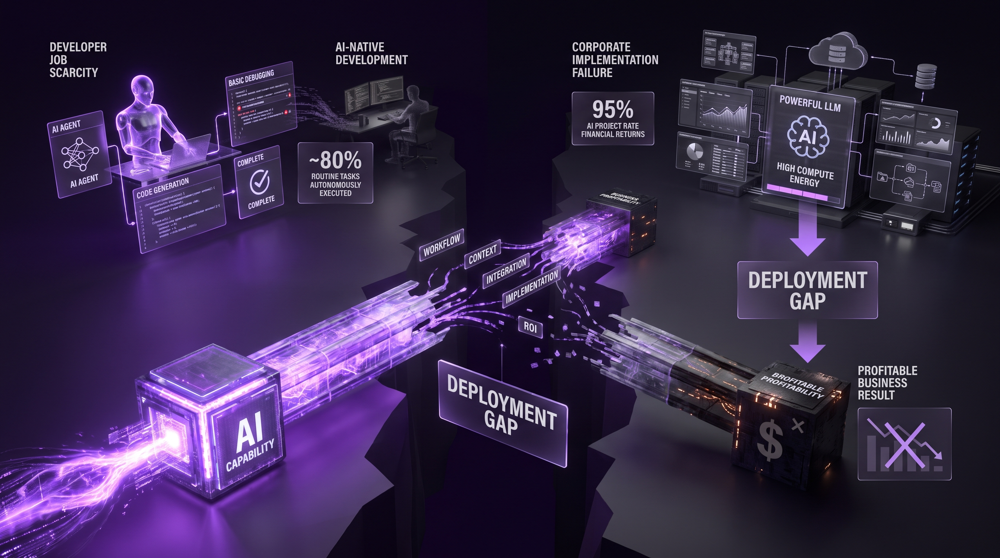
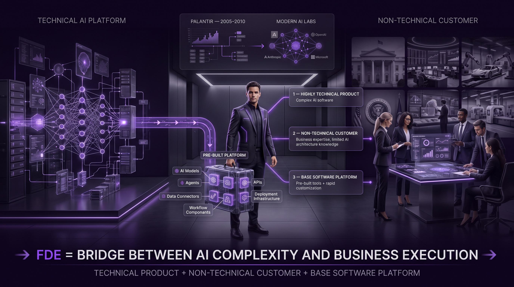
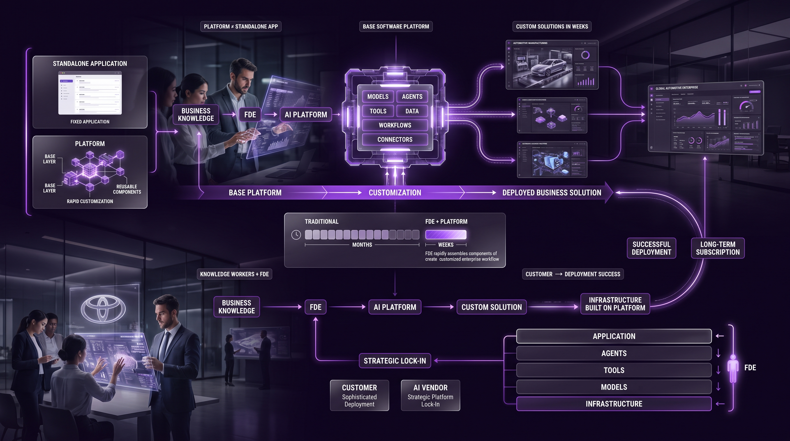
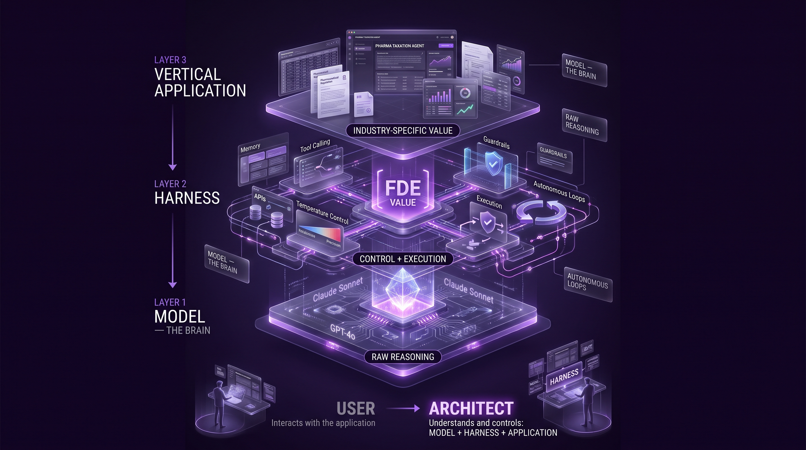
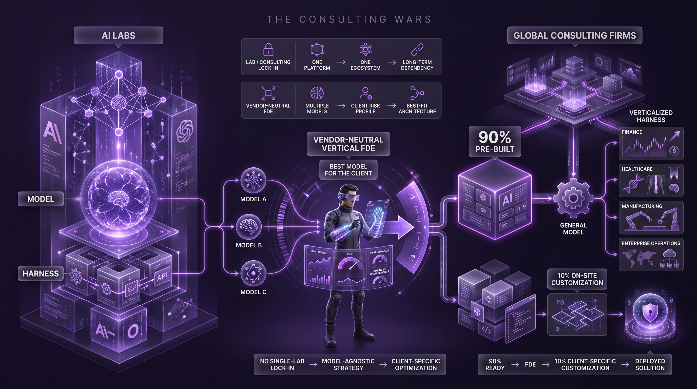
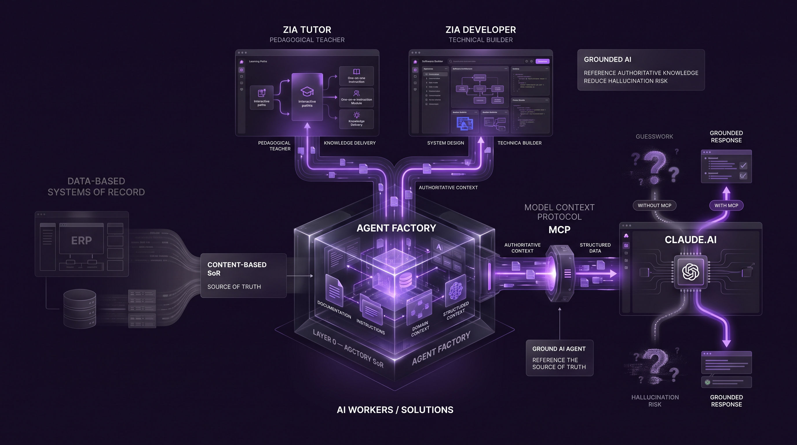
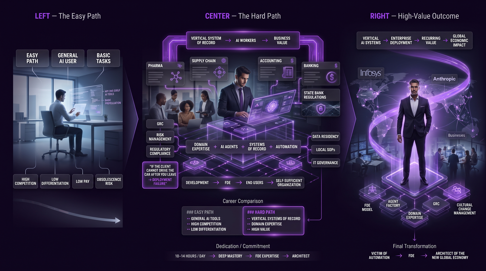

# Class 01 - Getting Paid in the AI Era as a Forward Deployed Engineer (FDE-100)

## 1. Course Foundations and Strategic International Positioning

FDE-100 is a survival mandate for a global economy restructured by Generative AI—history's most influential innovation. As routine coding becomes a commodity, this course blueprints the pivot from "code monkey" to Solution Architect: bridging sophisticated AI models and real-world business utility. Professional mediocrity is obsolescence; mastering these foundations is the only path to relevance as AI agents dominate the workforce.

The instruction team represents a hybrid of deep academic rigor and decades of industry experience, essential for navigating this transition:

| Name | Professional Background | Role within Panaversity / Agent Factory |
| --- | --- | --- |
| **Zia Khan** | ASU Graduate (Triple Masters: MBA, Master of Accountancy in MIS, Master of Engineering); CPA and CMA (USA). 40 years of industry experience. | Lead Instructor; Strategic Visionary for AI transformation and business-engineering hybridization. |
| **Junaid** | CTO at Panaversity; Former Instructor at Stanford University "Coding Place" (2024). | Technical Architect; Lead Developer of the Agent Factory platform and ecosystem. |
| **Wania** | Software Engineer (Bachelors, 2021); Faculty Member at Panaversity. | Faculty Lead; Core contributor to the Agent Factory Open Book and pedagogical frameworks. |
| **Rehan** | Electrical Engineer with 18+ years of industrial experience. | CEO of Panaversity; Strategic lead for Agentic AI educational scaling. |

A non-negotiable pillar of this curriculum is English linguistic proficiency. English is the native language of AI development and the universal language of international business. By enforcing English-medium instruction, Panaversity catalyzes "global lock-in" for its engineers, replicating the strategic success of the Indian IT sector. Proficiency is not about cultural dilution; it is a catalyst for international market entry, allowing engineers to communicate directly with global clients and navigate the highest tiers of the technical landscape. This structural positioning is the first step in addressing the systemic industry failures that have created the current "Deployment Gap."

## 2. The Development Gap: Analyzing the Software Engineering Crisis

The "Development Gap" (often specifically a Deployment Gap) is a market failure where the surge in AI capability fails to translate into corporate profitability. This misalignment has created a dual-sided crisis that threatens both the individual developer and the enterprise.

---

    
    

        <b><u>The Development Gap: Analyzing the Software Engineering Crisis</u></b>
    

---

### The Dual-Sided Crisis

- **Developer Job Scarcity:** AI-native development has moved from theory to reality. General agents like "Claude Code" now autonomously execute approximately 80% of routine tasks (writing code, basic debugging). Consequently, the market for manual code production is collapsing.
- **Corporate Implementation Failure:** A recent MIT study confirms a staggering 95% failure rate for AI projects attempting to generate financial returns. While the underlying models are functional, companies are drowning in the "Deployment Gap"—the space between a powerful LLM and a profitable, grounded business result.

---

    
    

        <b><u>The Dual-Sided Crisis</u></b>
    

---

### The Shift in Value: Beyond Code Production

Value has migrated from the act of writing code to the authority of oversight. To survive, an engineer must focus on:

- **Verifying Logic:** Managing the "Harness" (e.g., temperature control and guardrails) and "running the loops" to ensure AI outputs are accurate and safe.
- **Architecting Solutions:** Defining the "why" and "how" of a deployment, identifying specific business pain points that can be solved by an agentic workflow rather than just a standalone model.

These systemic failures necessitate a new professional archetype: the Forward Deployed Engineer.

## 3. Evolutionary Origins and the FDE Model

The Forward Deployed Engineer (FDE) has emerged as the dominant hiring model for Tier-1 AI labs (Anthropic, OpenAI, Microsoft). While the term has military origins—referring to troops stationed away from the main base to engage directly in the field—its corporate resurgence is a historical necessity.

### The Palantir Criteria and the "Suitcase of Tools"

The FDE role was popularized by Palantir (2005–2010) to deploy highly complex software into non-technical environments (government, banking). An FDE engagement requires **three criteria**:

1. **A Highly Technical Product:** The software is too complex for out-of-the-box use.
2. **A Non-Technical Customer:** The user understands the business (e.g., car manufacturing at Toyota) but not the AI architecture.
3. **A Base Software Platform:** The FDE arrives with a "suitcase of tools"—a pre-built platform—rather than starting from scratch.

---

    
    

        <b><u>The Palantir Criteria and the "Suitcase of Tools"</u></b>
    

---

### Platform vs. Standalone Application

Unlike a standalone app (e.g., Gmail), a Platform (e.g., Oracle, Palantir, or the Agent Factory) is a base layer that allows for rapid customization. An FDE uses this platform to build custom solutions in weeks, not months, working directly alongside the client's "knowledge workers."

### Strategic Lock-In vs. Deployment Success

For the Customer (e.g., Toyota), the FDE ensures sophisticated deployment that internal teams cannot achieve. For the AI Vendor (e.g., Anthropic), the FDE creates a "lock-in." By building the client's infrastructure on a specific platform, the vendor secures a long-term subscription. To compete with these giants, independent engineers must understand the internal hierarchy of the AI stack.

---

    
    

        <b><u>Strategic Lock-In vs. Deployment Success</u></b>
    

---

## 4. Technical Architecture: The AI Agent Stack and Consulting Rivalries

Strategic survival requires an FDE to understand the internal hierarchy of an agent. Without this, you are merely a user, not an architect.

### The AI Agent Stack

1. **The Model (The Brain):** The LLM (e.g., Claude Sonnet, GPT-4o). It provides raw reasoning.
2. **The Harness:** The software wrapper around the brain. This is where the FDE's value lies. It manages memory, tool calling, temperature control, guardrails, and the execution of autonomous loops.
3. **The Vertical Application:** The top layer designed for specific industries (e.g., a Pharma-specific Taxation Agent).

---

    
    

        <b><u>The AI Agent Stack</u></b>
    

---

### The Consulting Wars

A "Consulting War" is currently raging between AI Labs (who own the Brain and Harness) and Global Consulting Firms like **PwC (PRICEWATERHOUSECOOPERS LLP), Accenture,** and **Infosys**. Consulting firms maintain their relevance by building verticalized "harnesses" on top of general models. Their strategic goal is a "90% pre-built, 10% on-site customization" ratio. They bring a 90% finished product and use the FDE to customize the final 10% for the client's specific environment.

To survive this, the independent FDE must move toward becoming a Vendor-Neutral Vertical FDE. By not being tied to a single lab (Anthropic or OpenAI), the neutral FDE can recommend the best model for a client's specific risk profile, which is a major competitive advantage.

---

    
    

        <b><u>The Consulting Wars</u></b>
    

---

## 5. Procedural Guide: The Panaversity Agent Factory and MCP Integration

The industry is shifting from data-based Systems of Record (SoR) (like traditional ERPs) to Content-based SoRs. Panaversity's Agent Factory is a content-based SoR that serves as the "Source of Truth" for AI workers.

### The Panaversity Platform Layers

- **Layer 0 (Agent Factory SoR):** The base kernel containing authoritative knowledge.
- **Zia Tutor:** The pedagogical teacher layer (one-on-one instruction).
- **Zia Developer:** The technical builder layer for architecting solutions.

### Connecting Agent Factory to Claude.ai via MCP

The Model Context Protocol (MCP) allows an FDE to "ground" an AI agent, preventing hallucinations by forcing it to reference the Agent Factory knowledge base.

---

    
    

        <b><u>The Panaversity Platform Layers</u></b>
    

---

**Procedural Checklist:**

- [ ] **Navigate to the MCP Server URL:** Locate the specific server link within the Agent Factory **"System of Record"** instructions.
- [ ] **Open Claude.ai "Native Apps":** Access the settings menu in Claude.ai.
- [ ] **Configure the Connector:**
  - **Name:** Paste the authoritative name (e.g., Agent Factory).
  - **URL:** Paste the provided MCP server URL.
  - **OAuth Client ID:** Enter the specific ID from the instructions. CRITICAL: Leave the "Secret" field blank.
- [ ] **Authorize the Connection:** Click "Connect" and authorize via the Panaversity platform.
- [ ] **Set Permissions:** Change connector permissions to "Always Allow." This is vital for allowing the agent to run autonomous loops without constant manual approval.

## 6. Strategic Synthesis: Governance, Culture, and the Path to Monetization

The FDE's role is as much about organizational navigation as it is about technical implementation.

### The Career Path: Easy vs. Hard

- **The Easy Path:** Using general AI tools for basic tasks. High competition, low pay, and high risk of obsolescence.
- **The Hard Path:** Building Vertical Systems of Record for niche industries (Pharma, Supply Chain, Accounting). This requires deep domain expertise and yields the highest financial rewards.

### GRC and Cultural Change Management

A high-value FDE must navigate IT Governance, Risk Management (GRC), and Regulatory Compliance. In highly regulated sectors like banking, you must understand State Bank regulations, local SOPs, and data residency laws. The FDE is responsible for the "Cultural Change Management"—facilitating the handoff from development to the end-user. If the client cannot "drive the car" after you leave, the deployment is a failure.

### Conclusion: The Mandate for Dedication

The AI Era is not for the mediocre; it is an era of extremes. To survive the "Development Gap" and compete with global entities like Infosys or Anthropic, you must commit to 10 to 14 hours of daily dedication. There is no room for half-measures. By mastering the FDE model and the Agent Factory ecosystem, you transition from being a victim of automation to becoming an architect of the new global economy.

---

    
    

        <b><u>Governance, Culture, and the Path to Monetization</u></b>
    

---

Agent Factory Book: **[The Ecosystem Concept](https://agentfactory.panaversity.org/docs/ecosystem/ecosystem-concept)**