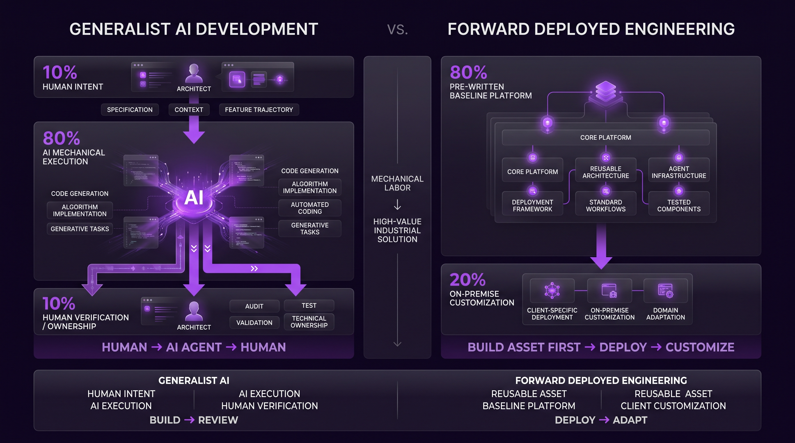
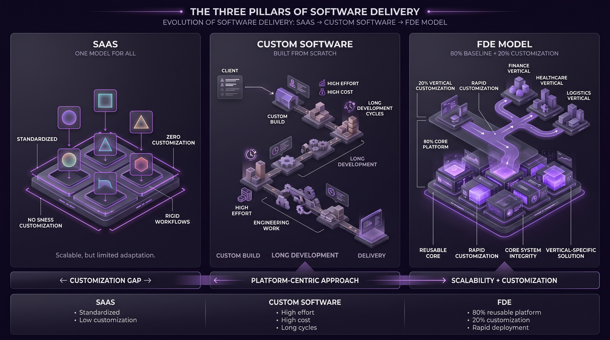
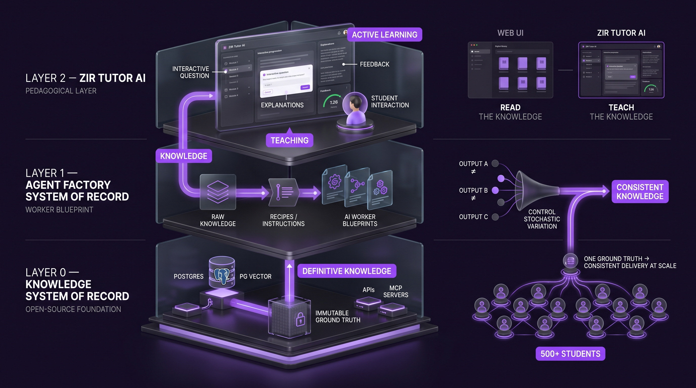
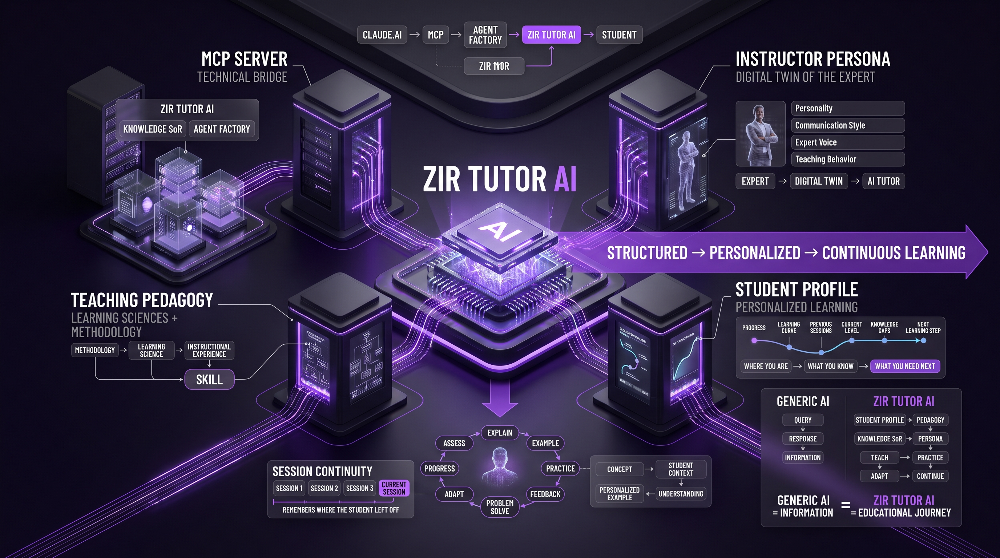
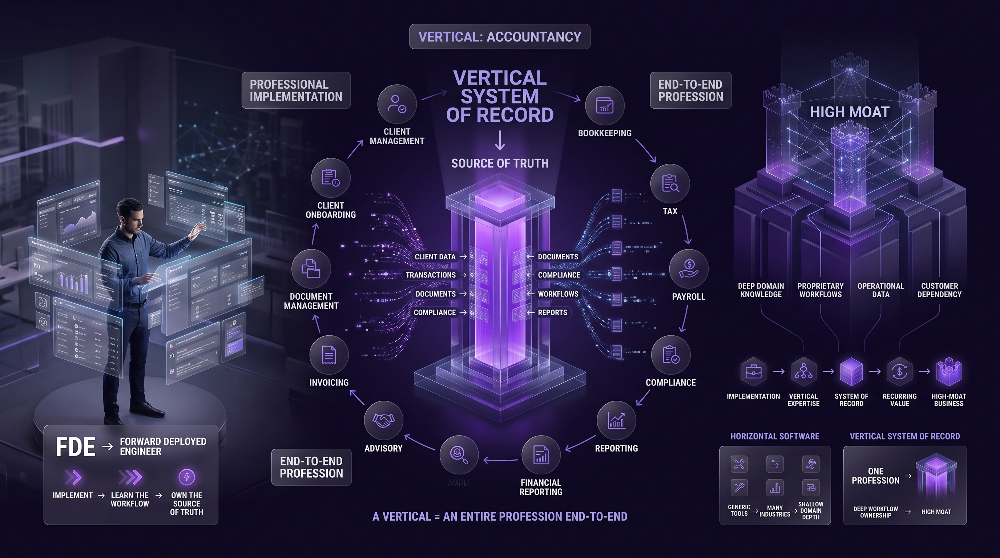

# Class 02: Strategic Foundations and Technical Architecture

## 1. The Rules of Engagement: AI-Driven Development Paradigms

These paradigms constitute the architectural bedrock for professional scalability in decentralized AI environments. Moving beyond the trivial use of LLMs, a Strategic Architect must distinguish between generalist AI-assisted coding and the specialized discipline of Forward Deployed Engineering (FDE). Understanding this shift is critical; it is the difference between performing mechanical labor and deploying high-value industrial solutions.

- **The 10/80/10 Rule (Generalist AI Development):** This workflow governs standard development using general agents like Claude Code. It is defined by three distinct phases where the human "owns" the first and last mile:
  - **10% Human Intent:** The human architect defines the specification, establishes the context, and plans the feature trajectory.
  - **80% AI Mechanical Execution:** The agent performs the heavy lifting, processing the specifications into code.
  - **10% Human Verification/Ownership:** The human assumes technical debt and responsibility by auditing, testing, and validating the output.
- **The 80/20 Rule (Forward Deployed Engineering):** The FDE model demands a shift from intent to assets. An FDE must possess a pre-written "80% baseline" platform before engaging a client. The workflow focuses on performing only the "20% on-premise customization" required for the specific deployment.

---

    
    

        <b><u>10/80/10 and 80/20</u></b>
    

---

### Comparison Analysis: Generalist vs. FDE Models

| Feature | Generalist (10/80/10) | Forward Deployed (80/20) |
| --- | --- | --- |
| **Prerequisite Assets** | None (Specifications only) | 80% Pre-written Baseline Platform |
| **Speed of Delivery** | Standard (Development from scratch) | Rapid (Customization of existing core) |
| **Technical Ownership** | Human owns the verified result | Engineer owns the foundational framework |
| **Workflow Focus** | Mechanical Coding Labor | Solution Deployment & Integration |

This 80/20 rule necessitates a more robust delivery model than traditional software sales. Because the FDE brings a functional core to the environment, the focus shifts from "building" to "implementing," requiring a paradigm that manages both customization and core stability.

## 2. Software Delivery Evolution: The Main Branch Integration Paradigm

The move toward the FDE model is a direct response to the historical inefficiencies of both SaaS and traditional custom software. SaaS offers zero customization, forcing businesses into rigid workflows, while custom software suffers from high costs and "craft time" delays. The FDE model bridges this gap by utilizing a platform-centric approach that allows for rapid customization without sacrificing the integrity of the core system.

### The Three Pillars of Software Delivery

1. **SaaS (Software as a Service):** One model for all; no customization possible.
2. **Custom Software:** High effort, high cost, and long development cycles.
3. **FDE Model:** A baseline platform (80%) customized (20%) for the specific vertical.

---

    
    

        <b><u>SaaS vs Custom Software vs FDE Model</u></b>
    

---

### Solving the "50-Branch Maintenance Nightmare"

Maintaining 50 different versions of a software for 50 different customers is a strategic failure. To avoid this fragmentation, FDEs utilize a "Main Branch" strategy where any innovation discovered during a client deployment is merged back into the primary framework.

### Strategic Benefits of Main Branch Integration:

- [ ] Avoidance of Version Fragmentation: Prevents the accumulation of unmanageable technical debt.
- [ ] Unified Support and Warranty: Maintaining a single source of truth ensures the software remains supportable.
- [ ] Collective Intelligence: Every customer eventually benefits from features discovered during individual deployments.

The Warranty Risk: In this model, refusing an update is equivalent to voiding a warranty. Just as Microsoft does not support outdated, fragmented versions of Windows, an FDE cannot guarantee the stability of a deployment that has diverged too far from the Main Branch.

### The AI Advantage

AI agents revolutionize this integration process. Historically, merging custom features back to a main branch was a slow, manual bottleneck. AI facilitates the rapid synthesis of client-specific innovations into the core framework, making it feasible to maintain a single, evolving source of truth that improves with every deployment.

This main-branch methodology is structurally supported by a layered architectural system designed to provide stability in an otherwise unpredictable AI landscape.

## 3. The Three-Layered System of Record (SoR) Architecture

A layered architecture is mandatory to mitigate the stochastic nature—the inherent unpredictability—of AI. When deploying at an industrial scale (e.g., teaching 500+ students simultaneously), the system cannot afford variations in core knowledge. This architecture ensures consistency across the enterprise.

- **Layer 0: Knowledge System of Record:** This is the "Open-Source Foundation." It utilizes Postgres and PG Vector to store information in a definitive, non-stochastic format. Accessible via APIs and MCP servers, it acts as the immutable ground truth for the entire ecosystem.
- **Layer 1: Agent Factory System of Record:** This layer acts as the "Worker Blueprint." It is essentially a wrapper or a repository of "recipes" that translates the raw data from Layer 0 into instructions for building specific AI workers.
- **Layer 2: ZIR Tutor AI (Zatu/Pedagogical Layer):** This is the pedagogical interface. While a user can read the Knowledge SoR like a book via a Web UI, Layer 2 provides an active learning experience where the AI "teaches" the content.

While Layer 0 and Layer 1 provide the data and the blueprints, the true value for the end-user is realized through the sophisticated pedagogical implementation of Layer 2.

---

    
    

        <b><u>The Three-Layered System of Record (SoR) Architecture</u></b>
    

---

## 4. Pedagogy-Driven EdTech: The ZIR Tutor AI Framework

Standard query-response interfaces are insufficient for high-value learning; they offer information but not education. "Pedagogical Engineering" involves packaging the digital twin of an expert into the system to guide the student through a structured journey.

### The Four Pillars of ZIR Tutor AI

- **MCP Server:** The technical bridge connecting the tutor to the Knowledge SoR (the Agent Factory repository).
- **Instructor Persona:** The digital twin of the expert (Saeed/SAG), embodying their specific personality and communication style.
- **Teaching Pedagogy:** The methodology, learning sciences, and instructional experience packaged into a "Skill" (MCP zip file).
- **Student Profile:** A personalized mechanism that tracks progress, allowing the tutor to adapt to the student's unique learning curve.

---

    
    

        <b><u>Four Pillars of ZIR Tutor AI</u></b>
    

---

### Feature Evaluation: Generic Claude vs. ZIR Tutor AI

Unlike a "Generic Claude Interaction," which simply extracts text, ZIA Tutor AI uses its tools to access the Agent Factory book and apply specific teaching methodologies. It ensures learning occurs in a proper order, utilizing problem-solving and personalized examples while remembering exactly where the student left off in previous sessions.

This pedagogical framework requires a precise technical ecosystem to function correctly within the Claude.ai environment.

## 5. Technical Implementation Guide: Configuring ZIA Tutor AI

The following Standard Operating Procedure (SOP) outlines the deployment of the tutor. Critical Resource Constraint: Users on free Claude.ai accounts are limited to one active MCP server. You must disconnect previous servers (such as the Agent Factory server) before installing the ZIA Tutor.

### Step 1: Connector Setup

1. Navigate to Claude.ai Settings > Customize > Add Connector.
2. Enter the MCP Server URL and Client ID provided in the course resources.
3. Mandatory: Set Tool Permissions to "Always Allow" to ensure seamless interaction without repeated authorization prompts.

### Step 2: Skill Integration

The pedagogical methodology is contained within a specific MCP zip file (the "Skill"). Download this file from the resource portal and upload it to the Claude interface. This skill provides the instructions that allow the agent to function as the ZIA Tutor rather than a general assistant.

### Step 3: Activation & Commands

Initiate the session by using the / command or typing ztutor-ai. This will:

1. Load the pedagogical skill.
2. Connect to the Knowledge SoR via the MCP connector.
3. Resume your session based on your stored Student Profile.

Once the technical ecosystem is established, the FDE can transition from being a student to identifying commercial opportunities within professional verticals.

## 6. The Vertical Opportunity: Professional Implementation

The ultimate economic opportunity for an FDE lies in dominating a "Vertical System of Record." A Vertical is defined as an entire profession end-to-end (e.g., specializing in accountancy within the broader finance industry). By owning the source of truth for a specific niche, the FDE creates a high-moat business.

---

    
    

        <b><u>Vertical System of Record</u></b>
    

---

### Case Study: ERP Migration (Mabash / Zohir)

In a real-world validation provided by the practitioner Mabash, the 80/20 rule was applied to ERP (Enterprise Resource Planning) systems. Mabash noted that these systems are 80–90% similar across clients.

- **Pre-AI Era:** Customization was limited by human development speed.
- **AI-Assisted FDE Era:** Using the AI-driven FDE model, specific client requirements (the 20%) are implemented at high velocity.
- **Strategic Result:** These customizations are merged back into the "Main Branch" (the Zub Zohir project), ensuring the platform grows more robust with every deployment.

### Strategic Takeaway

The FDE does not merely build software; they build and maintain a Vertical Source of Truth. The transition from a student to an FDE is marked by the shift from using AI tools to owning a platform. By maintaining a main branch that improves with every interaction, the FDE creates a scalable, high-speed delivery model that defines the future of professional AI services.
