# Class 03: The Knowledge System of Record (KSoR) Framework

Repo Link of **[KSoR](https://github.com/panaversity/ksor)**

Presentation on **[KSoR](https://docs.google.com/presentation/d/1lLF3PZBQ3vbeSdCKqPbMDTN9a6bgP6msDvbBIrEdeko/edit?slide=id.p1#slide=id.p1)**

## 1. Paradigm Shift: From Traditional Systems of Record to Knowledge Systems of Record

The modern enterprise is undergoing a strategic shift from managing transactional data to governing operational logic. For decades, organizations relied on traditional `"Systems of Record" (SOR)` to define the state of their business. However, as AI agents and autonomous workers begin to take on functional roles, these legacy systems are no longer sufficient. An AI worker cannot operate effectively with raw data alone; it requires the institutional knowledge, "unwritten rules," and policy-driven logic that has historically resided only in the minds of human experts.

---

<div align="center">
    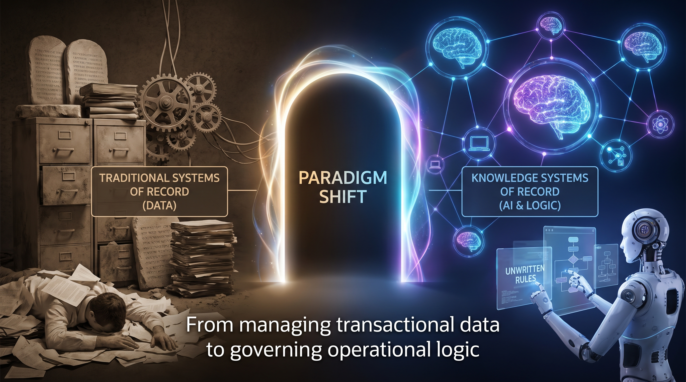
    <p>
        <b><u>From Traditional Systems of Record to Knowledge Systems of Record</u></b>
    </p>
</div>

---


The following table contrasts the legacy approach with the KSoR framework:

| Feature | Traditional System of Record (SOR) | Knowledge System of Record (KSoR) |
| --- | --- | --- |
| Primary Storage | Transactional State (Data) | Operational Logic (Expertise/Policy) |
| Examples | ERP (Odoo), QuickBooks, CRM | Governed Knowledge Layers, Rule Books |
| Primary User | Humans (Manual operators) | Governed AI Workers & Humans |
| Nature of Content | Fast-changing facts (e.g., bank balance) | Slow-changing logic (e.g., credit policy) |
| Purpose | To record what happened. | To record how work should be done. |

---

<div align="center">
    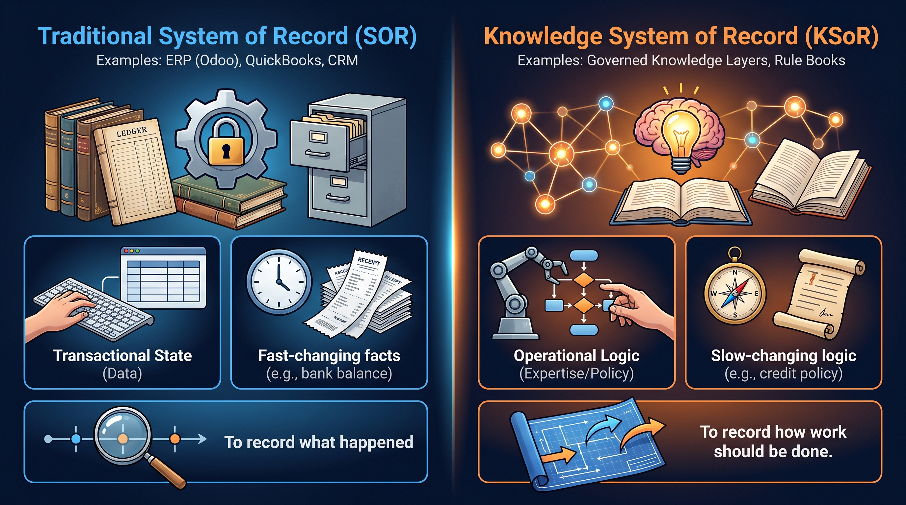
    <p>
        <b><u>Traditional Systems of Record Vs Knowledge Systems of Record</u></b>
    </p>
</div>

---


### The Logic Layer

KSoR captures the **"mind of the expert"**—the accountant's professional judgment, the doctor's clinical guidelines, or the credit officer's risk assessment—and transforms these into a governed, authoritative knowledge layer. This transitions the enterprise from a system of databases to a system of expertise. By formalizing these rules into a "source of truth" that both humans and AI can query, the KSoR ensures that the operational logic of the business is persistent, verifiable, and executable.

Establishing this authoritative layer is the technical and operational prerequisite for any organization seeking to deploy reliable, high-stakes AI agents.

---

<div align="center">
    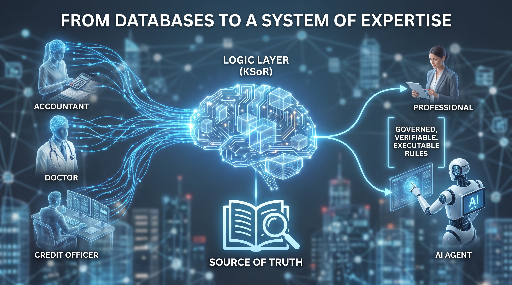
    <p>
        <b><u>The Logic Layer</u></b>
    </p>
</div>

---


## 2. The Four Imperatives: Why AI Requires a Knowledge Layer

Frontier Large Language Models (LLMs) are powerful but lack the native grounding required for enterprise-grade integrity. Without a KSoR layer, AI integration faces four critical risks:

1. **Stochasticity vs. the Deterministic Arc:** LLMs are stochastic, meaning they are non-deterministic and can produce varying answers to identical prompts. Furthermore, without a KSoR, an AI lacks a "Learner's Record"—it has no consistent arc or progression of knowledge. KSoR provides a "governance envelope" that forces the AI to operate within specific parameters, ensuring a deterministic outcome across a learning or operational journey.
2. **Public Data Inaccuracy:** Publicly available LLMs are trained on vast web datasets containing outdated or incorrect information (e.g., inaccurate blogs or Wikipedia entries). KSoR replaces this unreliable background with a verified, internal "Source of Truth" that overrides public training data.
3. **Hallucination Mitigation through Honest Refusal:** In high-stakes environments like medicine or finance, an AI "guessing" an answer can be catastrophic. The source context makes it clear: a single bad medical advice can cost someone their life. KSoR mandates "Honest Refusal"—teaching the AI to say "I don't know" if the answer is not in the governed book—thereby eliminating stochastic guessing.
4. **The Private Data Gap:** Public models have no access to an organization's internal logic, proprietary workflows, or private state. KSoR bridges this silo, providing AI workers with the specific context needed to perform company-specific tasks securely.

Understanding these risks clarifies why a specific architectural framework is required to govern AI interactions with enterprise knowledge.

---

<div align="center">
    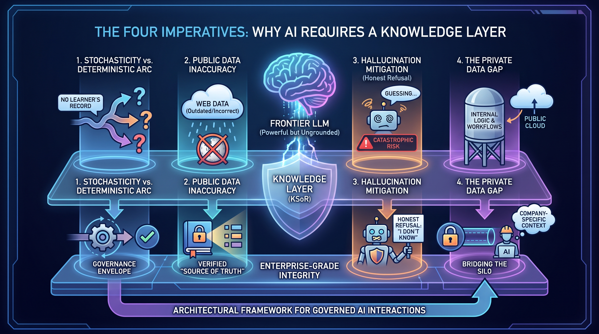
    <p>
        <b><u>The Four Imperatives: Why AI Requires a Knowledge Layer</u></b>
    </p>
</div>

---

## 3. The Architectural Blueprint: Eight Core Concepts of KSoR

KSoR is a multi-faceted architectural standard designed to ensure knowledge reliability through eight core concepts.

---

<div align="center">
    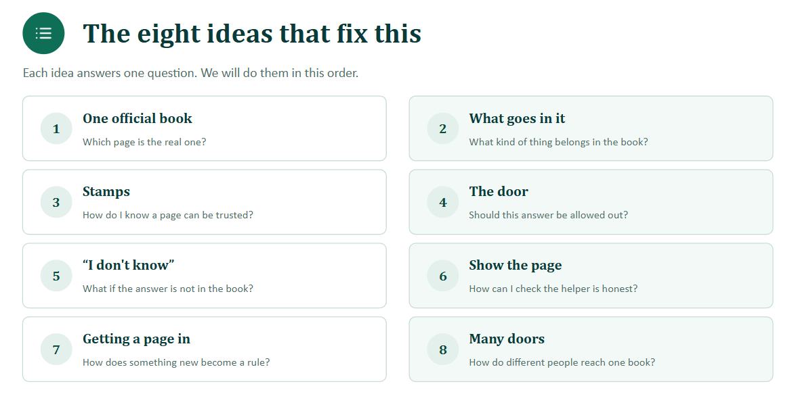
    <p>
        <b><u>Eight Core Concepts of KSoR</u></b>
    </p>
</div>

---


### 1. One Official Book

All authoritative knowledge is stored in a singular directory (typically /knowledge) using Markdown files. This represents the "one book" that everyone—humans and AI alike—must follow to ensure alignment.

---

<div align="center">
    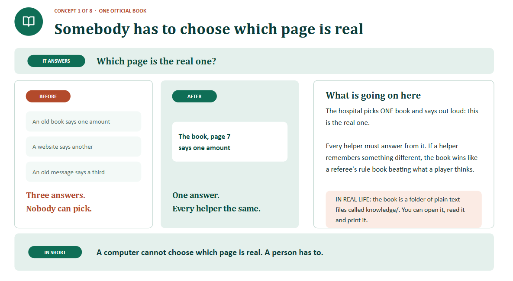
    <p>
        <b><u>Concept 01: One Official Book</u></b>
    </p>
</div>

---


### 2. Content Selection (WHAT GOES IN IT)

KSoR is reserved for **"Slow-changing policy"** (e.g., "How do we treat a fever?"). **"Fast-changing state"** (e.g., "How many beds are currently free?") remains in the traditional SOR. Crucially, KSoR content is defined as knowledge that requires **human intervention** to decide if it is true before it is authorized for the system.

---

<div align="center">
    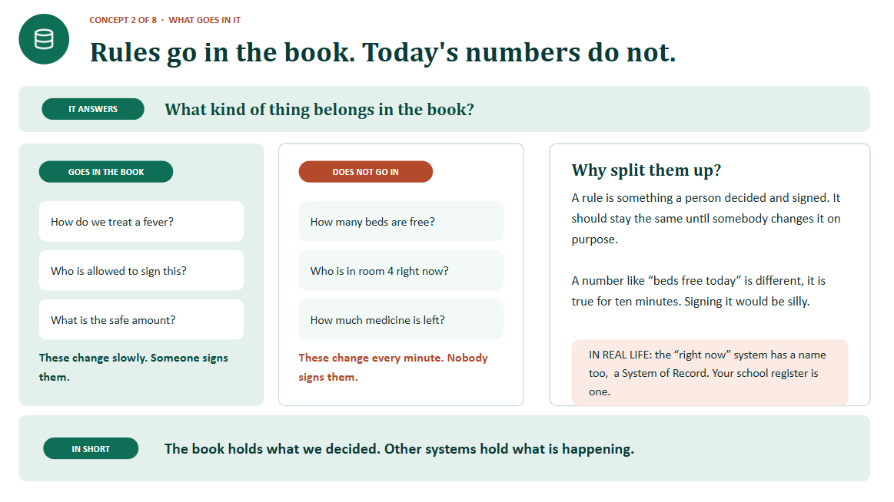
    <p>
        <b><u>Concept 02: Content Selection (WHAT GOES IN IT)</u></b>
    </p>
</div>

---


### 3. The Stamp (The Trust Layer)

To establish trust, every page in the KSoR must have a "Stamp." This is a rigorous metadata header used for human validation and version control. A valid stamp must include:

- **Author:** (e.g., Dr. Sana malik)
- **Approving Authority:** (e.g., The Medicine Committee)
- **Effective Date:** (e.g., March 3, 2026)
- **Version Number:** (e.g., Version 4)
- **Superseded Reference:** (e.g., "Version 3 is outdated")

---

<div align="center">
    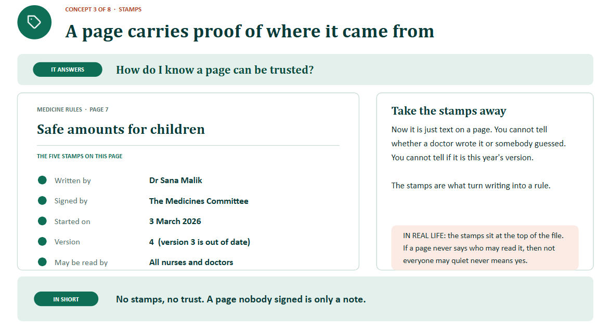
    <p>
        <b><u>Concept 03: The Stamp (The Trust Layer)</u></b>
    </p>
</div>

---


### 4. The Access Governance Layer (The Door)

"The Door" represents the permission layer. It ensures that knowledge is only retrieved by authorized parties based on their role. For example, a nurse may have access to a dosage page that a visitor is blocked from viewing.

---

<div align="center">
    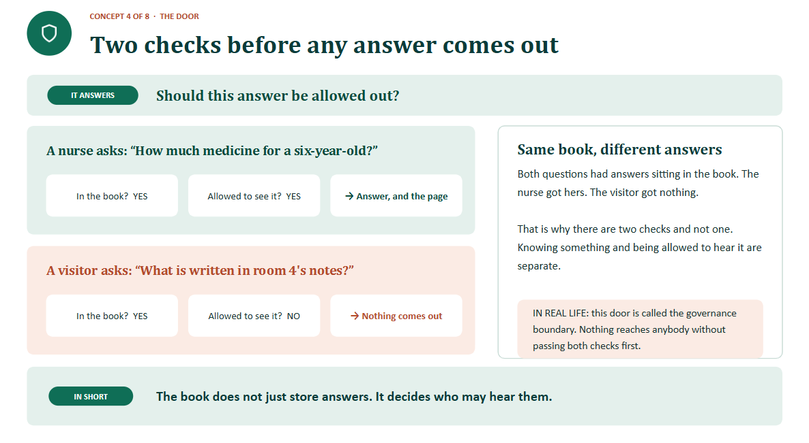
    <p>
        <b><u>Concept 04: The Access Governance Layer (The Door)</u></b>
    </p>
</div>

---

### 5. The "I Don't Know" Mandate

The system enforces a "refusal-first" policy. If a query falls outside the boundaries of the governed Markdown files, the AI is architecturally barred from guessing. Refusing is considered a correct and safe answer in this framework.

---

<div align="center">
    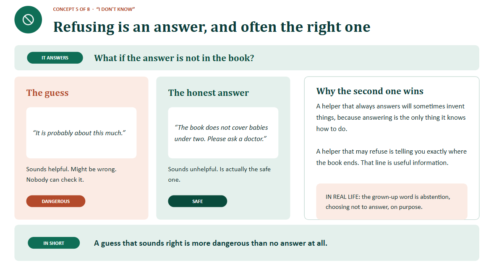
    <p>
        <b><u>Concept 05: The "I Don't Know" Mandate</u></b>
    </p>
</div>

---


### 6. The Citation Requirement (Show the Page)

Transparency is mandatory. For every claim, the AI must provide exact citations from the official book, including the page reference and version number (e.g., "Per Medicine Rules, Page 7, Version 4").

---

<div align="center">
    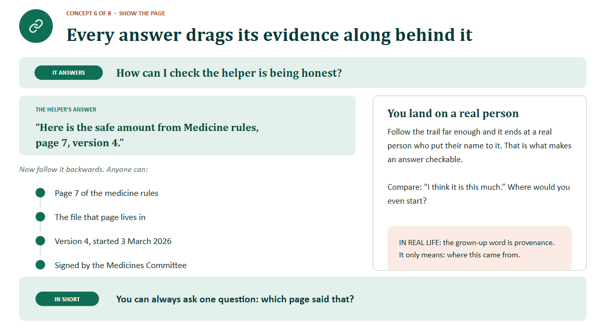
    <p>
        <b><u>Concept 06: The Citation Requirement (Show the Page)</u></b>
    </p>
</div>

---


### 7. The Ingestion Pipeline (Getting a Page In)

Knowledge is never auto-ingested. It follows a strict human-in-the-loop workflow: an expert writes the logic, a senior authority or committee reviews and signs off, and only then is the page "stamped" and made visible to AI helpers.

---

<div align="center">
    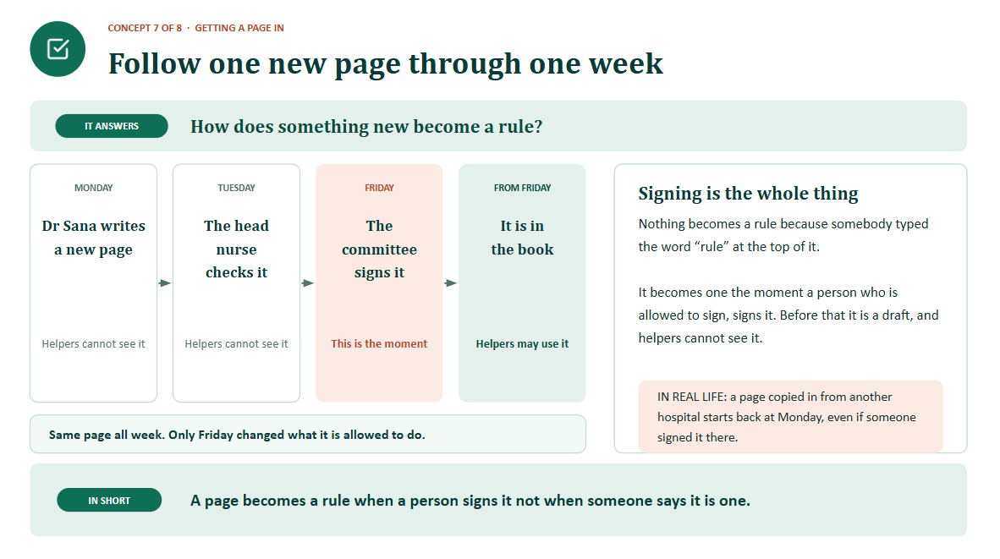
    <p>
        <b><u>Concept 07: The Ingestion Pipeline (Getting a Page In)</u></b>
    </p>
</div>

---


### 8. The Multimodal Interface (Many Doors)

KSoR is accessible through four distinct interfaces:

- **The Human Website:** A readable interface for staff.
- **The LLM.txt List File:** A specialized file for AI to quickly index available knowledge.
- **The MCP (Model Context Protocol) Helper Door:** A connector allowing AI agents to search and retrieve knowledge dynamically.
- **The OKF Bundle:** A "sealed box" or package used for deploying the KSoR to other systems or locations.

These internal mechanics allow KSoR to function as a reliable infrastructure that integrates seamlessly into a broader enterprise ecosystem.

---

<div align="center">
    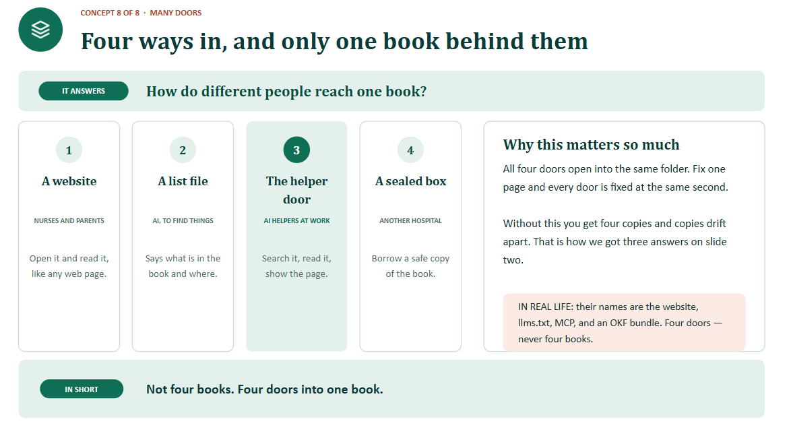
    <p>
        <b><u>Concept 08: The Multimodal Interface (Many Doors) - 1</u></b>
    </p>
</div>

---

<div align="center">
    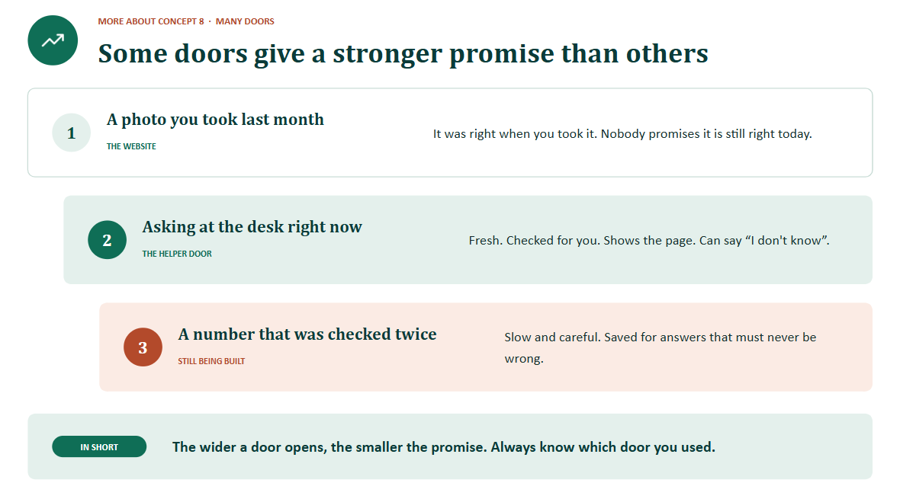
    <p>
        <b><u>Concept 08: The Multimodal Interface (Many Doors) - 2</u></b>
    </p>
</div>

---

## 4. Ecosystem Integration: Vertical KSoRs and Systems of Context

In a complex organization, knowledge is often tiered to ensure specialized expertise is properly managed.

- **Vertical KSoRs:** These are domain-specific knowledge layers. A bank might have a "Credit Analysis KSoR" containing the exact rules for loan approval and ratio analysis.
- **Systems of Context:** These are horizontal layers that connect various Records (SOR and KSoR) to actual work execution. While the KSoR provides the "how," the System of Context provides the environment where that knowledge is applied to real-time data.

---

<div align="center">
    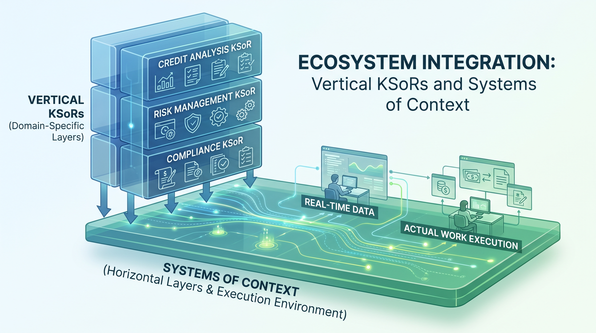
    <p>
        <b><u>Ecosystem Integration: Vertical KSoRs and Systems of Context</u></b>
    </p>
</div>

---

### The Role of the FDE and the Digital Twin

The Forward Deployed Engineer (FDE) is the primary architect responsible for building these vertical layers. Their ultimate goal is often the creation of an "Expert's Digital Twin" (e.g., a "Bashir Bot"). Without a KSoR, a digital twin is prone to giving conflicting or scattered advice because it lacks a grounded framework. The FDE ensures that the digital twin operates within a KSoR-governed boundary, preventing it from providing dangerous, conflicting answers—such as varying the dosage of medicine—across different interactions.

This brings us to the technical requirements necessary for a Forward Deployed Engineer to begin implementing these systems.

---

<div align="center">
    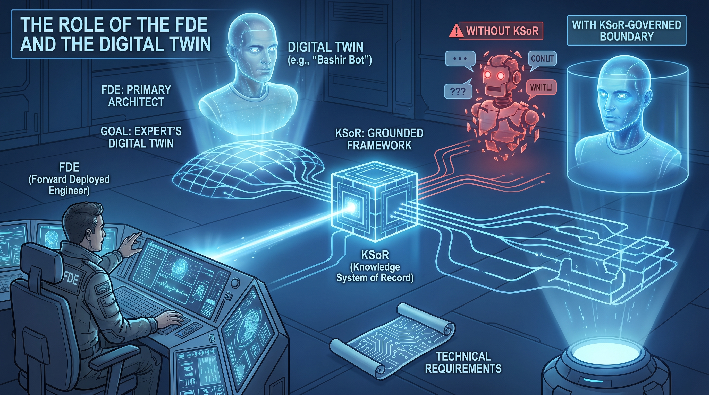
    <p>
        <b><u>The Role of the FDE and the Digital Twin</u></b>
    </p>
</div>

---


## 5. Technical Implementation: Prerequisites and Syntax

To ensure cross-platform compatibility and stability, KSoR deployment requires a standardized environment.

### Prerequisite Checklist

- [ ] NodeJS v24+: The environment must run on Node version 24 or higher.
- [ ] Version Verification: Confirm by running node -v in the terminal.
- [ ] Package Manager: Availability of npm, pnpm, or bun.

### Initialization Guide

To create a foundation for governed AI operations, the FDE initializes a project using a standardized command structure. To initialize a new project:

```bash
npx @panaversity/ksor@latest init my-knowledge-sor
cd my-knowledge-sor && npm install && npm run dev
```

This command generates a structured project containing the essential /knowledge directory where the "One Official Book" will reside.

## 6. Comparative Governance: KSoR vs. Retrieval-Augmented Generation (RAG)

A common misconception is that KSoR is simply a standard RAG (Retrieval-Augmented Generation) implementation. In reality, KSoR is the governed infrastructure that makes RAG reliable.

While RAG is a technical method for semantic retrieval, KSoR is the authoritative "Governance Envelope." Standard RAG often searches an "unverified junk drawer" of files. KSoR ensures that the retrieval source is signed, versioned, and human-approved. By providing these boundaries, KSoR transforms the LLM from a stochastic guesser into a deterministic worker within a specified boundary.

---

<div align="center">
    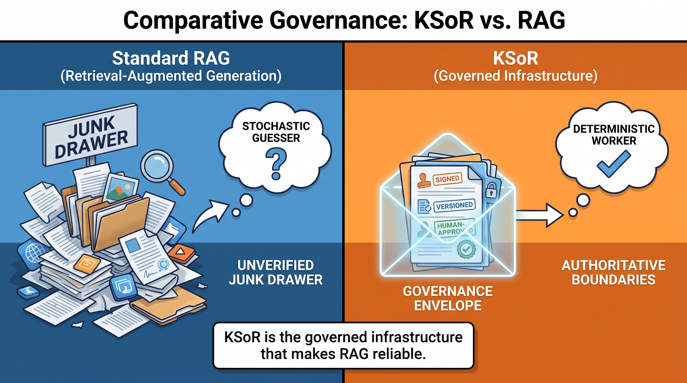
    <p>
        <b><u>Comparative Governance: KSoR vs. Retrieval-Augmented Generation (RAG)</u></b>
    </p>
</div>

---

## Final Summary

KSoR establishes a strict governance boundary, ensuring that AI responses are grounded exclusively in authorized logic. By mandating that AI agents show their sources and follow human-signed rules, the Knowledge System of Record serves as the definitive resource for the future of agentic work, providing the integrity and expertise required for AI to take on functional enterprise roles.
