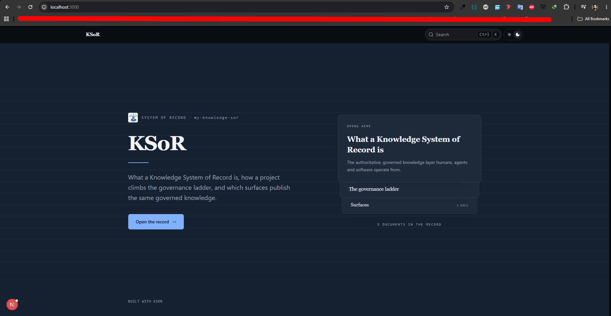
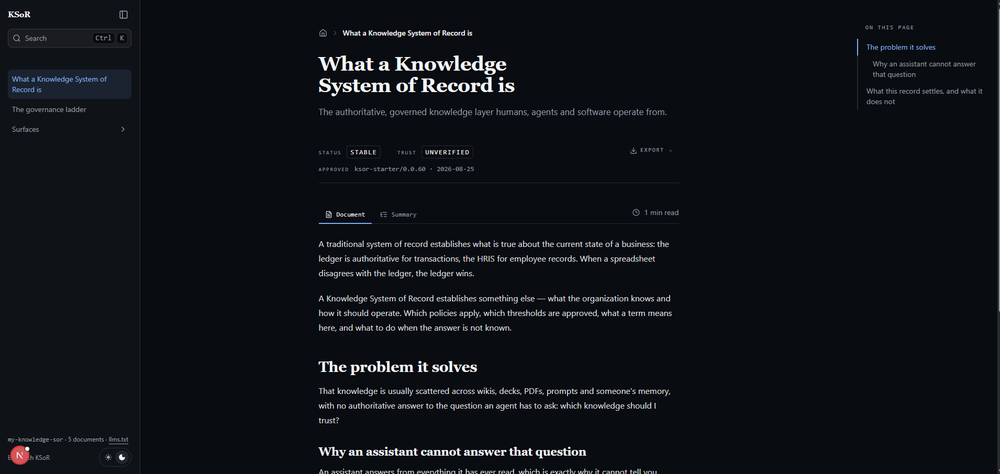
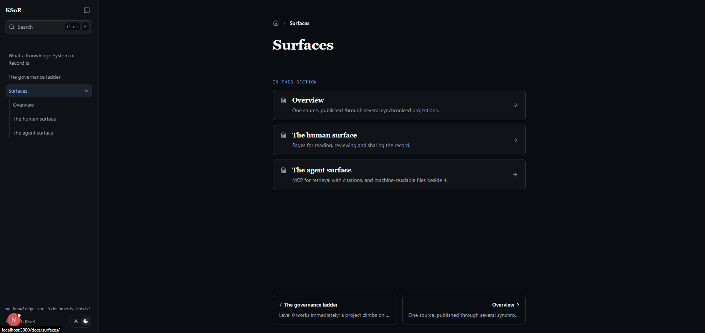

# Lesson 04: The Forward Deployed Engineer (FDE) Roadmap: KSOR Framework and Claude Certifications

## 1. Executive Summary: The Evolution of the AI Professional

The landscape of AI engineering has shifted decisively from generalist experimentation toward the era of the Forward Deployed Engineer (FDE). In this new paradigm, professional value is no longer derived from mere familiarity with chat interfaces, but from the ability to deploy ownable, governed technical infrastructure within an enterprise. Transitioning to an FDE requires a strategic balance between theoretical mastery and the implementation of a robust Knowledge System of Record (KSOR).

This report synthesizes the two pillars of the FDE-100 curriculum: Anthropic Claude Certifications (The Theory) and the KSOR Framework (The Practice). Together, these elements constitute "Proof You Can Carry"—a portable ecosystem of validated skills and proprietary intellectual property that allows an engineer to deliver immediate value. Professional validation via the Anthropic certification track is the non-negotiable baseline for establishing market trust and initiating this professional evolution.

## 2. The Anthropic Claude Certification Track

Anthropic certifications serve as the global gold standard for AI competency, providing a rigorous framework to validate professional credibility. These certifications ensure that a practitioner can apply Claude’s specific architectural strengths to solve complex business problems using industry-recognized best practices.

The certification track is structured across four distinct levels:

| **Certification Level** | **Primary Focus** | **Target Audience** |
| --- | --- | --- |
| Claude Certified Associate Foundations | Practical business problem-solving and application usage. | Knowledge workers, marketers, and business professionals. |
| Claude Certified Architect Foundations | Foundational agentic architecture and system design. | Aspiring AI architects and systems engineers. |
| Claude Certified Developer | Technical implementation and engineering workflows. | AI developers and software engineers. |
| Claude Certified Architect Professional | Advanced professional architecture for enterprise systems. | Senior AI architects and implementation leads. |

The Associate Foundations exam is purposefully designed for accessibility, targeting non-technical professionals such as marketers who must leverage AI for high-level business applications rather than deep coding. The exam consists of 60 questions and tests the candidate's ability to apply platforms like Claude.ai to real-world scenarios.

Notably, Rahan and Juned were the first professionals in Pakistan to achieve this certification. Rahan’s preparation serves as a benchmark for the industry: 8 hours of rigorous revision focusing specifically on the "Foundation Section" of Agent Factory. The track maintains a "no prerequisite" policy, allowing candidates to attempt exams in any sequence, though mastery of the foundations is strategically recommended before moving to architectural levels.

## 3. The FDE Concept and the "Proof You Can Carry" Paradigm

A standard hire is an expense that requires training; a Forward Deployed Engineer is an asset that brings a pre-existing ecosystem of value. The FDE arrives at an organization with "Proof You Can Carry," ensuring immediate deployment of proven skills and infrastructure.

The FDE model is built on three strategic pillars:

- **High-Profile Certifications:** Industry-leading validation from Anthropic and OpenAI that serves as the "ticket to entry."
- **Open-Source Foundations:** Leveraging frameworks like the Queue System of Record (QSR) to build reliable, repeatable workflows.
- **Proprietary Vertical Systems of Record:** Ownable IP that provides a distinct competitive edge in specific industries (e.g., healthcare, finance).

Organizations value the FDE model because it circumvents the traditional learning curve. By bringing a functional "engine for delivery," the FDE transitions from a generalist to a strategic implementation partner capable of managing an organization's most valuable asset: its knowledge.

## 4. KSOR Framework: Technical Deep Dive and Local Environment

The Knowledge System of Record (KSOR) is defined as a governed, agent-native knowledge layer. It is a strategic necessity for the modern enterprise, preventing fragmented organizational data by centralizing "How" and "Why" policies into a format that AI agents can navigate and humans can audit.

### Local Setup and Prerequisites

To initialize a KSOR project, the environment must meet the following requirements:

- NodeJS: Version 24 or above is mandatory.
- Project Initialization: Execute the following command in your terminal:

```bash
npx @panaverse/ksor@latest init <project-name>
```

### Repository and Project Folder Structure

The KSOR framework utilizes a specific directory structure to ensure both human readability and agentic efficiency:

- **knowledge/**: The core content layer containing Markdown (.md) and Mermaid Markdown (.mmd) files.
- **.cl/ (or dotcl/)**: Contains agent context and skill definitions (e.g., agents.mmd).
- **system/**: Protected system code. Strategic Warning: This folder must not be edited by humans. It is managed by the General Agent to maintain system integrity while the organization retains full ownership of the source.
- **mcp.json**: The configuration bridge for the Model Context Protocol (MCP), enabling tool discovery and integration.

---

<div align="center">
    
    <p>
        <b><u>KSOR Framework: Technical Deep Dive and Local Environment<u></b>
    </p>
</div>

---

## 5. The Human Surface: Governance and Knowledge Management

While KSOR is designed to be agent-native, the "Human Surface" (accessible at localhost:3000) is the primary interface for Governance. It is essential that domain experts—who may lack technical coding skills—have a visual UI to verify and audit the "System of Truth."

The Human Surface facilitates Interactive Editing, where changes to the Markdown files in the knowledge/ directory sync live to the UI. This allows policy makers to ensure that the AI’s underlying knowledge is accurate and safe.

Beyond manual updates, KSOR includes pre-loaded Agent Skills that ship with the framework. For example, an FDE can prompt Claude to generate a "refund policy"; the agent then uses these internal skills to generate a structured record in the knowledge/ directory.

Furthermore, the system autogenerates an **llm.txt** file and an **index.mmd** file. These follow emerging industry standards (originally proposed by Google) for agentic discovery. They provide a structured, machine-readable index that allows LLM crawlers and agents to understand the system’s hierarchy and content immediately.

---

<div align="center">
    
    <p>
        <b><u>The Human Surface: Governance and Knowledge Management</u></b>
    </p>
</div>

---

## 6. The Agent Surface and MCP Serving

The "Agent Surface" serves governed knowledge to AI agents via the Model Context Protocol (MCP), ensuring the KSOR acts as the authoritative knowledge provider for any connected agent.

---

<div align="center">
    
    <p>
        <b><u>The Agent Surface and MCP Serving</u></b>
    </p>
</div>

---

### Database Integration and PG Vector

KSOR integrates with the Neon Database to facilitate semantic Retrieval-Augmented Generation (RAG). By connecting a Neon account via the /mcp command, the agent automatically provisions:

- Database projects and specific branches (e.g., live-handbook).
- Schemas and necessary extensions, specifically PG Vector.

Semantic RAG is superior to keyword search because it understands the intent behind a query. This allows an agent to retrieve relevant cited knowledge from millions of records, ensuring responses are grounded in the "System of Truth."

### Vendor Neutrality and Configuration

The framework is strictly LLM-agnostic. While the .env file uses the Gemini API key by default due to its accessible free tier for embeddings, the system is designed for total swappability. FDEs can easily transition to OpenAI or other providers to avoid vendor lock-in and maintain strategic flexibility.

### Serving via MCP

Once registered in mcp.json, the agent uses semantic search tools to retrieve and cite knowledge directly from the KSOR. This creates a closed-loop system where the agent is limited to answering based on the governed policies defined within the KSOR.

## 7. Operational Excellence: Security, Integration, and Scalability

An FDE’s primary responsibility is ensuring data sovereignty and managing the "How and Why" of enterprise operations.

- **Data Privacy:** KSOR adopts a default zero-external-access policy. Through OAuth/OIDC protocols, the FDE manages access control, ensuring sensitive data is either redacted or hosted locally to prevent leakage to frontier LLM providers.
- **The State vs. Policy Distinction:** A critical strategic insight for CRM and ERP integration is that traditional systems store "State" (e.g., a customer's balance). KSOR stores the "How and Why" (the policy layer). An AI agent cannot effectively act on "State" data without the governing "Policy Layer" provided by KSOR.
- **Scalability:** Leveraging Postgres and PG Vector, the framework is capable of handling millions of rows, meeting the requirements of large-scale enterprise deployments.
- **Media Roadmap:** While the current focus is on text and transcripts, the KSOR roadmap includes support for interactive video and live audio, allowing the system of record to evolve alongside multimodal LLM capabilities.

## 8. Conclusion: The FDE Competitive Advantage

The transition to a Forward Deployed Engineer represents the marriage of theoretical validation and practical delivery. Theoretical certification through Anthropic provides the "ticket to entry," proving your mastery of AI's internal logic. However, the KSOR framework provides the "engine for delivery," allowing you to deploy ownable, governed infrastructure that solves real business problems.

In the AI-driven economy, you must either own the infrastructure or be replaced by the generalists who merely use it. Adopting the FDE mindset and mastering the KSOR framework is the definitive path to remaining relevant and indispensable. The challenge is clear: own your infrastructure, govern your knowledge, and provide the proof that only a Forward Deployed Engineer can carry.
