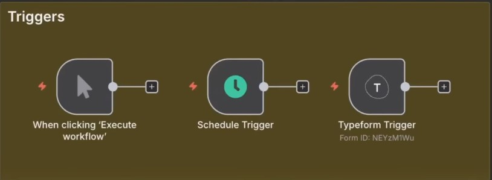
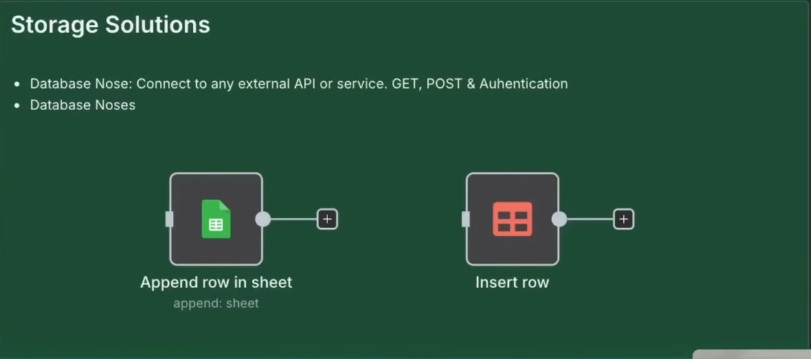
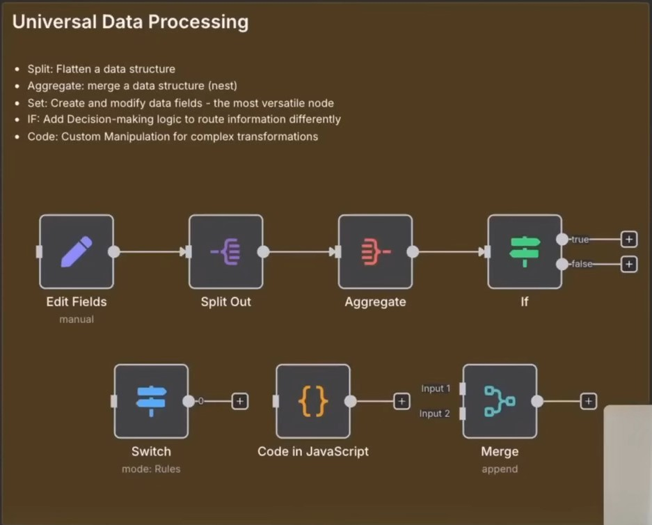
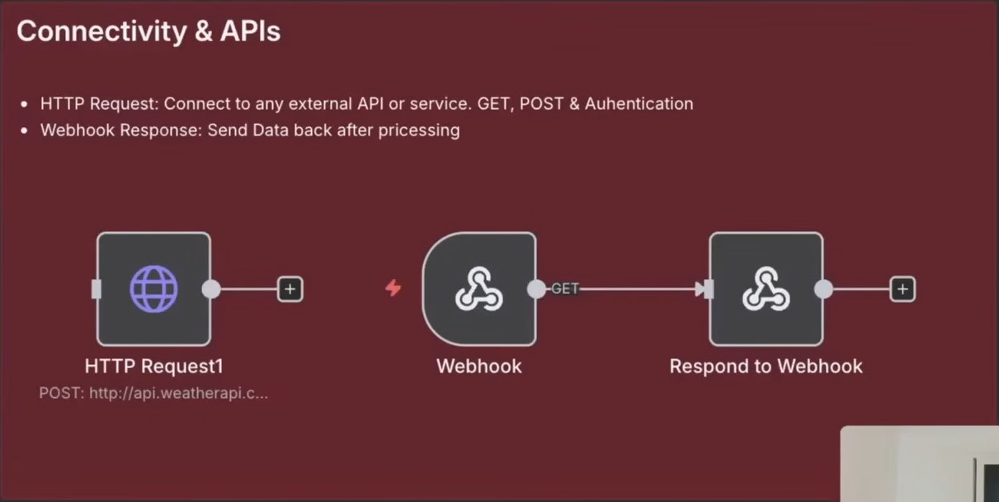
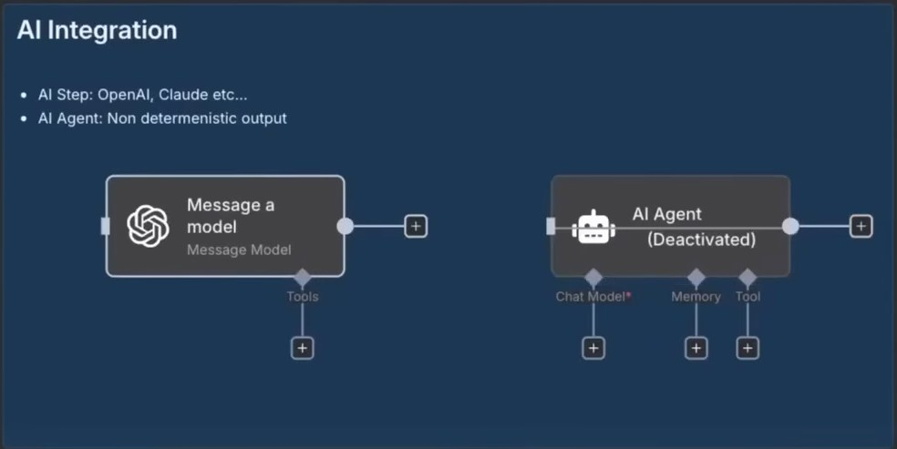

# The 17 Essential n8n Nodes for Automation Mastery

YouTube Video Link: **[Master 80% of n8n by Learning Just These 17 Nodes](https://www.youtube.com/watch?v=tf1mnCVWJkQ)**

## 1. Introduction: The 80/20 Framework for Automation Efficiency

In the discipline of workflow engineering, the "80/20 rule" (the Pareto Principle) serves as a strategic cornerstone. This principle posits that approximately 80% of professional automation requirements can be satisfied by mastering a specific subset of high-leverage tools—in this case, 17 essential n8n nodes. By focusing on these core components, an automation architect can effectively address the complex needs of diverse clients without becoming lost in the thousands of specialized integrations available.

This methodology is rooted in practical application, derived from real-world implementations for over 40 businesses and validated through the instruction of more than 17,000 students. The framework prioritizes functional versatility, ensuring that once these 17 nodes are mastered, the architect possesses the foundational logic to navigate almost any automation challenge. This mastery begins at the start of every workflow: the initiation of the process.

## 2. Trigger Nodes: Engineering Workflow Initiation

Triggers function as the primary catalyst for any automation, defining the specific conditions under which a sequence of actions begins. Strategically, triggers are categorized by their role in the development lifecycle and their performance in a production environment.

### The Manual Trigger

The Manual Trigger is a fundamental tool utilized primarily during the development and testing phases. It allows the architect to execute a workflow on demand to verify logic and data flow before the system is connected to live, high-stakes data sources.

### The Schedule Trigger

For automations requiring temporal regularity rather than event-based initiation, the Schedule Trigger provides granular control. This node allows for precise execution intervals, including:

- Seconds
- Minutes
- Hours
- Days
- Weeks
- Months
- **Custom (Cron):** For high-specificity scheduling, such as "every Tuesday at 2:00 PM."

A common professional application is the "Daily Midnight" configuration—often used for content systems to refresh data at the start of each day—setting the interval to "Days" with the triggered minute and hour at zero.

### App-Event Triggers

App-Event triggers are "on-app" initiators that respond to external actions within third-party software. For example, a hiring form built in Typeform serves as a digital listener. When a candidate submits the form, the **Typeform node** captures a specific data packet—including Name, Email, Phone, and Location—and immediately passes it to n8n. Once these workflows are triggered, the architect's priority shifts to where this resulting data is preserved.

---

    

---

## 3. Storage Nodes: Data Persistence and Universal Mapping

Maintaining data integrity across business processes requires structured storage solutions. Whether utilizing external spreadsheets or internal databases, the logic of data persistence remains the primary architectural concern.

### Google Sheets Integration

Google Sheets remains a global standard for business data. The "Append Row" action is the most frequent implementation, allowing the automation to add new data points dynamically.

> **Technical Note:** When mapping data to Google Sheets, ensure the data strings do not begin with a plus (+) or equal (=) sign. Google Sheets interprets these as native equations, which will trigger execution errors within the node.

### n8n Native Data Tables

A powerful internal alternative is the n8n Native Data Table. This allows for high-speed storage without the latency of external APIs. Using the "New People" table example, an architect can store Name, Email, Phone, and Location within the n8n ecosystem itself, streamlining the data flow.

### Universal Storage Strategy

Mastering Google Sheets and Native Tables provides a "Universal Storage Mapping" blueprint. The underlying logic of "appending," "updating," or "retrieving" data in these tools is nearly identical to the logic required for Airtable, Notion, ClickUp, and Asana. Understanding this core allows an architect to adapt to any platform where business information is stored, leading directly to the manipulation of that data.

---

    

---

## 4. Universal Data Processing: Structural Transformation

Data manipulation is the "engine room" of automation. Raw input often arrives in unstructured formats; these nodes transform that input into usable business intelligence.

### The Edit Fields Node

This node is essential for refining data structures, particularly when handling arrays or lists of profiles. It allows the architect to rename, remove, or modify fields to ensure they align with the requirements of downstream systems.

### 'Split Out' vs. 'Aggregate' Nodes

The relationship between these two nodes defines how an architect handles data volume. "Split Out" is essential when you receive an array but need to process or add items to a database individually.

| Node | Function | Transformation Logic | Professional Application |
| --- | --- | --- | --- |
| Split Out | Individual record processing | 1 Item (Array) → N Items | Processing items one-by-one from a list. |
| Aggregate | Batching and bulk uploads | N Items (Individual) → 1 Item | Compiling separate records for a single batch process. |

### The Merge Node

The Merge Node facilitates parallel path aggregation. To maintain structural integrity, a "tiered merge" architecture is often superior to a single-node input. For example, an architect might process a Facebook post and a LinkedIn post and merge them first, while simultaneously processing a Twitter post and a blog Article to merge them separately. Finally, these two merged outputs are combined into a single, final output. This hierarchical approach prevents messy data mapping and is more efficient than running separate automations for each platform.

- **Combine Mode:** Used to take two or more inputs and join them into the same array.
- **Append Mode:** Used to output each item individually for sequential processing.

### The Code Node Utility

While n8n is primarily low-code, the Code Node is a high-level tool for transformations that would otherwise require seven or eight separate nodes.

> **Architect's Note:** The Code Node is primarily a tool for speed and logic consolidation. It allows the architect to transform unstructured data into structured formats rapidly when standard nodes reach their logical limits.

With data correctly structured, the workflow must then utilize decision-making logic to determine the appropriate path.

---

    

---

## 5. Logic Nodes: Conditional Routing and Decision Trees

Logic nodes empower automations to act "intelligently" by routing data through different paths based on specific business rules.

### If Node vs. Switch Node

- **The If Node:** Operates on binary (True/False) logic. It is ideal for simple validation, such as checking if a name field contains a specific string.
- **The Switch Node:** Provides multi-branch flexibility. For instance, in an email automation, a Switch Node can route messages into multiple categories: FAQ, Promotional, or Normal. Unlike the binary If node, the Switch node allows for an unlimited number of routing rules within a single step, which is critical for connecting these internal logic paths to the broader internet.

## 6. Connectivity & Custom API Integration: Extending System Reach

APIs are the universal language of the internet. When a native node for a specific software does not exist, connectivity nodes allow n8n to communicate with virtually any web-based service, bypassing the need for "pre-made" apps.

### The HTTP Request Node

This is the most powerful node for custom integrations. By referencing API documentation, an architect can support "unsupported" apps. For instance, using the Free Weather API, one can retrieve the current temperature in London without a dedicated "Weather Node," demonstrating that n8n's reach is not limited by its native library.

### Webhooks & Respond to Webhook

- **Webhooks:** These act as digital "listeners" using a URL (Test URL for development, Production URL for live status). Standard implementation involves an HTTP Post Request to send data into the workflow.
- **Respond to Webhook:** This node provides essential feedback to the requesting server. During simulation (often using Postman API), this node can return a specific message like "workflow has finished," confirming that the external system's data was processed successfully. This connectivity serves as the foundation for the most advanced layer of the n8n stack: Artificial Intelligence.

---

    

---

## 7. Next-Gen AI Nodes: Cognitive Automation

The shift from linear automation to cognitive workflows is facilitated by Large Language Models (LLMs) and specialized AI nodes.

### The AI Node

The AI Node is designed for linear tasks, such as generating a LinkedIn post. It utilizes a three-tier prompt engineering structure:

1. **System:** Defines the AI's identity (e.g., "You are a professional copywriter").
2. **User:** Defines the specific task (e.g., "Write a post about life").
3. **Assistant:** Provides specific examples to guide the output style.

### The AI Agent

The AI Agent represents an architectural shift from linear chains to a "central hub." Triggered by a Chat Message Trigger, the Agent uses Memory to maintain conversation context—a feature the standard AI Node lacks. Most importantly, the Agent acts as a singular input data store that can autonomously utilize Tools (e.g., Gmail, Airtable, Notion) to take actions across various software platforms based on user conversation. It essentially acts as an autonomous personal assistant, and its ability to handle non-linear tasks is what has driven the recent surge in n8n's professional adoption.

---

    

---

## 8. Advanced Blueprint & Ecosystem: Strategic Implementation

Mastering these 17 nodes is the definitive step toward a professional-grade automation skillset. To accelerate deployment, architects leverage the "Free School Community" ecosystem, which provides:

- **The Templates Vault:** Pre-built n8n automation blueprints.
- **AI Automations 101:** A structured guide for transitioning from a beginner to a professional architect.

These 17 nodes should be strategically applied across the four primary business domains: Sales, Marketing, Product, and Service Delivery. Mastery of these components ensures that an architect is equipped to handle the diverse requirements of any modern business, transforming raw potential into sophisticated, intelligent systems.
