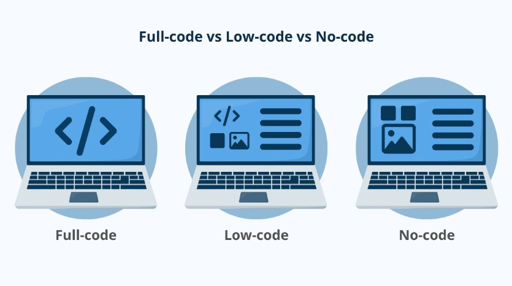
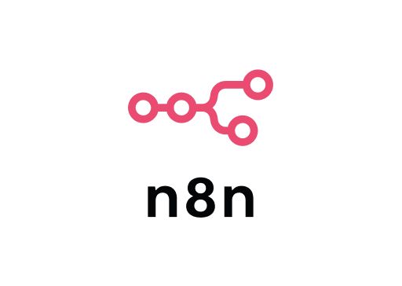
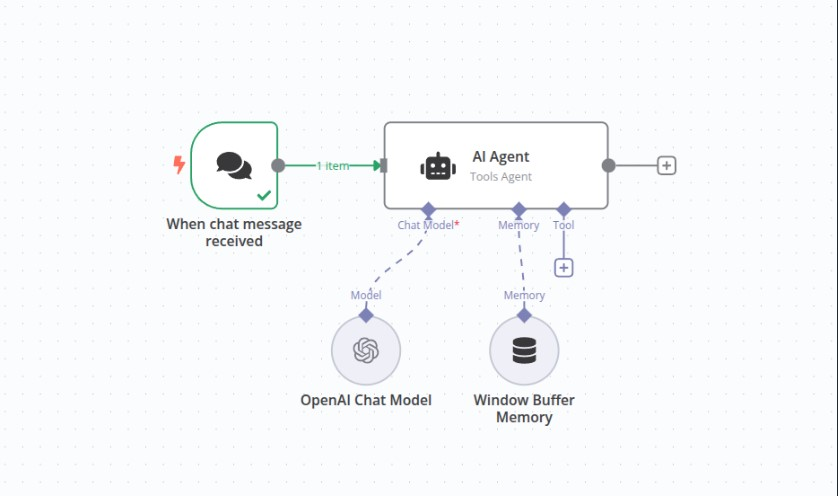
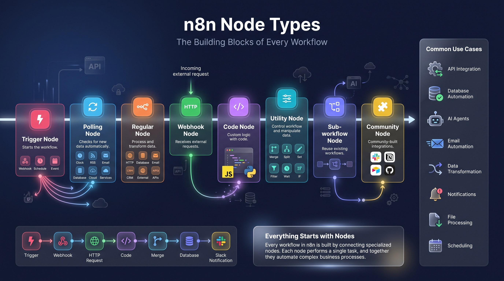

# Agentic AI Development with n8n and Low Code Platforms

## 1. Leadership Profile and Global Domain Expertise

In the current era of rapid digital transformation, human capital remains the ultimate strategic moat. As AI moves from a generative novelty to a functional business requirement, the convergence of veteran architectural wisdom and "Generation AI" agility determines an organization's ability to execute. The Panaversity Urdu teaching team represents a distributed global elite, synthesizing decades of enterprise stability with frontier technical talent to provide a unique pedagogical advantage for professional training.

Expertise Mapping: The Panaversity Core Team

| Lead Expert | Primary Role | Location | Core Industry Experience |
| --- | --- | --- | --- |
| **Sir Zia Khan** | Senior Visionary | Pakistan / Global | 64/65-year-old leader in technology education and digital transformation. |
| **Qasim** | Chief Data Scientist | New York, USA | Medical AI ecosystems; Data Science for NY startups (e.g., Cancer Clarity). |
| **Amin** | DevOps Architect | Saudi Arabia | Cloud architecture for 25+ banks; Digital banking specialist (e.g., Bank Albilad). |
| **Junaid** | CTO & AI Developer | Lahore, Pakistan | 24-year-old AI developer; Former instructor for Stanford’s CIP Python program. |
| **Zeeshan** | Senior Developer | Pakistan | Senior Core Development and AI Operations. |

### Strategic Insight: The Human Moat

This leadership structure serves as a critical hedge against the high failure rate of modern AI projects. By balancing "Senior Wisdom" (Zia)—which provides the enterprise guardrails and stability required by legacy institutions—with the rapid-iteration mindset of "Generation AI" (Junaid), the team ensures that solutions are both architecturally sound and at the absolute bleeding edge of the $4 trillion AI market.

## 2. The Three Waves of AI Evolution

Understanding the current technological shift requires a clear view of the historical progression from static predictive models to autonomous agentic systems.

### The Evolutionary Framework

The progression of AI can be categorized into three distinct waves:

-   **Wave 1: Predictive AI (Pre-2022):** Focused on statistical analysis and machine learning to identify patterns and forecast outcomes based on historical data.
-   **Wave 2: Generative AI (Late 2022):** Catalyzed by ChatGPT, this wave focused on content generation (text, audio, image) based on specific user prompts.
-   **Wave 3: Agentic AI (Current):** The current frontier, centered on reasoning, autonomous action, and the **Model Context Protocol (MCP)**. This wave enables AI to not just "think," but to "do."

### Strategic Insight: From Answer Engines to Action Engines

We have transitioned from viewing Large Language Models (LLMs) as simple "answer engines" to complex "action engines." This shift represents the massive market opportunity captured by trillion-dollar entities like NVIDIA and Microsoft. This historical context clarifies that the value of AI is no longer in the model itself, but in the functional architecture that allows the model to act.

## 3. Functional Architecture of AI Agents

An AI agent is not a chatbot; it is a goal-oriented system designed to perceive its environment and execute multi-step plans to achieve a specific result.

### Core Architectural Components

-   **Perception:** The ability to monitor environments through digital or physical sensors (e.g., detecting a power failure or a new customer lead).
-   **Decision/Reasoning:** The "Brain" (LLM) analyzing the environment and determining the necessary steps to reach a goal.
-   **Action:** The execution of tasks via **Tools** or Functions (e.g., sending an API request, starting a generator, or updating a database).
-   **Memory:** Moving from "Stateless" interactions to "Stateful/Persistent" awareness, where the agent retains context and user history.

### Strategic Insight: The Autonomous Multi-Step Advantage

Consider the "Generator Analogy": where Generative AI can explain how a generator works, an **Agent** perceives the lights have gone out, reasons that a switch may be tripped, checks the switch (Action 1), and if power is still absent, autonomously executes the start-up sequence for the backup generator (Action 2). This goal-oriented autonomy is the foundation of modern automation.

## 4. Strategic Business Use Cases: Triage, Analysis, and DevOps

The implementation of agentic workflows allows for unprecedented operational efficiency by automating high-frequency, complex professional tasks.

### Vertical Applications

-   **Inbox Triage:** Managing fragmented communications across WhatsApp, LinkedIn, and Email. Agents classify priority, draft context-aware responses, and schedule meetings without manual intervention.
-   **Data Analyst Agents:** Moving beyond simple spreadsheets, these agents extract and clean **fragmented data** from diverse sources like WhatsApp chats, CSVs, and Excel files, providing real-time synthesis and visual reports.
-   **DevOps Agents:** Essential in high-stakes banking environments, these agents monitor system logs for errors or security incidents, autonomously rolling back faulty deployments or scaling server resources to meet traffic demands.

### Strategic Insight: Architectural Guardrails

Despite the power of autonomy, "Human in the Loop" (HITL) remains a strategic imperative for high-stakes decisions, such as multi-million dollar financial transactions or border security. The agent provides the reasoning and preparation, but the final executive "hand-off" remains with a human to ensure safety and accountability.

## 5. Evaluation of Development Paradigms: No-Code, Low-Code, and Code

The democratization of agentic architecture allows for immediate ROI without the overhead of traditional software lifecycles, but leaders must choose the right tool for the specific objective.

  
  
<b><u>Development Paradigms</u></b>

---

### Platform Comparison Matrix

| Dimension               | No-code                            | Low-code                              | Full-code                                           |
| ----------------------- | ---------------------------------- | ------------------------------------- | --------------------------------------------------- |
| **Primary users**       | Business users, analysts           | Devs + prototypers + power users                    | Software engineers                                  |
| **Speed to MVP**        | Fastest                            | Fast                                  | Slowest                                             |
| **UI/Logic**            | Drag-and-drop + prebuilt actions   | Visual flows + custom code blocks     | Hand-coded UI, APIs, logic                          |
| **Data**                | Built-in tables/connectors         | Connectors + custom integrations      | Any database or data layer you choose               |
| **Extensibility**       | Limited to vendor features         | Plugins, scripts, custom components   | Unlimited (your stack, your rules)                  |
| **DevOps/CI/CD**        | Vendor-managed                     | Partial (some pipelines)              | You own CI/CD, testing, infra                       |
| **Compliance/Gov**      | Varies by vendor                   | Stronger enterprise options           | You design for your needs                           |
| **Scale & performance** | Good for small/medium apps         | Medium→large with tuning              | Any scale (with engineering effort)                 |
| **Vendor lock-in**      | Highest                            | Medium                                | Lowest                                              |
| **Cost profile**        | Per-user/app fees                  | Platform + dev time                   | Infra + engineering time                            |
| **Typical examples**    | Zapier + Airtable + Google Opal | n8n | React/Next.js + FastAPI +  Open AI Agents SDK |
---

### Platform Spotlight: n8n 

n8n has emerged as the premier low-code tool for the agentic era, seeing its valuation soar from $340M to $2.3B in recent months. Its open-source nature allows organizations to maintain data sovereignty by hosting it locally while benefiting from its powerful visual agentic nodes.

### Strategic Insight: The "Sweet Spot" for Deployment

n8n represents the optimal balance for rapid professional deployment. It bypasses the rigid limitations of no-code "vendor lock-in" while avoiding the sluggish development cycles of full-code Python environments. For most organizations, n8n is the primary engine for rapid business value.

## The idea in one line
> LLM (the brain) + tools/APIs (hands) + memory (long-term context) + goals (what to achieve) + a loop (to try, check, and try again).

## 7. n8n and its Nodes

### What is n8n?

**n8n** (pronounced “n-eight-n”) is an open‑source workflow automation, Agentic AI, and orchestration platform. It lets you build AI Agents and connect APIs, databases, and services with a visual, node‑based editor, while still giving you the power to drop into code when you need it. For agentic AI, that combination—**no‑code orchestration with just‑enough code**—makes n8n an ideal control plane for prototyping and building systems that can **perceive, plan, and act** across tools.

In agent terms, **n8n** is a visual **workflow orchestrator**. You drag-and-drop nodes to let an AI model (the “brain”) use **tools** (APIs, databases, vector stores), manage **memory**, and include **humans** when needed. In other words, you build agents that can perceive → decide → act across your stack. n8n ships AI/LLM nodes (OpenAI, embeddings, chat), tool nodes (HTTP Request, Slack, etc.), and “agent” patterns out of the box.

  
  
<b><u>n8n Logo</u></b>

---

  
  
<b><u>n8n</u></b>

---

### n8n Nodes

An n8n **node** is a self-contained unit implementing `INodeType`, defined by a `description` object (displayName, inputs/outputs, parameters, credentials, icon, version). Nodes execute discrete workflow steps.

**Main types:**

-   **Trigger** – starts workflows (webhook, schedule, event-based)
-   **Polling** – periodically checks for new data
-   **Regular** – processes/transforms data (most common)
-   **Webhook** – receives incoming HTTP requests
-   **Composite/Sub-workflow** – calls other workflows
-   **Code/Function** – custom JS logic (Code node now replaces old Function/Function Item nodes)
-   **Utility** – Set, Merge, SplitInBatches, etc. for data shaping
-   **Community/Custom** – third-party integrations

### n8n Node Types and Use Cases

| Node Category | Purpose | Exec Behavior | Credentials | Examples |
|---|---|---|---|---|
| **Trigger (Event)** | Start workflow on external event (webhook, schedule, form) | Asynchronous (runs when event occurs); can emit repeatedly or once per event | Usually none (some triggers require credentials, e.g. Gmail Trigger uses OAuth) | Webhook, Cron/Schedule Trigger, Manual Trigger, OAuth2/API Triggers (Slack, GitHub, etc.), When Called by Another Workflow |
| **Polling** | Periodically check external source for new data (e.g. RSS) | Asynchronous on schedule; returns new items or null if none | Often requires credentials (e.g. Email, GDrive) | RSS Feed, Email Trigger (IMAP), Twitter Trigger, Database Trigger |
| **Webhook (HTTP)** | Receive HTTP requests to start or feed workflows | Asynchronous waiting; outputs request data upon hit | None (but endpoint may be secured via credentials in request) | Generic Webhook, Form Trigger, Telegram Trigger (via webhook) |
| **Regular/Action** | Perform actions on data in flow (API calls, logic, transforms) | Synchronous (per execution path); processes incoming items and returns outputs | Yes, if calling external services (via credential types) | HTTP Request, Database Query, Email Send, Set (data transform), Merge, If/Switch, Filter, Wait, etc. |
| **Function/Code** | Custom JavaScript on data | Synchronous (run per item or all); can be async via `await` | No inherent creds (but code can call APIs if credentials provided via NodeHelpers) | Code node (replaces old Function), Function Item, Function Batch |
| **Composite/Sub-workflow** | Call or integrate another workflow | Can be synchronous or asynchronous (main waits or not) | Only for called workflow credentials if executing with context | Execute Workflow (sub-workflow), When Executed by Another Workflow (sub trigger) |
| **UI/Utility** | Data manipulation and control flow | Synchronous; no external I/O | No | Set, Merge, SplitInBatches, NoOp, Wait, IF/Switch |
| **Credential Nodes** | (Not applicable in canvas) Credential entry & tests exist outside workflows | — | — | N/A (credentials are defined in Settings) |
| **Community/Custom** | Any of above built by community | Varies | Varies | E.g. community integrations like Airtable, custom APIs, AI/LLM nodes, etc. |

---

  
  
<b><u>n8n Nodes</u></b>
  

---

### n8n Quick Start Tutorial: Build Your First Workflows

We will cover these tutorials in class:

[Quick Start](https://docs.n8n.io/try-it-out/quickstart/)

[Your first workflow](https://docs.n8n.io/try-it-out/tutorial-first-workflow/)

You will watch these videos at home:

[Beginner Video Course](https://docs.n8n.io/video-courses/#beginner)

[n8n Quick Start Tutorial: Build Your First Workflow [2025]](https://www.youtube.com/watch?v=4cQWJViybAQ)

## 8. Market Opportunity and Industry Demand Analysis

The labor market is currently facing a "Transition Risk" as AI shifts the demand from "Manual Process Owners" to "Agentic System Architects."

### The Demand Hierarchy

-   **Freelancing:** High demand for rapid, high-impact 500–2,000 n8n-based automation workflows.
-   **Startups:** Essential for rapid MVP development and testing market viability at low cost.
-   **Enterprises:** Massive demand for robust, scalable Python-based agents (30k–40k projects) to manage core infrastructure.

### Strategic Insight: The Opportunity of a Generation

Sam Altman, CEO of OpenAI, has designated this the "luckiest generation," providing "the greatest shot at success" in history. However, this opportunity comes with a catalyst: the estimated 50% unemployment risk for those who fail to adapt. To remain resilient, professionals must pivot from executing tasks to architecting the agents that perform them.

### Technical Implementation Roadmap: n8n Setup and Configuration

Professional automation environments can be deployed with minimal friction, providing immediate pathways to prototype agentic systems.

#### Step-by-Step Setup

-   **Cloud Trial:** For immediate testing, utilize the 14-day trial at **n8n.io**.
-   **Local Environment:**
    -   Install **Node.js (LTS version)**.
    -   **Global Installation:** Run `npm install n8n -g` in the terminal.
    -   **Execution:** Run `n8n start` to launch.
    -   **Pro-Tip:** Use `npx n8n` for immediate execution without a global installation.
    -   **Model Integration:**
    -   Secure an API Key from **Google AI Studio**. (Note: Google currently provides a **free API tier** for Gemini Flash/Pro, making it the strategic entry point for developers).
    -   Add a "Google Gemini Chat Model" node within the n8n interface.

### Strategic Insight: Persistent Intelligence

By default, LLMs are **stateless** and forget user context immediately. To build a true business assistant, developers must integrate **Persistent Memory** nodes. This transforms a simple response generator into a stateful professional partner that remembers client names, preferences, and complex project histories.

---

### **Conclusion:** 
The transition to Agentic AI is the defining shift of the 2025 economy. Organizations and individuals who master the architecture of action—rather than just the generation of content—will lead the next wave of global industry.
