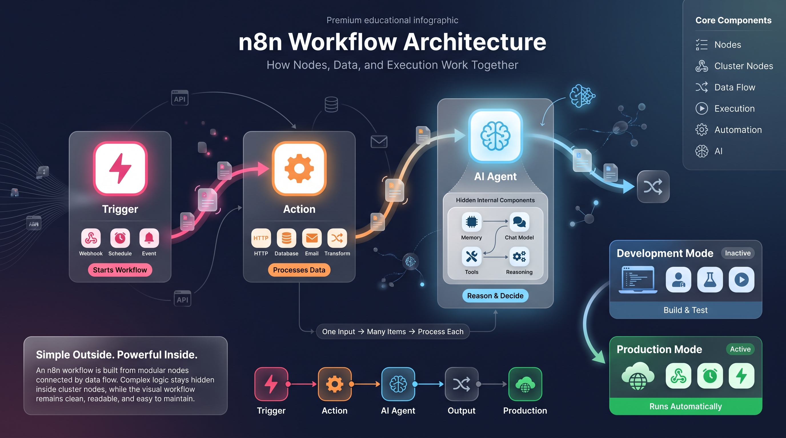
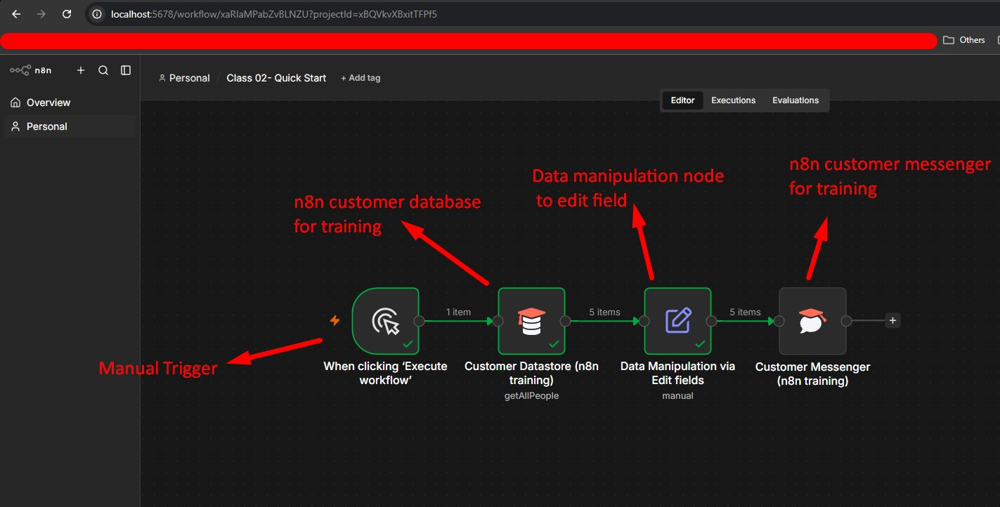
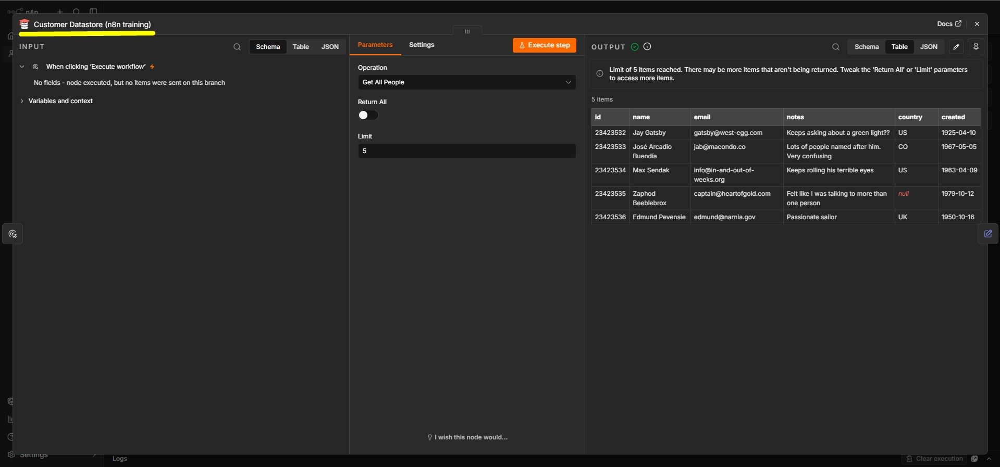
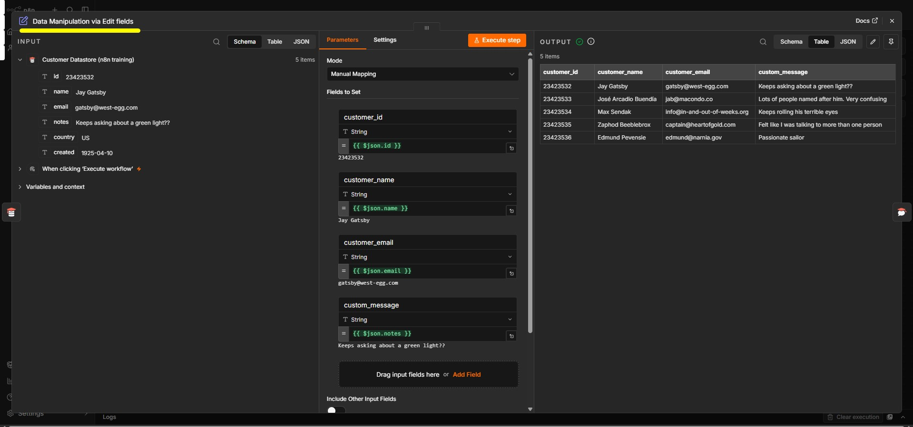
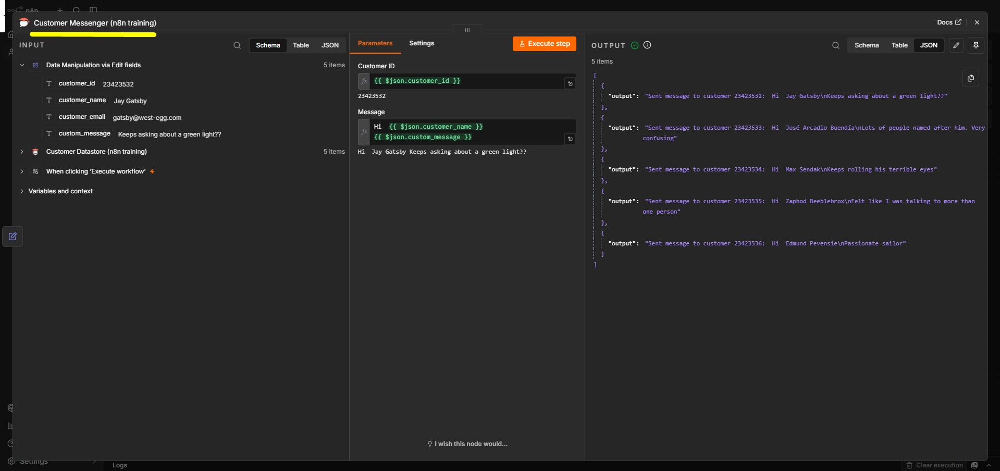

# Technical Summary: n8n Quickstart and Workflow Logic (Class 02)

## 1. The Core Architecture: Understanding the n8n Logic Engine

In the modern enterprise stack, n8n functions as a sophisticated low-code orchestration engine. Its strategic value lies in its ability to decouple complex business logic from the underlying codebase, providing a visual canvas where architects can design, manage, and scale automations without the overhead of traditional software development. By abstracting API interactions into a node-based interface, n8n allows for the rapid translation of high-level business requirements into executable technical workflows.

The foundational architecture of an n8n workflow consists of several critical components:

- **Nodes:** These are the atomic units of the workflow, categorized into Triggers (event listeners), Actions (functional tasks), and AI Agents (complex reasoning modules).
- **Cluster Nodes:** These are composite nodes that facilitate high-level abstraction. An AI Agent, for example, acts as a cluster node that encapsulates internal sub-nodes—such as memory modules and chat models—to maintain a clean top-level workflow while hiding underlying complexity.
- **Execution and Data Flow (Arrows):** Beyond simple sequencing, the arrows represent the flow of data as an array of objects. In n8n, the "arrow" signifies iteration logic; for every item passed in the JSON array, the subsequent node will execute, ensuring high-throughput processing.
- **Operational States:** Workflows alternate between an Inactive development mode (manual execution via the Test URL) and an Active production mode. In the Active state, the workflow is deployed to a production-ready environment, often triggered by a Production Webhook URL or an automated schedule.

---

<div align="center">
  
  <p><b><u>Understanding the n8n Logic Engine</u></b></p>  
</div>

---


The engine's versatility is driven by **Expressions**. Wrapped in double curly brackets `{{ }}`, n8n utilizes Luxon-based JavaScript syntax for data manipulation. This allows architects to dynamically map input data to node parameters, ensuring that the workflow remains flexible and data-driven. These concepts form the architectural bedrock for constructing resilient, real-world automations.

## 2. Case Study A: Mock Simulation of a Marketing Automation Flow

A primary use case for automation is the mitigation of "Cart Abandonment" in e-commerce. Historically, recovering these lost sales required expensive, manual intervention prone to human error. By implementing an automated sequence, we replace manual outreach with a stateless, scalable recovery logic that triggers based on customer inactivity.

This simulation demonstrates a critical architectural concept: Data Normalization. The "Edit Fields" node serves as the architect's tool for ensuring schema compliance between the source data and the downstream API.

1. **Trigger Mechanism:** Initialized via manual execution for development and testing.

---

<div align="center">
  
  <p><b><u>Mock simulation of a marketing automation flow</u></b></p>  
</div>


2. **Data Extraction:** A "Customer Data Store" node (n8n Training) is configured using the 'Get All People' operation, limited to 5 records to simulate a controlled data batch.

---

<div align="center">
  
  <p><b><u>Customer Datastore (n8n training)</u></b></p>  
</div>

---


3. **Data Transformation:** The "Edit Fields" node normalizes source data into a standardized format required by the messaging contract.

| Source Field (Input) | Destination Field (Output) | Architectural Reasoning |
| --- | --- | --- |
| ID | customer_id | Enforcing schema consistency for backend APIs |
| Name | customer_name | Normalizing key names for downstream consumption |
| Notes | customer_message | Mapping raw metadata to a functional messaging key |

---

<div align="center">
  
  <p><b><u>Data Manipulation via Edit fields</u></b></p>  
</div>

---


4. **The Messaging Simulation:** The "Customer Messenger" node validates the incoming JSON array. It simulates a template-based backend communication system, producing a verification output for each processed record.

Sample JSON Output (Customer Messenger):

```json
[
  {
    "confirmation": "Message successfully sent to customer 101",
    "payload": {
      "customer_id": "101",
      "customer_name": "John Doe",
      "customer_message": "Items are still in your cart."
    }
  }
]
```

---

<div align="center">
  
  <p><b><u>The Messaging Simulation</u></b></p>  
</div>

---

By auditing execution logs and node-level outputs, architects ensure data integrity. This rigorous verification prevents malformed data from reaching production APIs.

## 3. Engineering Logic: Troubleshooting and Advanced Logic Routing

Robust logic and error handling distinguish professional automations from simple scripts. Transitioning from a mock environment to live APIs (such as Gmail, WhatsApp, or PostgreSQL) requires a deep understanding of data structures and failure modes.

Architectural Best Practices:

- **Real-World Integration:** n8n supports a vast ecosystem of external services, enabling the orchestration of data across disparate SQL/Postgres databases and communication platforms.
- **Data Formats:** JSON is the universal language of n8n. Its key-value pair structure is what allows nodes to programmatically map an input like ID to an output like customer_id. Understanding this structure is essential for debugging complex data flows.
- **Conditional Routing:** The "If" node provides the primary branching logic. For high-complexity scenarios involving custom business rules, JavaScript or Python nodes can be injected to handle advanced logic that standard nodes cannot accommodate.
- **Error Resolution:** Architects utilize execution logs to pinpoint failure points. Logs are also critical for monitoring tier-based execution limits, signaling when an environment requires a capacity upgrade.

Conditional logic serves as the "brain" of the system, enabling autonomous decision-making that leads into advanced integrations, such as environmental monitoring systems.

## 4. Case Study B: Real-World Integration - The NASA DONKI Solar Flare Alert System

Strategic monitoring of scientific data requires high-availability, scheduled API integrations. This case study utilizes the NASA DONKI (Space Weather Database of Notifications, Knowledge, and Information) API to create a dynamic alert system.

Workflow Configuration:

- **Scheduling Logic:** The "On Schedule" trigger is set for recurring execution, providing consistent polling of the NASA dataset.
- **API Configuration:** Secure credentials are used to interface with the NASA DONKI dataset, specifically targeting the Solar Flare (DONKI) endpoint.
- **Dynamic Expression Mapping:** To ensure the workflow is "stateless" and idempotent, the Start Date is defined using Luxon: `{{ $today.minus(10, 'days') }}`. This creates a sliding window of data, ensuring that every execution only fetches relevant, recent events rather than stagnant records.
- **The Filtering Layer:** An "If" node is configured to filter for C-Class solar flares (a specific scientific classification of solar activity). The rule checks if the "Class Type" column "Contains" the letter 'C'.
- **Result Publication:** Filtered results are sent to Posbin, a request inspection and visualization tool used to verify that the output alerts are correctly formatted and transmitted.

By shifting from static data fetching to dynamic, expression-based logic, we ensure long-term workflow scalability. This progression—from basic node connections to sophisticated, logic-gated NASA integrations—reflects the shift from beginner automation to professional architectural design.

---

## 5. n8n Fundamentals: A Technical Guide to Workflow Construction (2025)

### 1. Executive Introduction: The n8n Automation Paradigm

The core philosophy of n8n is rooted in the **"Flowgramming"** mindset—the visual representation of complex business logic through a structured canvas. This approach transforms abstract code into a tangible map of data flows, allowing architects to build scalable, observable automations. At its technical core, every n8n workflow consists of two primary node categories: **Triggers** and **Actions**.

#### The Core Building Blocks

| Component | Function | Technical Description |
| --- | --- | --- |
| **Triggers** | Initiation | Nodes marked with a lightning bolt icon that instantiate the workflow based on external events (e.g., Webhooks, Pollers, or App Events). |
| **Actions** | Execution | Nodes that perform specific operations, such as data transformation, external API requests, or logic routing. |

Mastering these foundational mechanics is the mandatory prerequisite for advancing into "agentic" workflows or complex AI-driven automation architectures.

### 2. Building the Entry Point: Form Trigger Configuration

To initiate a workflow via user input, an **On Form Submission** trigger is utilized. This node generates a web-based UI that serves as the entry point for data. For the node to reach a valid state for execution, three primary parameters must be defined:

- **Form Title:** The primary H1 header for the user-facing form.
- **Description:** Contextual metadata providing instructions to the end user.
- **Form Elements:** The specific input fields (payload schema) required from the user.

> **Architectural Best Practice: UI-Driven Validation**
> When defining form elements, it is essential to utilize specific types such as **Email** or **Date**. This provides native data validation and ensures a superior user experience through specialized components like date pickers. Furthermore, architects must configure the **Completion Message** (e.g., "Hey great, your form was submitted") to define the user-facing response once the trigger payload is successfully received.

Once a trigger is configured, the resulting data must be visualized and validated against the internal "contract" before further manipulation.

### 3. The "Data Item Contract" and Output Visualization

A defining characteristic of the n8n engine is the standardized **"item contract"** maintained between all nodes. This structure governs how data is passed through the workflow lifecycle.

**The Item Contract:** Every node in n8n outputs a top-level array. Each element within that array is an **"item."** The n8n engine is designed to automatically iterate through this array, performing the node's designated action on each individual item. This native behavior often renders manual "Loop" nodes redundant for standard batch processing.

#### Data Visualization Modes

The output panel provides three distinct lenses to inspect the payload:

1. **JSON:** The raw representation of the data. Since n8n processes information primarily in JSON format, this is the most technically accurate view.
2. **Table:** A flattened, row-based view ideal for auditing structured datasets.
3. **Schema:** An architectural view that maps the data hierarchy. This mode is critical for understanding nested objects and is the primary interface for "Flowgramming" via drag-and-drop mapping.

To ensure consistency during the development lifecycle, architects use **"Pinning"** to stabilize these data arrays.

### 4. Efficiency in Development: The Power of Data Pinning

**Pinning** is the process of "freezing" a specific output payload within a node. This prevents the developer from having to repeatedly trigger the source (e.g., refilling a form or forcing a Stripe event) during the iterative building process.

> **Technical Note: Production Lifecycle Behavior**
> Pinned data exists exclusively for the design-time environment. Once a workflow is **Activated**, the n8n execution engine ignores all pinned data and processes the live, real-time payload from the production trigger.

### 5. Advanced Logic: Conditional Routing and Datetime Expressions

The **If Node** handles logical branching. To ensure long-term workflow maintainability, architects should adopt a **Question-based naming convention** (e.g., "Is within 7 days?"). This provides immediate visual clarity regarding what the "True" and "False" branches signify.

#### Datetime Expression Components

Calculating windows—such as a 7-day installation threshold—requires the use of JavaScript-based helper methods within the expression editor.

| Method/Syntax | Evaluated Result | Purpose |
| --- | --- | --- |
| `{{ $now }}` | Current Timestamp | Retrieves the exact moment of execution. |
| `.plus(7, 'days')` | Future Timestamp | Increments the datetime by a specific integer and unit. |
| `.toDateTime()` | Datetime Object | Casts the value to a robust datetime object for precise comparison. |

**Full Syntax Example:** `{{ $now.plus(7, 'days').toDateTime() }}`

By comparing "Value 1" (user input) against "Value 2" (the calculated threshold) using the **"is before or equal to"** operator, the workflow executes conditional routing.

### 6. External Integration: Slack Messaging and Credentials

Connecting to the broader app stack requires secure **Credentials**. n8n handles this through two primary methods:

- **OAuth:** The recommended path for n8n Cloud, providing a "click-to-connect" abstraction that manages token refresh cycles automatically.
- **Access Tokens:** A manual approach requiring the generation and maintenance of static strings from the external service.

#### The Slack Node: Resource and Operation

In the n8n nomenclature, app nodes are defined by a **Resource** (the object being acted upon) and an **Operation** (the action taken). For this workflow, we utilize:

- **Resource:** Message
- **Operation:** Send

**Data Mapping Mechanics:** Architects map data by dragging fields from the "Schema" or "JSON" views directly into the expression editor. This allows for a combination of **Static Text** (labels) and **Dynamic Expressions** (payload data from previous nodes).

> **Architectural Best Practice: Workflow Maintainability**
> Use **No-Operation (No-op)** nodes as placeholders on "False" branches. This ensures visual symmetry, simplifies debugging, and provides a clear "hook" for future logic expansion without disrupting the existing flow.

### 7. Deployment and Troubleshooting: Test vs. Production

Transitioning from development to a live environment requires an understanding of execution contexts.

| Environment | UI Icon | Behavior |
| --- | --- | --- |
| **Test Execution** | Beaker | Manually triggered; used for UI-driven validation and step-by-step debugging. |
| **Production Execution** | Standard | Triggered automatically by live events once the workflow is Activated. |

> **CRITICAL WARNING: Production URLs**
> The URL used for testing is distinct from the **Production URL**. The "Test" form is only active during an active "Execute Step" session. For the automation to function for end-users, you must use the **Production URL** provided in the node configuration after activation.

> **Architectural Best Practice: Production Troubleshooting**
> If a production execution fails, utilize the **"Copy to editor"** command from the Executions tab. This action unpins the current test data and replaces it with the actual production payload, allowing you to debug and evolve the logic using real-world data points.

**Final Step:** Toggle the **Activate** switch. A workflow is not "live" until this state change is committed.

To further expand your architectural toolkit, consult the **n8n Community Forum** (community.n8n.io) and the **[n8n Templates Library](https://n8n.io/workflows/)** — a curated repository of production-ready workflow templates that can be imported directly into your n8n instance for accelerated development.
