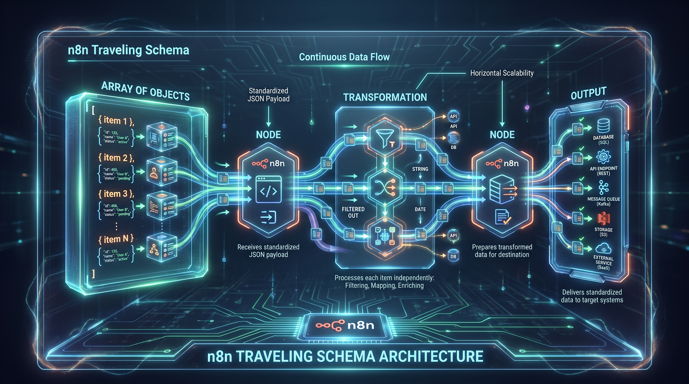
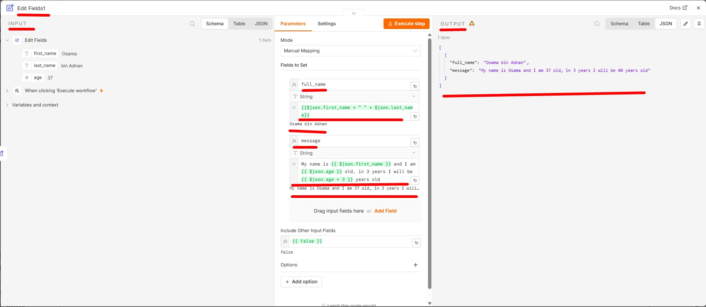

# Lesson 05: n8n Code Expressions and Agentic AI Architecture

Repo Link **[03_code_expressions](https://github.com/panaversity/learn-low-code-agentic-ai/tree/main/03_code_expressions)**

## 1. Executive Summary & Architectural Paradigm

- The software engineering landscape is experiencing a tectonic shift from traditional, manually intensive development to the era of Agentic AI.
- At this juncture, the strategic differentiation between "No-Code" and "Low-Code" is no longer semantic; it is the foundation for building scalable enterprise automations.
- While No-Code platforms prioritize a drag-and-drop experience that often concludes at a "logic wall," n8n serves as a Low-Code platform.
- This "Low-Code" status acts as a vital safety valve, allowing developers to handle 90% of a build visually while retaining the power to inject custom JavaScript or Python scripting for complex business logic.

Building professional-grade applications within this paradigm requires a cohesive, four-tier Full-Stack Agentic AI Ecosystem:

- **UX Pilot:** The design entry point where wireframing and blueprints are generated via AI prompting. These designs are exported as Figma or Canva files to maintain professional design standards.
- **Lovable:** The frontend engine. It imports the files from UX Pilot to generate functional UI code, bridging the gap between static design and interactive interfaces.
- **n8n:** The orchestration "brain." It manages the backend logic, connects disparate services, and executes complex workflows. Notably, n8n is evolving toward a text-to-workflow generation model, similar to Lovable, which will further accelerate development cycles.
- **Supabase:** The persistent data layer, utilizing a PostgreSQL and Vector database environment to manage AI memory and structured storage.

The integration of this stack is maintained through Webhooks for data input and Respond to Webhook nodes for UI output, while the Model Context Protocol (MCP) provides the standardized framework for agent-to-tool connectivity. As this architecture scales, it necessitates a rigorous validation process, ensuring that developers are equipped to handle the complexities of the Panaversity stack.

## 2. Administrative Protocols: Certification & Proctoring

To safeguard the professional value of the "Panaversity" credential in the global marketplace, we have implemented a high-stakes certification infrastructure. The rigor of these exams is comparable to the CKAD (Certified Kubernetes Application Developer) standards, ensuring that certified individuals possess verifiable technical proficiency.

### Exam Structural Breakdown

Certification is divided into two primary paths, focusing on prompt precision and technical execution:

| Exam ID | Focus Area | Question Count | Format/Nature |
| --- | --- | --- | --- |
| Exam 00 | Prompt & Context Engineering | 115 | Scenario-based, practical application |
| Exam 01-08 | n8n & Low-Code Agentic Stack | 155 | Technical proficiency & workflow logic |

### Proctoring & Integrity Standards

Maintaining the integrity of the credential requires strict anti-cheating protocols for both remote and on-site sessions:

- **Live Monitoring:** Remote candidates must be visible via Zoom or Google Meet, monitored in real-time by professional proctors.
- **Physical Environment Checks:** Mandatory 360-degree room scans and desk checks are performed prior to start. No physical aids—including paper, pencils, or external devices—are permitted.
- **On-Site Option:** Registered students may opt for proctored, on-site testing at designated locations like the Governor House.

### Fee & Attempt Policy

Students are provided two free attempts per exam. Subsequent attempts, or attempts by non-registered individuals, require a fee of Rs 1,000. This fee is not a profit mechanism but a quality control measure to compensate professional proctors and maintain the platform's global recognition.

Having established the professional environment, developers must optimize their local setup for continuous prototyping.

## 3. Developer Optimization: SaaS Trial Workaround

Cost-effective prototyping is a core skill for a solutions architect. To maximize testing periods on n8n Cloud without the friction of managing multiple email accounts, developers utilize "Gmail Sub-Mapping."

### The Gmail Sub-Mapping Tutorial

This technique exploits the fact that SaaS providers view sub-addresses as unique IDs while Gmail treats them as a single primary inbox.

1. **Identify your primary account:** e.g., architect@gmail.com.
2. **Apply the + syntax:** Add a unique tag after your username but before the @ symbol (e.g., **architect`+1`@gmail.com**).
3. **Iterative Registration:** When a trial expires, register a new account using a new tag (e.g., +2, +3).
4. **Centralized Management:** All verification links and platform communications will funnel into your primary architect@gmail.com inbox.

Once the developer environment is optimized, the focus shifts to the technical core of data movement: the "Traveling Schema."

## 4. Core n8n Data Architecture & The Traveling Schema

In n8n, data is never static; it exists as a "Traveling Schema." This standardized JSON structure ensures interoperability across disparate nodes, whether they are processing a single lead or a thousand database rows.

### The Array of Objects Structure

n8n processes all data as an Array of Objects. Even if a node produces only one result, it is wrapped in an array. This allows the workflow to scale horizontally by processing multiple items in parallel using the same logic.

### Primary Data Keys

Within the n8n data object, three critical keys define the payload:

- **json:** This key refers to the specific JSON object within the array. It contains all structured text, numerical values, and boolean data.
- **binary:** Used for handling files, images, and non-textual assets.
- **pairedItem:** A metadata link used for backend traceability, allowing n8n to maintain the relationship between input and output items throughout complex transformations.

To interact with this schema effectively, developers must master the syntax used to query and manipulate these objects.

---

  
  
<b><u>Core n8n Data Architecture & The Traveling Schema</u></b>
  

---

## 5. Syntax Engineering: n8n Code Expressions

n8n expressions are the platform’s internal scripting language. Based on JavaScript principles and utilizing **"Tournament"** syntax, they allow for dynamic parameterization of nodes.

### Expression Fundamentals

Within the standard Expression Tab of any node, logic is wrapped in double curly braces {{ }}. The editor provides "Live Compilation" feedback: Green indicates a valid resolution, while Red indicates a syntax error.

### Integrated Libraries

n8n provides two core libraries out-of-the-box for advanced data handling:

- **Luxon:** For sophisticated Date/Time manipulation and timezone conversions.
- **JMESPath:** A powerful query language for filtering and searching complex JSON structures within a workflow.

### Data Access Notations

Referencing data across the "Traveling Schema" follows specific conventions:

- **Current Node:** Accessed via $json.fieldName. (Note: Double curly braces are used in the Expression tab, but omitted when writing logic inside a Code Node).
- **Prior Nodes:** Referenced using $('NodeName').all() or specific attributes from an earlier step (e.g., student_data).
- **Workflow Variables:** Global constants are accessed via the $vars object.
- **Metadata:** Global values such as now or today provide real-time timestamps.

While expressions handle single-line transformations, multi-line algorithmic logic requires the transition to the Code Node.

---

  
  
<b><u>Current Node</u></b>
  

---

## 6. Advanced Logic via the Code Node

The Code Node is utilized when a developer graduates from simple data mapping to implementing complex algorithms and multi-line logic.

### Multi-Language Support & Performance

The node supports both JavaScript and Python. However, from an architectural standpoint, JavaScript is the preferred language for performance-critical tasks within n8n. Python may exhibit slower execution speeds due to the underlying environment overhead compared to the native Node.js execution of JavaScript.

### Structural Requirements

- **Variable Declaration:** Developers should use modern JS conventions (let, const).
- **Processing:** Logic often involves iterating over the input array using loops (e.g., for...of).
- **The Return Statement:** A Code Node must return an Array of Objects. If the return structure does not match the n8n "Traveling Schema," the workflow will fail to pass data to subsequent nodes.

The logic within these nodes frequently centers on sanitizing raw data and building decision-making systems.

## 7. Data Manipulation & Boolean Decision Systems

Data transformation is the process of converting raw input into "clean" actionable information. Mastering standard methods is essential for professional-grade automation.

### String and Numerical Methods

- **Sanitization:** Use .trim() to remove whitespace and .toUpperCase() / .toLowerCase() to standardize entries for database parity.
- **Extraction:** Use .slice() and .length to parse specific data strings (e.g., extracting a country code).
- **Precision:** Use .toFixed() for financial data decimal control, and Math.floor() or Math.ceil() for rounding logic.

### Boolean Logic and Branching

Decision-making in n8n is driven by boolean evaluation. Comparison operators (e.g., age > 18) return a literal true or false. This "Eligibility Logic" is often implemented via the Ternary Operator (condition ? valueIfTrue : valueIfFalse) or passed directly to an IF Node. These boolean results dictate the conditional branching of the entire agentic system.

## 8. Troubleshooting & Technical FAQ

Development is an iterative process requiring efficient localized testing and legacy support.

### Local Webhook Resolution

A common hurdle is receiving external pings (e.g., from the Meta API for WhatsApp) on a local n8n instance. Since local instances lack public URLs, developers must use the tunnel flag: n8n start --tunnel This generates a temporary, public URL that routes external traffic into the local development environment for testing.

### Legacy Integration: Excel vs. API

For legacy data sources like Excel, a distinction must be made between manual and automated workflows:

- **Manual:** Files can be uploaded directly into the workflow for one-time processing.
- **Automated:** For persistent data, architects should prioritize automated API pulls from cloud-based spreadsheets (e.g., Google Sheets or Excel Online) to ensure the "Traveling Schema" remains dynamic.

In summary, the journey through the Agentic AI stack moves from visual UI design to the complex backend orchestration of n8n. By mastering the Traveling Schema and the logic of the Code Node, developers can transform raw data into high-value, automated solutions.
