# Large Language Model Mechanics and n8n Agentic Workflow Architecture

## 1. The Strategic Paradigm Shift: From Prompting to Agency

- The artificial intelligence landscape is undergoing a fundamental strategic pivot, moving from the era of static prompt engineering to the deployment of autonomous Agentic AI.
- For senior architects and digital transformation leaders, it is critical to recognize that the Large Language Model (LLM) has evolved.
- It is no longer merely a sophisticated text generator; it has become a Reasoning Engine capable of orchestrating complex, multi-step business processes.
- This report bridges the gap between the theoretical backend mechanics of LLMs and the practical application of these technologies within the n8n automation ecosystem.
- By mastering the technical governances that dictate model behavior, developers can move beyond simple chat interfaces toward resilient, enterprise-grade agentic architectures.

## 2. Part 1: [Deep Dive into the 10 Critical Technical Questions of LLMs](https://sloanreview.mit.edu/article/how-llms-work/) (Document link also present in prompt engineering Repo [00_prompt_engineering](https://github.com/panaversity/learn-low-code-agentic-ai/tree/main/00_prompt_engineering))

Navigating the internal mechanics of LLMs is a strategic imperative for founders and architects. Grounded in research from MIT’s Ramakrishna, we must address the following ten technical constraints to build reliable systems.

### 2.1. Generation Dynamics and Stop Conditions

LLMs do not output content in blocks; they predict and generate text one token at a time. As an architect, you must manage three enforcement mechanisms that dictate when this generation halts:

- **Maximum Output Tokens:** A hard limit enforced by the developer to manage Inference-time overhead and costs.
- **Pre-trained Stop Tokens:** Markers embedded during training (e.g., [END]) that signify the model has reached a natural conclusion.
- **Custom Stop Sequences:** User-defined strings that trigger an immediate halt.
  - **Technical Nuance:** These are often case-sensitive. For instance, setting a stop sequence for "Qaid" may not trigger if the model generates "qaid." This is a frequent point of failure in troubleshooting generative workflows.

**The Architectural Insight:** The LLM generates the token, but the hosting environment (OpenAI, Google, or a local server) is the actual enforcer that recognizes the sequence and terminates the connection.

---

  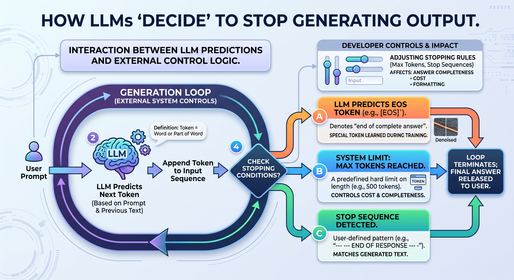
  
<b><u>Generation Dynamics and Stop Conditions</u></b>
  

---

### 2.2. Real-Time Weight Updates vs. Session Memory

A common architectural misconception is that correcting a model during a chat updates its core intelligence. Base models are static. If a user "corrects" a model by stating 1+1=3, that model does not learn this for other users; its core weights remain untouched.

Instead, we utilize Session-Based Context Windows to simulate learning by passing history back and forth. While platforms like ChatGPT and Gemini use a Personalization Memory schema to store user-specific data (like names or preferences) across threads, architects must realize that providers have not yet exposed these exact schemas. This "Black Box" nature of personalization memory means we cannot currently audit exactly what data is being prioritized or stored.

---

  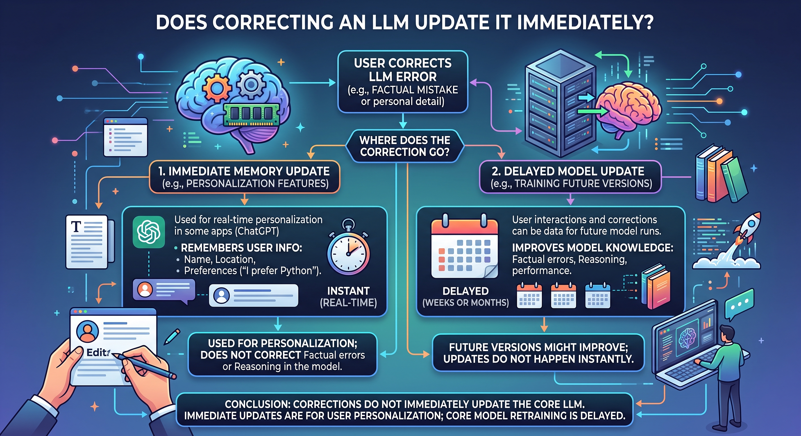
  
<b><u>Real-Time Weight Updates vs. Session Memory</u></b>
  

---

### 2.3. Temporal Knowledge Management and Memory Retrieval

AI memory mimics human cognitive structures: long-term, short-term, and procedural. To manage data over extended periods without exhausting the context window, we employ:

- **Summarization:** Condensing previous interactions to preserve core context.
- **External Databases:** Utilizing Vector and Graph Databases to retrieve specific facts (e.g., project details from a month ago) only when relevant.

---

  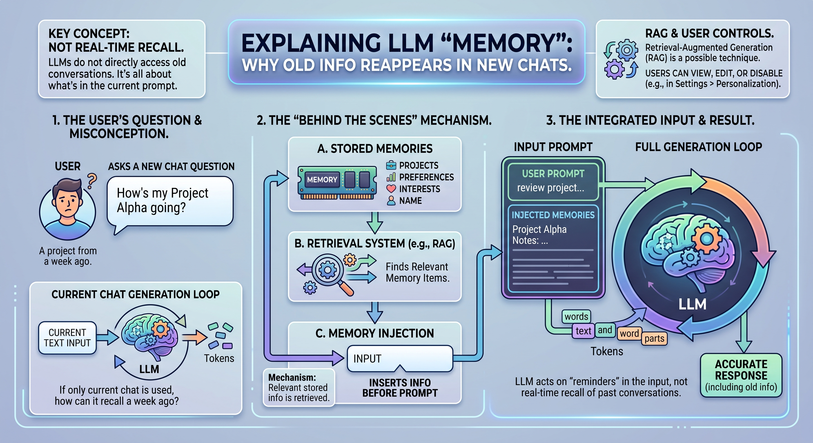
  
<b><u>Temporal Knowledge Management and Memory Retrieval</u></b>
  

---

### 2.4. Overcoming Knowledge Cut-Offs via Tool Calling

LLMs are essentially "frozen in time" at their training cut-off date. To bridge the gap to current events—such as a hypothetical future release of Gemini 3—we use Tool Calling. This allows the reasoning engine to trigger web searches or RAG queries, providing the model with real-time data it could not possibly have known during pre-training.

---

  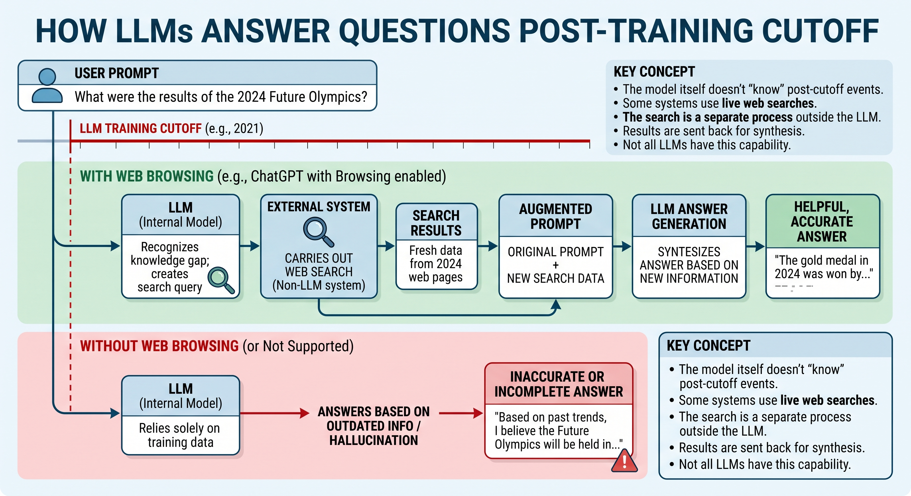
  
<b><u>Overcoming Knowledge Cut-Offs via Tool Calling</u></b>
  

---

### 2.5. The Myth of 100% Document-Only Constraints

From a deployment perspective, it is technically impossible to restrict an LLM to a single document with 100% certainty. Even with strict system prompts, the vast patterns learned during pre-training will influence the output. The model is a generative engine, not a closed search index; architects must plan for the inherent "leakage" of pre-trained knowledge.

---

  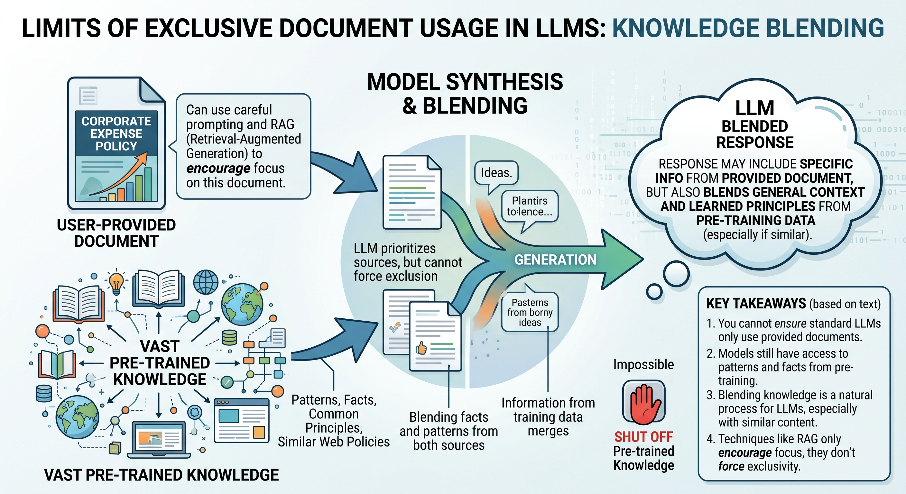
  
<b><u>The Myth of 100% Document-Only Constraints</u></b>
  

---

### 2.6. The Hallucination Crisis and Citation Validity

We must issue a stern technical warning: LLM-generated citations cannot be trusted without manual or automated validation. Models are designed to predict the next logical token, which frequently leads to the invention of plausible-sounding but non-existent books, quotes, or legal precedents.

---

  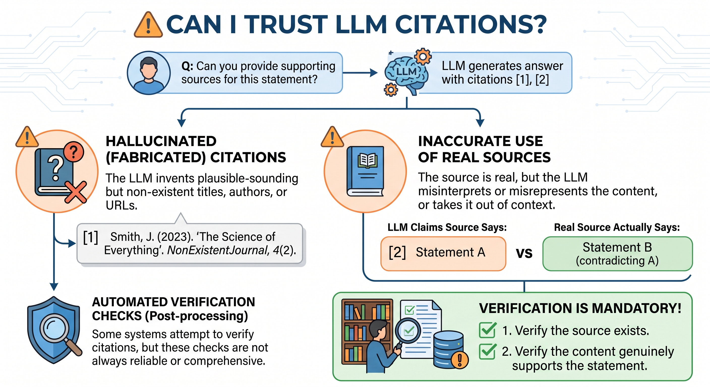
  
<b><u>The Hallucination Crisis and Citation Validity</u></b>
  

---

### 2.7. RAG vs. 1M+ Long Context Windows

While context windows now exceed one million tokens, Retrieval-Augmented Generation (RAG) remains the superior architectural choice for most enterprise applications due to:

- **Cost & Latency:** Processing 1M tokens per query is prohibitively expensive and slow.
- **"Lost in the Middle":** LLMs tend to overlook data buried in the center of massive files.
- **Surgical Precision:** RAG acts as a "surgical strike," providing the model with only the most relevant page of data, whereas long context is a "shotgun approach."

---

  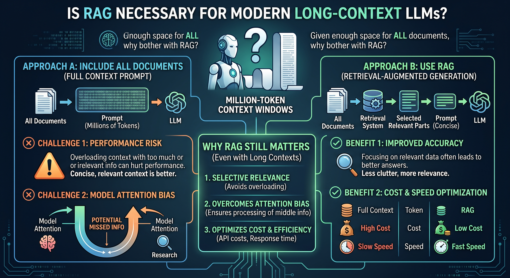
  
<b><u>RAG vs. 1M+ Long Context Windows</u></b>
  

---

### 2.8. Mitigation Strategies for Hallucinations

While hallucinations cannot be entirely eliminated, they are mitigated through Cosine Similarity in vector searches and real-time tool calling. The goal for a Senior Architect is to move accuracy from 70% to 90%+, acknowledging that the final 10% requires an Architectural Guardrail.

---

  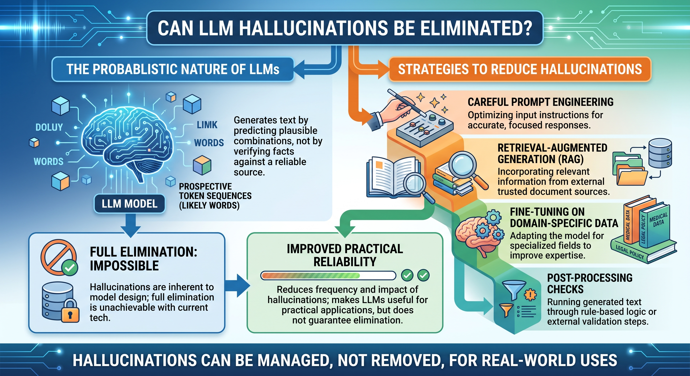
  
<b><u>Mitigation Strategies for Hallucinations</u></b>
  

---

### 2.9. Scalability of Output Verification: AI as a Judge

Human review is the gold standard but does not scale. To achieve enterprise reliability, we implement an "AI as a Judge" architecture where a secondary, often more restricted LLM, validates the primary output.

- **Strategic Requirement:** Professional deployments should utilize Test-Driven Development (TDD) and involve Domain Experts (e.g., Oncologists for medical AI) to curate the initial validation sets for these AI judges.

---

  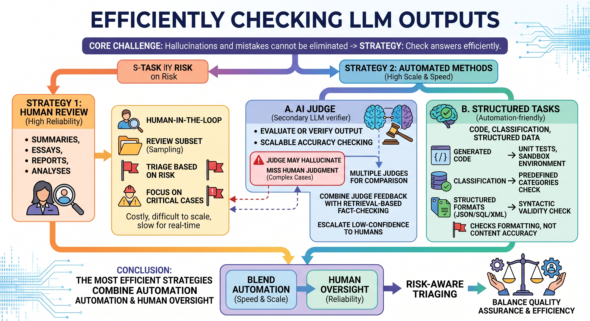
  
<b><u>Scalability of Output Verification: AI as a Judge</u></b>
  

---

### 2.10. Determinism, Temperature, and Server-Side Caching

To combat the inherent randomness of generative AI, we set Temperature to 0 (Greedy Decoding), forcing the model to choose the most probable next token. Furthermore, architects should implement Server-Side Caching as a core cost and latency optimization strategy. For identical queries, a cached response can be returned in 0.005s, compared to a 12s inference-time overhead for a fresh call.

---

  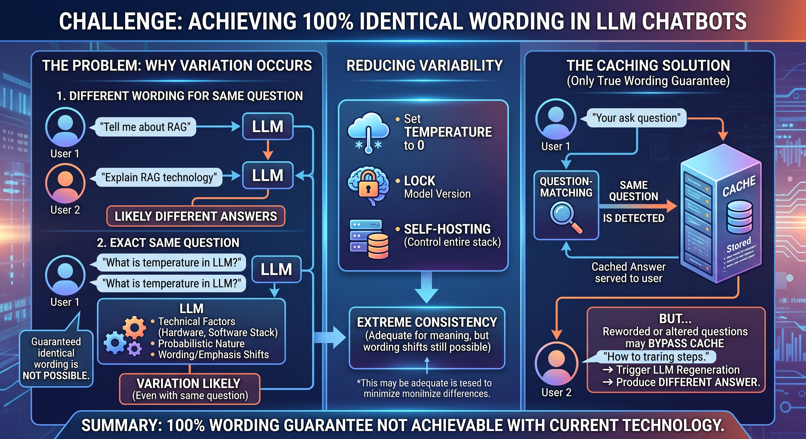
  
<b><u>Determinism, Temperature, and Server-Side Caching</u></b>
  

---

## 3. Part 2: n8n Agentic Workflows and Node Architecture

Transitioning from theory to implementation, n8n provides the infrastructure to transform a reasoning engine into a functional agent. In this environment, we move from simple automation to Agentic AI, where the model autonomously selects tools to achieve a defined goal.

### 3.1. Taxonomic Classification of n8n Nodes

Architects must understand the three-tier node structure in n8n:

1. **Trigger Nodes:** The entry point (e.g., 'On Chat Message').
2. **Action/Core Nodes:** Often called "God Nodes" (like 'Code' or 'Set'), these handle the heavy lifting of logic and data manipulation.
3. **Cluster Nodes:** Complex groupings that represent a 10x performance leap by consolidating sub-functional nodes into a single unit.

---

  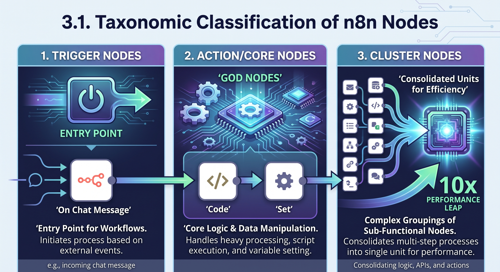
  
<b><u>Taxonomic Classification of n8n Nodes</u></b>
  

---

### 3.2. Anatomy of the 'AI Agent' Cluster Node

The AI Agent node is a high-performance cluster that connects a root node to three essential sub-components:

- **The Brain (The Model):** Exactly one Reasoning Engine (e.g., Gemini).
- **Memory:** Exactly one memory node (e.g., Simple Memory) with configurable limits (e.g., 5 or 10 messages).
- **Tools/Actions:** Unlimited external connections (e.g., PostgreSQL, Hacker News, Weather APIs).

---

  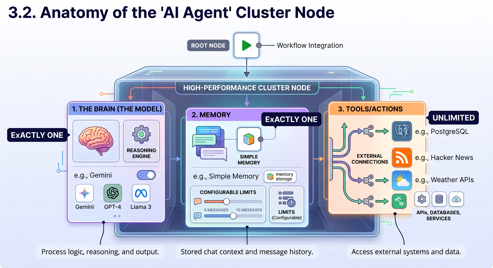
  
<b><u>Anatomy of the AI Agent Cluster Node</u></b>
  

---

### 3.3. The Agentic Execution Lifecycle

The execution flow within n8n follows a clinical, recursive loop:

1. **Trigger:** A user message enters the workflow.
2. **Agent Initialization:** The Agent node centralizes the signal.
3. **Brain Consultation:** The message is sent to the Brain (LLM).
4. **Decision Point:** The Brain decides whether to provide an immediate answer or call a Tool.
5. **Tool Execution:** If required, the Tool executes and returns data to the Brain for synthesis.
6. **Final Response:** The Brain produces the final output for the user.
7. **Memory Write:** The interaction is stored in the database for future context.

---

  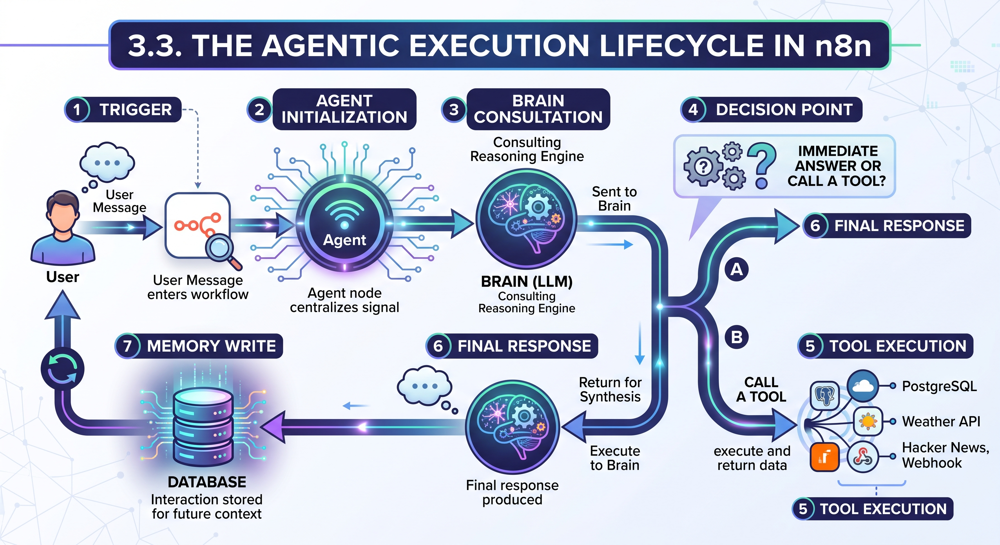
  
<b><u>The Agentic Execution Lifecycle</u></b>
  

---

### 3.4. Strategic Implementation: Portfolios and Performance

To professionalize these skills, architects should focus on the following:

- **Portfolio Development:** Demonstrate expertise by building and showcasing agentic workflows on LinkedIn and Twitter. Focus on real-world use cases like inventory management or automated research.
- **Cost Management:** Distinguish between n8n execution fees and LLM token costs.
- **Bottleneck Troubleshooting:** Watch for latency in API roundtrips. For example, connecting a large PostgreSQL database can cause significant lag; optimize by utilizing specific tool calls rather than reading entire tables.

Combining deep LLM mechanics with the modular power of n8n represents the next frontier of professional automation. The time to build your portfolio and implement these reasoning engines is now.

---

  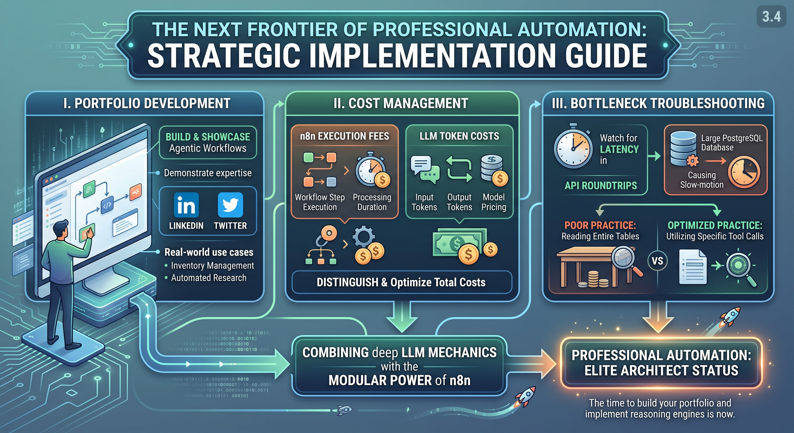
  
<b><u>Strategic Implementation: Portfolios and Performance</u></b>
  

---