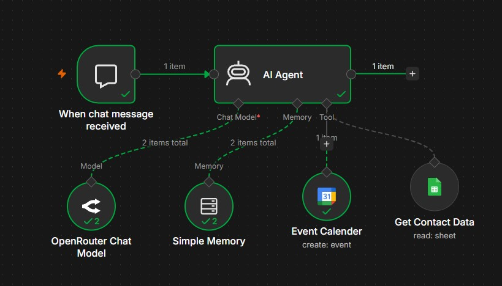
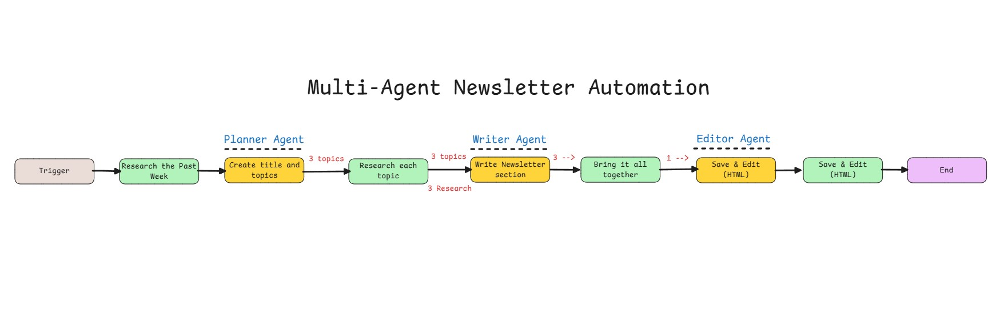
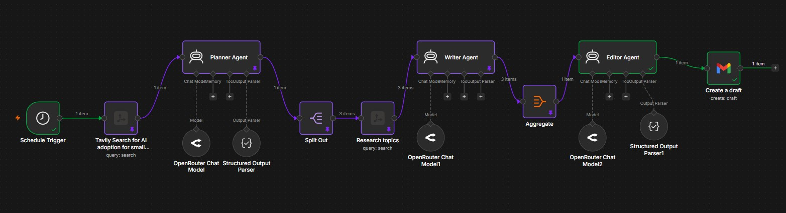

# Lesson 07: Architecting Single and Multi-Agent AI Workflows in n8n

**[04_ai_agents](https://github.com/panaversity/learn-low-code-agentic-ai/tree/main/04_ai_agents)**

## 1. Paradigm Shift: From Sequential Automation to Agentic Systems

The landscape of business automation is undergoing a fundamental strategic evolution. For years, we relied on traditional, linear "if-then" sequential automation—deterministic paths where software followed a rigid script. However, the modern enterprise requires systems capable of handling non-deterministic tasks that require reasoning and adaptability. We are moving from mere "programming" to true "delegation" through agentic workflows.

In the n8n ecosystem, an AI Agent functions as an autonomous middleman. To understand this, consider two primary analogies from the field:

- **The Travel Agent:** Unlike a search engine that merely lists flights, a travel agent takes a goal—"I want to tour Pakistan"—and autonomously reasons through the requirements. They book the flights, reserve the hotels, and generate a custom itinerary, making decisions on your behalf.
- **The Carpenter:** An LLM on its own is like a carpenter without a toolbox. It has the "skill" (intelligence) but lacks the physical means to act. By providing the agent with "tools" (APIs, file access), it becomes a carpenter equipped with a hammer and saw, capable of manipulating the external world to complete a task.

### Strategic Comparison: Traditional vs. Agentic Automation

| Feature | Traditional Sequential Automation | Agentic Automation |
| --- | --- | --- |
| Decision-Making | Pre-defined, rigid "if-then" logic. | Autonomous reasoning based on goal-state. |
| Flexibility | Breaks if input deviates from the script. | Highly adaptable to non-deterministic inputs. |
| Tool Usage | Fixed integrations called in a static order. | Dynamic selection of tools via semantic reasoning. |
| Execution | Programmed step-by-step. | Delegated to the agent's internal logic. |

The strategic advantage of this shift is clear: instead of building every conceivable branch of a logic tree, we architect an environment where an agent can coordinate execution based on intent.

## 2. The Anatomy of a Single-Agent Node Configuration

Building stable AI agents requires a modular, architectural approach. In n8n, agentic workflows are visualized and executed as Cluster Nodes. This consists of a Root Node (the AI Agent) and several Subnodes (Brain, Memory, Tools) that "plug into" it to provide cognitive structure.

### The Chat Trigger Node: The Entry Point

The Chat Trigger Node is the primary interface for real-time interaction. Unlike manual triggers, it initiates a chat UI and generates three critical variables for the downstream workflow:

1. `sessionID`: Unique identifier to maintain conversation continuity.
2. `action`: The specific intent or trigger type.
3. `chatInput`: The raw user query.

### The AI Agent Node: The Root Node

The AI Agent node acts as the central coordinator. A key architectural decision here is the Source for Prompt configuration:

- **Connected Chat Trigger:** The agent pulls data directly from the trigger.
- **Define Below:** This is the preferred choice for architects. It allows you to use n8n expressions to augment user input with metadata or specific context before it reaches the LLM.

The "So What?" Layer: Selecting "Define Below" is critical for user experience. It allows you to wrap the user's raw query in a strategic framework—injecting specific data points that the user might not have provided—ensuring the agent makes an informed decision the first time.

## 3. Subnode Architecture: Intelligence and Contextual Persistence

Intelligence is useless without structure. We attach subnodes to the Root Node to define the agent's "Brain" and "Memory."

### The Chat Model Subnode (The Brain)

The Chat Model is the engine. For standard high-speed tasks, we utilize Gemini 1.5 Flash.

- **Configuration:** Generate an API key via Google AI Studio.
- **Integration:** In n8n, create credentials for "Google AI" and test the connection until you receive the "Connection Tested Successfully" confirmation.
- **Strategic Choice:** Flash is optimized for low latency, making it ideal for the "coordinator" role in single-agent clusters.

### The Memory Subnode (Contextual Persistence)

LLMs are inherently stateless; they do not "remember" the last message unless we provide a historical buffer.

- **Window Buffer Chat Memory:** This subnode tracks the conversation history using the sessionID.
- **Configuration:** Set a Context Length (e.g., 10 messages). This allows the agent to maintain relevance (e.g., remembering the user’s name or previous requests) without exceeding the token limit or causing latency by overloading the model with irrelevant past data.

## 4. Expanding LLM Capabilities: Tool Integration & Autonomous Selection

To overcome the "bare-handed carpenter" limitation, agents use Tools. These allow the LLM to access real-time data or interact with external systems.

### Technical Guide: The Google Sheets Tool

- **Authentication:** OAuth2 is used to link your Google account.
- **Operation:** Select "Get Rows" to retrieve data.
- **The "So What?" Layer:** The agent uses Semantic Search over the Tool Name (e.g., get_contact_data) and Tool Description. When a user asks, "What is Sir Zia’s email?", the agent reviews its toolbox, sees a tool described as "Call this to get user data such as email," and reasons that this is the correct tool to invoke. Metadata is the language of autonomous decision-making.

---

<div align="center">
  
  <p><b><u>Single Agent Workflow Orchestration</u></b></p>
</div>

I have added json workflow file as well in the folder.But due to secrets and credentials, I can't share it on repo directly.

---

### Technical Guide: The Google Calendar Tool

- **Operation:** Select "Create an Event."
- **Dynamic Logic:** To handle 1-hour default bookings, we use the n8n expression logic: `{{ $now.plus({hours: 1}) }}`. By adding an hour to the "Start Time," the agent autonomously schedules the end time without further user input.

### Troubleshooting Flow

Architects must monitor n8n logs to verify tool invocation. Logs provide a step-by-step look at how the LLM receives the prompt, selects the tool, processes the tool's return data, and synthesizes it into a final answer.

## 5. Orchestrating Multi-Agent Systems (MAS): [The Newsletter Case Study](https://github.com/panaversity/learn-low-code-agentic-ai/blob/main/04_ai_agents/n8n_multi_agent_tutorial.md)

Complex business problems—like producing a high-quality weekly newsletter—often exceed the capabilities of a single agent. Multi-Agent Systems (MAS) solve this by assigning specialized agents to distinct stages: Schedule -> Research -> Planning -> Writing -> Editing -> Draft Creation.

---

<div align="center">
  
  <p><b><u>Multi-Agent Workflow Orchestration</u></b></p>  
</div>

---

## 6. Step-by-Step Multi-Agent Workflow Construction

### 1. The Schedule Trigger

Architected for consistency, the workflow is set to trigger every Sunday at 9:00 AM, ensuring the newsletter is ready for the start of the business week without manual intervention.

### 2. Tavily Search Node (Initial Research)

Tavily is a specialized AI search engine.

- **Query:** "AI adoption for small businesses."
- **Configuration:** Topic set to "News," Max Results set to "3."
- **Strategic Feature: Pin Data:** Always use "Pin Data" during development. This caches the research results in n8n, preventing redundant API calls to Tavily, which saves costs and eliminates latency while you build the rest of the workflow.

### 3. The Planning Agent

- **System Persona:** "Expert Newsletter Planner."
- **Output Requirements:** One catchy title (≤80 chars) and exactly three subtopics.
- **The "So What?" Layer (Data Flattening):** n8n uses a special variable `$json` to refer to the input data from the previous node. Often, this data is returned as a nested object that LLMs struggle to parse. To solve this, we use a Javascript mapping expression to flatten the result into a clean string:

```javascript
{{ $json.results.map(item => JSON.stringify(item, null, 2)).join('\n\n') }}
```

- **Structured Output Parser:** Use a JSON Schema to force the agent to output a 'title' and a 'topics' array, ensuring the next node receives predictable data.

### 4. Split Out & Deep Research

The Split Out Node takes the topics array and converts them into individual items. This enables parallel deep research. In the second Tavily node, we enable "Include Raw Content." Unlike a standard snippet, this extracts the full HTML text of the article, providing the writing agent with the full raw data required for high-depth content generation.

## 7. From Raw Data to Editorial Polish: Writing and Delivery

### Section Writer Agent

This agent focuses solely on the drafting phase. It takes the "Raw Content" from the research phase and writes a detailed section for each of the three topics.

### Aggregate Node

After the sections are written in parallel, the Aggregate Node merges these separate items back into a single list. This prepares the data for the final editorial review.

### The Editor Agent

- **System Persona:** "Chief Editor."
- **Strategic Requirement:** The editor must synthesize disparate sections into a unified HTML email.
- **Model Selection (Flash vs. Pro):** For this node, we upgrade to Gemini 1.5 Pro. While the Flash model is excellent for volume, it often fails to adhere to complex JSON schemas during high-level reasoning. The "Pro" model provides the superior reasoning necessary to maintain the HTML structure and adhere to the output schema.

### The Gmail Node

The workflow concludes with a "Create a Draft" action. By mapping the HTML body to a Gmail draft rather than sending it immediately, we maintain a Human-in-the-Loop architecture. This allows for a final manual review to ensure the "Editorial Polish" meets brand standards.

---

<div align="center">
  
  <p><b><u>Multi-Agent Workflow Orchestration</u></b></p>  
</div>

---

I have added json workflow file as well in the folder.But due to secrets and credentials, I can't share it on repo directly.


### Final Architectural Summary

The success of agentic systems relies on Model Tiering. Use Gemini 1.5 Flash for high-volume research and drafting to keep costs and latency low. Reserve Gemini 1.5 Pro for the "Editor" or "Architect" nodes where complex structural outputs and deep synthesis are non-negotiable. If you encounter schema parsing errors, it is a signal that your task complexity has outstripped the model's reasoning capacity.
