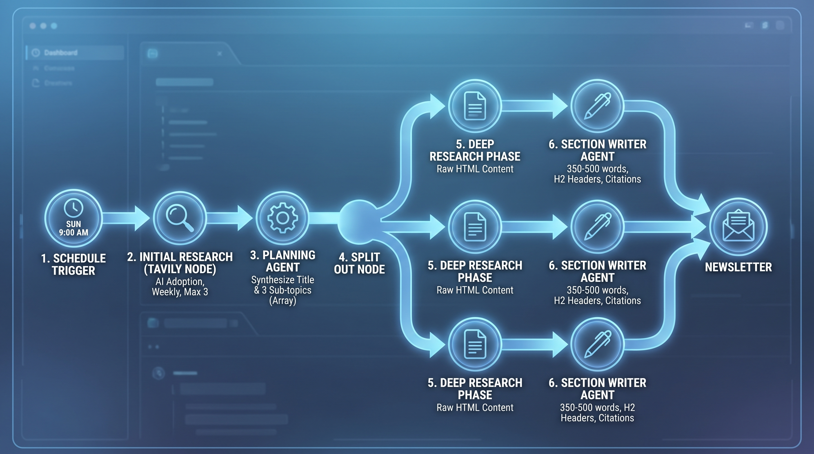
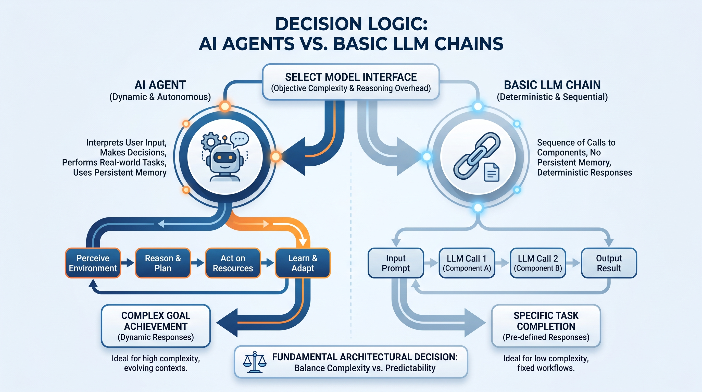
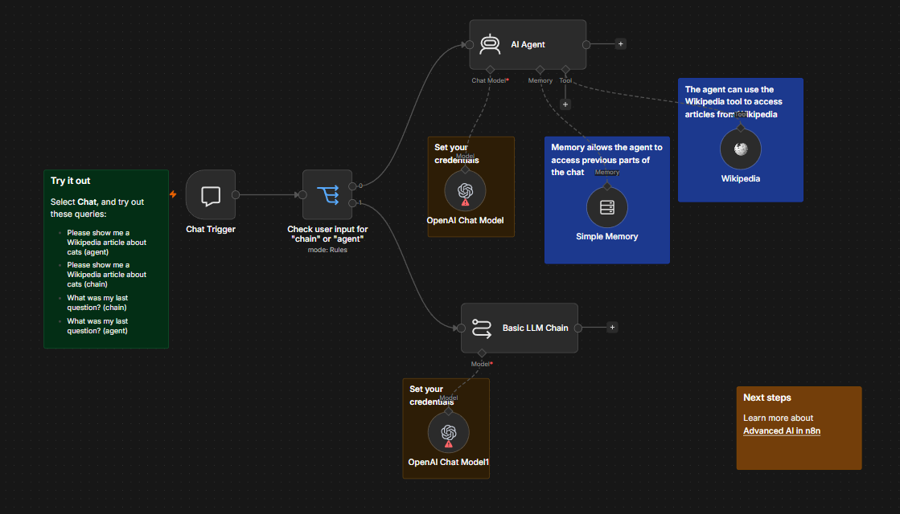
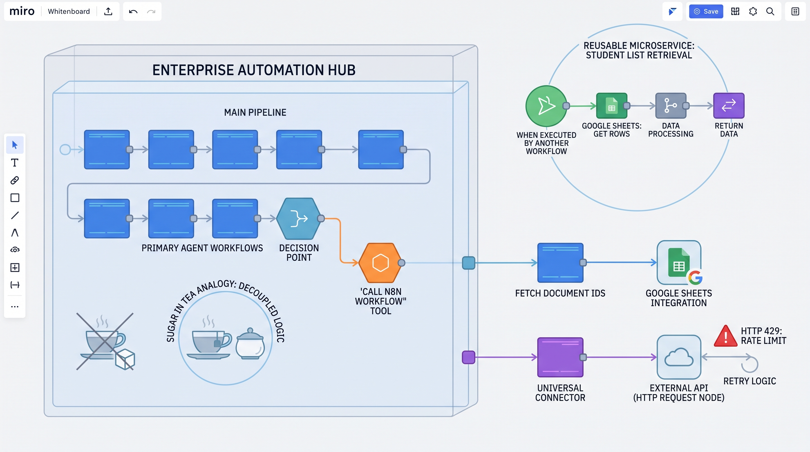
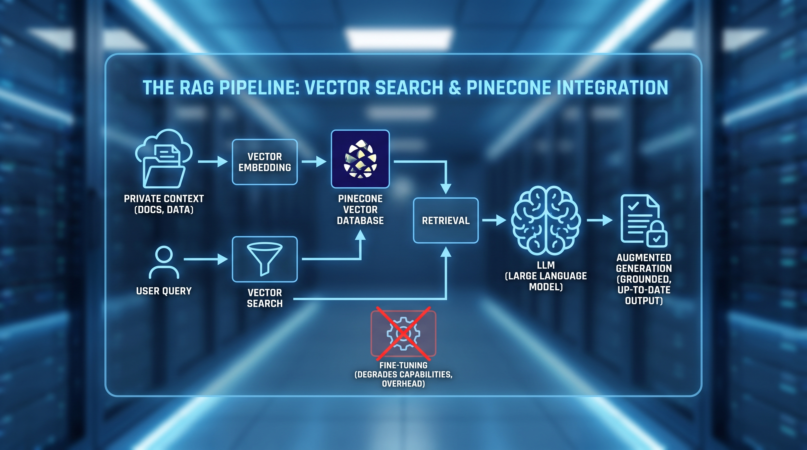
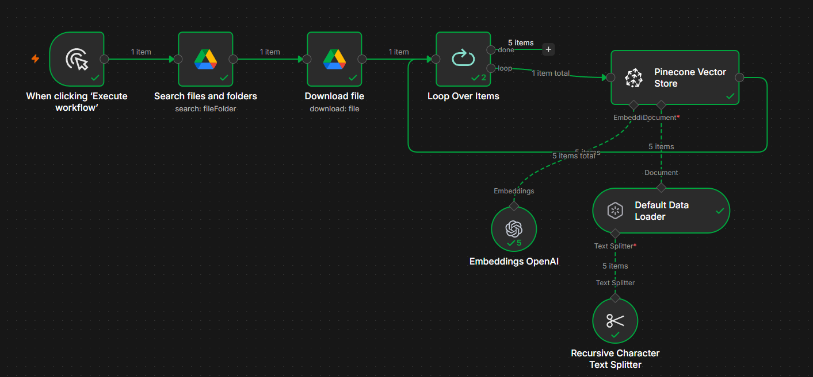
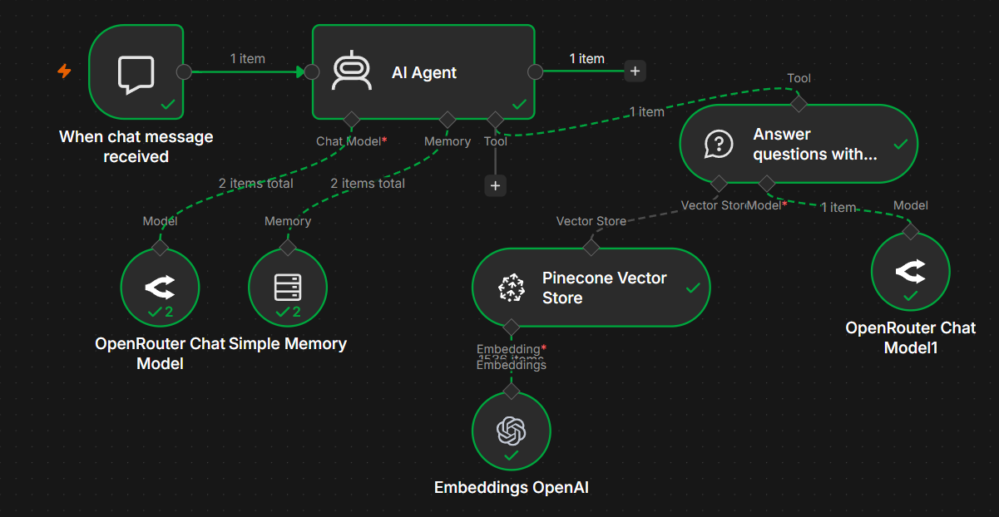

# Lesson 08: Multi-Agent Automation and RAG Implementation in n8n

**[04_ai_agents](https://github.com/panaversity/learn-low-code-agentic-ai/tree/main/04_ai_agents)**

## 1. Strategic Architecture of Multi-Agent Newsletter Automation

AI automation is evolving from single-agent systems to multi-agent architectures. Traditional single-agent setups—where one model handles research, synthesis, and formatting—suffer from context dilution and poor output quality. Multi-agent systems enforce task isolation: each agent specializes in one focused role within an optimized context, like a high-performance departmental team. This specialization delivers significantly higher accuracy and professional-grade output.

### End-to-End Pipeline Architecture

The automated newsletter generation system is engineered as a sequential, high-fidelity pipeline:

1. **The Schedule Trigger:** The workflow is governed by a temporal logic trigger set for autonomous execution every Sunday at 9:00 AM, ensuring consistent delivery without manual oversight.
2. **Initial Research (Tavily Node):** The pipeline initiates a broad web-search via the Tavily API. To ensure temporal relevance for topics like "AI Adoption for Small Businesses," the node is configured for a weekly time range with a max_results parameter of 3.
3. **The Planning Agent:** This agent functions as the system's architect. It is programmed via system instructions to synthesize initial research into a compelling title and exactly three sub-topics. Technical Dependency: The Planning Agent is specifically instructed to output these sub-topics as an array, a prerequisite for the downstream Split Out node.
4. **The Split Out Node:** This node transforms the single array item into three separate data objects. This decomposition is critical for the sequential processing of individual newsletter sections.
5. **Deep Research Phase:** Each sub-topic undergoes secondary research using the Tavily API. Crucially, the "Include Raw Content" parameter is enabled. Unlike default searches that return summaries or key points, this extracts the full HTML body of source articles, providing the raw material required for substantive long-form writing.
6. **Section Writer Agent:** Assigned to specific sub-topics, this agent synthesizes raw research into a structured narrative. Specifications include a 350–500 word count per section, H2 Markdown headers, and mandatory citation of source references.

---

  
  
<b><u>End-to-End Pipeline Architecture of Newsletter Automation</u></b>
  

---

### Final Assembly and Delivery

The terminal phase utilizes an Aggregation Node to consolidate individual items back into a cohesive dataset. The Editor Agent then processes this content, applying HTML/CSS inline styling for a professional layout. A notable architectural nuance is the use of the $now expression (e.g., $now.format('d MMMM yyyy')) to inject the current date—such as "8 October 2025"—as LLMs lack an internal clock for real-time temporal awareness. Finally, the Gmail Node converts the styled content into a formatted draft, ready for final distribution.

## 2. Core Mechanics: Workflow Execution and Sequential Processing

Maintaining transparency in data flow is essential for debugging high-complexity agentic systems. In n8n, the architecture relies on sequential processing of multi-item data arrays to maintain data integrity.

### Sequential Processing Logic

When an array of sub-topics enters the workflow after a Split Out node, n8n processes items one by one. This is an intentional architectural choice to prevent "data leakage" between sections. By processing sequentially, the system ensures that the **`$json`** variable refers strictly to the properties of the current object in the loop. This provides each section of the newsletter with dedicated computational focus, ensuring the research for Topic A does not contaminate the writing for Topic B.

### Inspecting Execution Logs

For performance optimization, architects must utilize the n8n execution logs. The UI provides a real-time "loading" visual during execution, pinpointing which node is currently active. By inspecting the Input and Output boxes, developers can track the transformation of data at every step. This granular visibility is the primary tool for identifying whether a specific research tool is returning insufficient data or if an agent's reasoning is failing during a specific loop iteration.

## 3. Decision Logic: AI Agents vs. Basic LLM Chains

Selecting the correct model interface—either a deterministic chain or a dynamic agent—is a fundamental architectural decision based on the complexity of the objective and the required reasoning overhead.

### AI Agent:
> AI agents are artificial intelligence systems capable of responding to requests, making decisions, and performing real-world tasks for users. They use large language models (LLMs) to interpret user input and make decisions about how to best process requests using the information and resources they have available.

### AI Chain:
> AI chains allow you to interact with large language models (LLMs) and other resources in sequences of calls to components. AI chains in n8n don't use persistent memory, so you can't use them to reference previous context (use AI agents for this).

---

  
  
<b><u>Decision Logic: AI Agents vs. Basic LLM Chains</u></b>
  

---

### Demonstration of key differences between agents and chains

In this workflow you can choose whether your chat query goes to an agent or chain. It shows some of the ways that agents are more powerful than chains.

---

  
  
<b><u>Agents vs chains</u></b>
  

---

- **Chat Trigger:** start your workflow and respond to user chat interactions. The node provides a customizable chat interface.

- **Switch node:** directs your query to either the agent or chain, depending on which you specify in your query. If you say "agent" it sends it to the agent. If you say "chain" it sends it to the chain.

- **Agent:** the Agent node interacts with other components of the workflow and makes decisions about what tools to use.

- **Basic LLM Chain:** the Basic LLM Chain node supports chatting with a connected LLM, but doesn't support memory or tools.

### Comparison: AI Agents vs. Basic LLM Chains

| Criteria | AI Agents | Basic LLM Chains |
| --- | --- | --- |
| Memory | Persistent, stateful (Chat Memory). | Generally stateless; linear history only. |
| Decision-Making | Dynamic; autonomous tool selection. | Deterministic; follows a fixed path. |
| Tool Integration | High; can call APIs/Wikipedia/Databases. | Low; limited to direct prompt response. |
| Cost & Latency | High; involves reasoning overhead. | Low; faster and computationally cheaper. |

### Implementation of the Switch Node

The Switch Node acts as the workflow's router, directing traffic based on specific logic. For example, a system can route based on user intent: if the input string "matches" or "contains" the keyword "Agent," the logic triggers an autonomous agent with tool access. If it matches "Chat," it routes to a Basic LLM Chain for a simple, fast response. This routing utilizes n8n expressions to perform string-based matching between Value 1 (the input) and Value 2 (the defined rule).

Architectural Insight: Basic chains should be utilized for simple generative tasks (like summarization) to minimize API latency and cost. Agents are reserved for scenarios requiring "reasoning" or tool interaction.

## 4. Advanced Modularity: Sub-Workflows and API Integration

Enterprise-grade automation adheres to the principles of Cohesion and Decoupling. We use the "Sugar in Tea" analogy: by keeping components separate (decoupled), logic can be reused or skipped as needed. If the "sugar" (a specialized logic block) is mixed directly into the "tea" (the main workflow), it cannot be easily removed or reused elsewhere.

### The 'Call n8n Workflow' Tool

By pairing the 'Call n8n Workflow' tool with the 'When Executed by Another Workflow' trigger, we create reusable microservices. For instance, a "Student List" retrieval sub-workflow can be built once and then called as a specialized tool by various primary agents. This modularity reduces duplication and simplifies system maintenance.

### External Data Integration

- **Google Sheets:** Utilized via the "Get Rows" operation. This allows the system to treat spreadsheets as structured databases, fetching specific document IDs and sheet names to feed data into agent prompts.
- **HTTP Request Node:** This serves as the universal connector for external APIs. It handles headers and JSON payloads. A critical operational "gotcha" is the HTTP 429 (Rate Limit) error. For instance, if an API limits requests to 5, the architecture must include retry logic or iterative testing to handle these limits gracefully without failing the entire execution.

---

  
  
<b><u>Advanced Modularity: Sub-Workflows and API Integration</u></b>
  

---

## 5. The RAG Pipeline: Vector Search and Pinecone Integration

Retrieval-Augmented Generation (RAG) is the preferred architectural pattern for providing LLMs with up-to-date, private context. While Fine-Tuning can actually degrade a model's existing capabilities and requires significant hardware overhead, RAG provides a grounded knowledge base that prevents hallucinations without modifying the model's weights.

---

  
  
<b><u>RAG Pipeline: Vector Search and Pinecone Integration</u></b>
  

---

### Technical Infrastructure Setup

1. **Google Cloud Console:** To access private organizational files (e.g., Google Drive), an OAuth 2.0 configuration is required. This involves generating a Client ID/Secret and setting Redirect URIs. Because the application is often in "Testing Mode" during development, the architect must explicitly add the developer's email to the "Test Users" list in the OAuth consent screen to avoid "Blocked" errors.
2. **Vector Database (Pinecone):** A Pinecone index (e.g., "Sample") is established. It is critical that the index dimensions match the embedding model. Using the OpenAI text-embedding-3-small model dictates a requirement of 1536 dimensions.

### Data Ingestion and Query Phase

The ingestion pipeline follows a strict sequence:

- **Binary Download:** Files are retrieved from Google Drive and handled as binary data.
- **Text Chunking:** The Recursive Character Splitter breaks text into 1,000-character chunks. To ensure no data is lost during the split, the Chunk Overlap should be managed (often set to zero in simple configurations, or adjusted for context continuity).
- **Query & Generation:** During the query phase, the Vector Store Tool uses the same embedding model to perform a similarity search. It retrieves the most relevant 1,000-character chunks and provides them as context to the LLM, allowing the model to generate a response grounded in private documentation.

---

  
  
<b><u>RAG Pipeline: Vector Insert and Pinecone Integration</u></b>
  

---

  
  
<b><u>RAG Pipeline: Query and Generation</u></b>
  

## 6. Operational FAQ and Troubleshooting Insights

- **API Key Reusability:** A single set of credentials (e.g., OpenAI or Google Sheets) is an "environment-wide key" and can be utilized across multiple separate workflows.
- **OAuth Authentication:** If a Google integration returns a "blocked" error, verify that the Google Cloud project is not stuck in "Testing" mode without designated test users.
- **Debugging Efficiency:** Use "Test Step" for individual node validation to conserve API credits and reduce execution time during the iterative development of RAG pipelines.

### Strategic Outlook

The industry is currently transitioning from "Low-code to Code," as evidenced by the release of the OpenAI Agent Kit. This represents the future of AI development: a move toward more powerful, code-centric agentic frameworks that bridge the gap between visual automation and deep software engineering. Architects should prepare for this shift by maintaining modular, well-documented logic that can eventually be ported to these more advanced kits.

