# Lesson 09: n8n Observability with LangSmith and Model Context Protocol (MCP)

---

## 1. Introduction and Session Context

This technical report is the capstone of the Panaversity Urdu series, marking the move from experimental AI agent development to production-grade deployment and standardization. It summarizes Class 08, co-led by Hamad and Junaid, and shifts the focus from simply building agents to observing, monitoring, and standardizing them for real-world use.

The session’s main goal was to equip architects with the tools needed for reliable production systems. That means institutionalizing AI workflows through telemetry and universal communication protocols, with LangSmith providing deep-trace observability and MCP enabling protocol-agnostic tool integration.

---

## 2. n8n Observability & Monitoring with [LangSmith](https://github.com/panaversity/learn-low-code-agentic-ai/tree/main/04_ai_agents#step-5-langsmith-in-n8n)

In the development phase, AI agents often operate as **"black boxes"**, where internal reasoning and tool-calling logic are opaque. For production environments, this lack of visibility is an operational risk. Observability is not merely a debugging convenience; it is the primary mechanism for an operations team to monitor reasoning paths, ensure reliability, and manage the unit economics of AI deployments.

### System Prerequisites

Architects must note that LangSmith integration currently requires a self-hosted n8n instance. This advanced telemetry suite is not yet available for the n8n cloud version, which relies on standard execution logs.

### Environment Configuration

Establishing the telemetry stream requires the configuration of four essential environment variables. These variables facilitate the persistent connection between the n8n execution engine and the LangSmith monitoring backend:

* **`LANGCHAIN_ENDPOINT`**: Specifies the destination URL for the telemetry data stream.
* **`LANGCHAIN_TRACING_V2=true`**: A critical Boolean flag required to initiate the telemetry stream and enable the tracing protocol.
* **`LANGCHAIN_API_KEY`**: The unique authentication token retrieved from LangSmith developer settings.
* **`LANGCHAIN_PROJECT`**: Defines the workspace name for organizational clarity, allowing for the segregation of traces by project (e.g., "production-crm-agent").

---

  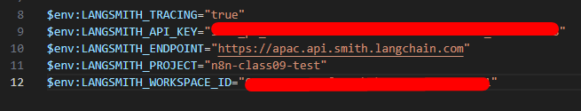
  
<b><u>Environment Configuration</u></b>
  

---

### Implementation Methodology

While variables can be set for temporary terminal sessions using the `set` command, professional-grade deployments demand global persistence. This is achieved by defining variables within a `.env` file at the n8n installation root. Furthermore, to leverage community-driven tools such as the Tavily search node, the `N8N_COMMUNITY_PACKAGES_ENABLED=true` variable must be active.

---

  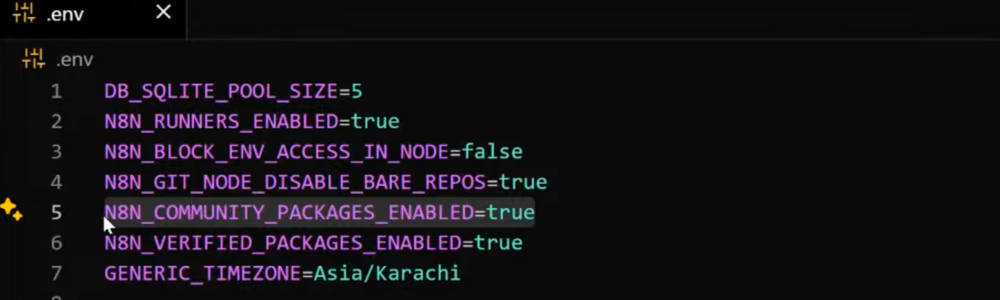
  
<b><u>Implementation Methodology</u></b>
  

---

### Metrics and Analytics Dashboard: The Unit Economics of AI

LangSmith provides a high-level command center for tracking the "Unit Economics" of AI operations. Key metrics include:

* **Trace Count & Success Rates**: Monitoring volume and identifying "red flag" error indicators to isolate failed reasoning paths.
* **Latency Analysis**: Distinguishing between total execution time and granular, step-by-step latency for models versus external tools.
* **Resource Consumption**: Aggregating input, output, and total token usage to calculate precise operational costs, essential for maintaining business margins.

---

  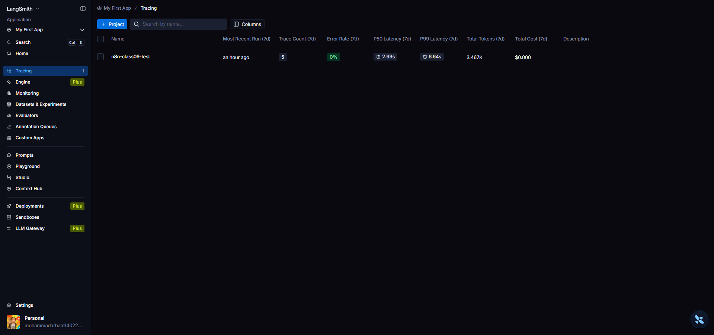
  
<b><u>Tracing</u></b>
  

---

  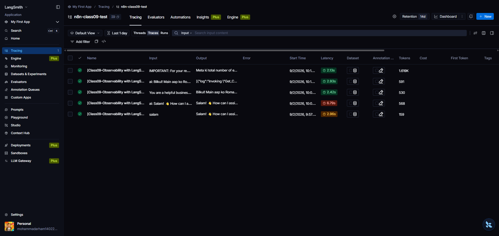
  
<b><u>All Agent Tracings</u></b>
  

---

  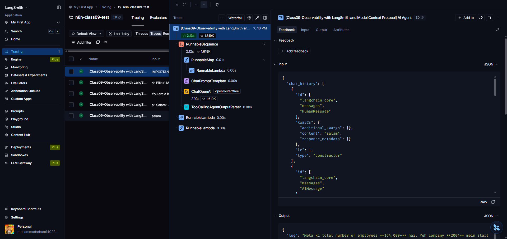
  
<b><u>Tracing of Agent Workflow</u></b>
  

---

  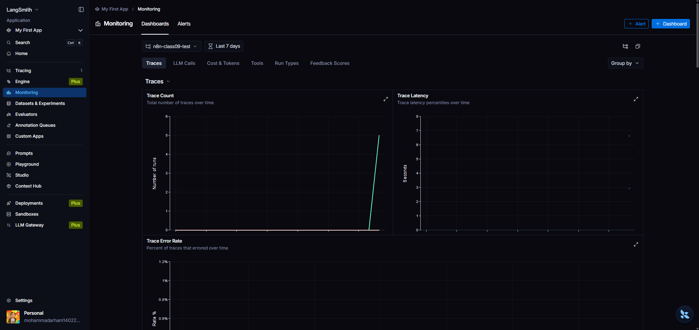
  
<b><u>Monitoring</u></b>
  

---

### Technical Trace Walkthrough

During the session's demo involving Gemini 2.5 Flash Preview and a custom Google Sheet tool, LangSmith provided architectural insights that standard logs could not. The trace revealed a total execution delay where 2.41s was attributed to external tool I/O (Google Sheets data retrieval) while the subsequent LLM reasoning step took only 1.18s. This granular visibility into memory management—confirming a context window of five interactions—allows architects to optimize tool performance and model selection.

---

  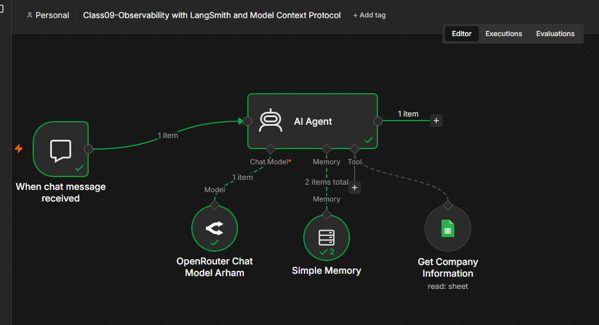
  
<b><u>Simple Agent for LangSmith Observability</u></b>
  

See json file for this agent **[Lesson09-ObservabilitywithLangSmithMCP](Lesson09-ObservabilitywithLangSmithMCP/Lesson09-Observability%20with%20LangSmith%20and%20Model%20Context%20Protocol.json)** 

---

## 3. Model Context Protocol (MCP) Deep Dive

The Model Context Protocol (MCP), an open standard introduced by Anthropic, addresses the "fragmentation problem" inherent in AI integration. As the number of LLMs and specialized tools proliferates, the cost of custom, platform-specific coding becomes unsustainable. MCP offers a universal language for tool discovery and execution.

### The Car Standardization Analogy

Consider the automotive industry: regardless of the manufacturer—Toyota, Honda, or Tesla—the interface for the driver (steering wheel, pedals) is standardized. If each brand required a unique steering mechanism, the ecosystem would collapse under the weight of its own complexity. MCP is the "steering wheel" for AI, providing a universal interface that allows any compliant LLM to interact with any standardized tool.

### Architectural Analysis: Client-Server Decoupling

MCP replaces platform-specific lock-ins with a standardized Client-Server model, enabling protocol-agnostic discovery:

* **MCP Client**: The AI agent or LLM that initiates requests and discovers tools.
* **MCP Server**: The provider that exposes tools and computational resources through a standardized registry.
* **Transport Modes**: MCP utilizes SSE (Server-Sent Events) and Stdio (Standard Input/Output) as the primary transport mechanisms for communication.

### n8n Implementation Roles

n8n is uniquely positioned to function in both capacities within the MCP ecosystem:

* **As an MCP Server**: Utilizing the `MCP Server Trigger` Node, n8n exposes its workflows and logic as standardized tools. This allows external agents to "discover" n8n tools—including their descriptions and parameters—automatically.

---

  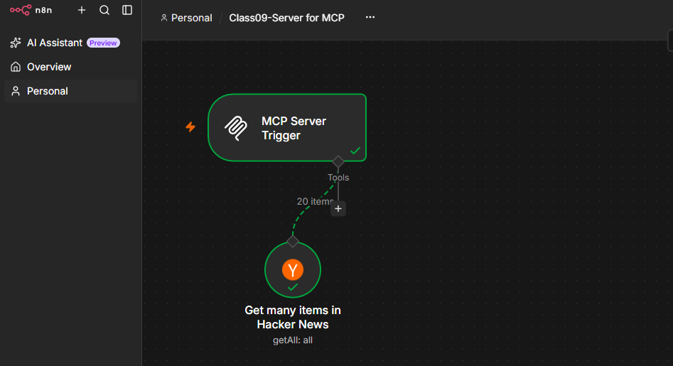
  
<b><u>MCP Server</u></b>
  

---

* **As an MCP Client**: Utilizing the `MCP Client Tool` Node, n8n agents can connect to external tool registries via Server URL, Transport type, and Authentication settings.

---

  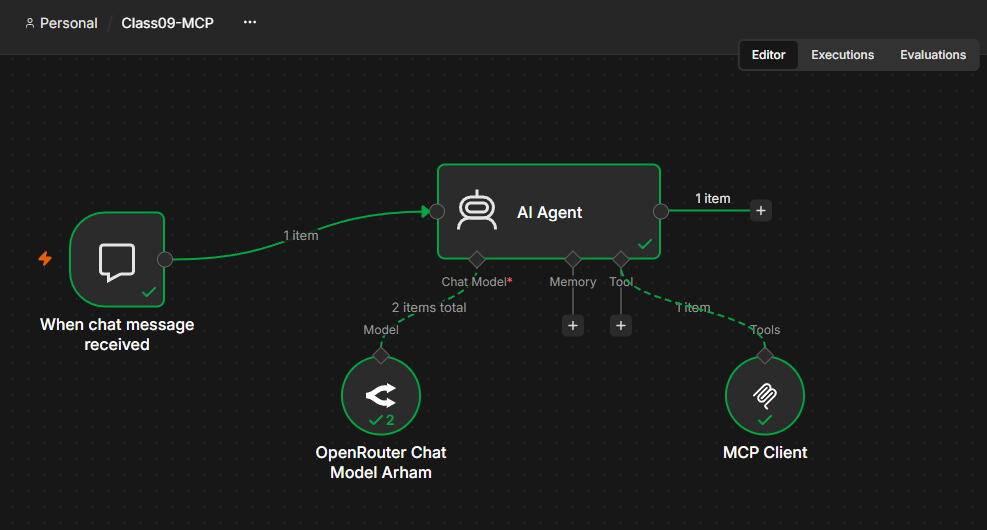
  
<b><u>MCP Client</u></b>
  

---

### Cross-Platform Case Study: Plug-and-Play Interoperability

A pivotal demo featured an n8n Hacker News MCP Server (retrieving 20 items) being called by an external OpenAI Agent Builder. Through MCP, the OpenAI agent was able to automatically discover the tool's schema and execute it without any manual API mapping. This demonstrates the "magic" of the open standard: write a tool once, and it becomes globally discoverable.

### Executive Comparison: Manual API vs. MCP Standardization

| Feature | Manual API Integration | MCP Standardization (Open Standard) |
| :--- | :--- | :--- |
| Connectivity | Manual mapping of inputs/outputs | Registry-based, protocol-agnostic discovery |
| Setup | Custom payloads and headers | Plug-and-play via standardized interface |
| Maintenance | High; requires updates per API change | Low; write-once, use-anywhere architecture |
| Interoperability | Platform-specific vendor lock-in | Universal interoperability across LLMs |

---

  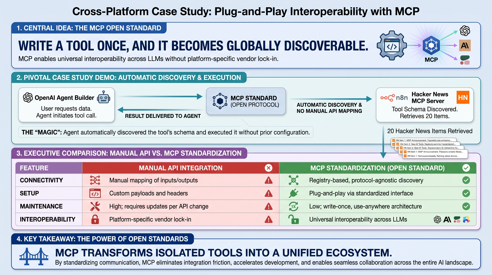
  
<b><u>Manual API vs. MCP Standardization</u></b>
  

---

## 4. Platform Comparison: n8n vs. OpenAI Agent Kit

Architects must choose between mature workflow automation and emerging agent-native frameworks. This choice represents a trade-off between stability and rapid innovation.

### Executive Decision Matrix

| Aspect | n8n | Agent Builder |
| --- | --- | --- |
| Focus | automations | agentic wf |
| Agentic AI | feature | agent native |
| Decision | program | llm/agents |
| Integrations | mature builtin connections | no builtin but native MCP connections |
| Valuation | 1 billion | 500 billion |
| Evals / Deployment | evals / JSON export | ease of use, chainkit built in evals (graders), take code and do anything deploy (builtin or custom) |
| Age / Stability | 6-year-old, battle-tested platform | Cutting-edge, 3 days old at session time |
| Architecture | Visual low-code with 500+ built-in nodes | Purely no-code with built-in visual evaluations |
| Constraint / Advantage | Vendor-specific JSON formats; agents are secondary to automation | Native code export (Python/SDK) and OpenAI ecosystem access |

---

  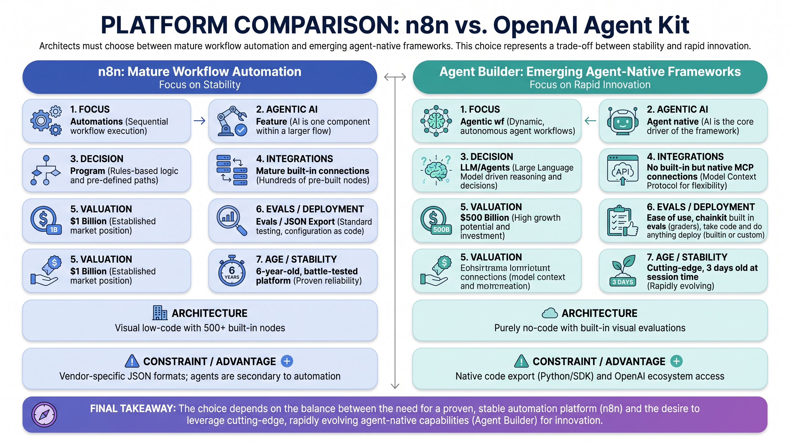
  
<b><u>Platform Comparison: n8n vs. OpenAI Agent Kit</u></b>
  

---

### Strategic Selection Framework

* Deploy **n8n** for production-ready, complex, and high-reliability business automations requiring deep integration with legacy systems.
* Deploy **OpenAI Agent Kit** for rapid prototyping, learning, and scenarios where pure agent orchestration and native OpenAI ecosystem integration are the priority.
  - **OpenAI AgentKit Layers**
    -   Agents sdk
    -   Guardrails framework
    -   Chainkit
    -   MCP framework
    -   Evals

---

## 5. Future Paradigms and Ethical Considerations

The industry is moving toward "Conversational UI," where the prompt effectively becomes the code. However, this shift introduces new architectural risks that must be managed by the System Architect.

### Emerging Development Trends: Beyond "Vibe Coding"

* **Vibe Coding**: Defined as intuitive, prompt-led code generation. While accessible, Vibe Coding typically breaks down at the third or fourth feature because it lacks foundational planning.
* **Spec-Driven Vibe Coding**: This is the professional standard for scaling AI. By using tools like SpecKit+, the developer acts as a System Architect, ensuring the AI follows a rigorous specification rather than just "vibes." This prevents the architectural collapse common in unmanaged AI-generated code.

Conversational Interface so Prompt Engineering is essential

* **a. No Code Tools**
  - (i.e: Opal Lovable, n8n)
  - No Programming Background

* **b. CLI Tools for Vibe Coding**
  - Free: GEMINI, QWEN
  - Paid: Claude, Codex, Cursor

* **Issue:** Messed/Unmanageable Code
* **Solution:** Spec Driven Vibe Coding

---

  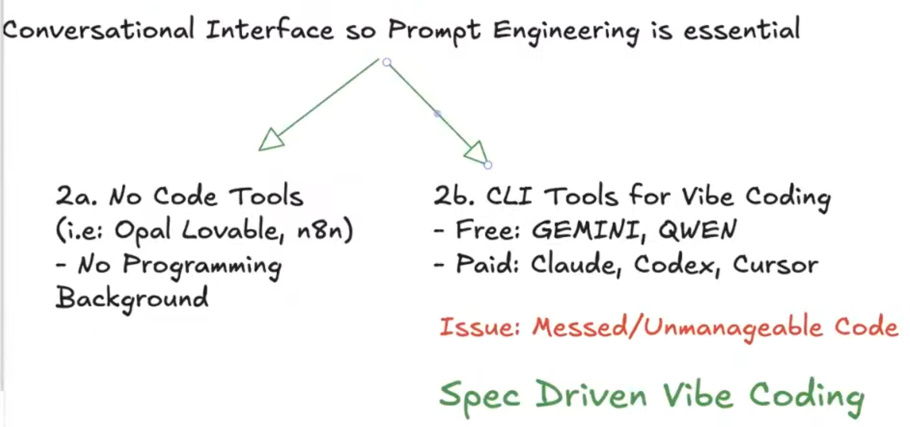
  
<b><u>Conversational Interfaces</u></b>
  

---

### Foundational Ethics in Business

Technical mastery is a liability without ethical integrity. As we navigate a world of automated agents and "Vibe Coding," the honesty and integrity of the "Spec" become paramount. We look to the historical examples of Hazrat Usman, whose business success was built on unwavering honesty, and Hazrat Ali, whose leadership was defined by bravery and integrity.

In the AI business landscape, these virtues are the only safeguard against the architectural and ethical collapse of complex systems. Technical proficiency in LangSmith and MCP must be paired with human integrity to lead the future of AI. Mastery of the machine is secondary to the honesty of the architect.

---

## 6. Working JSON Files for This Lesson

- **[MCP Client](Lesson09-MCPClient.json)**
- **[MCP Server for MCP](Lesson09-Server%20for%20MCP.json)**
- **[Observability with LangSmith and Model Context Protocol](Lesson09-ObservabilitywithLangSmithMCP/Lesson09-Observability%20with%20LangSmith%20and%20Model%20Context%20Protocol.json)**

These JSON files capture the workflow examples used throughout this lesson and can be opened directly from the repository.