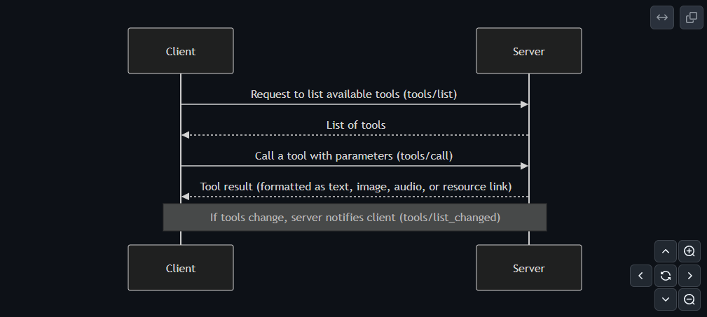

# [04_fundamental_ primitives](https://github.com/panaversity/learn-agentic-ai/tree/main/03_ai_protocols/01_mcp/04_fundamental_%20primitives) (Cont.)

[YouTube Panaversity Video Link](https://www.youtube.com/watch?v=xo5A3YUeEr4)

Discussed from the official course of Anthropic `Introduction to Model Context Protocol`

## [02_project_setup](https://github.com/panaversity/learn-agentic-ai/tree/main/03_ai_protocols/01_mcp/04_fundamental_%20primitives/02_project_setup)

We have created [agents_sdk_cli_project](agents_sdk_cli_project)

## [03_defining_tools](https://github.com/panaversity/learn-agentic-ai/tree/main/03_ai_protocols/01_mcp/04_fundamental_%20primitives/03_defining_tools)

In this step, you'll learn how to create and use MCP tools with the FastMCP Python SDK. This guide will show you how to turn your Python functions into easy-to-use tools with minimal hassle.

### How Tools Work: Discovery and Execution

Here’s a simple overview of the process:

1. **Finding Tools:** The MCP client sends a `tools/list` request to get a list of available tools.
2. **Using Tools:** When you want to run a tool, the client sends a `tools/call` request with the tool name and the necessary parameters.
3. **Handling Errors:** If something goes wrong (for example, if a document is missing), the tool raises a Python error that is automatically converted into an MCP error response.

Below is a simple diagram illustrating the process:

    

---

See [mcp_server.py](agents_sdk_cli_project/mcp_server.py) file for tool implementation

## [04_implementing_client](https://github.com/panaversity/learn-agentic-ai/tree/main/03_ai_protocols/01_mcp/04_fundamental_%20primitives/04_implementing_client)

[Class-04 Code: Model Context Protocol - Implementing Core MCP Client](https://github.com/panaversity/learn-agentic-ai/blob/main/03_ai_protocols/01_mcp/04_fundamental_%20primitives/04_implementing_client/class_code)

The MCP client abstracts away the complexity of server communication, letting you focus on your application logic while still getting access to powerful external tools and data sources.

