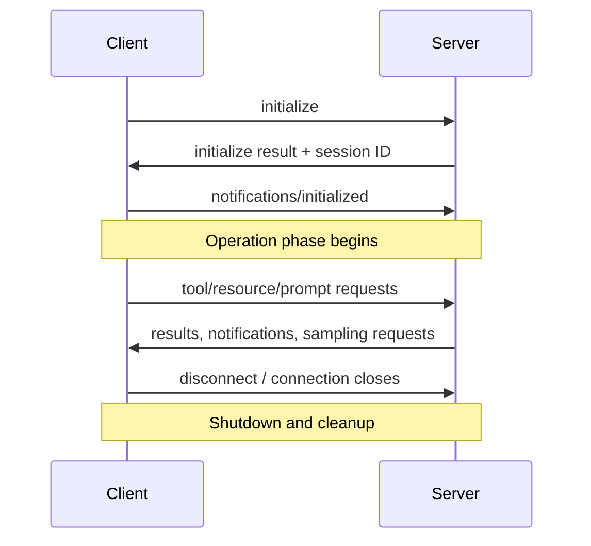

# [05_capabilities_and_transport](https://github.com/panaversity/learn-agentic-ai/tree/main/03_ai_protocols/01_mcp/05_capabilities_and_transport) (Cont.)

## [02_stateful_http_lifecycle](https://github.com/panaversity/learn-agentic-ai/tree/main/03_ai_protocols/01_mcp/05_capabilities_and_transport/02_stateful_http_lifecycle)


## MCP Lifecycle and Client Capabilities

MCP creates a distributed AI architecture: the **server** exposes tools, data, and workflows, while the **client** can provide LLM access, user approval, filesystem roots, and other capabilities.

This design solves two major problems for server owners:

| Traditional server-side AI | MCP distributed model |
|---|---|
| Server owner pays LLM inference/token costs | Client can use its own model, credits, or local resources |
| Users may need to give API keys to a server | API keys remain with the client |
| Server handles AI processing for every user | Server focuses on its domain logic and scales more easily |

> MCP moves expensive reasoning and private credentials closer to the user instead of forcing every server to own them.

---

## Stateful HTTP: Why Sessions Exist

Normal HTTP is stateless: each request is independent. Stateful MCP over Streamable HTTP adds a **session** so the server can recognize the same client across requests.

After initialization, the server issues a unique session ID. The client sends it in the `mcp-session-id` header for later requests.

```http
POST /mcp/ HTTP/1.1
Content-Type: application/json
MCP-Protocol-Version: 2025-06-18
mcp-session-id: <session-id>
```

The session enables:
- Server-to-client messages through the SSE connection
- Sampling requests
- Progress updates
- Resource subscriptions and change notifications
- Per-client state and capability awareness

---

## MCP Lifecycle: Three Phases

Think of an MCP session like visiting a shop:

1. **Initialization** — customer and shop owner introduce themselves and agree on what each can do.
2. **Operation** — normal work: tools, resources, prompts, notifications, sampling.
3. **Shutdown** — connection closes and resources are cleaned up.



### Phase 1: Initialization — Mandatory Handshake

The connection is ready only after this three-step exchange:

| Step | Direction | Purpose |
|---|---|---|
| 1. `initialize` request | Client → Server | Client sends MCP version, identity, and supported capabilities |
| 2. Initialize result | Server → Client | Server returns its version, identity, capabilities, and session ID |
| 3. `notifications/initialized` | Client → Server | Client accepts the server's proposal and confirms readiness |

### Client Initialize Request

```json
{
  "jsonrpc": "2.0",
  "id": 1,
  "method": "initialize",
  "params": {
    "protocolVersion": "2025-06-18",
    "capabilities": {
      "roots": { "listChanged": true },
      "sampling": {},
      "elicitation": {}
    },
    "clientInfo": {
      "name": "ExampleClient",
      "title": "Example Client Display Name",
      "version": "1.0.0"
    }
  }
}
```

### Server Initialize Response

```json
{
  "jsonrpc": "2.0",
  "id": 1,
  "result": {
    "protocolVersion": "2025-06-18",
    "capabilities": {
      "logging": {},
      "prompts": { "listChanged": true },
      "resources": { "subscribe": true, "listChanged": true },
      "tools": { "listChanged": true },
      "completions": {}
    },
    "serverInfo": {
      "name": "ExampleServer",
      "title": "Example Server Display Name",
      "version": "1.0.0"
    },
    "instructions": "Optional instructions for the client"
  }
}
```

### Client Ready Notification

```json
{
  "jsonrpc": "2.0",
  "method": "notifications/initialized"
}
```

> Tools, resources, prompts, sampling, and other normal operations begin only after initialization completes.

### Phase 2: Operation

During normal operation, client and server use the capabilities they negotiated:

- Client calls `tools/list`, `tools/call`, `resources/read`, and `prompts/get`
- Server returns results and may send notifications
- Server can request client capabilities, such as sampling
- Client includes both `MCP-Protocol-Version` and `mcp-session-id` headers in stateful HTTP requests

### Phase 3: Shutdown

There is no special JSON-RPC shutdown method in the specification.

- With HTTP, shutdown happens when the client closes the connection.
- The server cleans up the associated session automatically.
- Clients should close connections gracefully to avoid losing in-flight work.

---

## Sampling: Server Requests AI Reasoning from Client

**Sampling** lets an MCP server ask the client to use its LLM. The server does not need to store an LLM API key or pay for model inference itself.

### Sampling Flow

```text
1. Server needs reasoning, summarization, writing, or a decision
2. Server sends a sampling request to the client
3. Client may show the request to the user for approval
4. Client calls its own LLM using its own credentials / credits
5. Client returns the generated result to the server
6. Server continues its workflow
```

### Why Sampling Matters

| Benefit | Explanation |
|---|---|
| **Cost efficiency** | Server owner does not pay for every user's LLM tokens |
| **Privacy and security** | User API keys stay on the client and are never shared with the server |
| **Human in the loop** | Client can require approval before spending credits or sending context to a model |
| **Scalability** | Server can support more users because it offloads heavy reasoning work |

**Example:** A document server receives a request to write an article. Instead of hosting an LLM, it asks the client to generate the article using the user's configured model, then stores or processes the returned result.

---

## Logging vs. Progress Reporting

Both provide visibility, but they have different scopes:

| Capability | Scope | Purpose | Example |
|---|---|---|---|
| **Logging** | Server/session level | Technical, diagnostic events | `Database connection established` |
| **Progress reporting** | One request or tool call | User-facing status during long work | `50% complete — fetching remote data` |

- **Logging notifications** show what is happening inside the server.
- **Progress notifications** are tied to a specific long-running operation and can power a progress bar or status message.
- Stateful SSE communication is needed for the server to push these updates without waiting for another client request.

---

## Stateful vs. Stateless HTTP

### Why Scaling Stateful HTTP Is Difficult

A stateful MCP client normally has two related paths:

1. **GET/SSE connection** for server-to-client messages
2. **POST requests** for tool calls and request/response traffic

With a load balancer, the GET/SSE connection can reach **Server A** while a POST request reaches **Server B**. If Server B needs to send a sampling request or progress notification, it does not own the SSE connection from Server A. This creates cross-instance coordination complexity.

```text
Client ── GET/SSE ──► Server A  (holds session + event stream)
Client ── POST ─────► Server B  (may not know this session)
```

### `stateless_http=True`

Stateless HTTP removes per-client server state so any instance can handle any request behind a load balancer.

```python
from mcp.server.fastmcp import FastMCP

mcp = FastMCP("MyMCPServer", stateless_http=True)
```

| Stateful HTTP (default) | Stateless HTTP |
|---|---|
| Server tracks session IDs in memory | No per-client session state |
| Initialization lifecycle required | Direct request/response flow; no session lifecycle overhead |
| Supports SSE server-to-client requests | No server-to-client SSE request path |
| Supports sampling | No sampling |
| Supports progress updates | No pushed progress reports |
| Supports subscriptions/resource updates | No pushed update notifications |
| Harder to scale across instances | Easy horizontal scaling behind load balancers |

### Use Stateless HTTP When

- You need many instances behind a load balancer
- Your server only needs request/response operations
- Tools do not need sampling or client-side LLM reasoning
- You do not need live progress, subscriptions, or server-pushed updates
- You want minimal connection/session overhead

### JSON Response Mode

Use JSON responses when streaming is not needed and your integration expects plain HTTP JSON responses. This is simpler for conventional HTTP clients, but does not provide an event stream for server-pushed messages.

---

## FastMCP Automates Lifecycle Details

FastMCP handles much of the protocol complexity automatically:

- Protocol-version negotiation (`2025-06-18`)
- JSON-RPC 2.0 message handling and errors
- `MCP-Protocol-Version` header requirements
- Stateful session IDs and cleanup
- Capability negotiation
- Graceful HTTP connection management

Example server launch:

```bash
uv add mcp uvicorn httpx
uv run uvicorn server:mcp_app --host 0.0.0.0 --port 8000 --reload
```

---

## Key Takeaways

1. MCP turns a normally stateless HTTP exchange into a stateful conversation through the session ID and SSE pathway.
2. The lifecycle has three phases: **Initialization → Operation → Shutdown**.
3. Initialization negotiates versions and capabilities before normal MCP features are allowed.
4. Sampling lets a server request LLM reasoning from the client, reducing token cost and API-key liability for server owners.
5. Logging explains server activity globally; progress reports describe one active request.
6. Stateful HTTP enables sampling, notifications, and subscriptions but complicates horizontal scaling.
7. `stateless_http=True` solves load-balancer scaling problems but removes server-to-client capabilities such as sampling, progress, and subscriptions.

### References

- [MCP Stateful HTTP Lifecycle Lesson](https://github.com/panaversity/learn-agentic-ai/tree/main/03_ai_protocols/01_mcp/05_capabilities_and_transport/02_stateful_http_lifecycle)
- [MCP Lifecycle Specification — 2025-06-18](https://modelcontextprotocol.io/specification/2025-06-18/basic/lifecycle)
- [MCP HTTP Transport Requirements](https://modelcontextprotocol.io/specification/2025-06-18/basic/transports#protocol-version-header)
- [JSON-RPC 2.0 Specification](https://www.jsonrpc.org/specification)
