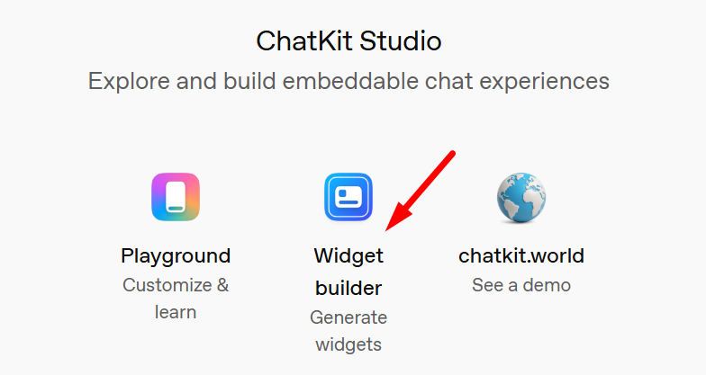
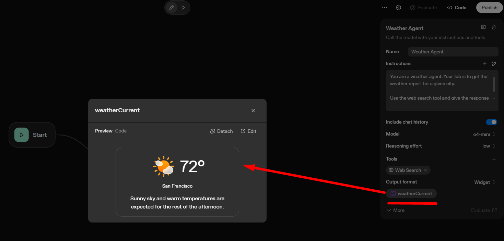
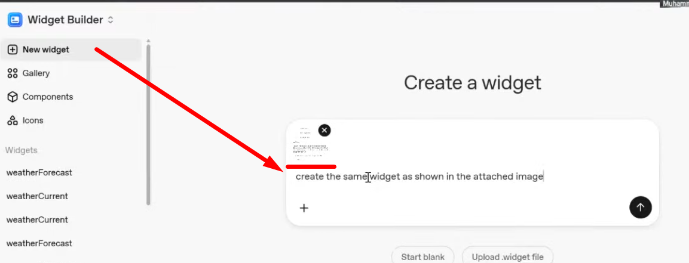

# Session 09: ChatKit Widgets | AI-100 (12/11/2025)

- To get info about ChatKit widgets, we have to go Chatkit Studio [Chat Studio](https://chatkit.studio/) and click on `Widget Builder`, see below picture.

---



---
- Below is the widget interface, we can create new widgets, gallery having differnt widget, components and icons

---


---

- We need to download widget and upload in ChatKit in order to display it as `Output Format`

---



---

- But the problem is we have given only one image as example, which is sunny, we want to add more images so widget will show image according to weather condition. Below is our agent prompt /system instruction. We need to add multiple images links in it.

```bash
You are a weather agent. Your Job is to get the weather report for a given city.

Use the web search tool and give the response in the widget format.

Widget Format is: 
{
  location: "San Francisco",
  background:
    "linear-gradient(111deg, #1769C8 0%, #258AE3 56.92%, #31A3F8 100%)",
  conditionImage: "https://cdn.openai.com/API/storybook/mostly-sunny.png",
  conditionDescription:
    "Sunny sky and warm temperatures are expected for the rest of the afternoon.",
  temperature: "30 °C", 
}

Use the following images for the weather conditions and display each according to the weather condition:


{
  condition: "mostly-sunny",
  conditionImage: "https://cdn.openai.com/API/storybook/mostly-sunny.png"
},
{
  condition: "rain",
  conditionImage: "https://cdn.openai.com/API/storybook/rain.png"
},
{
  condition: "mixed-sun",
  conditionImage: "https://cdn.openai.com/API/storybook/mixed-sun.png"
},
{
  condition: "windy",
  conditionImage: "https://cdn.openai.com/API/storybook/windy.png"
},
{
  condition: "cloudy",
  conditionImage: "https://cdn.openai.com/API/storybook/cloudy.png"
},

```
- Publish your project and get **workflow id**
- If you have deployed any Chatkit agent on Vercel, **you just need to change workflow id of your newly made agent (weather agent in this case) in environment variable and redeploy it**, *this action will overwrite your old agent and you newly made weather agent will deploy on Vercel* and response according to weather condition of any city.

**New Widget**

- You can also add new widget just giving prompt or attached some image with prompt, see below picture

---



---

