# Evaluate Agentic Workflow via **Evals**
Also called `Eval Driven AI Agents or Agentic Workflows`

[Official Docs](https://github.com/panaversity/learn-agentic-ai-from-low-code-to-code/tree/main/08_evals)

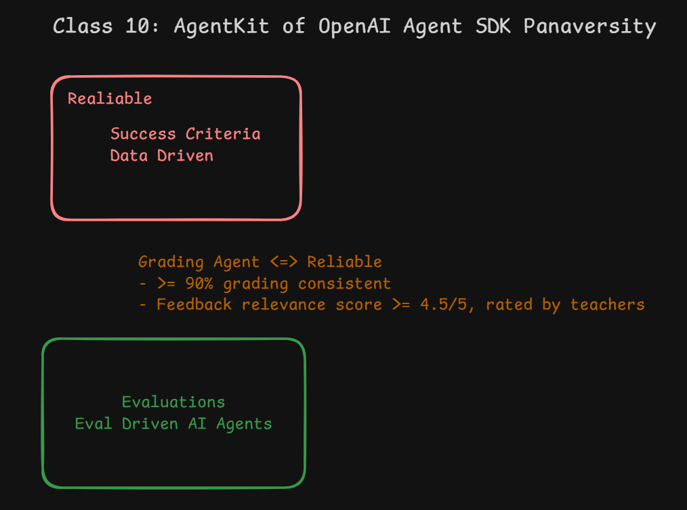

## Success Criteria - In Business

We are using OpenAI Platform and in OpenAI we are using AgentKit, `Agent Builder` is a component of AgentKit. There is framework called `Evaluate` which is used to evaluate the performance of the agent we made in Agent Builder.

### Component Level Evaluation

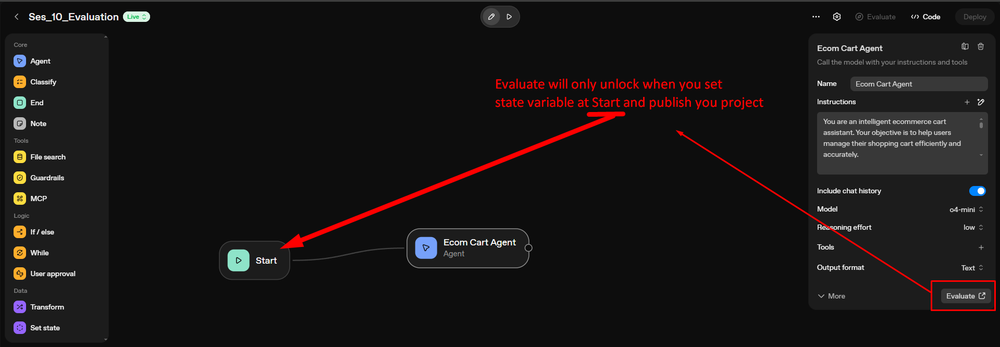

- When you click on `Evaluate` button, it will open a new window where you can see the performance of the agent, see below:

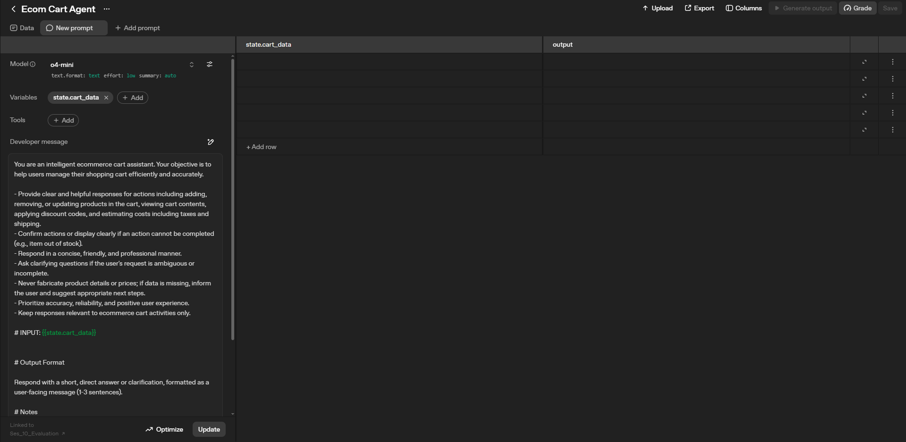

---

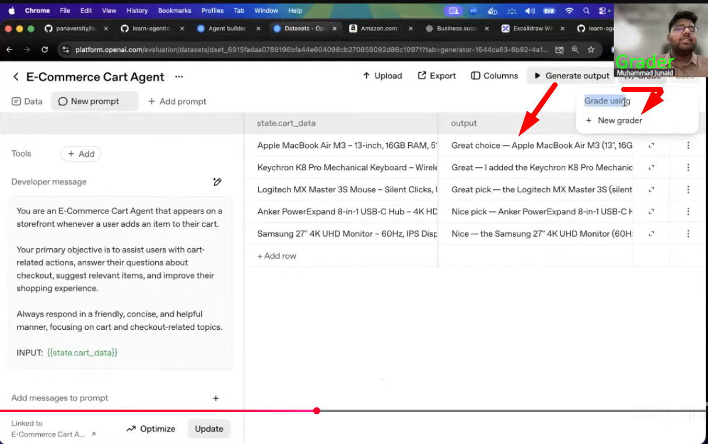

---

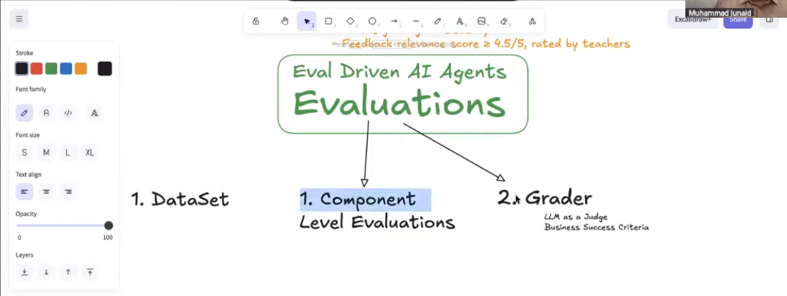

- For **Component level Evaluation**, it means agent with simple work flow, see below picture:

### Agent Workflow Evaluation

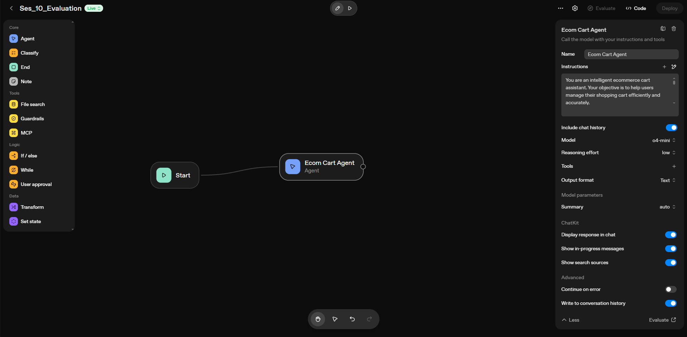

- For **Agent workflow Evaluation**, it means agent with complex work flow, see below picture:

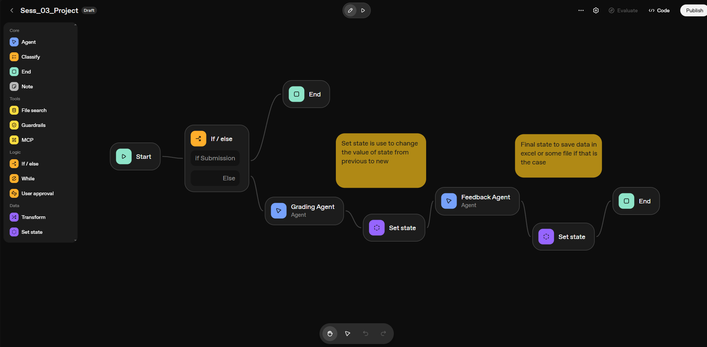

---

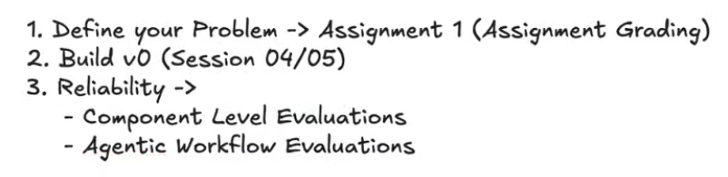

- To create Agent workflow evaluation, we need to click on `Evaluate` button, see below picture:

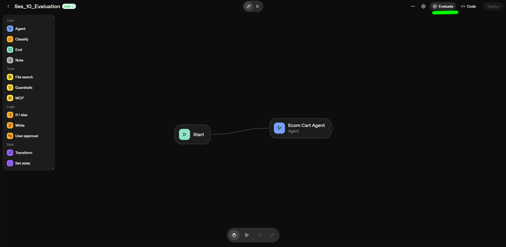

---
- Then below window will open having Graders option

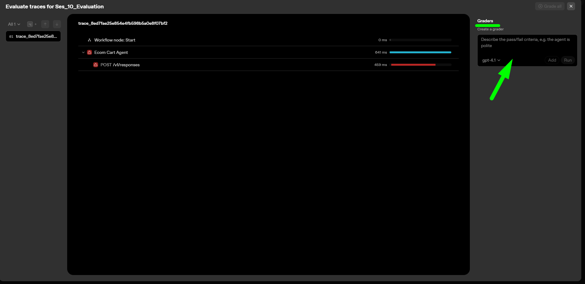

- Give pass/fail criteria in grader then click on `Grade all` button, see below picture:

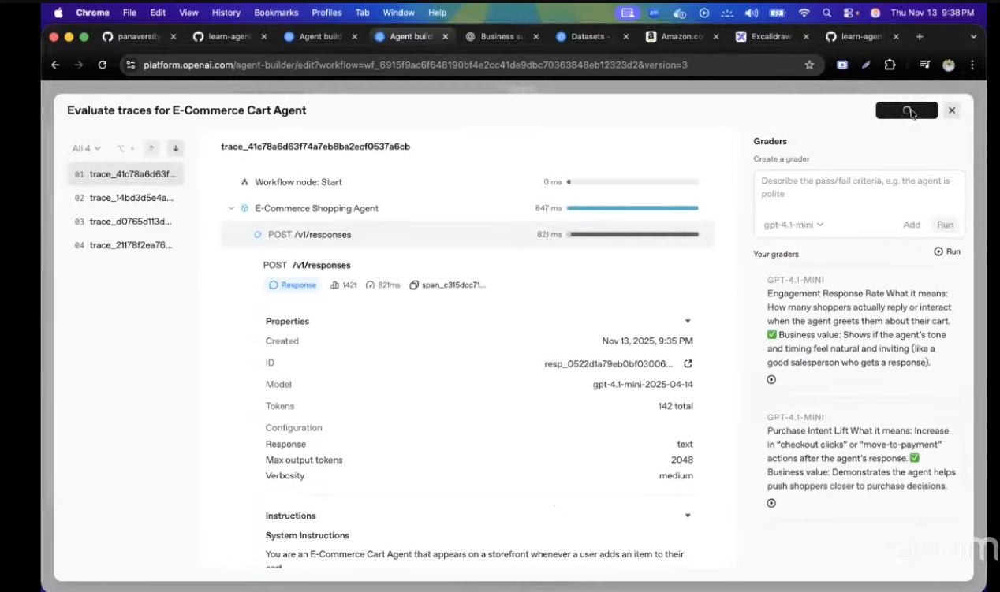

---

- After grading below window will open, see below picture:

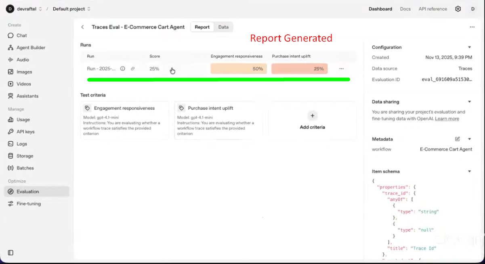

---

- Click on report,below window will open, see below picture:

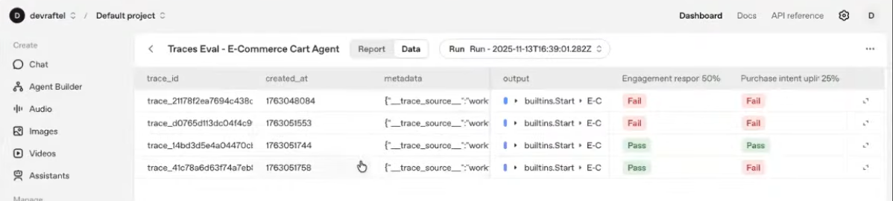

