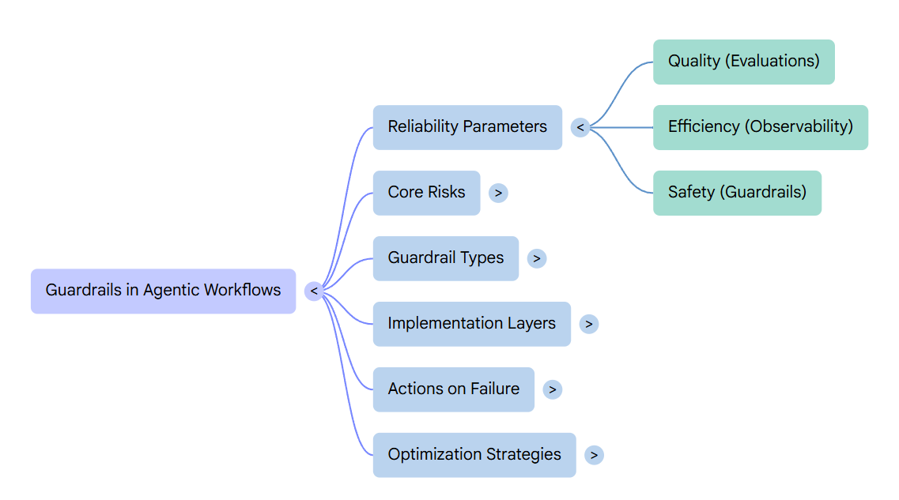
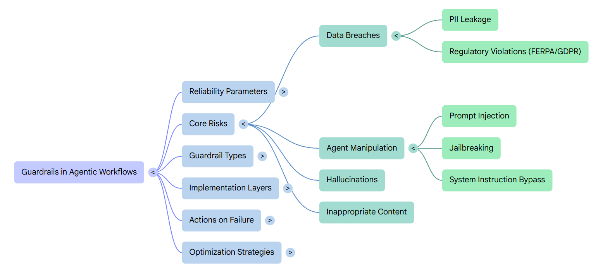
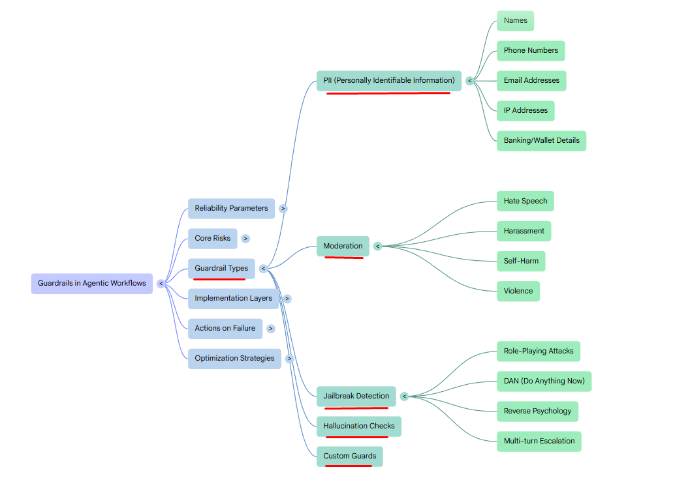
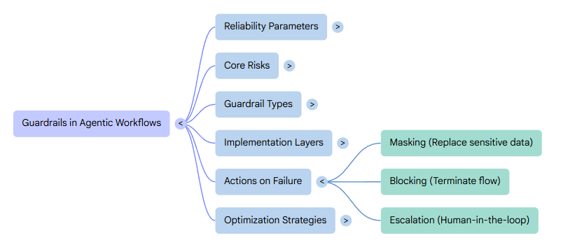

# Guardrails & Governance

Offical Repo Link **[Guardrails & Governance](https://github.com/panaversity/learn-agentic-ai-from-low-code-to-code/tree/main/10_guardrails)**

**Guardrails in agentic workflows** are safety and control mechanisms that keep autonomous AI agents operating within safe, defined boundaries. They prevent harmful, unauthorized, or unintended actions in multi-step, tool-using processes.

-   **Core purpose**: Balance agent autonomy with reliability, security, and compliance by enforcing rules on inputs, reasoning, actions, and outputs.[⁠Medium](https://medium.com/@tahirbalarabe2/what-are-agentic-guardrails-249ecfc50d0a)
-   **Why needed**: Agents can plan, use tools, and affect real-world systems (e.g., data changes, API calls), so simple prompt filtering isn't enough—runtime controls are essential.
- **Implementation**: Often runtime checks, system prompts, policy frameworks, or dedicated layers (e.g., input/output validation, deterministic rules).

## Part 1: The Safety Imperative - Why Guardrails Matter (20 min)

[](https://github.com/panaversity/learn-agentic-ai-from-low-code-to-code/blob/main/10_guardrails/readme.md#part-1-the-safety-imperative---why-guardrails-matter-20-min)

### Building on Sessions 8 & 9

[](https://github.com/panaversity/learn-agentic-ai-from-low-code-to-code/blob/main/10_guardrails/readme.md#building-on-sessions-8--9)

**The Journey So Far:**

-   **Session 8:** Built quality through evaluations
    
    -   Agent works correctly
    -   Produces accurate results
    -   Quality = "Does it work?"
-   **Session 9:** Added efficiency through observability
    
    -   Optimized for cost and speed
    -   Monitored production usage
    -   Efficiency = "Does it work well?"
-   **Session 10:** Now adding safety through guardrails
    
    -   Protect users and business
    -   Prevent harmful outcomes
    -   Safety = "Does it work safely?"

**The Production Triangle:**

```
        QUALITY (Session 8)
           /\
          /  \
         /    \
        /      \
       /        \
      /  AGENT   \
     /   READY    \
    /   FOR PROD   \
   /                \
SAFETY ------------- EFFICIENCY
(Session 10)       (Session 9)
```



**All three are required for production.**

### [The Real Risks of Unprotected Agents](https://github.com/panaversity/learn-agentic-ai-from-low-code-to-code/blob/main/10_guardrails/readme.md#-the-real-risks-of-unprotected-agents)
---
- The Data Leak
- The Manipulation
- The Inappropriate Content
- The Hallucination



### The Business Impact
---
**Real Consequences:**

| Risk | Business Impact | Example |
|------|----------------|---------|
| **Data Breach** | Legal liability, fines, loss of trust | FERPA violation: $50K+ fines |
| **Manipulated Agent** | System compromise, invalid results | Grades changed, academic fraud |
| **Harmful Content** | Reputation damage, regulatory issues | Appears to endorse hate speech |
| **Misinformation** | Loss of credibility, user confusion | False grades cause complaints |
| **Bias** | Discrimination claims, unfair outcomes | Certain groups graded differently |

**Without guardrails, you cannot safely deploy to production.**

### The Solution: Multi-Layer Safety

[](https://github.com/panaversity/learn-agentic-ai-from-low-code-to-code/blob/main/10_guardrails/readme.md#the-solution-multi-layer-safety)

**Defense in Depth:**

```
Layer 1: INPUT GUARDRAILS
  ↓ Check user input before processing
  ↓ Block: PII, jailbreaks, harmful content

Layer 2: AGENT PROCESSING
  ↓ Agent does its work (grading, support, etc.)

Layer 3: OUTPUT GUARDRAILS
  ↓ Check agent output before showing user
  ↓ Block: PII leaks, hallucinations, harmful responses

Layer 4: HUMAN OVERSIGHT
  ↓ High-risk decisions go to human approval

Layer 5: AUDIT TRAIL
  ↓ Log everything for compliance and review
```

**Each layer catches what previous layers missed.**

## [Part 2: The 9 Types of Guardrails (25 min)](https://github.com/panaversity/learn-agentic-ai-from-low-code-to-code/blob/main/10_guardrails/readme.md#part-2-the-5-types-of-guardrails-25-min)

As of April 2026, OpenAI AgentKit has increased its number of guardrails to 7.

### AgentKit Guardrails Overview

[](https://github.com/panaversity/learn-agentic-ai-from-low-code-to-code/blob/main/10_guardrails/readme.md#agentkit-guardrails-overview)

OpenAI Agent Builder provides **5 built-in guardrail types** through the Guardrails Wizard:

1.  **PII (Personally Identifiable Information) Masking** - Protect personal information
2. **Jailbreak Prevention** - Stop manipulation attempts
3. **Content Moderation** - Filter harmful/inappropriate content
4. **Hallucination Detection** - Verify factual accuracy
5. **NSFW Text** - Detects NSFW (not safe for work) content such as sexual content, hate speech, violence, or other inappropriate material.
6. **URL filter guardrail** - Blocks URLs that fall outside your allow list or violate allowed schemes.
7. **Prompt injection detection guardrail** - Detects prompt injection attempts and misaligned outputs so your system prompt stays in control.
8. **Custom prompt check guardrail** - Evaluate text against your own system prompt and flag when it does not comply.
9. **Custom Guardrails** - Define your own rules



## [Part 3: Risk Assessment for Your Agent (20 min)](https://github.com/panaversity/learn-agentic-ai-from-low-code-to-code/blob/main/10_guardrails/readme.md#part-3-risk-assessment-for-your-agent-20-min)

### [Risk Assessment Framework](https://github.com/panaversity/learn-agentic-ai-from-low-code-to-code/blob/main/10_guardrails/readme.md#risk-assessment-framework)




