# Master OpenClaw for Business Professionals (AI-50)
These classes had been conducted by Panaversity faculty.

Official Book Link: **[Building OpenClaw Apps](https://agentfactory.panaversity.org/docs/Building-OpenClaw-Apps/meet-your-personal-ai-employee)**

## Class 01:

### What makes a Personal AI Employee fundamentally different from a chatbot

| Feature | Chatbot | Personal AI Employee |
| --- | --- | --- |
| **Definition** | A software application that simulates human conversation through text or voice interactions. | An AI agent that acts as a virtual employee, capable of performing tasks, making decisions, and managing workflows on behalf of a user or organization. |
| **Scope** | Typically designed for specific tasks or domains (e.g., customer support, FAQs, lead generation). | Broad and versatile, capable of handling complex, multi-step tasks across different domains. |
| **Autonomy** | Limited autonomy; usually requires human intervention for complex queries or decisions. | High autonomy; can operate independently, make decisions, and execute tasks without constant human supervision. |
| **Integration** | Integrates with specific systems or platforms (e.g., websites, messaging apps). | Integrates with multiple systems, tools, and data sources to perform end-to-end workflows. |
| **Learning** | Limited learning capabilities; typically follows predefined scripts or rules. | Continuous learning and adaptation based on interactions, feedback, and new data. |
| **Proactivity** | Reactive; responds to user queries or commands. | Proactive; can anticipate needs, initiate tasks, and provide suggestions without being prompted. |
| **Decision Making** | Rule-based or simple decision-making capabilities. | Advanced decision-making based on data analysis, pattern recognition, and business logic. |
| **Examples** | Customer support bots, FAQ bots, lead generation bots. | Virtual assistants, automated workflow agents, data analysis agents, personalized recommendation systems. |

See **[Real-Life Example](https://agentfactory.panaversity.org/docs/Building-OpenClaw-Apps/meet-your-personal-ai-employee/ai-employee-moment#a-real-life-example-first)**

### Difference Between Personal AI Employee (AI Agent) and Digital FTE (RPA Bot)

| Feature              | **Personal AI Employee (AI Agent)**                          | **Digital FTE (RPA Bot)**                          |
|----------------------|-------------------------------------------------------------|----------------------------------------------------|
| **Definition**       | An intelligent AI agent that works as a virtual employee, capable of reasoning, decision-making, and handling end-to-end workflows. | A software robot that automates repetitive, rule-based tasks by mimicking human interactions (clicks & keystrokes). |
| **Scope**            | Broad and flexible. Handles complex, unstructured data, multi-step processes, and cross-domain tasks. | Narrow and rigid. Limited to highly structured, repetitive, and predictable processes. |
| **Autonomy**         | High autonomy. Can handle exceptions, adapt plans, and figure out *how* to achieve goals independently. | Low autonomy. Follows exact predefined steps and fails when exceptions occur. |
| **Integration**      | Dynamically uses APIs, tools, browsers, databases, and LLMs for intelligent, adaptive workflows. | Relies on screen scraping and UI automation. Breaks easily if the interface changes. |
| **Learning & Adaptation** | Continuously learns from feedback, self-corrects, and improves over time. | No learning ability. Requires manual reprogramming for any process change. |
| **Proactivity**      | Proactive. Can anticipate needs, suggest improvements, initiate tasks, and optimize processes. | Reactive/Scheduled. Only executes when triggered by a human, event, or timer. |
| **Decision Making**  | Advanced reasoning, contextual understanding, and cognitive problem-solving. | Simple rule-based logic (If-Then). No real intelligence or reasoning. |
| **Technology**       | Powered by Large Language Models (LLMs), multi-agent systems, memory, and tool-use capabilities (2025–2026). | Traditional RPA tools (UiPath, Automation Anywhere, Blue Prism) with optional AI add-ons. |
| **Best Use Cases**   | Research, sales outreach, customer support, software development, data analysis, project management. | Invoice processing, data entry, report generation, legacy system migration, payroll updates. |

### [Personal AI Employee Dimensions](https://agentfactory.panaversity.org/docs/Building-OpenClaw-Apps/meet-your-personal-ai-employee/ai-employee-moment#the-sixth-dimension):
1.   **Multi-channel**: Can operate across multiple channels (e.g., WhatsApp, Slack, Email, Web).
2.   **Always-on**: Available 24/7 without breaks.
3.   **Proactive**: Can initiate tasks and suggest improvements without being prompted and can ask human for help if needed.
4.   **Extensible**: Can be extended with new capabilities and integrations via plugins, MCPs, APIs, etc.
5.   **Multi-agent**: Can coordinate with other agents to complete complex tasks.
6.   **Ownership**: Can own tasks and see them through to completion.

"The first five describe capability," he said. "The sixth defines control."

### [The Agent OS: A Mental Model](https://agentfactory.panaversity.org/docs/Building-OpenClaw-Apps/meet-your-personal-ai-employee/ai-employee-moment#the-agent-os-a-mental-model):

| OpenClaw Component | OS Analogue | Plain-English Meaning | What It Does |
|--------------------|-------------|-----------------------|--------------|
| **Gateway**        | **Kernel**  | The central coordinator | Routes messages, manages sessions, coordinates plugins |
| **Workspace files**| **Firmware**| Foundational behavioral instructions | Define identity, memory, and behavior across interactions |
| **Plugins**        | **Device drivers** | Capability add-ons | Add channels, tools, voice, and integrations |
| **Sessions**       | **Process memory** | Per-task working state | Hold per-conversation context, isolated per user |

**[ClawHub](https://clawhub.ai/):** Community to build and use plugins

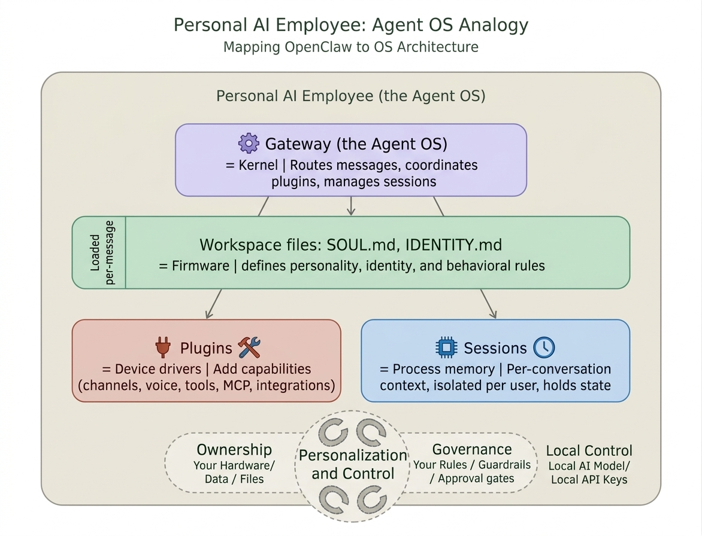

### Conway: Upcoming Personal AI Employee by Anthropic

As of now, **Anthropic** is testing **Conway** as its first personal AI employee.

**Conway** is Anthropic's unreleased **"always-on" persistent agent platform** for Claude — discovered via an accidental source code leak on March 31, 2026.

Instead of Claude waiting for your prompts, Conway would keep Claude **running continuously**, able to:

-   React to external events via webhooks
-   Control the browser autonomously
-   Run Claude Code
-   Support third-party extensions (`.cnw.zip` format — like an app store)
-   Integrate with tools like Claude in Chrome

Think of it as Claude evolving from a **chatbot you talk to** → into a **persistent AI agent that works for you in the background**. It hasn't been officially announced by Anthropic yet.

### [Install OpenClaw](https://agentfactory.panaversity.org/docs/Building-OpenClaw-Apps/meet-your-personal-ai-employee/install-and-connect#install-openclaw)

If you prefer a Linux environment on Windows (recommended for the rest of this book), install OpenClaw inside **WSL2 + Ubuntu**. WSL gives you a real Linux terminal next to Windows, and every Linux command in this chapter then works exactly as written.

**Step 1: Enable WSL and install Ubuntu**

Open **PowerShell as Administrator** (right-click Start, then "Terminal (Admin)"), then run:

```bash
wsl --install -d Ubuntu
```

This single command enables the WSL feature, installs the WSL2 kernel, and downloads Ubuntu. **Reboot when prompted.**

WSL is already installed on my machine, so I just check started Ubuntu in PowerShell using below command

```bash
wsl -d Ubuntu
```

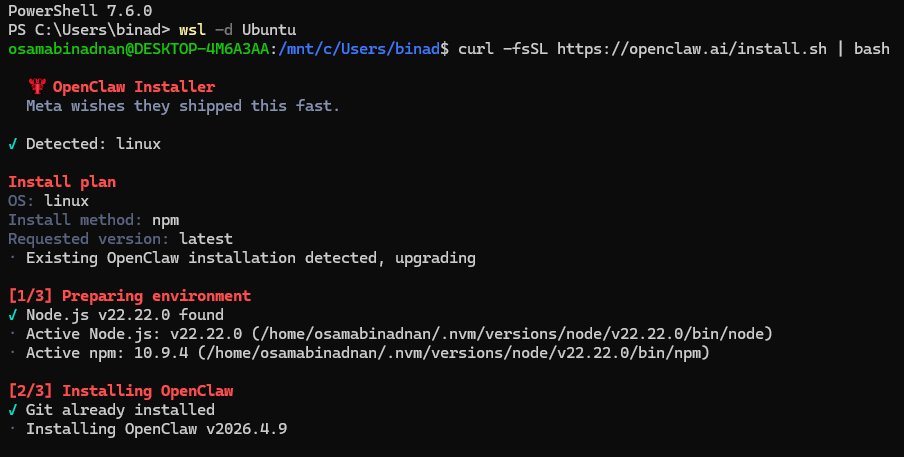

**Step 2: Install OpenClaw inside Ubuntu**

Inside the Ubuntu terminal, run the same Linux installer:

```bash
curl -fsSL https://openclaw.ai/install.sh | bash
```

The installer detects Linux, installs Node.js if needed, installs the OpenClaw npm package, and creates `~/.openclaw/` inside your Ubuntu home directory (not your Windows `C:\Users\...`).

**Step 3: Fix PATH if `openclaw` is not found**

If running `openclaw --version` returns `command not found`, add OpenClaw to your shell PATH:

```bash
echo 'export PATH="$HOME/.openclaw/bin:$PATH"' >> ~/.bashrcsource ~/.bashrc
```

Then verify:

```bash
openclaw --version
```

**Step 4: Start the onboarding wizard**

On WSL, the installer does not auto-launch the wizard. Start it yourself, and install the background daemon at the same time:

```bash
openclaw onboard --install-daemon
```

The `--install-daemon` flag registers the gateway as a systemd user service inside Ubuntu so it restarts automatically when you reopen WSL. The wizard then walks you through the same steps the other tabs describe (security acknowledgment, LLM provider, channel pairing).

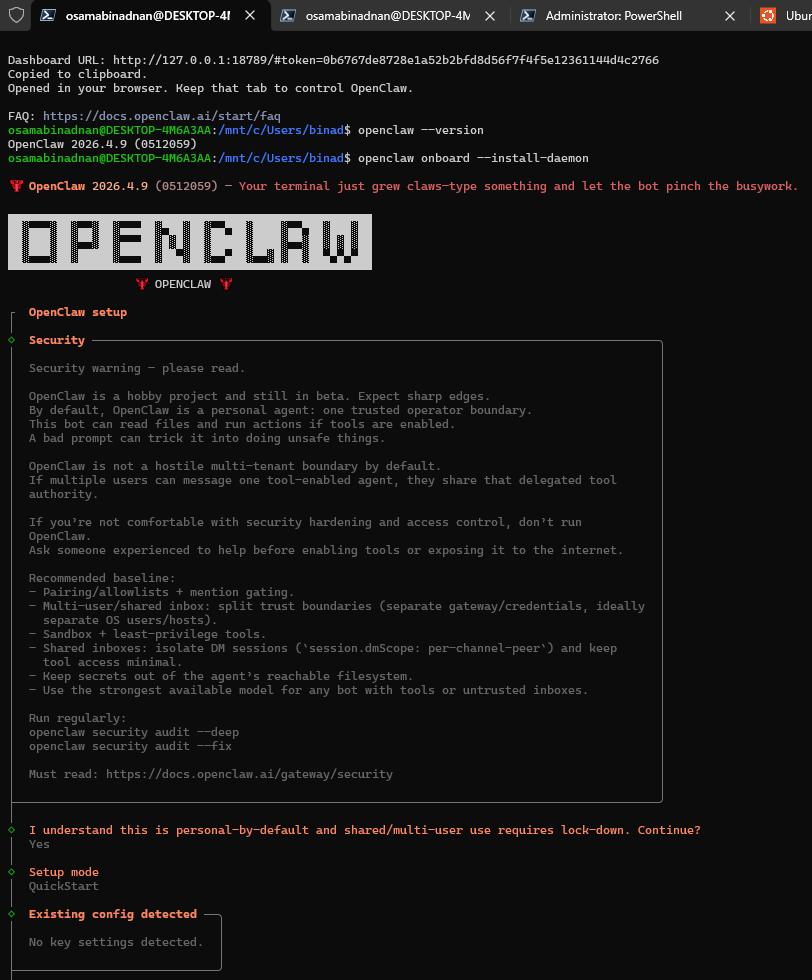

---

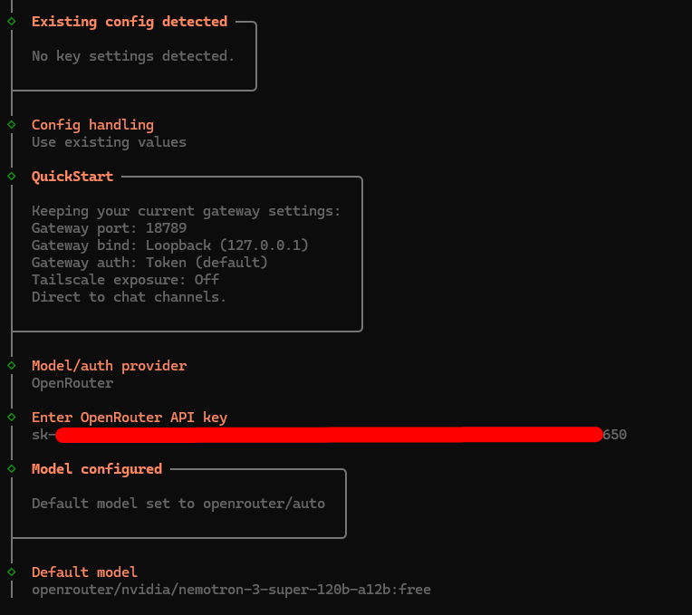

---

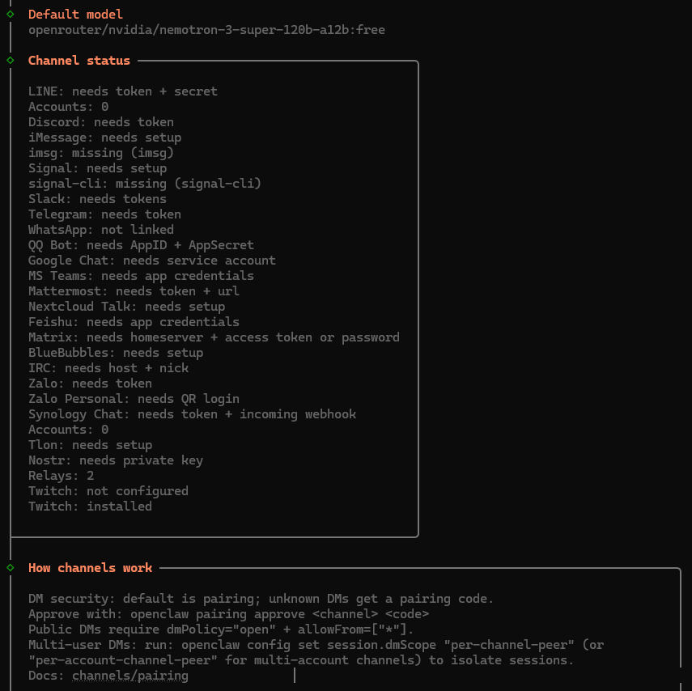

---

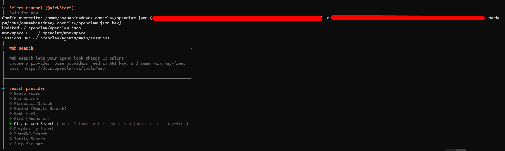

---

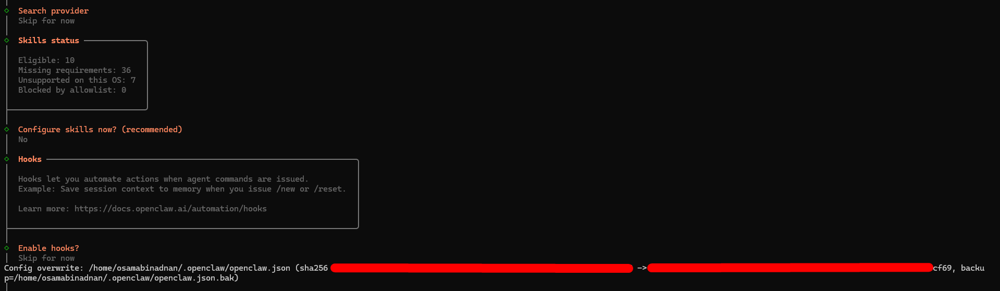

---

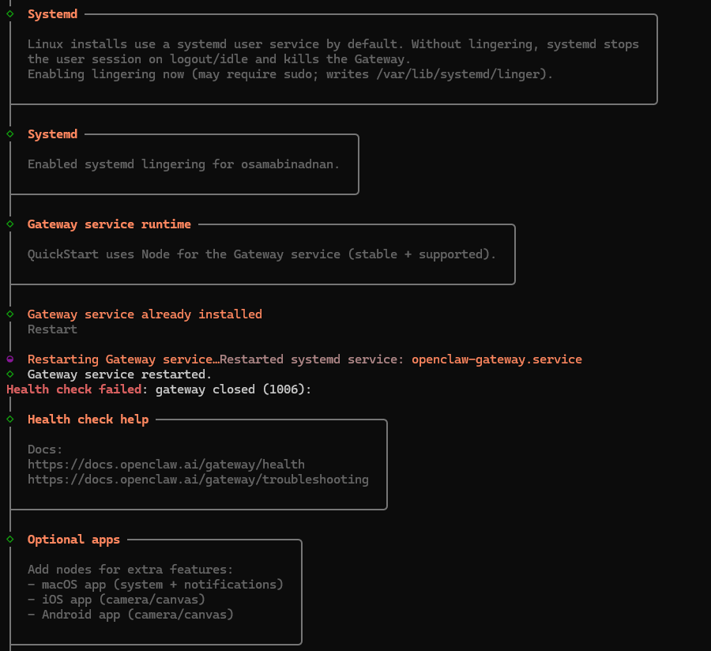

---

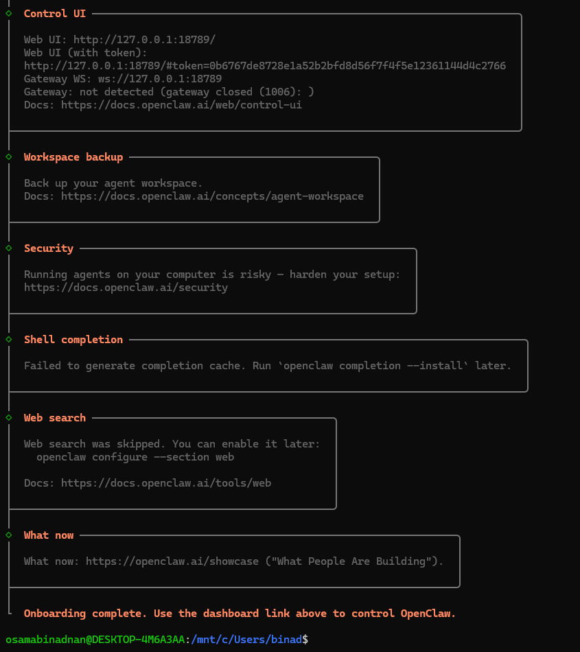

- To check your current default model and set new model use below commands

```bash
# See your current model  
openclaw config get agents.defaults.model  
  
# Change the default model directly  
openclaw config set agents.defaults.model.primary "google/gemini-2.5-flash"  
openclaw gateway restart
```

### [Connect Your Channel](https://agentfactory.panaversity.org/docs/Building-OpenClaw-Apps/meet-your-personal-ai-employee/install-and-connect#connect-your-channel)

To connect different channels like WhatsApp, Telegram, Discord, etc. read **[Agent Factory Documentation](https://agentfactory.panaversity.org/docs/Building-OpenClaw-Apps/meet-your-personal-ai-employee/install-and-connect#connect-your-channel)**

### [Explore the Dashboard](https://agentfactory.panaversity.org/docs/Building-OpenClaw-Apps/meet-your-personal-ai-employee/install-and-connect#explore-the-dashboard)

Open the Control UI in your browser:

```bash
openclaw dashboard
```

This copies the dashboard URL (with auth token) to your clipboard and opens it. You see your agent's status, connected channels, active sessions, and message history. The dashboard is the visual confirmation that your Personal AI Employee is running.

Bookmark this URL. You will use it throughout the chapter alongside the terminal and WhatsApp.

If you do not receive a response from WhatsApp within 30 seconds:

1.  Check `openclaw channels status --probe` (is the channel connected?)
2.  Check `openclaw doctor` (is the gateway healthy?)
3.  Check the gateway log for errors:

```bash
tail -f ~/.openclaw/logs/gateway.log
```

The log is your source of truth. Every message received, every tool invoked, every error thrown appears here. If the agent is silent, the log tells you why.

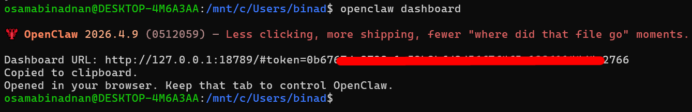

---

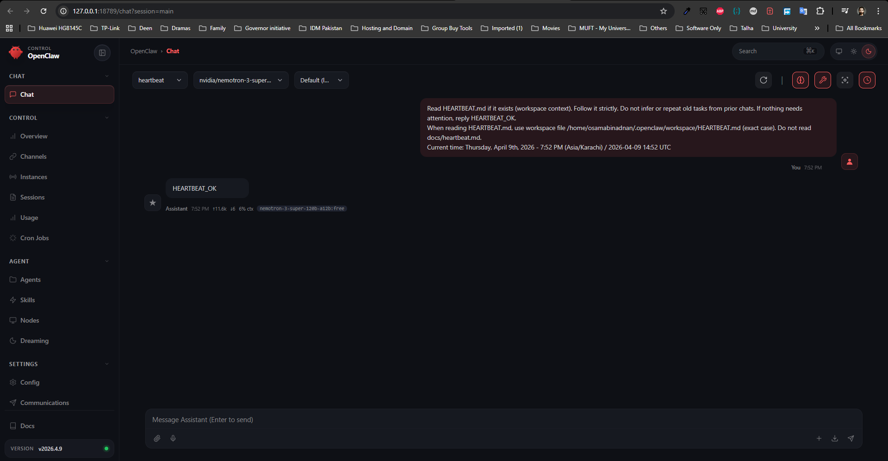
