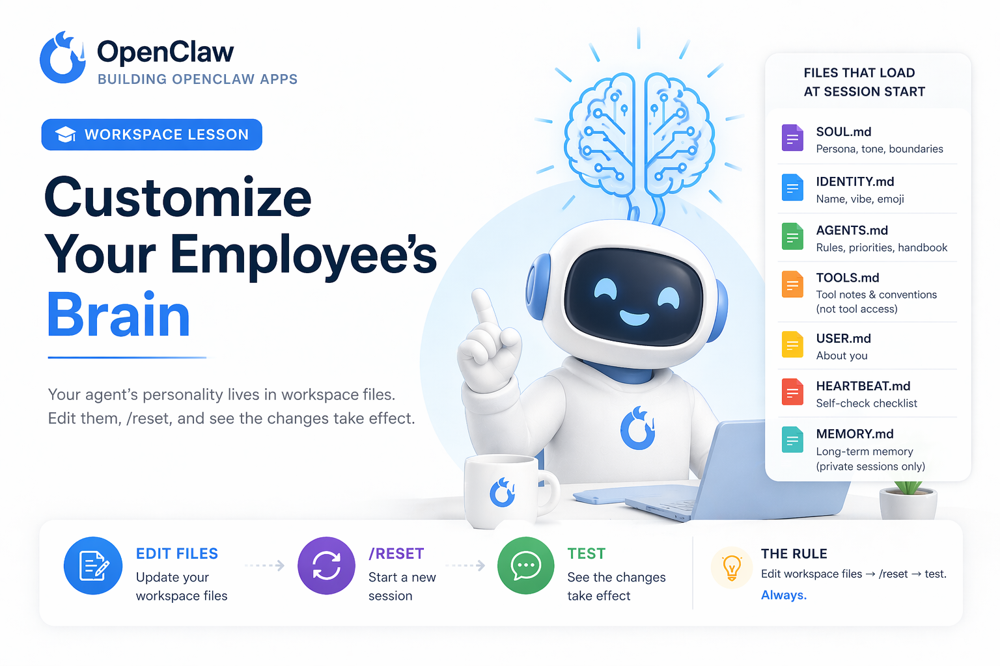
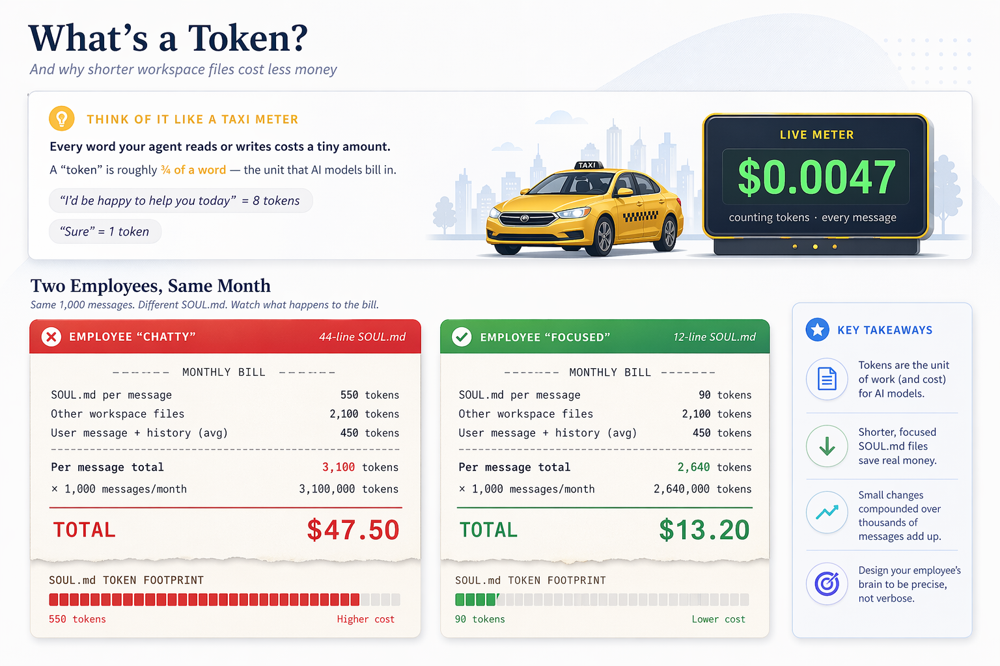
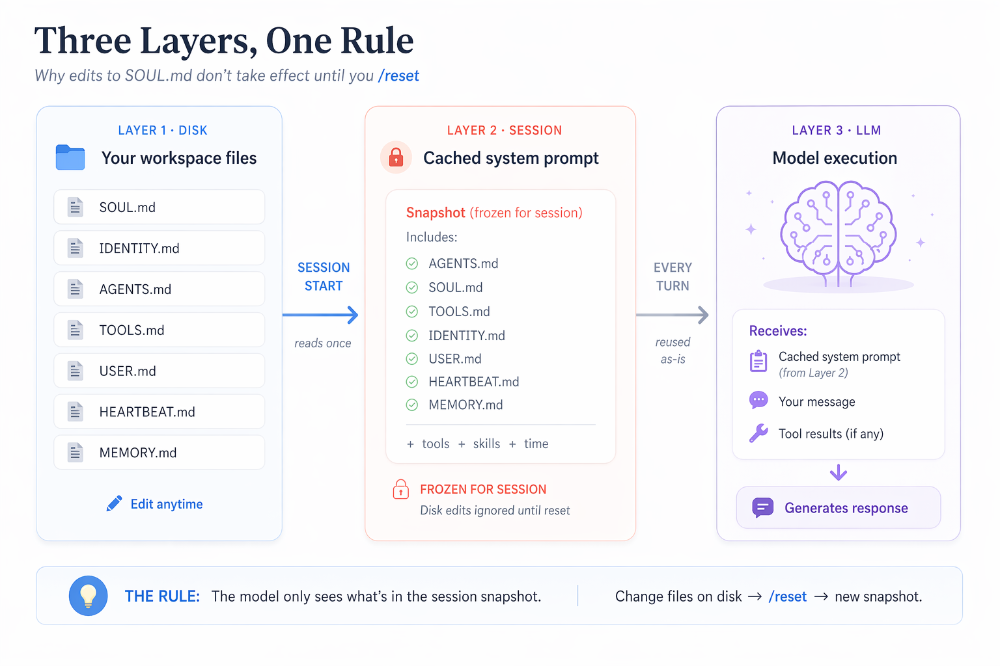
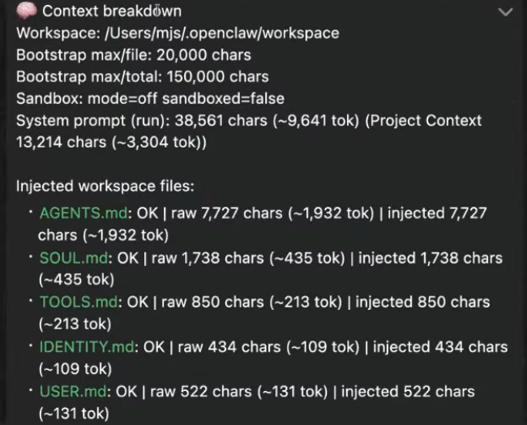
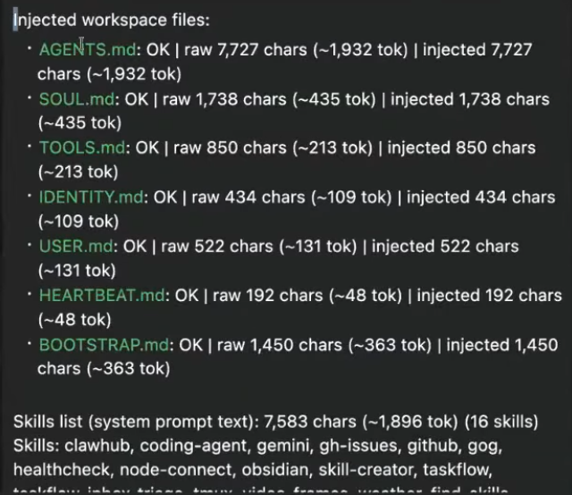
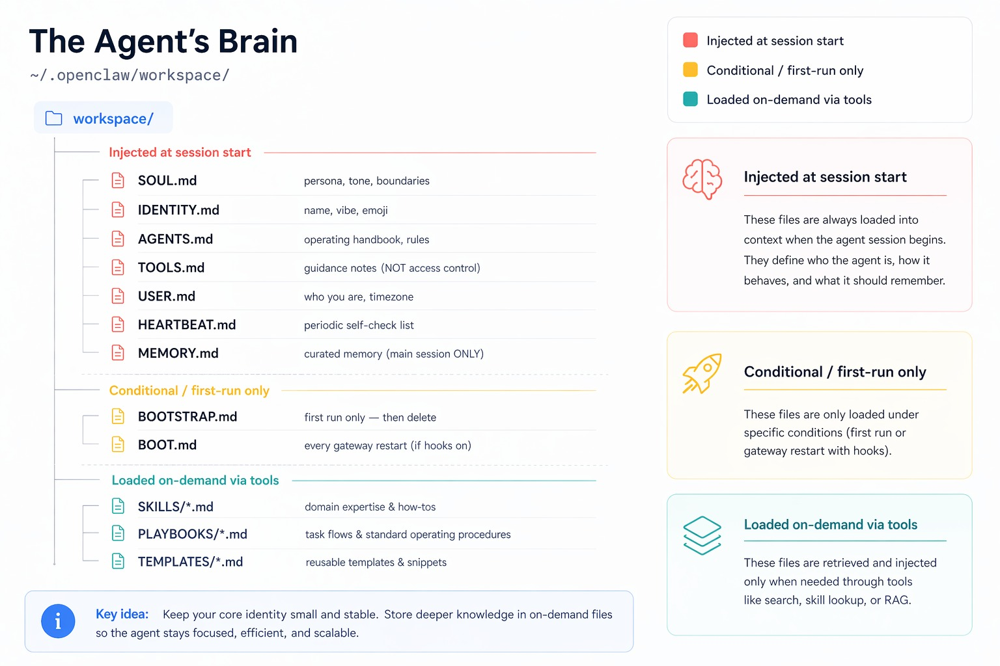
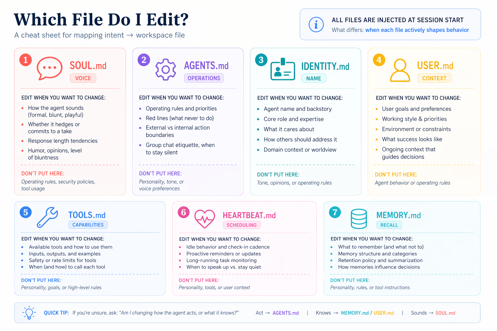

# Master OpenClaw for Business Professionals (AI-50)

Official Book Link: **[Building OpenClaw Apps](https://agentfactory.panaversity.org/docs/Building-OpenClaw-Apps/meet-your-personal-ai-employee)**

## Class 03: Customize Your Employee's Brain

In this class, we learn how the AI Employee's behavior is controlled through workspace files, how session caching works, and how to safely edit and verify changes.

---

## What You Will Learn

- How OpenClaw builds your agent's "brain" from workspace files
- Which files are auto-loaded at session start
- Why edits do not apply immediately in an active session
- How to validate loaded context using `/context list`
- How tool profiles and workspace instructions are different
- How to back up and bootstrap your workspace safely

---

## Your Agent's Brain at a Glance

The primary workspace directory:



### What's a Token?
Your AI employee runs on tokens the way a car runs on petrol or electricity. Every extra instruction you load into its brain costs tokens each time it works. A lean brain is cheaper to run and usually more reliable.



```bash
ls ~/.openclaw/workspace/
```

Core files loaded at session start:
- `SOUL.md` → tone, style, response personality
- `IDENTITY.md` → agent identity, role, self-description
- `AGENTS.md` → operating rules and workflows
- `TOOLS.md` → tool usage guidance (not access control)
- `USER.md` → user-specific facts/preferences
- `HEARTBEAT.md` → periodic behavior guidance
- `MEMORY.md` → curated long-term memory (main private session)

---

## Try This First (Prove It Yourself)

1. Ask the agent normally:
```text
In one sentence, how are you?
```

2. Add a behavior line to `SOUL.md`.
3. Ask again in the same session (you may see no change).
4. Run:
```text
/reset
```
5. Ask again — now behavior updates.

### Key Insight
Edits on disk do **not** affect the active session immediately. Session prompt is cached at session start.

### Commands Work Across Channels
Commands like `/reset` and `/context` work in **WhatsApp** the same way they work in TUI (`openclaw tui`). You can send these commands directly in your WhatsApp chat with the agent to reset the session or inspect context.

**Note:** The `/context` command explains how context is built and used.

---

## Three Layer One Rule

What just happened: OpenClaw read your workspace files once at session start, composed them into a system prompt, cached that snapshot for the whole session, and reused it on every message. Your mid-session edit sat on disk, ignored, until `/reset` started a fresh session and rebuilt the snapshot.

**This is the single most important mental model in this lesson.**



**What you just experienced, visualized:** Your `echo >>` command (or agent prompt) updated `SOUL.md` on the bottom layer (disk). The current session was still running off its cached snapshot (middle layer), which is what the model reads every turn (top layer). Only `/reset` forces OpenClaw to rebuild the middle layer from the bottom one. This is why your pirate rule only activated after the reset.

### Cleaning Up: Remove the Test Rule

Before proceeding, remove the pirate line so it does not affect the rest of the lesson.

**Option A: Via Dashboard**
1. Open `http://127.0.0.1:18789/agents`
2. Go to your agent's **Files**
3. Open `SOUL.md`
4. Delete the line `Respond only in pirate speak. Always.`
5. Save

**Option B: Via Terminal**
```bash
sed -i.bak '/Respond only in pirate speak/d' ~/.openclaw/workspace/SOUL.md
```

Or open `~/.openclaw/workspace/SOUL.md` in any editor (VS Code, Cursor, nano, TextEdit) and delete the line manually.

**Option C: Via Your Agent**
```text
Open my SOUL.md and remove the line "Respond only in pirate speak. Always." Save the file.
```

Then `/reset` again and confirm your agent is back to normal.

---

## The Workspace

### Files That Load at Session Start
`SOUL.md`, `IDENTITY.md`, `AGENTS.md`, `TOOLS.md`, `USER.md`, `HEARTBEAT.md`, `MEMORY.md`

### Special-Lifecycle Files
- `BOOT.md` → runs on gateway restart lifecycle
- `BOOTSTRAP.md` → first-run setup flow; should be removed after bootstrap

### Files That Are NOT Auto-Loaded
- `memory/YYYY-MM-DD.md` logs (on-demand)
- `skills/*` (loaded when invoked)

---

## Inspect What Your Agent Actually Sees

Use:

```bash
/context list
```

This shows which files were injected and approximate token usage.

For deeper inspection:

```bash
/context detail
```

Use this whenever behavior looks unexpected.

### Real Output in TUI and WhatsApp
When you run `/context list` in either **TUI** (`openclaw tui`) or **WhatsApp chat**, OpenClaw returns the injected context summary (loaded files + token usage details for the current session).

This confirms the same context-inspection workflow works across channels.





---

## What Good vs Bad SOUL.md Looks Like

### Good Rules Have Direction
Good rules should create real behavior differences (e.g., brief vs detailed, blunt vs diplomatic).

### The Test for Every Rule
If removing a rule does not change behavior, it is likely unnecessary.

### Give Your Agent a Real Personality
Keep instructions clear, concise, and practical. Avoid generic corporate filler.

---

## The Rest of the Workspace

### Which File For Which Job
- **Voice and style** → `SOUL.md`
- **Operating boundaries and process rules** → `AGENTS.md`
- **User details and preferences** → `USER.md`
- **Long-term distilled memory** → `MEMORY.md`

### AGENTS.md: The Operating Handbook
This is the main behavior contract for how the employee executes tasks.

### MEMORY.md: Curated Long-Term Memory
Used for persistent memory in the main private session context.

### The BOOTSTRAP Pattern
A temporary `BOOTSTRAP.md` can guide first-time self-configuration, then should be deleted.

---

## The Boundary: Knowledge vs Access

Workspace files shape behavior, but tool permission is controlled by tool profiles (Minimal/Coding/Messaging/Full/Inherit), not by `TOOLS.md`.

- `TOOLS.md` = guidance
- Tool profile = actual permission boundary

---

## Back Up Your Brain Before You Close This Lesson

Recommended backup options:

```bash
cd ~/.openclaw/workspace && git init && git add . && git commit -m "Initial brain"
```

Or clone backup folder:

```bash
cp -r ~/.openclaw/workspace/ ~/.openclaw/workspace-backup/
```

Do **not** commit sensitive credentials publicly.

---

## The Workspace Is a Role Template

Your agent's workspace lives at ~/.openclaw/workspace/. OpenClaw injects a specific set of files into the system prompt at session start. Everything else in that directory (daily memory logs, skill folders, canvas files) is available on demand through tools, not auto-loaded.

Your workspace is not just config; it is a reusable role template.
A well-designed workspace gives predictable behavior across sessions and channels.

---



---

### [Files That Load at Session Start​](https://agentfactory.panaversity.org/docs/Building-OpenClaw-Apps/meet-your-personal-ai-employee/customize-your-employees-brain#files-that-load-at-session-start "Direct link to Files That Load at Session Start")

These seven files compose the system prompt every time a session begins.

| File | Purpose |
| --- | --- |
| **SOUL.md** | Voice and style instructions that load into the session snapshot. |
| **IDENTITY.md** | Name, emoji, and short self-description. |
| **AGENTS.md** | Operating rules and workflow instructions. |
| **TOOLS.md** | Tool-usage guidance notes that load with the rest of the workspace prompt. |
| **USER.md** | Facts about you that the agent should know at session start. |
| **HEARTBEAT.md** | Periodic self-check guidance. |
| **MEMORY.md** | Curated long-term memory for the main private session. |

These seven files are loaded at session start. The composed system prompt is then cached and reused for every message within the session. Edits take effect only when a new session begins.

---



---

### [Special-Lifecycle Files](https://agentfactory.panaversity.org/docs/Building-OpenClaw-Apps/meet-your-personal-ai-employee/customize-your-employees-brain#special-lifecycle-files "Direct link to Special-Lifecycle Files")

| File | When It Loads | Purpose |
| --- | --- | --- |
| **BOOT.md** | Every gateway restart | Startup checklist (for example, "verify MCP connections"). Only runs when internal hooks are enabled. |
| **BOOTSTRAP.md** | First run only | Self-configuration ritual. The agent deletes it after the ritual is complete. |

### [Files That Are NOT Auto-Loaded​](https://agentfactory.panaversity.org/docs/Building-OpenClaw-Apps/meet-your-personal-ai-employee/customize-your-employees-brain#files-that-are-not-auto-loaded "Direct link to Files That Are NOT Auto-Loaded")

Two important distinctions that catch new users:

-   **Daily memory logs** at `memory/YYYY-MM-DD.md` are not injected into the system prompt. They live on disk, and the agent fetches them on demand using the `memory_search` and `memory_get` tools. This keeps the context small while preserving history. You will explore the memory system in Lesson 5.
-   **Workspace skills** under `skills/` are advertised in the system prompt (name, description, file location) but the actual `SKILL.md` content loads on demand when the agent decides it needs that skill. You will install skills in Lesson 6.

