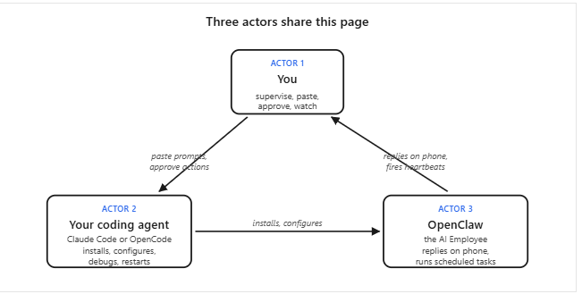
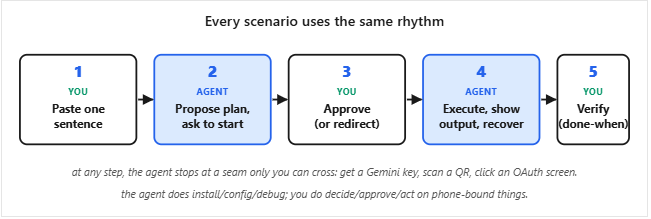
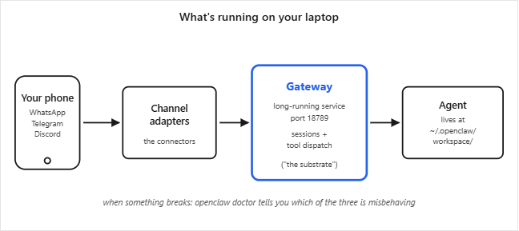

# [OpenClaw with General Agents](https://agentfactory.panaversity.org/docs/openclaw-with-general-agents)

OpenClaw is your **Personal AI Employee**: an open-source assistant that runs on your own laptop and replies through messaging apps you already use (WhatsApp, Telegram, Discord, Slack, iMessage, and more).

It's the project that proved AI Employees are real, they work, and people want them. OpenClaw became the fastest-growing open-source project of 2026, with [hundreds of thousands of GitHub stars](https://github.com/openclaw/openclaw) in its first months. Jensen Huang called it "the next ChatGPT" at GTC 2026; NVIDIA built NemoClaw on top of it.

By the end of these ninety minutes, you will have one: an AI Employee on your phone that answers messages, uses tools and external services, customizes itself to you, runs on its own schedule, and stays on your laptop. Not a chatbot you visit; a worker you delegate to.

**We will not do any work manually from now onwards, every task on openclaw will be performed by our coding agent**

## [The collaboration pattern​](https://agentfactory.panaversity.org/docs/openclaw-with-coding-agents#the-collaboration-pattern "Direct link to The collaboration pattern")

Three actors share this page. The diagram makes the relationship concrete:



***Every scenario then uses the same five-step rhythm:***



Download zip file of [openclaw-with-coding-agents](https://agentfactory.panaversity.org/downloads/openclaw-with-coding-agents.zip) under [The Collaboration Pattern](https://agentfactory.panaversity.org/docs/openclaw-with-coding-agents#the-collaboration-pattern) section.

## [Scenario 1: Get the Employee installed and chatting (~15 min)](https://agentfactory.panaversity.org/docs/openclaw-with-coding-agents#scenario-1-get-the-employee-installed-and-chatting-15-min)

### [1a. Install and configure](https://agentfactory.panaversity.org/docs/openclaw-with-coding-agents#1a-install-and-configure "Direct link to 1a. Install and configure")

**First prompt: describe what you want and ask for the plan.**

> I'd like to get OpenClaw running on my laptop and chatting back through Gemini's free tier. Before you touch anything, walk me through your plan in plain language: what you'll check first, what you'll change, and where you'll need me to step in.

Your agent reads `AGENTS.md`, looks at your machine, and proposes a plan. It'll flag two places it needs you: getting a free Gemini API key from [aistudio.google.com/app/api-keys](https://aistudio.google.com/app/api-keys), and confirming before it makes changes to your system. Read the plan. If it looks reasonable, move on. If something feels off, push back. Ask "why are you doing that?" and the agent will explain or adjust.

**Second prompt: approve and let it run.**

> Plan looks good. Go ahead step by step, and tell me what you see at each step. When you need my Gemini key, pause and tell me how to give it to you safely.

The agent will pause and ask for your key. Go to [aistudio.google.com/app/api-keys](https://aistudio.google.com/app/api-keys), create one (free, no credit card), and follow whatever safe-handling instruction your agent gives you. It should prefer an environment variable in your terminal over you pasting the key into chat.

**1a done when:** the agent reports OpenClaw is installed, configured, and the Gemini key is in place.

### [1b. Verify end-to-end and open the dashboard](https://agentfactory.panaversity.org/docs/openclaw-with-coding-agents#1b-verify-end-to-end-and-open-the-dashboard "Direct link to 1b. Verify end-to-end and open the dashboard")

**Third prompt: verify end-to-end, then hand off to the dashboard.**

> Now do your own end-to-end check first (a quick "hi" through the gateway from the command line, the way your brief describes), then open the dashboard for me so I can try it from the browser too.

**You're done with Scenario 1 when:** your agent's own CLI check came back with a real reply, AND the dashboard it opened for you in your browser also replies after you type `hi`. The dashboard footer should show `google/gemini-2.5-flash` as the active model. If it shows anything else (especially a `pro-preview` model), tell your agent and it'll switch you to the free tier before you get charged.

Under the hood, OpenClaw is now three pieces running on your laptop, all coordinated by a background service that starts when you log in:



## [Scenario 2: Pair a channel from your phone (~15 min)](https://agentfactory.panaversity.org/docs/openclaw-with-coding-agents#scenario-2-pair-a-channel-from-your-phone-15-min "Direct link to Scenario 2: Pair a channel from your phone (~15 min)")

Goal: send "hi" from your phone to your AI Employee and get a reply back.

I created whatsapp group in which I added my openclaw assistant (OBIN) and myself. But when I mentioned assitant in the group it did not reply. Then I ask my general agent (claude) in this case and he suggested me to set `groupPolicy` for whatsapp:

```md
groupPolicy - Controls WHO can trigger OBIN in groups

groupPolicy: "open" (what you have now)
- Anyone in the group can talk to OBIN by @mentioning them
- No pre-approval needed
- Good for: public groups, team collaboration, demos

groupPolicy: "allowlist" (what you had before)
- Only specific groups on a whitelist can interact with OBIN
- Groups must be explicitly added to the allowlist
- Good for: private/controlled environments

groupPolicy: "disabled"
- OBIN ignores all group messages completely
- Only responds to direct messages (DMs)
- Good for: personal use only

Current setup:
- groupPolicy: "open" = anyone can @mention OBIN in any group
- ackReaction.group: "always" = OBIN sends full replies (not just 👀)

This combination means OBIN will respond to anyone who @mentions them in any WhatsApp group they're added to.

```

I asked about the **dmPolicy** for whatsapp, then claude suggested me to set `dmPolicy` for whatsapp:

```md
 Your dmPolicy is set to "pairing".

  What this means:

  dmPolicy: "pairing" - Pairing mode (most secure for DMs)
  - When a stranger sends OBIN a direct message for the first time, OBIN replies with a one-time pairing code
  - The stranger must share that code with you
  - You approve it using: openclaw pairing approve whatsapp <code>
  - After approval, that person can chat with OBIN freely
  - Your number (92302xxxxxxx) is already in the allowFrom list, so you don't need pairing approval

  Other DM policy options:

  - "allowlist" - Only pre-approved numbers can DM (strictest)
  - "open" - Anyone can DM without approval (least secure)
  - "disabled" - All DMs blocked

  Your current setup (pairing) is a good balance between security and usability - you can chat freely, but strangers need your approval first.
```

## [Scenario 3: Delegate real work and watch the loop (~10 min)](https://agentfactory.panaversity.org/docs/openclaw-with-coding-agents#scenario-3-delegate-real-work-and-watch-the-loop-10-min)

To be continued...